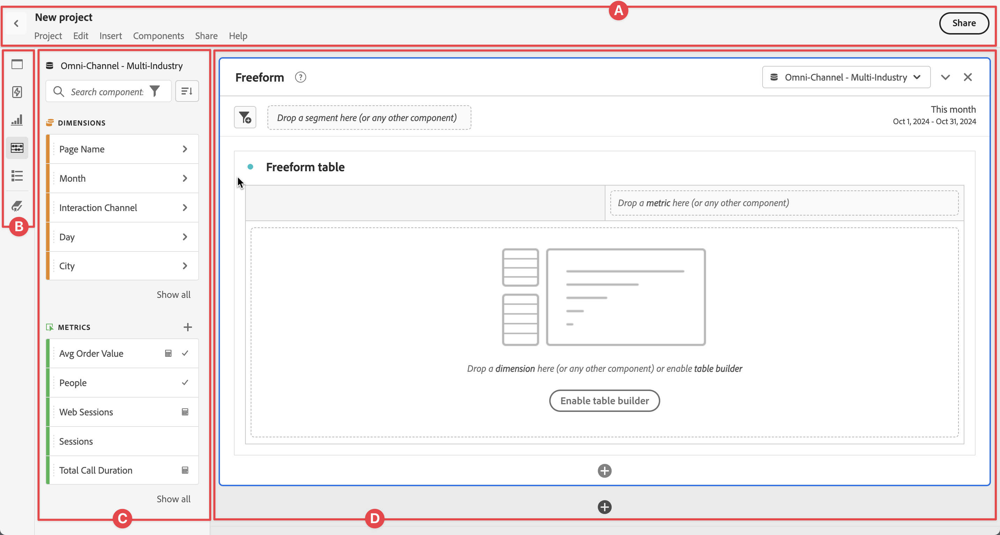

# Información general sobre Analysis Workspace {#analysis-workspace-overview}

Analysis Workspace te permite crear análisis rápidamente para recopilar información y luego compartirlas con otros. Mediante la interfaz del explorador arrastrar y soltar, puedes crear tu análisis, añadir visualizaciones para que los datos cobren vida, depurar un conjunto de datos, compartir y programar [proyectos](/help/analysis-workspace/build-workspace-project/freeform-overview.md) con cualquier persona de tu organización.

>[!BEGINSHADEBOX]

Consulte  [Información general de Analysis Workspace](https://video.tv.adobe.com/v/26266/?quality=12&learn=on){target="_blank"} para ver un vídeo de demostración.

{{videoaa}}

>[!ENDSHADEBOX]

## Interfaz

En la siguiente imagen y la tabla adjunta se explican los elementos principales de la interfaz de usuario de Analysis Workspace:

| Ubicación | Nombre y función |
|:---------:|----------|
| A | Contiene el nombre del proyecto, una estructura de menús para acceder a las funciones, un botón  para volver a la lista de Proyectos, y un botón **[!UICONTROL Compartir]** para [compartir su proyecto de Workspace](/help/analysis-workspace/curate-share/share-projects.md).  Seleccione el nombre del proyecto (por ejemplo: Nuevo proyecto) en cualquier momento para cambiarlo.  Seleccione  para añadir su proyecto como un proyecto  favorito. |
| B | **Panel Botón:** contiene botones para acceder a las [funciones](#features) clave de Analysis Workspace:<ul><li> [[!UICONTROL Paneles]](/help/analysis-workspace/c-panels/panels.md)</li><li> [[!UICONTROL Análisis guiado]](/help/guided-analysis/overview.md)</li><li> [[!UICONTROL Visualizaciones]](/help/analysis-workspace/visualizations/freeform-analysis-visualizations.md)</li><li> [[!UICONTROL componentes]](/help/components/overview.md)</li><li> [[!UICONTROL Índice]](/help/analysis-workspace/build-workspace-project/project-table-of-contents.md)</li><li> [[!UICONTROL Diccionario de datos]](/help/components/data-dictionary/data-dictionary-overview.md)</li></ul> |
| C | **Panel izquierdo:** esta área contiene paneles, visualizaciones, componentes o listas individuales. El contenido depende del botón seleccionado en el panel Botón. |
| D | **Lienzo:** es el área principal donde se arrastra contenido desde los carriles izquierdos para crear el proyecto. El proyecto se actualiza dinámicamente a medida que se añaden paneles, visualizaciones a los paneles y componentes a las visualizaciones. Puedes crear varios paneles y, dentro de cada panel, puedes crear varias visualizaciones. Cada panel se basa en una vista de datos seleccionada. La vista de datos seleccionada determina los componentes disponibles, como las métricas y las dimensiones. Consulta [Paneles - Visualización de datos](/help/analysis-workspace/c-panels/panels.md#data-view) para obtener más información. |

## Funciones

Las funciones principales de Analysis Workspace están disponibles a través del panel Botón:

| Icono | Función | Descripción |
|:---:|---|---|
|  | **[!UICONTROL Paneles]** | [Los paneles](/help/analysis-workspace/c-panels/panels.md) se utilizan para organizar el análisis dentro de un proyecto y pueden tener muchas tablas y visualizaciones. Muchos de los paneles que se proporcionan en Analysis Workspace generan un conjunto completo de análisis basados en unas pocas entradas de usuario.  |
|  | **[!UICONTROL Análisis guiado]** | El [análisis guiado](../guided-analysis/overview.md) te permite ofrecer datos de alta calidad y perspectivas sobre el recorrido del cliente a través de flujos de trabajo guiados. Puedes crear un análisis para incluirlo en tu proyecto de Workspace o incluir un análisis existente guardado anteriormente. |
|  | **[!UICONTROL Visualizaciones]** | Las [Visualizaciones](/help/analysis-workspace/visualizations/freeform-analysis-visualizations.md), como una barra o un gráfico de líneas se pueden utilizar para que los datos cobren vida visualmente. En el panel del extremo izquierdo, selecciona el icono **[!UICONTROL Visualizaciones]** del medio para ver la lista completa de visualizaciones disponibles. |
|  | **[!UICONTROL Componentes]** | [Los componentes](/help/components/overview.md) incluyen los siguientes elementos:<ul><li> [Dimensión](/help/components/dimensions/overview.md)</li><li> [ Métricas](/help/components/apply-create-metrics.md)</li><li> [Segmentos](/help/components/segments/seg-overview.md)</li><li> [Intervalos de fecha](/help/components/date-ranges/overview.md)</li></ul> |
|  | **[!UICONTROL Índice]** | El índice organiza todos los paneles y visualizaciones incluidos en el proyecto en una lista contraíble, lo que te permite acceder rápidamente a un panel o visualización específicos. |
|  | **Diccionario de datos** | El [Diccionario de datos](/help/components/data-dictionary/data-dictionary-overview.md) ayuda tanto a los usuarios como a los administradores a realizar un seguimiento de los componentes de su entorno de Analytics y a comprenderlos mejor. |

## Menú

La mayoría de las funciones de Analysis Workspace están disponibles mediante la función de arrastrar y soltar, y a través de menús contextuales dentro de paneles, visualizaciones y componentes.

La funcionalidad también está disponible a través del menú Workspace y de los accesos directos o las teclas de acceso directo. Las teclas de método abreviado difieren según el sistema operativo en el que se ejecute el explorador. Consulta las tablas siguientes para obtener una descripción general.

Ten en cuenta que en el teclado se pueden utilizar los siguientes símbolos:

- **⇧** para **[!UICONTROL *shift *]**.
- **⌘** para **[!UICONTROL *cmd *]**(comando).
- **⌃** para **[!UICONTROL *ctrl *]**(control).
- **⌥** para **[!UICONTROL *opt *]**(opción).
- **⎇** para **[!UICONTROL *alt *]**(alternativo).

Consulta las tablas siguientes para ver una descripción general de los menús disponibles.

| **[!UICONTROL Proyecto]** | Acceso directo a Mac | Acceso directo a Windows | Descripción |
|---|---|---|---|
| **[!UICONTROL Crear proyecto]** | **[!UICONTROL *shift+cmd+p *]** | **[!UICONTROL *shift+ctrl+p *]** | Creación de un nuevo proyecto. |
| **[!UICONTROL Creación de un cuadro de resultados móvil]** | | | [Creación de un cuadro de resultados móvil](/help/mobile-app/create-scorecard.md). |
| **[!UICONTROL Abrir...]** | **[!UICONTROL *cmd+o *]** | **[!UICONTROL *ctrl + o *]** | [Abrir un proyecto existente](/help/analysis-workspace/build-workspace-project/save-projects.md#open-another-project). |
| **[!UICONTROL Abrir la versión anterior…]** | **[!UICONTROL *opt+cmd+o *]** | **[!UICONTROL *alt+ctrl+o *]** | [Abrir versiones anteriores del proyecto](/help/analysis-workspace/build-workspace-project/save-projects.md#open-previous-version). |
| **[!UICONTROL Guardar]** | **[!UICONTROL *cmd+s *]** | **[!UICONTROL *ctrl+s *]** | [Guardar el proyecto](/help/analysis-workspace/build-workspace-project/save-projects.md#save-projects). |
| **[!UICONTROL Guardar con notas…]** | **[!UICONTROL *opt+cmd+s *]** | **[!UICONTROL *alt+ctrl+s *]** | [Agrega notas a la versión del proyecto que guardaste](/help/analysis-workspace/build-workspace-project/save-projects.md#save-project-options). |
| **[!UICONTROL Guardar como...]** | **[!UICONTROL *shift+cmd+s *]** | **[!UICONTROL *shift+ctrl+s *]** | [Guarda el proyecto con un nombre y detalles diferentes](/help/analysis-workspace/build-workspace-project/save-projects.md#save-project-options). |
| **[!UICONTROL Actualizar proyecto]** | **[!UICONTROL *opt+r *]** | **[!UICONTROL *alt+r *]** | Actualiza el proyecto. |
| **[!UICONTROL Descargar CSV]** | **[!UICONTROL *shift+cmd+v *]** | **[!UICONTROL *shift+ctrl+v *]** | Descargar el proyecto como archivo CSV. |
| **[!UICONTROL Descargar PDF]** | **[!UICONTROL *shift+cmd+b *]** | **[!UICONTROL *shift+ctrl+b *]** | Descargar el proyecto como documento de PDF. |
| **[!UICONTROL Info y configuración del proyecto]** | | | Define la configuración para tus proyectos, como nombre, etiquetas, paleta de colores, etc. |
| **[!UICONTROL Configuración de usuario]** | | | [Configura las preferencias para usar Analysis Workspace](/help/analysis-workspace/user-preferences.md). |

| **[!UICONTROL Editar]** | Acceso directo a Mac | Acceso directo a Windows | Descripción |
|---|---|---|---|
| **[!UICONTROL Deshacer]** | **[!UICONTROL *cmd+z *]** | **[!UICONTROL *ctrl+z *]** | Deshacer la acción anterior. |
| **[!UICONTROL Rehacer]** | **[!UICONTROL *cmd+shift+z *]** | **[!UICONTROL *ctrl+shift+z *]** | Rehacer la acción anterior. |
| **[!UICONTROL Borrar todo]** | **[!UICONTROL *opt+w *]** | **[!UICONTROL *alt+w *]** | Borrar todos los paneles del proyecto actual. |

| **[!UICONTROL Insertar]** | Acceso directo a Mac | Acceso directo a Windows | Descripción |
|---|---|---|---|
| **[!UICONTROL Panel en blanco]** | **[!UICONTROL *opt+b *]** | **[!UICONTROL *alt+b *]** | Insertar un [panel en blanco](/help/analysis-workspace/c-panels/blank-panel.md). |
| **[!UICONTROL Espectadores simultáneos de medios]** | **[!UICONTROL *opt+h *]** | **[!UICONTROL *alt-h *]** | Insertar un panel de [Espectadores simultáneos de medios](/help/analysis-workspace/c-panels/media-concurrent-viewers.md). |
| **[!UICONTROL Tiempo invertido en la reproducción de contenido]** | **[!UICONTROL *opt+i *]** | **[!UICONTROL *alt+i *]** | Insertar un panel [Tiempo invertido en la reproducción de contenido](/help/analysis-workspace/c-panels/media-playback-time-spent.md). |
| **[!UICONTROL Público medio por minuto de medios]** | **[!UICONTROL *opt+m *]** | **[!UICONTROL *alt+m *]** | Insertar un panel de [Público medio por minuto de medios](/help/analysis-workspace/c-panels/average-minute-audience-panel.md). |
| **[!UICONTROL Atribución]** | **[!UICONTROL *opt+e *]** | **[!UICONTROL *alt+e *]** | Insertar un panel de [atribución](/help/analysis-workspace/c-panels/attribution.md) |
| **[!UICONTROL de forma libre]** | **[!UICONTROL *opt+a *]** | **[!UICONTROL *alt+a *]** | Insertar un panel [de forma libre](/help/analysis-workspace/c-panels/freeform-panel.md). |
| **[!UICONTROL Información rápida]** | **[!UICONTROL *opt+j *]** | **[!UICONTROL *alt+j *]** | Insertar un panel de [Información rápida](/help/analysis-workspace/c-panels/quickinsight.md). |
| **[!UICONTROL Experimentación]** | **[!UICONTROL *opt+x *]** | **[!UICONTROL *alt+x *]** | Insertar un panel [Experimentación](/help/analysis-workspace/c-panels/experimentation.md). |
| **[!UICONTROL Tabla de forma libre]** | **[!UICONTROL *opt+1 *]** | **[!UICONTROL *alt+1 *]** | Insertar una visualización de [tabla de forma libre](/help/analysis-workspace/visualizations/freeform-table/freeform-table.md). |
| **[!UICONTROL Líneas]** | **[!UICONTROL *opt+2 *]** | **[!UICONTROL *alt+2 *]** | Insertar una visualización de[líneas](/help/analysis-workspace/visualizations/line.md). |
| **[!UICONTROL Barra]** | **[!UICONTROL *opt+3 *]** | **[!UICONTROL *alt+3 *]** | Insertar una visualización [barras](/help/analysis-workspace/visualizations/bar.md). |
| **[!UICONTROL Combo]** | **[!UICONTROL *opt+4 *]** | **[!UICONTROL *alt+4 *]** | Insertar una visualización [Combo](/help/analysis-workspace/visualizations/combo-charts.md). |

| **[!UICONTROL Componentes]** | Acceso directo a Mac | Acceso directo a Windows | Descripción |
|---|---|---|---|
| **[!UICONTROL Crear segmento...]** | **[!UICONTROL *shift+cmd+e *]** | **[!UICONTROL *shift+ctrl+e *]** | Crear un nuevo [segmento](/help/components/segments/seg-create.md). |
| **[!UICONTROL Crear métrica...]** | **[!UICONTROL *shift+cmd+c *]** | **[!UICONTROL *shift+ctrl+c *]** | Crear una nueva [métrica calculada](/help/components/calc-metrics/calc-metr-overview.md). |
| **[!UICONTROL Crear intervalo de fechas...]** | **[!UICONTROL *shift+cmd+d *]** | **[!UICONTROL *shift+ctrl+d *]** | Creación de un nuevo [intervalo de fechas](/help/components/date-ranges/overview.md). |
| **[!UICONTROL Crear anotación...]** | **[!UICONTROL *shift+cmd+o *]** | **[!UICONTROL *shift+ctrl+o *]** | Crear una [nueva anotación](/help/components/annotations/overview.md). |
| **[!UICONTROL Crear público...]** | **[!UICONTROL *shift+cmd+u *]** | **[!UICONTROL *shift+ctrl+u *]** | Crear un [público nuevo](/help/components/audiences/audiences-overview.md). |
| **[!UICONTROL Actualizar componentes]** | **[!UICONTROL *opt+shift+r *]** | **[!UICONTROL *alt+shift+r *]** | Actualizar los componentes del proyecto. |

| **[!UICONTROL Compartir]** | Acceso directo a Mac | Acceso directo a Windows | Descripción |
|---|---|---|---|
| **[!UICONTROL Compartir con usuarios de Workspace]** | **[!UICONTROL *cmd+h *]** | **[!UICONTROL *ctrl+h *]** | [Compartir el proyecto con otros usuarios de Workspace](/help/analysis-workspace/curate-share/share-projects.md#share-with-customer-journey-analytics-users-and-groups-in-your-organization). |
| **[!UICONTROL Compartir con cualquiera]** | **[!UICONTROL *opt+l *]** | **[!UICONTROL *alt+l *]** | [Compartir una versión de solo lectura del proyecto con alguien](/help/analysis-workspace/curate-share/share-projects.md#share-a-link-to-a-project). |
| **[!UICONTROL Enviar archivo]** | **[!UICONTROL opt+s]** | **[!UICONTROL *alt+s *]** | [Enviar un proyecto como CSV o PDF a otros destinatarios](/help/analysis-workspace/curate-share/send-schedule-files.md). |
| **[!UICONTROL Programar la exportación del archivo]** | **[!UICONTROL *shift+opt+s *]** | **[!UICONTROL *shift+alt+s *]** | [Enviar el proyecto según una programación como archivo CSV o de PDF a otros destinatarios](/help/analysis-workspace/curate-share/send-schedule-files.md). |
| **[!UICONTROL Depurar datos de proyectos]** | **[!UICONTROL *shift+cmd+g *]** | **[!UICONTROL *shift+ctrl+g *]** | [Depurar datos de proyectos](/help/analysis-workspace/curate-share/curate.md) |

| Ayuda | Descripción |
|---|---|
| Vídeos de **** | Abre el canal YouTube del Customer Journey Analytics en una nueva pestaña del explorador. |
| **[!UICONTROL Documentación de ayuda]** | Abre la documentación (que acabas de leer…) en una nueva pestaña del explorador. |
| **[!UICONTROL Foro de ayuda]** | Abre el foro de comunidades de Experience League de Adobe Analytics en una nueva pestaña del explorador. |
| **[!UICONTROL Teclas de acceso directo]** | Mostrar una descripción general de los métodos abreviados de teclado que se pueden utilizar en Workspace. |
| **[!UICONTROL Habilitar depurador]** | Habilitar depurador. Se volverá a cargar el proyecto. |
| **[!UICONTROL Deshabilitar depurador]** | Deshabilitar el recurso. Se volverá a cargar el proyecto. |
| **[!UICONTROL Rendimiento]** | Mostrar un cuadro de diálogo que muestra métricas sobre el **[!UICONTROL rendimiento de Analysis Workspace]**. Usa **[!UICONTROL Descargar como CSV]** para descargar un archivo CSV de las métricas de rendimiento. |
| **[!UICONTROL Acerca de Workspace]** | Mostrar un cuadro de diálogo **[!UICONTROL Acerca de Analysis Workspace]** con información de versión, niveles de acceso a características y marcas de características activas. |

## Fuentes de datos

La sincronización de visualizaciones te permite controlar qué tabla de datos o fuente de datos corresponde con una visualización. Consulta [Fuentes de datos](/help/analysis-workspace/visualizations/t-sync-visualization.md) para obtener más información.

## Uso de Analysis Workspace

Empezar a utilizar Analysis Workspace

1. Inicia sesión en [Adobe Experience Cloud](https://experience.adobe.com).
1. Selecciona **[!UICONTROL Customer Journey Analytics]** del conmutador de aplicaciones  en la parte superior derecha de la interfaz.
1. La página **[!UICONTROL Proyectos]** de Analysis Workspace se muestra de forma predeterminada. Si se ha seleccionado un proyecto específico o se ha estado trabajando en él recientemente, ese proyecto se muestra de forma predeterminada.

### Crear un proyecto

Un análisis en Analysis Workspace se denomina [proyecto](/help/analysis-workspace/build-workspace-project/freeform-overview.md).

Puede crear un proyecto en Analysis Workspace tal como se describe en [Crear proyectos](/help/analysis-workspace/build-workspace-project/create-projects.md).

Los proyectos se pueden organizar en carpetas y subcarpetas, tal como se describe en [Carpetas en Analysis Workspace](/help/analysis-workspace/build-workspace-project/workspace-folders/about-folders.md).

### Guardar y compartir un proyecto

A medida que crea un análisis en Analysis Workspace, su trabajo se [guarda automáticamente](/help/analysis-workspace/build-workspace-project/save-projects.md).

Cuando crea el proyecto, este recopila información procesable y está listo para que otros lo consuman. Puede compartir el proyecto con personas y grupos de su organización, o incluso con personas fuera de su organización. Para obtener información sobre cómo compartir un proyecto, consulte [Uso compartido de proyectos](/help/analysis-workspace/curate-share/share-projects.md).

## Recursos adicionales {#resources}

- La página de [aterrizaje de aprendizaje](/help/getting-started/landing.md#learning) en Customer Journey Analytics. Esta página es una buena manera de familiarizarse con Analysis Workspace. Especialmente los elementos fundamentales de aprendizaje de Workspace. Esta plantilla estándar te guía por la terminología común y los pasos para crear tu primer análisis en Workspace. 
- Adobe ofrece cientos de [tutoriales de formación en vídeo de Analytics](https://experienceleague.adobe.com/es/docs/analytics-learn/tutorials/overview).
- Consulte [Notas de la versión de Adobe Experience Cloud](https://experienceleague.adobe.com/es/docs/release-notes/experience-cloud/current) para obtener actualizaciones acerca de las nuevas funciones.

