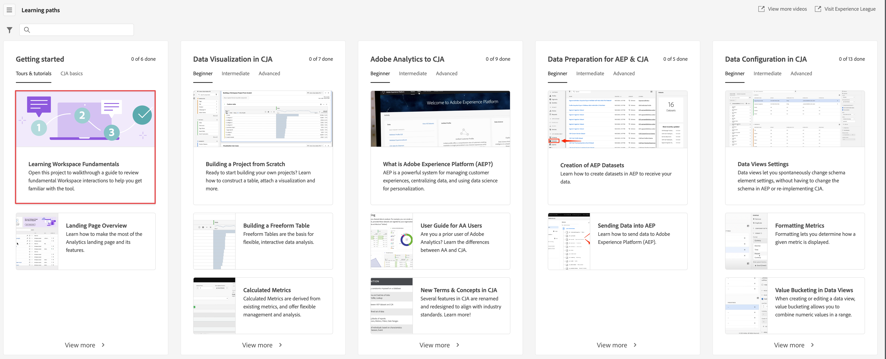

# Información general de Analysis Workspace

Analysis Workspace le permite crear análisis rápidamente para recopilar perspectivas y luego compartirlas con otros usuarios. Mediante la interfaz del explorador de arrastrar y soltar, puede crear su análisis, agregar visualizaciones para dar vida a los datos, depurar un conjunto de datos y compartir y programar proyectos con cualquier persona que elija.

El siguiente vídeo ofrece una breve descripción general con ejemplos de lo que es posible.

>[!VIDEO](https://video.tv.adobe.com/v/26266/?quality=12)

## Áreas de Analysis Workspace

La siguiente imagen y la tabla adjunta explican algunas de las áreas principales de Analysis Workspace:

| Ubicación en la imagen | Nombre y función |
|---------|----------|
| A | **Carril izquierdo lejano:** Contiene fichas para agregar paneles, visualizaciones y componentes a Analysis Workspace. También contiene el icono del diccionario de datos que se utiliza para abrir el diccionario de datos. |
| B | **Carril izquierdo:** En función de la pestaña seleccionada en el carril del extremo izquierdo, esta área contiene paneles, visualizaciones o componentes individuales. |
| C | **Lienzo:** Esta es el área principal donde arrastra contenido desde los carriles izquierdos para crear el proyecto. El proyecto se actualiza de forma dinámica a medida que se agregan paneles, visualizaciones y componentes al lienzo. |
| D | **Menú desplegable Vista de datos:** Para cada panel de Analysis Workspace, el menú desplegable de vista de datos le permite elegir la vista de datos que desea utilizar como fuente de datos. |

## Funciones en Analysis Workspace {#analysis}

A continuación se presentan algunas de las funciones clave disponibles en Analysis Workspace:

### Paneles

**Los paneles** se utilizan para organizar el análisis dentro de un proyecto y pueden tener muchas tablas y visualizaciones. Muchos de los paneles que se proporcionan en Analysis Workspace generan un conjunto completo de análisis basados en unas pocas entradas del usuario. En el carril del extremo izquierdo, seleccione el icono **[!UICONTROL Paneles]** en la parte superior para ver una lista completa de paneles disponibles.

Para obtener más información sobre los paneles, consulte [Información general sobre paneles](/help/analysis-workspace/c-panels/panels.md).

### Visualizaciones

**Visualizaciones**, como una barra o un gráfico de líneas, se pueden utilizar para dar vida visualmente a los datos. En el carril del extremo izquierdo, seleccione el icono **[!UICONTROL Visualizaciones]** del medio para ver la lista completa de visualizaciones disponibles.

Para obtener más información sobre las visualizaciones, consulte [Resumen de las visualizaciones](/help/analysis-workspace/visualizations/freeform-analysis-visualizations.md).

### Componentes

Los componentes de Analysis Workspace son los siguientes:

* Dimensiones

* Métricas

* Segmentos

* Intervalos de fechas

Para obtener más información sobre cada uno de estos tipos de componentes, consulte [Información general sobre componentes](/help/components/overview.md).

Cada uno de estos tipos de componentes se puede añadir a una visualización (como una tabla improvisada) para comenzar a responder a las preguntas comerciales.

Después de comprender la terminología de los componentes, puede arrastrar componentes a visualizaciones (incluidas tablas improvisadas) para [cree su análisis](/help/analysis-workspace/visualizations/freeform-table/freeform-table.md).

### Diccionario de datos

El diccionario de datos de Analysis Workspace ayuda a los usuarios y administradores a seguir los componentes de su entorno de Analytics y a comprenderlos mejor.

Para obtener más información sobre el diccionario de datos, consulte [Resumen del diccionario de datos](/help/components/data-dictionary/data-dictionary-overview.md).

## Empezar a usar Analysis Workspace

### Iniciar sesión en Adobe Analytics {#login}

Para empezar a usar Analysis Workspace, inicie sesión en Adobe Analytics en [experience.adobe.com/analytics](https://experience.adobe.com/analytics). La página Proyectos de Analysis Workspace se muestra de forma predeterminada. Si se ha seleccionado un proyecto específico, ese proyecto se muestra de forma predeterminada.

### Crear un proyecto {#new-project}

Un análisis en Analysis Workspace se denomina [proyecto](/help/analysis-workspace/build-workspace-project/freeform-overview.md).

Puede crear un proyecto en Analysis Workspace tal como se describe en [Crear proyectos](/help/analysis-workspace/build-workspace-project/create-projects.md).

Los proyectos se pueden organizar en carpetas y subcarpetas, tal como se describe en [Carpetas en Analysis Workspace](/help/analysis-workspace/build-workspace-project/workspace-folders/about-folders.md).

### Guardar y compartir un proyecto

A medida que crea un análisis en Analysis Workspace, su trabajo es [guardado automáticamente](/help/analysis-workspace/build-workspace-project/save-projects.md).

Cuando termina de crear el proyecto y está recopilando perspectivas procesables, el proyecto está listo para ser consumido por otros. Puede compartir el proyecto con usuarios y grupos de su organización, o incluso con personas ajenas a su organización. Para obtener información sobre cómo compartir un proyecto, consulte [Compartir proyectos](/help/analysis-workspace/curate-share/share-projects.md).

## Recursos adicionales {#resources}

* Adobe ofrece cientos de [tutoriales de formación en vídeo de Analytics](https://experienceleague.adobe.com/docs/analytics-learn/tutorials/overview.html?lang=es).
* Consulte [Notas de la versión de Adobe Experience Cloud](https://experienceleague.adobe.com/docs/release-notes/experience-cloud/current.html?lang=es#analytics) para obtener actualizaciones acerca de las nuevas funciones.
* Una buena manera de familiarizarse con Analysis Workspace es a través de la plantilla Tutorial de formación de Analysis Workspace . Esta plantilla le explica la terminología común y los pasos para crear su primer análisis en Workspace. Para comenzar el tutorial:
   1. En el [!UICONTROL **Espacio de trabajo**] en Adobe Analytics, seleccione **[!UICONTROL Aprendizaje]** a la izquierda.
   1. Select **[!UICONTROL Abrir tutorial]**.
      
