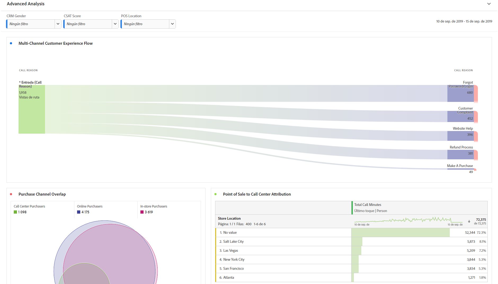
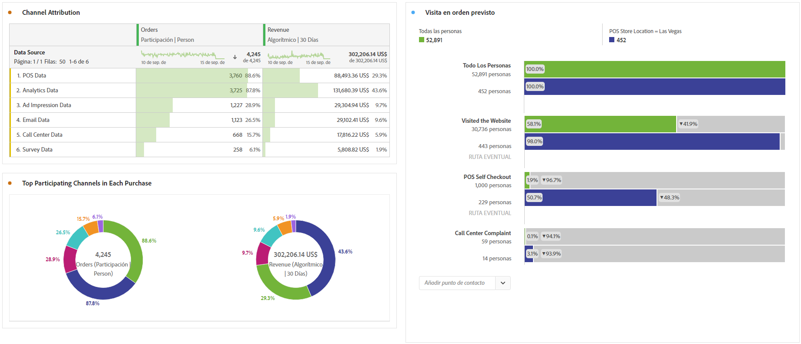

# Realizar análisis avanzado

>[!NOTE]
>
>Está viendo la documentación de Analysis Workspace en Customer Journey Analytics. Su conjunto de funciones difiere ligeramente del [Analysis Workspace de la versión tradicional de Adobe Analytics](https://experienceleague.adobe.com/docs/analytics/analyze/analysis-workspace/home.html). [Más información...](/help/getting-started/cja-aa.md)

El análisis avanzado aprovecha características como [Diagramas de flujo](/help/analysis-workspace/visualizations/c-flow/flow.md), [Attribution IQ](/help/analysis-workspace/attribution/overview.md), [Abandonos](/help/analysis-workspace/visualizations/fallout/fallout-flow.md) y [desgloses de dimensión](/help/components/dimensions/t-breakdown-fa.md).

