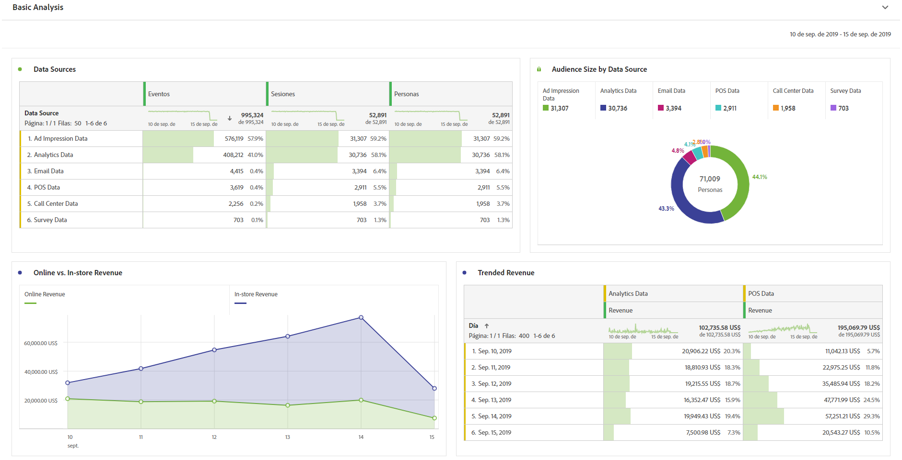
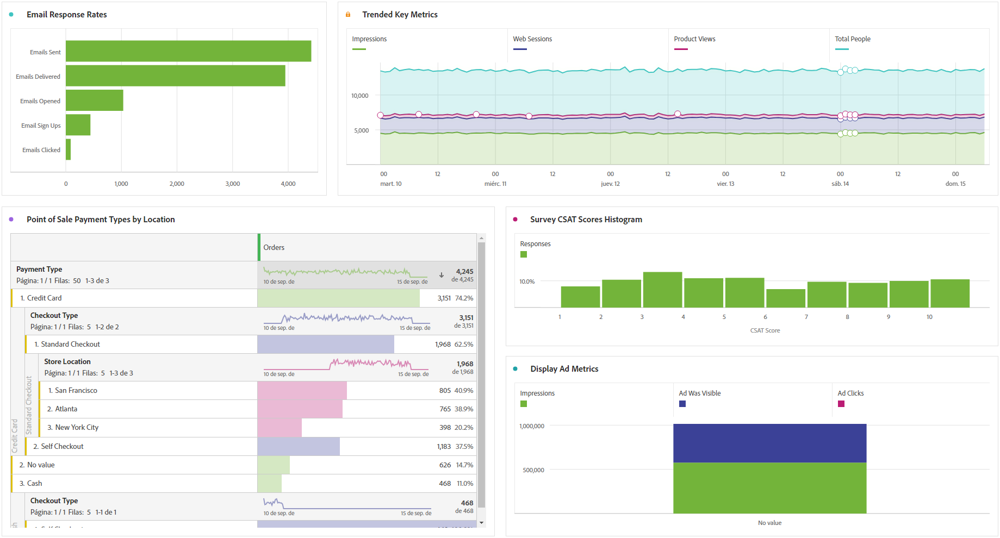

# Realizar análisis básico

>[!NOTE]
>
>Está viendo la documentación de Analysis Workspace en Customer Journey Analytics. Su conjunto de funciones difiere ligeramente del [Analysis Workspace de la versión tradicional de Adobe Analytics](https://experienceleague.adobe.com/docs/analytics/analyze/analysis-workspace/home.html?lang=es). [Más información...](/help/getting-started/cja-aa.md)

Después de crear conexiones y vistas de datos, analice los datos que ha introducido con la potencia y flexibilidad de Analysis Workspace. No dude en experimentar y arrastrar dimensiones y métricas, cambiar dimensiones y configuraciones de atribución de métricas, nombres prácticos, husos horarios, configuraciones de sesión, etc.

A continuación, verá un ejemplo de visualizaciones básicas el Espacio de trabajo. Por ejemplo, puede

* Cree un informe de clasificación de las fuentes de datos que muestran la mayor cantidad de eventos, sesiones y personas.

* Cree un informe de tendencias de los ingresos en línea frente a los ingresos en el almacén que compare las dos fuentes de datos con el paso del tiempo.

* Indique el tamaño de la audiencia según las fuentes de datos, como los datos de impresiones de publicidad, los datos de Customer Journey Analytics, los datos de correo electrónico, del POS, del centro de llamadas y de las encuestas.

