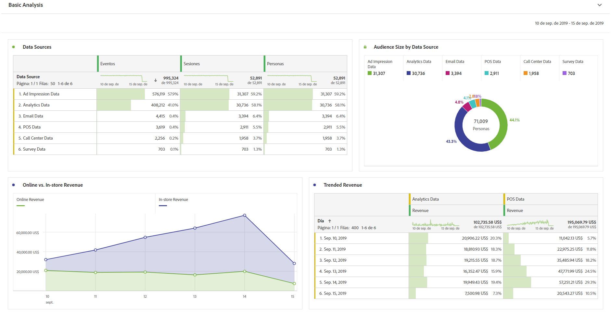
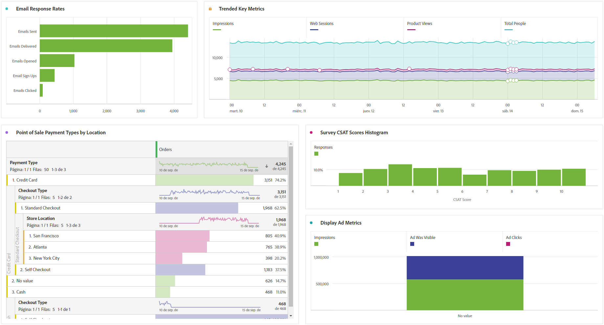

# Realizar análisis básico

Customer Journey Analytics le permite analizar datos utilizando la potencia y flexibilidad de Analysis Workspace.

>[!TIP]
>
>Si no hay datos disponibles en Analysis Workspace, asegúrese de seguir el [proceso de ingesta de datos](/help/data-ingestion/data-ingestion.md), que incluye lo siguiente:<ul><li>[Crear una conexión](/help/connections/create-connection.md#create-and-configure-the-connection)  Asegúrese de que la conexión está configurada para importar nuevos datos, datos de relleno o ambos.</li><li>[Añadir conjuntos de datos](/help/connections/create-connection.md#add-and-configure-datasets)</li><li>[Creación de vistas de datos](/help/data-views/create-dataview.md)</li></ul>

No dude en experimentar y arrastrar dimensiones y métricas, cambiar dimensiones y configuraciones de atribución de métricas, nombres prácticos, husos horarios, configuraciones de sesión, etc.

A continuación, verá un ejemplo de visualizaciones básicas el Espacio de trabajo. Por ejemplo, puede

* Cree un informe de clasificación de las fuentes de datos que muestran la mayor cantidad de eventos, sesiones y personas.

* Cree un informe de tendencias de los ingresos en línea frente a los ingresos en el almacén que compare las dos fuentes de datos con el paso del tiempo.

* Indique el tamaño del público según las fuentes de datos, como los datos de impresiones de publicidad, los datos de Customer Journey Analytics, los datos de correo electrónico, del POS, del centro de llamadas y de las encuestas.

