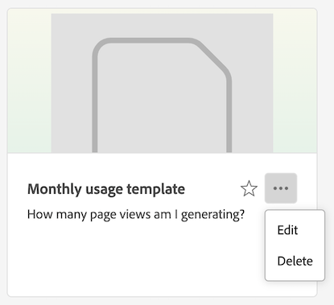

# Creación y administración de plantillas

Los administradores pueden crear plantillas y guardarlas para que las utilicen otros usuarios de su empresa de inicio de sesión.

Las personas de la compañía de inicio de sesión pueden usar estas plantillas de compañía como se describe en [Usar plantillas](/help/analysis-workspace/templates/use-templates.md).

## Creación de una plantilla

Para crear una nueva plantilla que puedan utilizar los usuarios de su empresa de inicio de sesión:

1. En Analysis Workspace, genere un proyecto con el estado que desee.

1. Seleccione [!UICONTROL **Proyecto**] > **[!UICONTROL Guardar como plantilla...]**.

   

1. Especifique la siguiente información en el cuadro de diálogo [!UICONTROL Guardar como plantilla]:

   | Campo | Descripción |
   |---------|----------|
   | **[!UICONTROL Nombre]** | Proporcione un nombre descriptivo para la plantilla. |
   | **[!UICONTROL Descripción]** | Proporcione una breve descripción para la plantilla que describa sus usos previstos. |
   | **[!UICONTROL Por qué usar esta plantilla]** | Proporcione una breve explicación para informar a los miembros de la organización sobre cómo se puede utilizar esta plantilla. Esta explicación se muestra en la página Vista previa de la plantilla. |
   | **[!UICONTROL Canales]** | Elija cualquier canal aplicable que se aplique a esta plantilla. Puede seleccionar varios canales: **[!UICONTROL web]**, **[!UICONTROL móvil]**, **[!UICONTROL canal cruzado]**, **[!UICONTROL centro de llamadas]** y **[!UICONTROL en tienda]**.
Las selecciones que elija determinan dónde se muestra la plantilla y qué filtros se aplican a los usuarios que acceden a ella desde la página Plantillas de Organización.
 |
   | **[!UICONTROL Casos de uso]** | Elija cualquier caso de uso que se aplique a esta plantilla. Puede seleccionar varios casos de uso: **[!UICONTROL participación]**, **[!UICONTROL conversión]**, **[!UICONTROL audiencia]**, **[!UICONTROL adquisición]** y **[!UICONTROL Journey Optimizer]**. 
Las opciones seleccionadas determinan la ubicación de la plantilla en la página Plantillas de Organización. Los usuarios pueden navegar a la plantilla o filtrar la lista por caso de uso. 

**Nota:** La opción **[!UICONTROL Journey Optimizer]** solo está disponible si hay datos de Journey Optimizer en la vista de datos que está usando en Customer Journey Analytics. Si se elige **[!UICONTROL Journey Optimizer]**, la plantilla estará disponible para su uso en Adobe Journey Optimizer. En Journey Optimizer, hay disponible un menú desplegable en la página **[!UICONTROL Informes]**, que permite a los usuarios seleccionar esta plantilla o la plantilla predeterminada. Para obtener más información, consulte [Introducción a la experiencia de generación de informes actualizada](https://experienceleague.adobe.com/es/docs/journey-optimizer/using/reporting/channel-report/report-gs-cja) en la documentación de Journey Optimizer. |
   | **[!UICONTROL Tipo de actividad de Journey Optimizer]** | Elija el tipo de actividad de Journey Optimizer que se asociará con esta plantilla: **[!UICONTROL Campañas]**, **[!UICONTROL Recorridos]**, **[!UICONTROL Páginas de aterrizaje]**, **[!UICONTROL Informes]** o **[!UICONTROL Suscripciones]**. 
Deje este campo en blanco si desea que esta plantilla se asocie a todos los tipos de actividades.

Este campo solo se muestra si **[!UICONTROL Journey Optimizer]** está seleccionado en el campo **[!UICONTROL Casos de uso]**.
 |
   | **[!UICONTROL Actividad de Journey Optimizer]** | Seleccione la actividad de Journey Optimizer que desea asociar con esta plantilla. 
Deje este campo en blanco si desea que esta plantilla se asocie a todas las actividades del tipo de actividad seleccionado.

Este campo solo se muestra si **[!UICONTROL Journey Optimizer]** está seleccionado en el campo **[!UICONTROL Casos de uso]**.
 |
   | **[!UICONTROL Etiquetas]** | Especifique las etiquetas que desee aplicar a la plantilla. Las personas pueden filtrar la lista de plantillas según las etiquetas que agregue. |

1. Seleccione [!UICONTROL **Guardar como plantilla**].

Para obtener información sobre cómo los usuarios pueden crear un proyecto basado en una plantilla, consulte [Crear un proyecto basado en una plantilla](/help/analysis-workspace/templates/use-templates.md#create-a-project-based-on-a-template) en [Usar plantillas](/help/analysis-workspace/templates/use-templates.md).

## Editar o eliminar una plantilla

Los administradores pueden editar o eliminar las plantillas de empresa.

1. En Analysis Workspace, seleccione la ficha [!UICONTROL **Workspace**] y, a continuación, en **[!UICONTROL Plantillas]**, en el carril izquierdo, seleccione **[!UICONTROL _nombre_empresa_inicio_sesión _plantillas]**.

1. Si está viendo plantillas en una vista de columna :

   1. Vaya a la plantilla que desee editar o eliminar y seleccione el icono de información junto al nombre de la plantilla.

      

   1. Seleccionar **[!UICONTROL vista previa]**.

   1. Seleccione el icono Más y luego seleccione **[!UICONTROL Editar]** o **[!UICONTROL Eliminar]**.

      

1. Si está viendo plantillas en una vista de tarjeta :

   1. Busque la plantilla que desee editar o eliminar.

      

   1. Pase el ratón sobre la plantilla y luego seleccione **[!UICONTROL Vista previa]**.

   1. Seleccione el icono Más y luego seleccione **[!UICONTROL Editar]** o **[!UICONTROL Eliminar]**.

      

1. Si está editando una plantilla, realice las modificaciones que desee y luego seleccione [!UICONTROL **Proyecto**] > **[!UICONTROL Guardar como plantilla...]**.

   

1. Especifique la siguiente información en el cuadro de diálogo [!UICONTROL Guardar como plantilla]:

   | Campo | Descripción |
   |---------|----------|
   | **[!UICONTROL Nombre]** | Proporcione un nombre descriptivo para la plantilla. |
   | **[!UICONTROL Descripción]** | Proporcione una breve descripción para la plantilla que describa sus usos previstos. |
   | **[!UICONTROL Por qué usar esta plantilla]** | Proporcione una breve explicación para informar a los miembros de la organización sobre cómo se puede utilizar esta plantilla. Esta explicación se muestra en la página Vista previa de la plantilla. |
   | **[!UICONTROL Canales]** | Elija cualquier canal aplicable que se aplique a esta plantilla. Puede seleccionar varios canales: **[!UICONTROL web]**, **[!UICONTROL móvil]**, **[!UICONTROL canal cruzado]**, **[!UICONTROL centro de llamadas]** y **[!UICONTROL en tienda]**. Si no se selecciona ningún canal, la plantilla se incluye con todos los canales.
Las selecciones que elija determinan dónde se muestra la plantilla y qué filtros se aplican a los usuarios que acceden a ella desde la página Plantillas de Organización.
 |
   | **[!UICONTROL Casos de uso]** | Elija cualquier caso de uso que se aplique a esta plantilla. Puede seleccionar varios casos de uso: **[!UICONTROL participación]**, **[!UICONTROL conversión]**, **[!UICONTROL audiencia]**, **[!UICONTROL adquisición]** y **[!UICONTROL Journey Optimizer]**. 
Las opciones seleccionadas determinan la ubicación de la plantilla en la página Plantillas de Organización. Los usuarios pueden navegar a la plantilla o filtrar la lista por caso de uso. 

**Nota:** Si elige **[!UICONTROL Journey Optimizer]**, la plantilla también estará disponible en Adobe Journey Optimizer. En Journey Optimizer, hay disponible un menú desplegable en la página **[!UICONTROL Informes]** que permite a los usuarios seleccionar esta plantilla o la plantilla predeterminada. Para obtener más información, consulte [Introducción a la experiencia de generación de informes actualizada](https://experienceleague.adobe.com/es/docs/journey-optimizer/using/reporting/channel-report/report-gs-cja) en la documentación de Journey Optimizer. |
   | **[!UICONTROL Tipo de actividad de Journey Optimizer]** | Elija el tipo de actividad de Journey Optimizer que se asociará con esta plantilla: **[!UICONTROL Campañas]**, **[!UICONTROL Recorridos]**, **[!UICONTROL Páginas de aterrizaje]**, **[!UICONTROL Informes]** o **[!UICONTROL Suscripciones]**. 
Deje este campo en blanco si desea que esta plantilla se asocie a todos los tipos de actividades.

Este campo solo se muestra si **[!UICONTROL Journey Optimizer]** está seleccionado en el campo **[!UICONTROL Casos de uso]**.
 |
   | **[!UICONTROL Actividad de Journey Optimizer]** | Seleccione la actividad de Journey Optimizer que desea asociar con esta plantilla. 
Deje este campo en blanco si desea que esta plantilla se asocie a todas las actividades del tipo de actividad seleccionado.

Este campo solo se muestra si **[!UICONTROL Journey Optimizer]** está seleccionado en el campo **[!UICONTROL Casos de uso]**.
 |
   | **[!UICONTROL Etiquetas]** | Especifique las etiquetas que desee aplicar a la plantilla. Las personas pueden filtrar la lista de plantillas según las etiquetas que agregue. |

1. Seleccione [!UICONTROL **Guardar como plantilla**].

## Cambiar nombre, etiquetar o aprobar plantillas

Los administradores pueden cambiar el nombre, etiquetar y aprobar plantillas de empresa.

1. En Analysis Workspace, selecciona la pestaña [!UICONTROL **Workspace**] y, a continuación, selecciona la pestaña **[!UICONTROL Proyectos]** en el carril izquierdo.

1. Seleccione el icono de filtro para filtrar la lista de proyectos.

1. En el carril de filtro, seleccione **OTROS FILTROS** y, a continuación, seleccione **Plantillas de empresa**.

   Se muestra una lista de las plantillas de empresa. No se muestran todos los proyectos normales, a menos que estén anclados.

   Las plantillas de empresa se pueden identificar mediante el  que precede al nombre de la plantilla.

   

1. Haga clic en el icono de tres puntos **...** junto a una plantilla para ver las opciones disponibles.

   

1. Seleccione **[!UICONTROL Cambiar nombre]**, **[!UICONTROL Etiqueta]** o **[!UICONTROL Aprobar]**.

   También puede eliminar una plantilla, o bien puede eliminar una plantilla como se describe en [Editar o eliminar plantillas](#edit-or-delete-templates).

1. (Opcional) Para volver a la vista normal, en el carril de filtro, anule la selección de **[!UICONTROL Plantillas de empresa]**.

## Adición de los componentes que faltan a la vista de datos para una plantilla determinada

De forma predeterminada, algunas plantillas proporcionadas por Adobe no se pueden usar porque contienen componentes que no están en la vista de datos.

Para cada componente que falta, hay una etiqueta de contexto coincidente disponible en la vista de datos. Debe agregar la etiqueta de contexto coincidente a un componente que ya está en la vista de datos o agregar un componente nuevo a la vista de datos y agregarle la etiqueta de contexto.

Para añadir componentes que faltan a una plantilla:

1. En Analysis Workspace, seleccione la ficha [!UICONTROL **Workspace**] y, a continuación, en **[!UICONTROL Plantillas]** en el carril izquierdo, seleccione **[!UICONTROL Plantillas de Adobe]**.

1. Seleccione el icono de filtro para filtrar la lista de plantillas.

1. Seleccione **[!UICONTROL No listo para usar]** para mostrar las plantillas que requieren componentes que no están en la vista de datos.

   

1. Busque una plantilla que aún no esté lista para utilizarse con la vista de datos.

1. Realice una de las acciones siguientes:

   * **Si está viendo plantillas en una vista de columna** :

      1. Vaya a la plantilla que aún no esté lista para usarla con la vista de datos y, a continuación, seleccione el icono de información junto al nombre de la plantilla.

         

      1. Seleccionar **[!UICONTROL vista previa]**.

         

   * **Si está viendo plantillas en una vista de tarjeta** :

      1. Busque la plantilla que aún no esté lista para utilizarse con la vista de datos.

         

      1. Pase el ratón sobre la plantilla y luego seleccione **[!UICONTROL Vista previa]**.

         

1. En la sección **[!UICONTROL Componentes que faltan]**, se muestra una lista de los componentes que faltan en la vista de datos. Seleccione **[!UICONTROL Agregar estos componentes a su vista de datos]**.

   La página de configuración de la vista de datos se muestra en una nueva pestaña.

1. Seleccione la ficha **[!UICONTROL Componentes]** para la vista de datos.

   

1. Para cada componente que se enumeró como ausente de la plantilla, realice una de las acciones siguientes en la ficha **[!UICONTROL Componentes]**:

   * En la sección **[!UICONTROL Componentes incluidos]**, seleccione un componente que ya esté incluido en la vista de datos que desee usar para el componente que falta.

   * Agregue un nuevo componente a la vista de datos que desee utilizar para el componente que falta y, a continuación, seleccione el componente.

     Para agregar un componente nuevo a la vista de datos, busque en la lista de campos de esquema y arrástrelo a la sección **[!UICONTROL Componentes incluidos]**.

1. Con el componente seleccionado, busque el menú desplegable **[!UICONTROL Etiquetas contextuales]** en la columna derecha.

   

1. En el menú desplegable **[!UICONTROL Etiquetas contextuales]**, seleccione la etiqueta contextual que tenga el mismo nombre que el componente que falta.

1. Seleccione **[!UICONTROL Guardar y continuar]**.

1. Para cada componente que falte, repita el proceso de agregar la etiqueta de contexto coincidente a un componente en la vista de datos.

## Acceso a una plantilla de empresa

Al igual que con las plantillas que proporciona el Adobe, los usuarios de la organización pueden acceder a las plantillas que crean los administradores.

Para obtener información sobre cómo obtener acceso a una plantilla de empresa, vea [Obtener acceso y ejecutar una plantilla](/help/analysis-workspace/templates/use-templates.md#access-and-run-a-template) en [Usar plantillas](/help/analysis-workspace/templates/use-templates.md).
