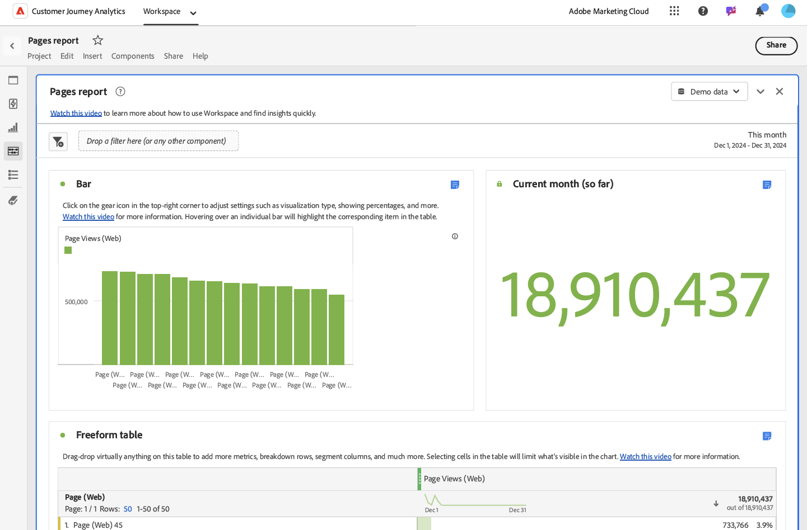

# Uso de plantillas

Las plantillas (o plantillas de empresa) de Analysis Workspace proporcionan una visión rápida de los escenarios más comunes de creación de informes. A continuación se muestran algunos ejemplos de preguntas que puede responder con plantillas:

* La cantidad de personas que visitan el sitio
* La cantidad de los visitantes únicos (se cuentan solo una vez)
* La forma en la que llegaron al sitio (si siguieron un vínculo o llegaron directamente)
* Las palabras clave utilizadas por los visitantes para buscar el contenido del sitio
* El tiempo que los visitantes permanecieron en una página determinada o en todo el sitio
* Los vínculos en los que hicieron clic los visitantes y en qué momento salieron del sitio
* Los canales de marketing que son más eficaces para generar ingresos o eventos de conversión
* Cuánto tiempo emplearon en ver un vídeo
* Qué exploradores y dispositivos utilizaron para visitar el sitio

En la siguiente información se describe cómo tener acceso a las plantillas de la ficha [!UICONTROL Plantillas] de Analysis Workspace y utilizarlas.

## Acceso y ejecución de una plantilla

1. En Analysis Workspace, seleccione la pestaña [!UICONTROL **Espacio de trabajo**].

1. Seleccione [!UICONTROL **Plantillas**].

   

1. En el campo de búsqueda, empiece a escribir el nombre de la plantilla que desea buscar y, a continuación, selecciónela en la lista de plantillas.

   O

   Seleccione la categoría de plantilla que desea ver y, a continuación, seleccione la plantilla de la lista de plantillas.

   >[!TIP]
   >
   >Para desplazarse por el menú con las teclas de dirección, presione la tecla de barra diagonal (/) y, a continuación, presione la tecla de flecha hacia abajo.  Pulse Intro para cargar la plantilla seleccionada.

   Para obtener una lista de las plantillas disponibles, consulte la sección [Plantillas disponibles](#available-templates) más abajo.

1. (Opcional) Vea y utilice plantillas que contienen componentes que no están disponibles en la vista de datos. (De forma predeterminada, las únicas plantillas que se muestran son las que utilizan componentes disponibles en la vista de datos).

   1. Seleccionar (¿nombre de la opción de filtro?) para mostrar las plantillas que requieren componentes adicionales.

      <!-- add screenshot -->

   1. Seleccione la plantilla que desee utilizar.

   1. Si la plantilla contiene componentes que no están disponibles en la vista de datos, se muestra un mensaje que indica qué componentes faltan. Haga clic en (¿botón?) para ir a la vista de datos, donde puede crearlos automáticamente. <!--how do you do this? Walk through the process -->

1. Seleccione la plantilla para crear un informe basado en la plantilla elegida.

## Personalizar y guardar una plantilla {#use-reports}

Puede que una plantilla no se ajuste exactamente a sus necesidades, pero puede acercarle. En estos casos, puede utilizar la plantilla como punto de partida y, a continuación, personalizarla para adaptarla mejor a sus fines específicos.

Si se aleja de una plantilla después de realizar cambios, se le pedirá que guarde o descarte los cambios. Al guardar los cambios en una plantilla, se guarda la plantilla como un nuevo proyecto.

Para personalizar y guardar una plantilla:

1. En Adobe Analytics, seleccione la pestaña [!UICONTROL **Espacio de trabajo**].

1. Seleccione la ficha [!UICONTROL **Plantillas**].

1. Seleccione la plantilla que desee ver. Por ejemplo, en [!UICONTROL **El más popular**], seleccione el informe [!UICONTROL **Páginas**].

   La plantilla Páginas, tal como se muestra en Analysis Workspace, muestra dos [visualizaciones](/help/analysis-workspace/visualizations/freeform-analysis-visualizations.md) ([Gráfico de barras](/help/analysis-workspace/visualizations/bar.md) y [Número de resumen](/help/analysis-workspace/visualizations/summary-number-change.md)) y una [tabla de forma libre](/help/analysis-workspace/visualizations/freeform-table/freeform-table.md). La métrica utilizada es Ocurrencias.

   

1. Realice una de las siguientes acciones:

   * Vea la plantilla.
   * Puede arrastrar uno o más segmentos a la zona de colocación de Segmento en la parte superior. Por ejemplo, arrastre el segmento [!UICONTROL **Clientes móviles**] y vea los resultados.
   * Para cambiar el intervalo de fecha, vaya al calendario en la parte superior derecha.
   * Añada desgloses de dimensión, arrastre otras métricas y, por lo general, personalice la plantilla para adaptarla a sus necesidades.

1. (Opcional) Guarde la plantilla como un proyecto seleccionando [!UICONTROL **Proyecto**] > [!UICONTROL **Guardar**].

   La plantilla se guarda como un proyecto nuevo; no modifica el informe existente. Para obtener más información sobre cómo guardar un informe como proyecto, consulte [Guardar proyectos](/help/analysis-workspace/build-workspace-project/save-projects.md).

## Plantillas disponibles

Para acceder a todas las plantillas creadas previamente disponibles:

1. En Adobe Analytics, selecciona la pestaña [!UICONTROL **Workspace**] y luego selecciona la pestaña [!UICONTROL **Templates**].

   Las plantillas creadas previamente están organizadas por categoría.

   <!--add screenshot-->

1. Seleccione una categoría para ver las plantillas que incluye.

   Las secciones siguientes corresponden a las categorías disponibles y proporcionan información sobre cada plantilla.

   * [[!UICONTROL ](#most-popular)

   * [[!UICONTROL ](#engagement)

   * [[!UICONTROL ](#web-conversion)

   * [[!UICONTROL ](#web-audience)

   * [[!UICONTROL ](#web-acquisition)

   * [[!UICONTROL ](#mobile-mobile-app)

   * [[!UICONTROL ](#mobile-mobile-device-information)

   * [[!UICONTROL ](#time-parting)

   * [[!UICONTROL ](#cross-channel)

   * [[!UICONTROL ](#other-channels)

   * [[!UICONTROL ](#ajo)

### Más popular {#most-popular}

<!-- markdownlint-disable MD034 -->

>[!CONTEXTUALHELP]
>id="cja_template_desc_training_tutorial"
>title="Plantilla del tutorial de formación"
>abstract="Conozca la terminología común de Analysis Workspace y los pasos para crear su primer análisis."

<!-- markdownlint-enable MD034 -->

<!-- markdownlint-disable MD034 -->

>[!CONTEXTUALHELP]
>id="cja_template_desc_pages"
>title="Plantilla Páginas"
>abstract="Identificar las páginas más populares y menos populares.  **Esto puede ayudarte** a entender mejor a tu audiencia y el tipo de información que más les interesa. **En función de lo que aprendas, puedes** hacer cualquier cosa, como ajustar los metadatos de la página para aumentar la visibilidad en páginas menos vistas o dedicar tiempo a mejorar el contenido de tus páginas más vistas. Esta plantilla usa la dimensión Página y la métrica Vistas de página."

<!-- markdownlint-enable MD034 -->

<!-- markdownlint-disable MD034 -->

>[!CONTEXTUALHELP]
>id="cja_template_desc_page_views"
>title="Plantilla de vistas de página"
>abstract="Ver el número total de vistas de página. Los datos se muestran a lo largo de un período de tiempo y se comparan con períodos anteriores.  **Esto puede ayudarte** a comprender mejor cómo el tráfico del sitio puede aumentar o disminuir con el tiempo. **Según lo que sepa, podría** hacer muchas cosas, como evaluar la eficacia de una campaña de marketing lanzada recientemente comparando el tráfico del sitio antes y después del lanzamiento de la campaña. O puede comparar el tráfico de días festivos año tras año. Esta plantilla usa la dimensión Día y la métrica Vistas de página."

<!-- markdownlint-enable MD034 -->

<!-- markdownlint-disable MD034 -->

>[!CONTEXTUALHELP]
>id="cja_template_desc_web_visits"
>title="Plantilla de visitas web"
>abstract="Ver el número total de visitas. Los datos se muestran a lo largo de un período de tiempo y se comparan con períodos anteriores.  **Esto puede ayudarte** a comprender mejor cómo el tráfico del sitio puede aumentar o disminuir con el tiempo. **Según lo que sepa, podría** hacer muchas cosas, como evaluar la eficacia de una campaña de marketing lanzada recientemente comparando el tráfico del sitio antes y después del lanzamiento de la campaña. O puede comparar el tráfico de días festivos año tras año. Esta plantilla usa la dimensión Día y la métrica Visitas."

<!-- markdownlint-enable MD034 -->

<!-- markdownlint-disable MD034 -->

>[!CONTEXTUALHELP]
>id="cja_template_desc_multi_channel_overview"
>title="Plantilla de información general de varios canales"
>abstract=" "

<!-- markdownlint-enable MD034 -->

<!-- markdownlint-disable MD034 -->

>[!CONTEXTUALHELP]
>id="cja_template_desc_multi_channel_comparison"
>title="Plantilla de comparación multicanal"
>abstract=" "

<!-- markdownlint-enable MD034 -->

<!-- markdownlint-disable MD034 -->

>[!CONTEXTUALHELP]
>id="cja_template_desc_key_metrics"
>title="Plantilla de métricas clave"
>abstract="Vea un informe que muestra en paralelo las métricas de vistas de página, visitas y visitantes únicos. Los datos se muestran a lo largo de un período de tiempo y se comparan con períodos anteriores.  **Esto puede ayudarle** a comparar estas métricas importantes para obtener una imagen más completa del número de personas únicas que visitan el sitio, el número de veces que se visitaron las páginas y el número de sesiones. **En función de lo que sepa, podría** hacer cualquier cosa, como evaluar el número promedio de páginas que vio cada persona al visitar el sitio en una semana o mes determinados, y cómo cambió eso durante ciertas épocas del año o antes y después de ejecutar las campañas de marketing.  Esta plantilla usa la dimensión Día, la métrica Vistas de página, la métrica Visitas y la métrica Visitantes únicos."

<!-- markdownlint-enable MD034 -->

Las plantillas disponibles son las siguientes:

| Nombre de plantilla | Por qué usar esta plantilla <!-- What do you do with it? What can it help you learn? and What are the potential actions? --> |
| --- | --- | 
| [!UICONTROL **Tutorial de formación**] | Conozca la terminología común de Analysis Workspace y los pasos para crear su primer análisis |
| [!UICONTROL **Páginas**] | <!--duplicated in Engagement section--> Identificar las páginas más populares y menos populares. 
**Esto puede ayudarte** a entender mejor a tu audiencia y el tipo de información que más les interesa.

**En función de lo que aprendas, puedes** hacer cualquier cosa, como ajustar los metadatos de la página para aumentar la visibilidad en páginas menos vistas o dedicar tiempo a mejorar el contenido de tus páginas más vistas.

Esta plantilla utiliza la dimensión Página y la métrica Vistas de página.
 |
| [!UICONTROL **Vistas de páginas**] | <!--duplicated in Engagement section--> Ver el número total de vistas de página. Los datos se muestran a lo largo de un período de tiempo y se comparan con períodos anteriores. 
**Esto puede ayudarte** a comprender mejor cómo el tráfico del sitio puede aumentar o disminuir con el tiempo.

**Según lo que sepa, podría** hacer muchas cosas, como evaluar la eficacia de una campaña de marketing lanzada recientemente comparando el tráfico del sitio antes y después del lanzamiento de la campaña. O puede comparar el tráfico de días festivos año tras año.

Esta plantilla utiliza la dimensión Día y la métrica Vistas de página.
 |
| [!UICONTROL **Visitas Web**] | <!--duplicated in Engagement section--> Ver el número total de visitas. Los datos se muestran a lo largo de un período de tiempo y se comparan con períodos anteriores. 
**Esto puede ayudarte** a comprender mejor cómo el tráfico del sitio puede aumentar o disminuir con el tiempo.

**Según lo que sepa, podría** hacer muchas cosas, como evaluar la eficacia de una campaña de marketing lanzada recientemente comparando el tráfico del sitio antes y después del lanzamiento de la campaña. O puede comparar el tráfico de días festivos año tras año.

Esta plantilla utiliza la dimensión Día y la métrica Visitas.
 |
| [!UICONTROL **Visitantes web**] | <!--duplicated in Engagement section--> Ver la cantidad total de visitantes únicos. Los datos se muestran a lo largo de un período de tiempo y se comparan con períodos anteriores. 
**Esto puede ayudarle** a comprender mejor cómo el alcance y el tamaño de la audiencia del sitio aumentan o disminuyen con el tiempo o en comparación con un período anterior.

**En función de lo que sepa, podría** hacer muchas cosas, como evaluar si una campaña de marketing lanzada recientemente logró atraer a nuevas personas al sitio comparando visitantes únicos antes y después del lanzamiento de la campaña. O puede comparar la cantidad de personas que visitan el sitio durante los días festivos año tras año.

Esta plantilla utiliza la dimensión Día y la métrica Visitantes únicos.
 |
| **[!UICONTROL Información general de varios canales]** |  |
| **[!UICONTROL Comparación entre canales]** |  |
| [!UICONTROL **Métricas clave**] | <!--duplicated in Engagement section--> Vea un informe que muestra en paralelo las métricas de vistas de página, visitas y visitantes únicos. Los datos se muestran a lo largo de un período de tiempo y se comparan con períodos anteriores. 
**Esto puede ayudarle** a comparar estas métricas importantes para obtener una imagen más completa del número de personas únicas que visitan el sitio, el número de veces que se visitaron las páginas y el número de sesiones.

**En función de lo que sepa, podría** hacer cualquier cosa, como evaluar el número promedio de páginas que vio cada persona al visitar el sitio en una semana o mes determinados, y cómo cambió eso durante ciertas épocas del año o antes y después de ejecutar las campañas de marketing. 

Esta plantilla utiliza las métricas Día, Vistas de página, Visitas y Visitantes únicos.
 |
| [!UICONTROL **Secciones del sitio**] | Vea las secciones más populares o de mayor rendimiento del sitio. 
**Esto puede ayudarte** a comprender mejor qué secciones del sitio son las más visitadas.

**En función de lo que aprenda, podría** hacer muchas cosas, como evaluar qué productos o servicios proporciona generan el mayor interés.
 
Esta plantilla utiliza la dimensión Sección del sitio y la métrica Visitas.
 |
| [!UICONTROL **Página siguiente y anterior**] | Ver los lugares más comunes a los que van las personas inmediatamente después de visitar o inmediatamente antes de visitar un lugar determinado. 
**Esto puede ayudarle** a comprender cómo se mueve el tráfico de una página determinada a otras partes del sitio, así como las rutas que siguen los usuarios para llegar a una página determinada.

**En función de lo que aprendas, podrías** hacer muchas cosas, como evaluar si el diseño de la página podría optimizarse para dirigir a las personas a páginas más deseables, como una página para hacer una compra o dejar una revisión. O evalúe si es probable que la información de la página actual proporcione la dirección o las acciones que las personas buscan a medida que llegan desde páginas anteriores. O puede evaluar si las páginas que no aparecen como páginas anteriores necesitan vínculos más destacados a la página actual.

Esta plantilla utiliza el panel Elemento siguiente o anterior.
 |
| [!UICONTROL **Campañas (código de seguimiento)**] | Vea los vínculos que generaron más tráfico en el sitio. 
**Esto puede ayudarte** a comprender mejor qué códigos de seguimiento (y los vínculos con los que están asociados) se utilizaron más para obtener acceso al sitio.

**Según lo que sepa, podría** hacer muchas cosas, como ajustar su estrategia para agregar vínculos a su sitio.

Esta plantilla utiliza la dimensión Código de seguimiento y la métrica Visitas.
 |
| [!UICONTROL **Productos**] | Ver el número de pedidos por producto. Los datos se muestran durante un período de tiempo. 
**Esto puede ayudarle** a comprender qué productos tienen la demanda más alta o más baja.

**Según lo que sepa, podría** hacer muchas cosas, como ajustar sus estrategias de marketing para promocionar productos de alto rendimiento o para mejorar o dejar de utilizar productos de bajo rendimiento. También puede ajustar el inventario de productos en función de su análisis de los datos.

Esta plantilla utiliza la dimensión Producto y la métrica Pedidos.
 |
| [!UICONTROL **Canal de marketing de último toque**] | Vea los canales de marketing más recientes con los que coinciden los visitantes durante su periodo de participación (de forma predeterminada, 30 días).
**Esto puede ayudarle** a comprender qué canales de marketing fueron los más eficaces para atraer a usuarios a un sitio y generar así conversiones.

**Según lo que sepa, podría** hacer muchas cosas, como asignar más recursos a canales de alto rendimiento o asignar menos recursos a canales de bajo rendimiento.

Esta plantilla utiliza la dimensión Canal de último contacto y la métrica Visitantes únicos.
 |
| [!UICONTROL **Detalles de canal de marketing de último toque**] | Vea detalles sobre los canales de marketing más recientes con los que coinciden los visitantes durante su periodo de participación (de forma predeterminada, 30 días).
**Esto puede ayudarle** a comprender no solo qué canales de marketing fueron los más eficaces para atraer a usuarios a un sitio con conversiones, sino también detalles sobre esos canales de marketing. Por ejemplo: si un visitante llegó a su sitio y coincidió con el canal de marketing de “Búsqueda de pago”, puede utilizar el detalle de canal para ver qué motor de búsqueda se utilizó o qué palabra clave buscó.

**Según lo que sepa, podría** hacer muchas cosas, como asignar más recursos a canales de alto rendimiento o asignar menos recursos a canales de bajo rendimiento.

Esta plantilla utiliza la dimensión Detalle del canal de último contacto y la métrica Visitantes únicos.
 |
| [!UICONTROL **Ingresos**] | Ver la cantidad monetaria de productos comprados dentro de todos los pedidos. Los datos se muestran a lo largo de un período de tiempo y se comparan con períodos anteriores.
**Esto puede ayudarte** a comprender cómo los ingresos aumentan o disminuyen con el tiempo. Puede combinar esta métrica con cualquier dimensión para conocer qué elementos de dimensión contribuyeron a los ingresos.

**Según lo que sepa, podría** hacer muchas cosas, como generar ingresos futuros basados en tendencias anteriores. También puede agregar otra dimensión, como la dimensión Código de seguimiento, para conocer qué campañas generan la mayor cantidad de ingresos.

Esta plantilla utiliza la dimensión Día y la métrica Ingresos.
 |
| [!UICONTROL **Pedidos**] | Ver el número total de eventos de compra. Los datos se muestran a lo largo de un período de tiempo y se comparan con períodos anteriores. 
**Esto puede ayudarte** a comprender mejor cómo el interés en tus productos y servicios aumenta o disminuye con el tiempo. Puede aplicar un segmento para conocer qué clientes o regiones geográficas realizan la mayor cantidad de pedidos y cómo son las tendencias de dichos pedidos a lo largo del tiempo.

**En función de lo que sepa, podría** hacer muchas cosas, como evaluar la eficacia de una campaña de marketing lanzada recientemente comparando pedidos antes y después del lanzamiento de la campaña. O puede comparar pedidos de vacaciones año tras año.

Esta plantilla utiliza la dimensión Día y la métrica Pedidos.
 |

### Web: participación

Las plantillas disponibles son las siguientes:

| Nombre de plantilla | Por qué usar esta plantilla <!-- What do you do with it? What can it help you learn? and What are the potential actions? --> |
| --- | --- | 
| [!UICONTROL **Métricas clave**] | <!--duplicated in Most popular section--> Vea un informe que muestra en paralelo las métricas de vistas de página, visitas y visitantes únicos. Los datos se muestran a lo largo de un período de tiempo y se comparan con períodos anteriores. 
**Esto puede ayudarle** a comparar estas métricas importantes para obtener una imagen más completa del número de personas únicas que visitan el sitio, el número de veces que se visitaron las páginas y el número de sesiones.

**En función de lo que sepa, podría** hacer cualquier cosa, como evaluar el número promedio de páginas que vio cada persona al visitar el sitio en una semana o mes determinados, y cómo cambió eso durante ciertas épocas del año o antes y después de ejecutar las campañas de marketing. 

Esta plantilla utiliza las métricas Día, Vistas de página, Visitas y Visitantes únicos.
 |
| [!UICONTROL **Vistas de páginas**] | <!--duplicated in Most popular section-->Ver el número total de vistas de página. Los datos se muestran a lo largo de un período de tiempo y se comparan con períodos anteriores. 
**Esto puede ayudarte** a comprender mejor cómo el tráfico del sitio puede aumentar o disminuir con el tiempo.

**Según lo que sepa, podría** hacer muchas cosas, como evaluar la eficacia de una campaña de marketing lanzada recientemente comparando el tráfico del sitio antes y después del lanzamiento de la campaña. O puede comparar el tráfico de días festivos año tras año.

Esta plantilla utiliza la dimensión Día y la métrica Vistas de página.
 |
| [!UICONTROL **Páginas**] | <!--duplicated in Most popular section-->Identificar las páginas más populares y menos populares. 
**Esto puede ayudarte** a entender mejor a tu audiencia y el tipo de información que más les interesa.

**En función de lo que aprendas, puedes** hacer cualquier cosa, como ajustar los metadatos de la página para aumentar la visibilidad en páginas menos vistas o dedicar tiempo a mejorar el contenido de tus páginas más vistas.

Esta plantilla utiliza la dimensión Página y la métrica Vistas de página.
 |
| [!UICONTROL **Visitas**] | <!--duplicated in Most popular section-->Ver el número total de visitas. Los datos se muestran a lo largo de un período de tiempo y se comparan con períodos anteriores. 
**Esto puede ayudarte** a comprender mejor cómo el tráfico del sitio puede aumentar o disminuir con el tiempo.

**Según lo que sepa, podría** hacer muchas cosas, como evaluar la eficacia de una campaña de marketing lanzada recientemente comparando el tráfico del sitio antes y después del lanzamiento de la campaña. O puede comparar el tráfico de días festivos año tras año.

Esta plantilla utiliza la dimensión Día y la métrica Visitas.
 |
| [!UICONTROL **Visitantes**] | <!--duplicated in Most popular section-->Ver la cantidad total de visitantes únicos. Los datos se muestran a lo largo de un período de tiempo y se comparan con períodos anteriores. 
**Esto puede ayudarle** a comprender mejor cómo el alcance y el tamaño de la audiencia del sitio aumentan o disminuyen con el tiempo o en comparación con un período anterior.

**En función de lo que sepa, podría** hacer muchas cosas, como evaluar si una campaña de marketing lanzada recientemente logró atraer a nuevas personas al sitio comparando visitantes únicos antes y después del lanzamiento de la campaña. O puede comparar la cantidad de personas que visitan el sitio durante los días festivos año tras año.

Esta plantilla utiliza la dimensión Día y la métrica Visitantes únicos.
 |
| [!UICONTROL **Tiempo empleado**] | Ver el tiempo promedio que los visitantes pasan en el sitio durante cada visita, así como el tiempo promedio que los usuarios pasan antes de un evento de éxito. Los datos se muestran a lo largo de un período de tiempo y se comparan con períodos anteriores. 
**Esto puede ayudarte** a comprender mejor los niveles de participación de los visitantes y cuánto tiempo tardan los visitantes en realizar una acción deseada, como realizar una compra.

**En función de lo que sepa, podría** hacer muchas cosas, como evaluar si los cambios en el sitio mejoran la capacidad de los visitantes para llegar rápidamente a un evento de éxito.

Esta plantilla utiliza la dimensión Día y la métrica Tiempo empleado por visita (segundos), la dimensión Día y la métrica Tiempo empleado por visita (segundos).
 |
| [!UICONTROL **Secciones del sitio**] | <!--duplicated in Most popular section-->Vea las secciones más populares o de mayor rendimiento del sitio. 
**Esto puede ayudarte** a comprender mejor qué secciones del sitio son las más visitadas.

**En función de lo que aprenda, podría** hacer muchas cosas, como evaluar qué productos o servicios proporciona generan el mayor interés.
 
Esta plantilla utiliza la dimensión Sección del sitio y la métrica Visitas.
 |
| [!UICONTROL **Consumo de contenido web**] | Vea qué contenido web se consume más y resulta más atractivo para los usuarios.
**Esto puede ayudarte** a comprender mejor a dónde van las personas al entrar por primera vez al sitio, qué secciones del sitio visitan con mayor frecuencia y qué páginas tienen más probabilidades de expulsar a personas del sitio.

**Según lo que sepa, podría** hacer muchas cosas, como evaluar qué rutas del sitio llevan a los usuarios a las páginas más importantes y qué páginas tienen más probabilidades de sacar a los usuarios del sitio <!-- not sure about these takeaways... -->.
 
Esta plantilla utiliza las métricas Página y Vistas de página, Visitas, Visitantes únicos, Tasa de entrada, Tasa de salida, Tasa de salida y Velocidad del contenido. También utiliza visualizaciones de flujo para las secciones de entrada, salida y superior.
 |
| [!UICONTROL **Consumo de contenido multimedia**] | Vea qué contenido multimedia se consume más y resulta más atractivo para los usuarios.
**Esto puede ayudarte** a comprender mejor a dónde van las personas al entrar por primera vez al sitio, qué secciones del sitio visitan con mayor frecuencia y qué páginas tienen más probabilidades de expulsar a personas del sitio.

**Según lo que sepa, podría** hacer muchas cosas, como evaluar qué rutas del sitio llevan a los usuarios a las páginas más importantes y qué páginas tienen más probabilidades de sacar a los usuarios del sitio <!-- not sure about these takeaways... -->.
 
Esta plantilla utiliza las métricas Página y Vistas de página, Visitas, Visitantes únicos, Tasa de entrada, Tasa de salida, Tasa de salida y Velocidad del contenido. También utiliza visualizaciones de flujo para secciones de entrada, salida y principales; una visualización de diagrama de puntos que muestra las vistas de página de las páginas más comunes; una visualización de barras que muestra las vistas de página por tiempo agrupado; y una visualización de línea que muestra una vista de tendencias del tiempo promedio empleado en el sitio.
 |
| [!UICONTROL **Página siguiente y anterior**] | Ver los lugares más comunes a los que van las personas antes o después de visitar un lugar determinado.
**Esto puede ayudarte** a comprender mejor a dónde van las personas al entrar por primera vez al sitio, qué secciones del sitio visitan más los usuarios y qué páginas tienen más probabilidades de ser visitadas antes de salir del sitio.

**Según lo que sepa, podría** hacer muchas cosas, como evaluar qué rutas del sitio llevan a los usuarios a las páginas más importantes y qué páginas tienen más probabilidades de sacar a los usuarios del sitio<!-- not sure about these takeaways... -->.
 
Esta plantilla utiliza las métricas Página, Vistas de página, Visitas, Visitantes únicos, Tasa de entrada, Tasa de salida, Tasa de salida y Velocidad del contenido. También utiliza visualizaciones de flujo para secciones de entrada, salida y principales; una visualización de diagrama de dispersión que muestra las vistas de página de las páginas más comunes; una visualización de barras que muestra las vistas de página por tiempo agrupado; y una visualización de línea que muestra una vista de tendencias del tiempo promedio empleado en el sitio.
 |
| **Resumen de página** | Ver información clave sobre cualquier página de las propiedades. Muestra vistas de página, una línea de tendencia, una visualización de flujo y mucho más.  
**Esto puede ayudarte** a comprender mejor cómo interactúan las personas con una página determinada.

**En función de lo que sepa, podría** hacer muchas cosas, como analizar el rendimiento de la página durante un período de tiempo o comprender mejor qué genera tráfico en la página.

Esta plantilla utiliza la métrica Vistas de página. También utiliza la visualización Línea y la visualización Flujo.
 |
| **Páginas de entrada** | Ver las páginas principales a las que acceden los usuarios al visitar el sitio por primera vez. 
**Esto puede ayudarte** a comprender mejor qué páginas dirigen la mayor cantidad de tráfico al sitio o a comprender mejor las primeras impresiones que los visitantes tienen en el sitio.

**Según lo que sepa, podría** hacer muchas cosas, como optimizar la experiencia inicial que obtienen los usuarios en el sitio o asegurarse de que las páginas que ven los usuarios por primera vez al entrar en el sitio sean acogedoras y proporcionen los vínculos necesarios a otras áreas del sitio.

Esta plantilla utiliza la métrica Sesiones. También utiliza la visualización de barras y la visualización de tabla de forma libre.
 |
| **Páginas de salida** | Vea las páginas principales a las que los usuarios acceden inmediatamente antes de abandonar el sitio.
**Esto puede ayudarte** a comprender mejor qué páginas están alejando a la gente del sitio. 

**En función de lo que sepas, podrías** hacer muchas cosas, como actualizar las páginas de salida comunes para optimizar la experiencia que obtienen las personas antes de irse, o incluir contenido o vínculos para animar a las personas a que permanezcan en tu sitio.

Esta plantilla utiliza la métrica Sesiones. También utiliza la visualización de barras y la visualización de tabla de forma libre.
 |

### Web: conversión

Las plantillas disponibles son las siguientes:

| Nombre de plantilla | Por qué usar esta plantilla <!-- What do you do with it? What can it help you learn? and What are the potential actions? --> |
| --- | --- | 
| [!UICONTROL **Canal de conversión de productos**] | 
**Esto puede ayudarte** a entender mejor

**Según lo que aprendas, podrías** hacer muchas cosas, como 

Esta plantilla utiliza el |
| **Productos** | Vea qué productos dirigen métricas clave, como los principales vendedores o los más visitados. 
**Esto puede ayudarte** a comprender mejor qué productos tienen más éxito.

**Según lo que aprendas, podrías** hacer muchas cosas, como aumentar los fondos para productos exitosos y disminuir los fondos para productos menos exitosos.

Esta plantilla utiliza la métrica Pedidos y la dimensión Producto. |
| **Rendimiento del producto** | Vea qué productos tienen el mayor rendimiento.
**Esto puede ayudarte** a comprender mejor qué productos tienen más éxito.

**Según lo que aprendas, podrías** hacer muchas cosas, como aumentar los fondos para productos exitosos y disminuir los fondos para productos menos exitosos.

Esta plantilla utiliza las métricas Vistas del producto, Adiciones al carro de compras, Pedidos, Ingresos y Unidades. También utiliza la dimensión Producto. |
| **Canales de conversión del carro de compras** | Ver la cantidad de veces que las personas realizaron eventos clave de cierre de compra, como agregar artículos al carro de compras, ver el carro de compras, quitar artículos del carro de compras y cerrar la compra. 
**Esto puede ayudarle** a comprender mejor qué partes del canal del proceso de cierre de compra generan conversión y cuáles son las más propensas al abandono del carro de compras.

**Según lo que aprendas, podrías** hacer muchas cosas, como reducir la fricción en ciertos pasos del proceso de pago.

Esta plantilla utiliza el |
| **Carros de compras** | Ver el número de personas que agregaron un producto al carro de compras.
**Esto puede ayudarte** a comprender mejor el número de personas que agregan un producto al carro de compras, a diferencia del número total de productos que se agregan al carro de compras.

**Según lo que sepa, podría** hacer muchas cosas, como medir la efectividad de las páginas de productos.

Esta plantilla utiliza la métrica Carros de compras. |
| **Vistas del carro de compras** | Ver la cantidad de veces que las personas vieron el carro de compras. 
**Esto puede ayudarte** a comprender mejor la experiencia de cierre de compra en un esfuerzo por reducir las tasas de abandono del carro de compras o a analizar el tiempo entre adiciones al carro de compras y cierres de compras entre diferentes productos.

**En función de lo que sepa, podría** hacer muchas cosas, como ofrecer promociones de productos que permanezcan en carros durante más tiempo y que corran el mayor riesgo de ser abandonados.

Esta plantilla utiliza la métrica Vistas del carro de compras. |
| **Adiciones al carro de compras** | Ver la cantidad de veces que las personas agregaron algo al carro de compras. 
**Esto puede ayudarte** a comprender mejor la parte del canal de conversión en la que el interés del cliente en un producto es lo suficientemente alto como para agregarlo al carro de compras.

**Según lo que sepa, podría** hacer muchas cosas, como mejorar las recomendaciones de productos para todos los clientes. Esto se puede hacer analizando qué productos se agregan con frecuencia a los mismos carros de compras y sugiriendo productos relacionados en función de los artículos que ya están en el carro de compras. |
| **Eliminaciones del carro de compras** | Ver la cantidad de veces que las personas han eliminado algo del carro de compras.
**Esto puede ayudarte** a entender mejor la parte del canal de conversión en la que los clientes ya no están interesados en un producto, o puede ayudarte a entender dónde pueden existir problemas en el proceso de cierre de compra.

**Según lo que hayas aprendido, podrías** hacer cualquier cosa, como eliminar cualquier posible barrera que pueda existir en el proceso de pago, como una experiencia de usuario complicada.

Esta plantilla utiliza la métrica Eliminaciones del carro de compras. |
| **Canal de conversión de compra** | 
**Esto puede ayudarte** a entender mejor

**Según lo que aprendas, podrías** hacer muchas cosas, como 

Esta plantilla utiliza el |
| **Ingresos** | Ver la cantidad monetaria de productos comprados dentro de todos los pedidos.
**Esto puede ayudarle** a comprender mejor qué elementos de dimensión contribuyeron a los ingresos, combinando la métrica Ingresos con cualquier dimensión. Por ejemplo, puede ver las campañas principales (usando la dimensión Código de seguimiento ) que contribuyeron a los ingresos. 

**En función de lo que sepa, podría** hacer cualquier cosa, como ajustar campañas que no cumplan con los objetivos de ingresos que esperaría.

Esta plantilla utiliza la métrica Ingresos. |
| **Pedidos** | Ver la cantidad total de eventos de compra realizados en el sitio. 
**Esto puede ayudarle** a comprender mejor qué elementos de dimensión contribuyeron a un pedido, combinando la métrica Pedidos con cualquier dimensión. Por ejemplo, puede ver las campañas principales (usando la dimensión Código de seguimiento ) que contribuyeron a las compras.

**En función de lo que sepas, podrías** hacer cualquier cosa, como ajustar campañas que no cumplan los objetivos de compra que esperarías. 

Esta plantilla utiliza la métrica Pedidos. |

### Web: Audiencia

Las plantillas disponibles son las siguientes:

| Nombre de plantilla | Por qué usar esta plantilla <!-- What do you do with it? What can it help you learn? and What are the potential actions? --> |
| --- | --- | 
| [!UICONTROL **Usuarios primero frente a repetidos**] | Vea una comparación de los visitantes nuevos que repiten visita. 
**Esto puede ayudarle** a comprender mejor la eficacia de su sitio para conservar la lealtad de sus clientes o la velocidad a la que está adquiriendo nuevos clientes.

**En función de lo que sepas, podrías** hacer muchas cosas, como ofrecer incentivos para futuras compras a los visitantes nuevos con el fin de animarlos a que regresen.

Esta plantilla utiliza el |
| **Id./Área De Nombres De La Persona** | 
**Esto puede ayudarte** a entender mejor

**Según lo que aprendas, podrías** hacer muchas cosas, como 

Esta plantilla utiliza el |
| **Información general de ubicación** | Puede ver una descripción general de la ubicación de los visitantes en una visualización de mapa.
**Esto puede ayudarte** a comprender mejor dónde se encuentran los visitantes que visitan el sitio. 

**En función de lo que sepa, podría** hacer muchas cosas, como enfocar los recursos de marketing en las ubicaciones donde vea el mayor interés y oportunidad.

Esta plantilla utiliza el |
| **Países geográficos** | Vea el país desde el que se originaron las personas que visitaron el sitio.
**Esto puede ayudarte** a comprender mejor de qué países provienen los visitantes más populares del sitio.

**En función de lo que sepa, podría** hacer cualquier cosa, como usar los datos para centrarse en las actividades de marketing en estos países o asegurarse de que la experiencia del sitio sea óptima en países que tienen diferentes idiomas principales.

Esta plantilla utiliza la dimensión Países. |
| **Estados de EE. UU. geográficos** | Vea el estado (en Estados Unidos) desde el que se originaron las personas que visitaron el sitio. Esto es similar a la plantilla Regiones geográficas, excepto que es específica de Estados Unidos.
**Esto puede ayudarte** a comprender mejor los estados de EE. UU. más populares de los que proceden los visitantes que visitan el sitio.

**En función de lo que sepa, podría** hacer cualquier cosa, como usar los datos para centrarse en los esfuerzos de marketing en estos estados.

Esta plantilla utiliza la dimensión Estados de EE. UU. |
| **Regiones geográficas** | Vea la región geográfica desde la que se originaron las personas que visitaron el sitio. Una región es un área geográfica más pequeña que un país, pero más grande que una ciudad. En algunos países, una región es un estado, una provincia o una prefectura. En otras áreas, es un país constituyente, departamento o región metropolitana. 
**Esto puede ayudarte** a entender mejor las regiones más populares de las que proceden los visitantes que visitan el sitio.

**En función de lo que sepa, podría** hacer cualquier cosa, como usar los datos para centrarse en los esfuerzos de marketing en estas regiones o asegurarse de que la experiencia del sitio sea óptima en regiones que tienen diferentes idiomas principales. 

Esta plantilla utiliza las dimensiones ID (variables/país geográfico) y Regiones. |
| **Ciudades geográficas** | Vea la ciudad desde la que se originaron las personas que visitaron el sitio. 
**Esto puede ayudarte** a entender mejor las ciudades más populares de las que proceden los visitantes que visitan el sitio.

**En función de lo que sepa, podría** hacer muchas cosas, como usar los datos para centrarse en los esfuerzos de marketing en estas ciudades. 

Esta plantilla utiliza el |
| **DMA de EE. UU. geográfico** | Vea las áreas de marketing designadas (DMA) dentro de los Estados Unidos desde las que se originaron las personas que visitaron el sitio.
**Esto puede ayudarte** a entender mejor las regiones más populares de las que proceden los visitantes que visitan el sitio.

**En función de lo que sepa, podría** hacer muchas cosas, como usar los datos para centrarse en los esfuerzos de marketing en las regiones de mayor éxito. 

Esta plantilla utiliza el |
| **Idiomas** | Vea los idiomas principales en los que los visitantes prefieren ver el contenido. 
**Esto puede ayudarte** a comprender mejor los idiomas de los visitantes que se prefieren con más frecuencia.

**En función de lo que hayas aprendido, puedes** hacer muchas cosas, como enfocar los esfuerzos de localización o de marketing en los idiomas más populares.

Esta plantilla utiliza la dimensión Idioma. |
| **Información general sobre tecnología** | 
**Esto puede ayudarte** a entender mejor

**Según lo que aprendas, podrías** hacer muchas cosas, como 

Esta plantilla utiliza el |
| **Exploradores** | Ver el nombre y la versión de los exploradores principales que usan los visitantes para acceder al sitio.
**Esto puede ayudarte** a comprender mejor los exploradores más comunes que usan los visitantes.

**En función de lo que sepa, podría** hacer muchas cosas, como mejorar la calidad del sitio probando nuevas versiones del sitio con los exploradores principales. Al hacerlo, se pueden maximizar los esfuerzos de control de calidad.

Esta plantilla utiliza la dimensión Explorador. |
| **Tipos de explorador** | Vea los nombres de las organizaciones que crearon los exploradores principales que los usuarios utilizaron para acceder al sitio. Esto difiere de la plantilla del explorador en que no enumera versiones diferentes del mismo explorador como elementos de dimensión independientes.
**Esto puede ayudarte** a comprender mejor los exploradores más comunes que usan los visitantes

**En función de lo que sepa, podría** hacer muchas cosas, como mejorar la calidad del sitio probando nuevas versiones del sitio con los exploradores principales. Al hacerlo, se pueden maximizar los esfuerzos de control de calidad. 

Esta plantilla utiliza la dimensión Tipo de explorador. |

### Web: adquisición

Las plantillas disponibles son las siguientes:

| Nombre de plantilla | Por qué usar esta plantilla <!-- What do you do with it? What can it help you learn? and What are the potential actions? --> |
| --- | --- | 
| [!UICONTROL **Canales de mercadotecnia**] > [!UICONTROL **Informe de descripción general de canal de mercadotecnia**] | Al utilizar la atribución personalizada, esta plantilla muestra cómo llegan los visitantes al sitio.
**Esto puede ayudarte** a entender mejor cuáles de tus canales de marketing son los más efectivos.

**En función de lo que sepa, podría** hacer muchas cosas, como invertir más en canales de marketing efectivos y desinvertir en canales de marketing menos eficaces.

Esta plantilla utiliza la dimensión ID (variables/canal de marketing) y la métrica Ingresos. |
| [!UICONTROL **Canales de mercadotecnia**] > [!UICONTROL **Canal de mercadotecnia de primer toque**] | Vea el primer canal de marketing con el que coincide un visitante durante el periodo de participación de ese visitante (de forma predeterminada, 30 días). 
**Esto puede ayudarle** a comprender mejor qué canales de marketing dirigen el tráfico inicial a su sitio.

**En función de lo que sepa, podría** hacer muchas cosas, como enfocar los esfuerzos de marketing en las áreas más efectivas.

Esta plantilla utiliza la dimensión Canal de primer contacto. |
| [!UICONTROL **Canales de mercadotecnia**] > [!UICONTROL **Detalles de canal de mercadotecnia de primer toque**] | Vea detalles sobre el primer canal de marketing con el que coincide un visitante durante el periodo de participación de ese visitante (de forma predeterminada, 30 días).
**Esto puede ayudarte** a comprender mejor qué contribuyó a que la visita coincidiera con un canal de marketing. Por ejemplo: si un visitante llegó a su sitio y coincidió con el canal de marketing de “Búsqueda de pago”, puede utilizar el detalle de canal para ver qué motor de búsqueda se utilizó o qué palabra clave buscó.

**En función de lo que sepa, podría** hacer muchas cosas, como enfocar los esfuerzos de marketing en las áreas más efectivas.

Esta plantilla utiliza la dimensión Detalle del canal de primer contacto, |
| [!UICONTROL **Canales de mercadotecnia**] > [!UICONTROL **Canal de mercadotecnia de último toque**] | Vea el canal de marketing más reciente con el que coincide un visitante durante el periodo de participación de ese visitante (de forma predeterminada, 30 días).
**Esto puede ayudarle** a comprender mejor qué canales de marketing conducen el tráfico al sitio y cuáles resultan en conversiones.

**En función de lo que sepa, podría** hacer muchas cosas, como enfocar los esfuerzos de marketing en las áreas más efectivas.

Esta plantilla utiliza la dimensión Canal de último contacto. |
| [!UICONTROL **Canales de mercadotecnia**] > [!UICONTROL **Detalles de canal de mercadotecnia de último toque**] | Vea detalles sobre el canal de marketing más reciente con el que coincide un visitante durante el periodo de participación de ese visitante (de forma predeterminada, 30 días)
**Esto puede ayudarte** a comprender mejor qué contribuyó a que la visita coincidiera con un canal de marketing. Por ejemplo: si un visitante llegó a su sitio y coincidió con el canal de marketing de “Búsqueda de pago”, puede utilizar el detalle de canal para ver qué motor de búsqueda se utilizó o qué palabra clave buscó.

**En función de lo que sepa, podría** hacer muchas cosas, como enfocar los esfuerzos de marketing en las áreas más efectivas. 

Esta plantilla utiliza la dimensión Detalle del canal de último contacto. |
| [!UICONTROL **Campañas**] > [!UICONTROL **Campañas (código de seguimiento)**] | Ver los nombres de los códigos de seguimiento en el sitio. Puede colocar vínculos con diferentes valores de parámetros de cadena de consulta en diferentes lugares de Internet.
**Esto puede ayudarte** a comprender mejor qué vínculos fueron los más exitosos a la hora de dirigir tráfico a tu sitio. La adición de cadenas de consulta de código de seguimiento es habitual en correos electrónicos, anuncios, publicaciones en medios sociales y otros esfuerzos de marketing que utiliza su organización

**En función de lo que sepa, podría** hacer muchas cosas, como enfocar los esfuerzos de marketing en las campañas que generan la mayor cantidad de ingresos.

Esta plantilla utiliza la dimensión Código de seguimiento. |
| [!UICONTROL **Campañas**] > [!UICONTROL **Canal de conversión de campañas**] | 
**Esto puede ayudarte** a entender mejor

**Según lo que aprendas, podrías** hacer muchas cosas, como 

Esta plantilla utiliza el |
| [!UICONTROL **Campañas**] > [!UICONTROL **Rendimiento De La Campaña**] | Vea detalles sobre el rendimiento de sus campañas de marketing.
**Esto puede ayudarte** a comprender mejor los distintos indicadores de éxito asociados con las campañas, como los ingresos, las vistas de productos, los pedidos, etc.

**En función de lo que sepa, podría** hacer muchas cosas, como enfocar los esfuerzos de marketing en las campañas que generan la mayor cantidad de ingresos. 

Esta plantilla utiliza las métricas Ingresos, Vistas del producto, Adiciones al carro de compras, Pedidos y Unidades. También utiliza la dimensión Código de seguimiento y la dimensión Dominio de referencia. |
| **Adquisición web** | Vea cómo obtiene el sitio web visitantes.
**Esto puede ayudarte** a comprender mejor los distintos factores que llevan a la adquisición, como palabras clave de búsqueda, dominio de referencia, etc.

**Según lo que aprendas, podrías** hacer muchas cosas, como 

Esta plantilla utiliza las métricas Tasa de salida hacia otro sitio y Devoluciones. También utiliza las dimensiones Motor de búsqueda, Palabra clave de búsqueda, Página de entrada, Dominio de referencia, Código de seguimiento y Referente. |
| **Buscar palabras clave-todas** | Vea las palabras clave de búsqueda que los visitantes utilizan para llegar al sitio, independientemente de si son de pago o naturales. 
**Esto puede ayudarte** a comprender mejor las palabras clave que usan los visitantes en las búsquedas que generan tráfico en el sitio. 

**En función de lo que hayas aprendido, podrías** hacer cualquier cosa, como identificar y rellenar los huecos de SEO entre las palabras clave que se están usando y las que están impulsando el tráfico del sitio.

Esta plantilla utiliza la dimensión Buscar palabra clave. |
| **Palabras clave de búsqueda de pago** | Vea las palabras clave de búsqueda que los visitantes utilizan para llegar al sitio, que coincidieron con la detección de búsquedas de pago.
**Esto puede ayudarte** a comprender mejor las palabras clave que usan los visitantes en las búsquedas que generan tráfico en el sitio.

**En función de lo que hayas aprendido, podrías** hacer cualquier cosa, como identificar y rellenar los huecos de SEO entre las palabras clave que se están usando y las que están impulsando el tráfico del sitio. 

Esta plantilla utiliza la dimensión Palabra clave de búsqueda de pago. |
| **Palabras clave de búsqueda: natural** | Vea las palabras clave de búsqueda que los visitantes utilizan para llegar al sitio, que no coinciden con la detección de búsquedas de pago.
**Esto puede ayudarte** a comprender mejor las palabras clave que usan los visitantes en las búsquedas que generan tráfico en el sitio.

**En función de lo que hayas aprendido, podrías** hacer cualquier cosa, como identificar y rellenar los huecos de SEO entre las palabras clave que se están usando y las que están impulsando el tráfico del sitio.

Esta plantilla utiliza la dimensión Palabra clave de búsqueda: natural. |
| **Motores de búsqueda-Todos** | Vea los motores de búsqueda que los visitantes utilizan para llegar al sitio, independientemente de si es de pago o natural. 
**Esto puede ayudarte** a comprender mejor los motores de búsqueda que usan los usuarios para generar tráfico en el sitio. 

**Según lo que hayas aprendido, podrías** hacer muchas cosas, como enfocar tus esfuerzos de SEO en los motores de búsqueda que generan la mayor cantidad de tráfico en el sitio.

Esta plantilla utiliza la dimensión Motor de búsqueda. |
| **Motores de búsqueda de pago** | Vea los motores de búsqueda que los visitantes utilizan para llegar al sitio, que coincidieron con la detección de búsquedas de pago.
**Esto puede ayudarte** a comprender mejor los motores de búsqueda que usan los usuarios para generar tráfico en el sitio.

**Según lo que hayas aprendido, podrías** hacer muchas cosas, como enfocar tus esfuerzos de SEO en los motores de búsqueda que generan la mayor cantidad de tráfico en el sitio. 

Esta plantilla utiliza la dimensión Motor de búsqueda: de pago. |
| **Motores de búsqueda: natural** | Vea las palabras clave de búsqueda que los visitantes utilizan para llegar al sitio, que no coinciden con la detección de búsquedas de pago.
**Esto puede ayudarte** a comprender mejor los motores de búsqueda que usan los usuarios para generar tráfico en el sitio.

**Según lo que hayas aprendido, podrías** hacer muchas cosas, como enfocar tus esfuerzos de SEO en los motores de búsqueda que generan la mayor cantidad de tráfico en el sitio.

Esta plantilla utiliza la dimensión Motor de búsqueda: natural. |
| **Dominios de referencia** | Ver los dominios en los que los visitantes hacen clic para llegar al sitio.
**Esto puede ayudarte** a comprender mejor qué sitios de terceros generan la mayor cantidad de tráfico en el tuyo. (Debe existir un vínculo en el sitio externo y un visitante debe hacer clic en él para que se muestre el elemento de dimensión).

**En función de lo que sepa, podría** hacer muchas cosas, como crear o ajustar contenido para que se ajuste mejor a los intereses de los visitantes que provienen de los dominios de referencia principales. 

Esta plantilla utiliza la dimensión Dominio de referencia. |
| **Dominios de referencia originales** | Ver el primer dominio de referencia en el que los visitantes hicieron clic para llegar al sitio. (Una vez configurado, contiene el mismo valor para toda la duración de ese ID de visitante).
**Esto puede ayudarle** a comprender mejor qué sitios de terceros generan tráfico al sitio originalmente.

**En función de lo que sepa, podría** hacer muchas cosas, como crear o ajustar contenido para que se ajuste mejor a los intereses de los visitantes que provienen de los principales dominios de referencia originales. 

Esta plantilla utiliza la dimensión Dominio de referencia original. |
| **Referentes** | Vea en qué direcciones URL se encontraban los visitantes al hacer clic para llegar al sitio. (Debe existir un vínculo en la dirección URL externa y un visitante debe hacer clic en él para que se muestre el elemento de dimensión).  
**Esto puede ayudarte** a comprender mejor qué URL específicas generan la mayor cantidad de tráfico en tu sitio.

**En función de lo que sepa, podría** hacer muchas cosas, como crear o ajustar contenido para que se ajuste mejor a los intereses de los visitantes que provienen de las principales direcciones URL. 

Esta plantilla utiliza la dimensión Dominio de referencia 

Esta plantilla utiliza la dimensión Referente. |
| **Tipos de referente** | Vea en qué canales genéricos hicieron clic los visitantes para llegar a su sitio. El Adobe mantiene las reglas para cada canal. Los posibles canales incluyen motores de búsqueda, redes sociales, otros sitios web, discos duros o correo electrónico.
**Esto puede ayudarle** a comprender mejor qué tipo de referentes generan la mayor cantidad de tráfico en el sitio.

**En función de lo que aprendas, puedes** hacer muchas cosas, como crear o ajustar contenido para que se ajuste mejor a los intereses de los visitantes que vienen de un canal determinado.

Esta plantilla utiliza la dimensión Tipo de referente. |

### Móvil: aplicación móvil

Las plantillas disponibles son las siguientes:

| Nombre de plantilla | Por qué usar esta plantilla <!-- What do you do with it? What can it help you learn? and What are the potential actions? --> |
| --- | --- | 
| [!UICONTROL **Screens de aplicación móvil**] | Ver información sobre las pantallas móviles que usan los visitantes al acceder al sitio, como el tamaño, el ancho y el alto de la pantalla. 
**Esto puede ayudarte** a comprender mejor cómo experimentan tu sitio los usuarios.

**En función de lo que sepa, podría** hacer muchas cosas, como optimizar la representación del sitio para los tamaños de pantalla más comunes.

Esta plantilla utiliza el |
| **Acciones de aplicación móvil** | 
**Esto puede ayudarte** a entender mejor

**Según lo que aprendas, podrías** hacer muchas cosas, como 

Esta plantilla utiliza el |
| **Uso de aplicaciones móviles** | 
**Esto puede ayudarte** a entender mejor

**Según lo que aprendas, podrías** hacer muchas cosas, como 

Esta plantilla utiliza el |
| **Recorridos de aplicaciones móviles** | 
**Esto puede ayudarte** a entender mejor

**Según lo que aprendas, podrías** hacer muchas cosas, como 

Esta plantilla utiliza el |
| **Métricas de aplicación móvil** | 
**Esto puede ayudarte** a entender mejor

**Según lo que aprendas, podrías** hacer muchas cosas, como 

Esta plantilla utiliza el |
| **Mensajería de aplicación móvil** | 
**Esto puede ayudarte** a entender mejor

**Según lo que aprendas, podrías** hacer muchas cosas, como 

Esta plantilla utiliza el |
| **Rendimiento de aplicación móvil** | 
**Esto puede ayudarte** a entender mejor

**Según lo que aprendas, podrías** hacer muchas cosas, como 

Esta plantilla utiliza el |
| **Retención de aplicación móvil** | 
**Esto puede ayudarte** a entender mejor

**Según lo que aprendas, podrías** hacer muchas cosas, como 

Esta plantilla utiliza el |

### Móvil: información de dispositivo móvil

Las plantillas disponibles son las siguientes:

| Nombre de plantilla | Por qué usar esta plantilla <!-- What do you do with it? What can it help you learn? and What are the potential actions? --> |
| --- | --- | 
| [!UICONTROL **Operador de telefonía móvil**] | Vea los operadores de telefonía móvil que usan los visitantes para acceder al sitio.
**Esto puede ayudarte** a comprender mejor qué operadores de telefonía móvil son los más populares entre tu base de usuarios.

**En función de lo que sepa, podría** hacer cualquier cosa, como adaptar la entrega de contenido en función de las capacidades de red de diferentes operadores para garantizar una experiencia de usuario sin problemas.

Esta plantilla utiliza la dimensión Operador de telefonía móvil. |
| **Dispositivos móviles** | Vea los dispositivos móviles que usan los usuarios para acceder al sitio.
**Esto puede ayudarte** a comprender mejor qué dispositivos móviles son los más populares entre tu base de usuarios.

**En función de lo que sepa, podría** hacer muchas cosas, como optimizar la representación del sitio para los dispositivos móviles más comunes.

Esta plantilla utiliza la dimensión Nombre del dispositivo móvil. |
| **Tipo de dispositivo móvil** | Vea los tipos de dispositivos móviles que usan los usuarios para acceder al sitio, como teléfonos y tabletas.
**Esto puede ayudarte** a comprender mejor los distintos tipos de dispositivos móviles que se usan para acceder al sitio.

**En función de lo que sepa, podría** hacer muchas cosas, como optimizar el sitio para los tipos de dispositivos móviles que más se usan.

Esta plantilla utiliza la dimensión Tipo de dispositivo móvil. |
| **Fabricante** | Vea qué fabricantes producen los dispositivos móviles que usan los usuarios para acceder al sitio, como Apple y Samsung.
**Esto puede ayudarte** a entender mejor qué fabricantes son los más populares entre tu base de usuarios.

**En función de lo que aprendas, puedes** hacer cualquier cosa, como adaptar tu entrega de contenido en función de las capacidades de diferentes fabricantes para garantizar una experiencia de usuario sin problemas.

Esta plantilla utiliza la dimensión Fabricante móvil. |

### Partición de tiempo

Las plantillas disponibles son las siguientes:

| Nombre de plantilla | Por qué usar esta plantilla <!-- What do you do with it? What can it help you learn? and What are the potential actions? --> |
| --- | --- | 
| [!UICONTROL **Minuto de la hora**] | Ver el minuto en el que se produjo una métrica determinada (redondeada hacia abajo). El primer elemento de dimensión es el primer minuto del intervalo de fechas y el último elemento de dimensión es el último minuto del intervalo de fechas. 
**Esto puede ayudarte** a entender mejor

**Según lo que aprendas, podrías** hacer muchas cosas, como 

Esta plantilla utiliza el |
| **Hora del día** | 
**Esto puede ayudarte** a entender mejor

**Según lo que aprendas, podrías** hacer muchas cosas, como 

Esta plantilla utiliza el |
| **a. m./p. m.** | 
**Esto puede ayudarte** a entender mejor

**Según lo que aprendas, podrías** hacer muchas cosas, como 

Esta plantilla utiliza el |
| **Día de la semana** | 
**Esto puede ayudarte** a entender mejor

**Según lo que aprendas, podrías** hacer muchas cosas, como 

Esta plantilla utiliza el |
| **Día del mes** | 
**Esto puede ayudarte** a entender mejor

**Según lo que aprendas, podrías** hacer muchas cosas, como 

Esta plantilla utiliza el |
| **Día del año** | 
**Esto puede ayudarte** a entender mejor

**Según lo que aprendas, podrías** hacer muchas cosas, como 

Esta plantilla utiliza el |
| **Día de la semana/Fin de semana** | 
**Esto puede ayudarte** a entender mejor

**Según lo que aprendas, podrías** hacer muchas cosas, como 

Esta plantilla utiliza el |
| **Semana del año** | 
**Esto puede ayudarte** a entender mejor

**Según lo que aprendas, podrías** hacer muchas cosas, como 

Esta plantilla utiliza el |
| **Mes del año** | 
**Esto puede ayudarte** a entender mejor

**Según lo que aprendas, podrías** hacer muchas cosas, como 

Esta plantilla utiliza el |
| **Trimestre del año** | 
**Esto puede ayudarte** a entender mejor

**Según lo que aprendas, podrías** hacer muchas cosas, como 

Esta plantilla utiliza el |

### Cross-Channel

Las plantillas disponibles son las siguientes:

| Nombre de plantilla | Por qué usar esta plantilla <!-- What do you do with it? What can it help you learn? and What are the potential actions? --> |
| --- | --- | 
| [!UICONTROL **Información general de varios canales**] | 
**Esto puede ayudarte** a entender mejor

**Según lo que aprendas, podrías** hacer muchas cosas, como 

Esta plantilla utiliza el |
| **Comparación entre canales** | 
**Esto puede ayudarte** a entender mejor

**Según lo que aprendas, podrías** hacer muchas cosas, como 

Esta plantilla utiliza el |
| **Desviación del centro de llamadas (Web+Centro de llamadas)** | Ver cómo afecta el tráfico web al tráfico del centro de llamadas.
**Esto puede ayudarte** a comprender mejor el éxito con que el contenido de autoservicio de tu sitio web está desviando el tráfico a tu centro de llamadas.

**En función de lo que aprenda, podría** hacer muchas cosas, como mejorar el contenido de autoservicio para reducir el tráfico al centro de llamadas o medir el retorno de la inversión del contenido de autoservicio calculando la cantidad ahorrada mediante menos llamadas de soporte.

Esta plantilla utiliza el |
| **Web+aplicación** | Ver tráfico web y tráfico móvil juntos.
**Esto puede ayudarte** a comprender mejor la distribución del tráfico web y móvil al sitio.

**Según lo que hayas aprendido, podrías** hacer muchas cosas, como dedicar más recursos a tu experiencia de aplicación móvil cuando llega a un cierto nivel de tráfico.

Esta plantilla utiliza el |
| **En línea/Sin conexión** | Ver juntos el tráfico en línea y sin conexión.
**Esto puede ayudarte** a entender mejor la distribución del tráfico en línea y sin conexión a tu sitio.

**En función de lo que aprendas, puedes** hacer muchas cosas, como dedicar más recursos a tu experiencia en línea cuando llega a cierto nivel de tráfico.

Esta plantilla utiliza el |

### Otros canales

Las plantillas disponibles son las siguientes:

| Nombre de plantilla | Por qué usar esta plantilla <!-- What do you do with it? What can it help you learn? and What are the potential actions? --> |
| --- | --- | 
| [!UICONTROL **Panel del centro de llamadas**] | 
**Esto puede ayudarte** a entender mejor

**Según lo que aprendas, podrías** hacer muchas cosas, como 

Esta plantilla utiliza el |
| **POS/Sin conexión** | Ver datos de transacciones sin conexión y puntos de venta (TPV).
**Esto puede ayudarte** a entender mejor

**Según lo que aprendas, podrías** hacer muchas cosas, como 

Esta plantilla utiliza el |
| **Correo electrónico/AJO** | 
**Esto puede ayudarte** a entender mejor

**Según lo que aprendas, podrías** hacer muchas cosas, como 

Esta plantilla utiliza el |
| **Encuesta** | 
**Esto puede ayudarte** a entender mejor

**Según lo que aprendas, podrías** hacer muchas cosas, como 

Esta plantilla utiliza el |

### AJO

Las plantillas disponibles son las siguientes:

| Nombre de plantilla | Por qué usar esta plantilla <!-- What do you do with it? What can it help you learn? and What are the potential actions? --> |
| --- | --- | 
| [!UICONTROL **Campañas de AJO**] | 
**Esto puede ayudarte** a entender mejor

**Según lo que aprendas, podrías** hacer muchas cosas, como 

Esta plantilla utiliza el |
| **Recorridos AJO** | 
**Esto puede ayudarte** a entender mejor

**Según lo que aprendas, podrías** hacer muchas cosas, como 

Esta plantilla utiliza el |
| **Páginas de aterrizaje de AJO** | 
**Esto puede ayudarte** a entender mejor

**Según lo que aprendas, podrías** hacer muchas cosas, como 

Esta plantilla utiliza el |
| **Informe general de AJO** | 
**Esto puede ayudarte** a entender mejor

**Según lo que aprendas, podrías** hacer muchas cosas, como 

Esta plantilla utiliza el |
| **Suscripciones de AJO** | 
**Esto puede ayudarte** a entender mejor

**Según lo que aprendas, podrías** hacer muchas cosas, como 

Esta plantilla utiliza el |

<!-- deleted: 

| [!UICONTROL **Real-Time**] | View the dimensions and metrics that are currently being collected on your site. 
**This can help you** better understand what is trending on your site.

**Based on what you learn, you might** respond to and actively manage the performance of your current marketing content and campaigns.
 
This template uses the [Real-time report](/help/admin/admin/c-manage-report-suites/c-edit-report-suites/realtime/realtime.md).
 | 
| [!UICONTROL **Fallout**] | View where people leave or continue through a predefined sequence of pages.
**This can help you** better understand where people are falling out of the user journey.

**Based on what you learn, you might** do any number of things, like analyze conversion rates through specific processes on your site (such as a purchase or registration process), or analyze correlations between events on your site. (For example, what percentage of people who looked at your privacy policy went on to purchase a product.) You can also use this template to perform side-by-side comparisons of two different segments in the same report.
 
This template uses the [Fallout visualization](/help/analyze/analysis-workspace/visualizations/fallout/fallout-flow.md).
 | 
| [!UICONTROL **Cross-device analysis**] | View which devices people used across all points of the journey.
**This can help you** better understand how many people interact with your brand, the types of devices they use, and how their use of multiple devices affects their experience. For example, how often do people begin a task on a mobile device and then later move to a desktop to complete a task? What are the most common paths users take from one device to another? Where do they drop out? Where do they succeed? And so forth.

**Based on what you learn, you might** do any number of things, like optimize certain parts of the user journey for a mobile experience.
 
This template uses the [Flow visualization](/help/analyze/analysis-workspace/visualizations/c-flow/flow.md), [Fallout visualization](/help/analyze/analysis-workspace/visualizations/fallout/fallout-flow.md), [Cohort analysis](/help/analyze/analysis-workspace/visualizations/cohort-table/cohort-analysis.md), [the People metric](/help/components/metrics/people.md), and [the Unique devices metric](/help/components/metrics/unique-devices.md).
 |
| [!UICONTROL **Web retention**] | View who your loyal users are and what they are doing on your site.
**This can help you** better understand the number of times the average person visits your site, the frequency with which people return to the site, and the number of days between return visits.

**Based on what you learn, you might** do any number of things, like analyze what content is most effective at bringing people back to the site.
This template uses the [Visits metric](/help/components/metrics/visits.md) and the [Unique visitors metric](/help/components/metrics/unique-visitors.md).
 | 
| [!UICONTROL **Streaming Media Consumption**] | View  trends and top metrics of media consumption across all digital devices.
**This can help you** better understand the number of times the average person visits your site, the frequency with which people return to the site, and the number of days between return visits.

**Based on what you learn, you might** do any number of things, like analyze what content is most effective at bringing people back to the site.
This template uses the [Visits metric](/help/components/metrics/visits.md) and the [Unique visitors metric](/help/components/metrics/unique-visitors.md).
 | 

-->

<!--

Ignore below this 

| Menu item | Reports under this menu item |
| --- | --- | 
| **[!UICONTROL Most Popular]** | <ul><li>Training Tutorial (Pre-existing Workspace template)</li><li>Pages (What are my top pages?)</li><li>Page views (How many page views am I generating?)</li><li>Visits (How many visits am I getting?)</li><li>Visitors (How many visitors am I getting?)</li><li>Key metrics (How are my most important metrics performing?)</li><li>Site sections (Which sections of my site generated the most page views?)</li><li>Real-Time (What is trending on my site, and why?)</li><li>Next page (What are the next pages my visitors go to?)</li><li>Previous page (What are the previous pages my visitors went to?)</li><li>Campaigns (What campaigns are driving my key metrics?)</li><li>Products (What products are driving my key metrics?)</li><li>Last touch channel (Which last touch channel is performing best?</li><li>Last touch channel detail (Which specific last touch channel is outperforming others?)</li><li>Revenue (How is my revenue performing?)</li><li>Orders (How are my orders performing?)</li><li>Units (How many units am I selling?)</li></ul> | 
| **[!UICONTROL Engagement]** | <ul><li>Key metrics (How are my most important metrics performing?)</li><li>Page views (How many page views am I generating?)</li><li>Pages (What are my top pages?)</li><li>Visits (How many visits am I getting?)</li><li>Visitors (How many visitors am I getting?)</li><li>Time spent per visit (How much time do my users spend per visit?)</li><li>Time prior to event (How much time do my users spend prior to a success event?)</li><li>Site sections (Which sections of my site generated the most page views?</li><li>Web content consumption (Which content is consumed most and is engaging users?)</li><li>Media content consumption (Which content is consumed most and is engaging users?)</li><li>Next and previous page flow (What are/were the next/previous paths my visitors take/took?)</li><li>Fallout (Where am I seeing fallout through my digital properties?)</li><li>Cross-device analysis (Using cross-device analysis in Analysis Workspace)</li><li>Web retention (Who are my loyal users and what do they do?)</li><li>Media audio consumption (What are trends and top metrics of audio consumption?)</li><li>Media recency, frequency, loyalty (Who are my loyal readers?)</li><li>Page analysis > Reloads (Which pages generate the most reloads?)</li><li>Page analysis > Time spent on page (How much time do my users spend on my pages?)</li><li>Entries & exits > Entry pages (What are my top entry pages?)</li><li>Entries & exits > Original entry pages (What page did my visitor originally enter from?)</li><li>Entries & exits > Single-page visits (Which pages generated the most single-page visits?)</li><li>Entries & exits > Exit pages (What are my top exit pages?)</li><li>Page Analysis > Page summary</li></ul> |
| **[!UICONTROL Conversion]** | <ul><li>Products > Products (Which products are driving my key metrics?)</li><li>Products > Product performance (Which products are performing best?)</li><li>Products > Categories (What are my best performing product categories?</li><li>Shopping cart > Carts (How many users added a product to cart?</li><li>Shopping cart > Cart views (How many times did my visitors view their carts?)</li><li>Shopping cart > Cart additions (How often are users adding a product to their cart?)</li><li>Shopping cart > Cart removals (How often are users removing a product from their cart?)</li><li>Purchases > Revenue (How is my revenue performing?)</li><li>Purchases > Orders (How are my orders performing?)</li><li>Purchases > Units (How many units am I selling?)</li><li>[Magento: marketing and commerce](https://experienceleague.adobe.com/docs/analytics/analyze/analysis-workspace/build-workspace-project/starter-projects.html#commerce)</li></ul> |
| **[!UICONTROL Audience]** |<ul><li>People metric (How many people are interacting with my brand?)</li><li>Visitor profile > Location overview (Which locations are driving the most usage among users)</li><li>Visitor profile > Geosegmentation > Geo Counties, Geo US States, Geo Regions, Geo Cities, Geo US DMA (Which geographies are my users visiting from?)</li><li>Visitor profile > Languages (Which language do my users prefer?)</li><li>Visitor profile > Time zones (Which time zones are my users visiting from?)</li><li>Visitor profile > Domains (Which ISPs are my visitors using to access my site?)</li><li>Visitor profile > Top level domains (Which domains are driving traffic to my site?)</li><li>Visitor profile > Technology > Technology overview (What technologies are people using to access my site?)</li><li>Visitor profile > Technology > Browsers, Browser type, Browser width, Browser height (Which company's browser, browser version, and its width and height, are people using to access my site?)</li><li>Visitor profile > Technology > Operating system, Operating system types (Which OS and which version of it do my visitors use?)</li><li>Visitor profile > Technology > Mobile carrier (Which mobile carriers do my visitors use to access my site?)</li><li>Visitor retention > Return frequency (How much time passes between my user's current visit and previous visits?)</li><li>Visitor retention > Return visits (How many of my visits are returning users?)</li><li>Visitor retention > Visit number (Which visit number bucket drives most of my key metrics)</li><li>Visitor retention > Sales cycle > Customer loyalty (Which loyalty segment do my users belong to?)</li><li>Visitor retention > Sales cycle > Days before first purchase (How many days passed between my users' first visit and their first purchase?)</li><li>Visitor retention > Sales cycle > Days since last purchase (How many days have passed between my users' current visit and their last purchase? )</li><li>Visitor retention > Mobile > Devices and Device types (Which devices and device types are my visitors using?)</li><li>Visitor retention > Mobile > Manufacturer (Which mobile device manufacturer do my visitors use?)</li><li>Visitor retention > Mobile > Screen size, Screen height, Screen width (Which mobile screen size/height/width do my visitors have?)</li><li>Visitor retention > Mobile > [Mobile app usage](https://experienceleague.adobe.com/docs/analytics/analyze/analysis-workspace/build-workspace-project/starter-projects.html#mobile)</li><li>Visitor retention > Mobile > [Mobile app journeys](https://experienceleague.adobe.com/docs/analytics/analyze/analysis-workspace/build-workspace-project/starter-projects.html#mobile)</li><li>Visitor retention > Mobile > [Mobile app metrics](https://experienceleague.adobe.com/docs/analytics/analyze/analysis-workspace/build-workspace-project/starter-projects.html#mobile)</li><li>Visitor retention > Mobile > [Mobile app messaging](https://experienceleague.adobe.com/docs/analytics/analyze/analysis-workspace/build-workspace-project/starter-projects.html#mobile)</li><li>Visitor retention > Mobile > [Mobile app performance](https://experienceleague.adobe.com/docs/analytics/analyze/analysis-workspace/build-workspace-project/starter-projects.html#mobile)</li><li>Visitor retention > Mobile > [Mobile app retention](https://experienceleague.adobe.com/docs/analytics/analyze/analysis-workspace/build-workspace-project/starter-projects.html#mobile)</li></ul> |
| **[!UICONTROL Acquisition]** |<ul><li>Marketing channels > First touch channel, First touch channel detail (Which first touch channel, and which specific first touch channel is performing best?)</li><li>Marketing channels > First last channel, First last channel detail (Which last touch channel, and which specific last touch channel is performing best?)</li><li>Campaigns > Campaigns (Which campaigns are driving my key metrics?)</li><li>Campaigns > Campaign performance (What campaigns are driving the most revenue?)</li><li>Campaigns > Tracking code (Which campaign tracking codes perform the best?)</li><li>[Web acquisition](https://experienceleague.adobe.com/docs/analytics/analyze/analysis-workspace/build-workspace-project/starter-projects.html#web)</li><li>[Mobile acquisition](https://experienceleague.adobe.com/docs/analytics/analyze/analysis-workspace/build-workspace-project/starter-projects.html#mobile)</li><li>[Advertising Analytics: paid search](https://experienceleague.adobe.com/docs/analytics/analyze/analysis-workspace/build-workspace-project/starter-projects.html#advertising)</li><li>Search keywords - all, paid, natural (Which search keywords and paid/natural search keywords drive my key metrics the best?)</li><li>Search engines - all, paid, natural (Which search engines and paid/natural search engines drive my key metrics the best?)</li><li>All search page ranking (Which search page are my users visiting from?)</li><li>Referring domains (Which domains are driving traffic to my site?)</li><li>Original referring domains (What was the first domain users were on before visiting my site?)</li><li>Referrers (Which URLs were my users on before clicking through to my site?)</li><li>Referrer types (Which category do my referring URLs belong to?)</li></ul> |

-->
