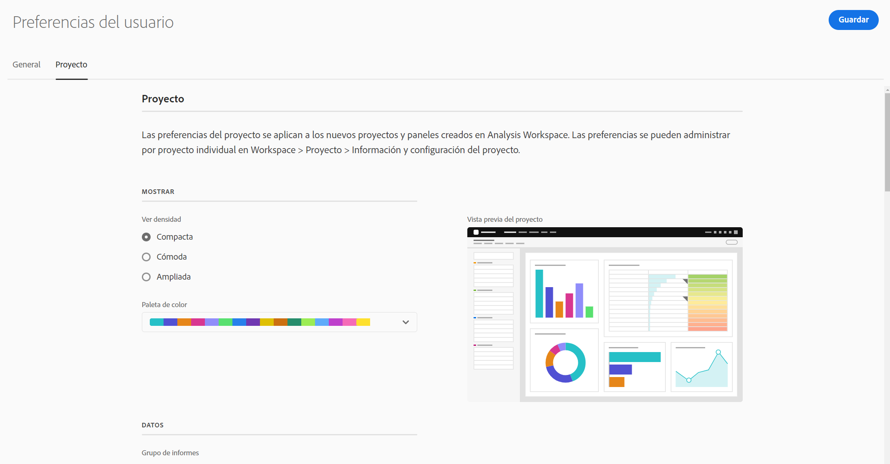
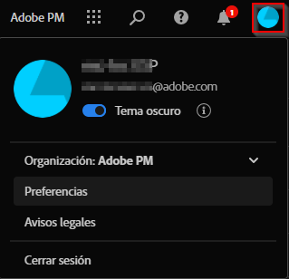

# Preferencias del usuario

Puede administrar la configuración de Analysis Workspace y sus componentes relacionados para todos los proyectos o paneles nuevos que cree. Los proyectos y paneles existentes no se ven afectados.

## Actualizar preferencias

1. En Customer Journey Analytics, vaya a la página de aterrizaje de [!UICONTROL **Proyecto**] y, a continuación, seleccione [!UICONTROL **Preferencias**].

   

1. Para obtener información sobre las preferencias disponibles en cada pestaña, continúe con cualquiera de las secciones siguientes de este artículo:

   * [Preferencias generales](#general-preferences)

   * [Preferencias de proyecto](#project-preferences)

   * [Preferencias de tabla de forma libre](#freeform-table-preferences)

   * [Preferencias de visualizaciones](#visualizations-preferences)

## Preferencias generales

Las preferencias generales se aplican a su experiencia de Customer Journey Analytics en el explorador.

| Preferencia | Opciones |
| --- | --- |
| Página de aterrizaje | Elija la página que se muestra como predeterminada al acceder a Adobe Analytics: <ul><li>Lista de proyectos (predeterminado)</li><li>Proyecto en blanco</li><li>Proyecto específico  seleccionado de una lista</li></ul> |
| Mostrar sugerencias | Muestra sugerencias en un cuadro azul en el área inferior derecha de Analysis Workspace. 
Esta opción está habilitada de manera predeterminada.
 |
| Componentes mostrados en los grupos del carril izquierdo | Elija cuántos componentes de cada se van a mostrar en el menú Componentes del carril izquierdo. 
Si elige 0, ya no podrá acceder al componente desde el carril izquierdo de los espacios de trabajo.

De forma predeterminada, se muestran 5 componentes para cada una de las siguientes opciones:
 <ul><li>Dimensiones</li><li>Métricas</li><li>Filtros</li><li>Intervalos de fechas</li></ul> 
Para obtener más información sobre los componentes en Analysis Workspace, consulte la [Información general sobre componentes](/help/components/overview.md).
 |

## Preferencias de proyecto

Puede personalizar las preferencias de proyecto para todos los proyectos nuevos que cree en Analysis Workspace. Para obtener información sobre cómo acceder a estas preferencias, consulte [Actualizar preferencias](#update-preferences).

Algunas de estas mismas preferencias también se pueden personalizar para proyectos individuales, como se describe en la [Información general sobre proyectos](/help/analysis-workspace/build-workspace-project/freeform-overview.md).

Haga clic en los títulos de las preferencias vinculadas para obtener más información y contexto sobre cada preferencia.

| Sección | Preferencia | Opciones |
| --- | --- | --- |
| **Mostrar** |  |  |
|  | [Ver densidad](https://experienceleague.adobe.com/docs/analytics/analyze/analysis-workspace/build-workspace-project/view-density.html?lang=es) | Elija cuánto contenido se mostrará en la pantalla al reducir el margen vertical del carril izquierdo, las tablas de forma libre y las tablas de cohorte. <ul><li>Compacto</li><li>Cómodo</li><li>Expandido (predeterminado)</li></ul> |
|  | [Paleta de color](https://experienceleague.adobe.com/docs/analytics/analyze/analysis-workspace/build-workspace-project/color-palettes.html?lang=es) | Elija la paleta de colores de visualización que se utiliza en Analysis Workspace. <ul><li>Paletas proporcionadas por Adobe (predeterminado)</li><li>Paleta de formato condicional </li><li>Paleta arriba/abajo (divergente)<li>Paletas personalizadas</li></ul> |
| **Datos** |  |  |
|  | [Grupo de informes](https://experienceleague.adobe.com/docs/analytics/analyze/analysis-workspace/panels/panels.html?lang=es#report-suite) | Elija desde dónde las tablas y las visualizaciones obtienen sus datos. <ul><li>Más reciente (predeterminado)</li><li>Grupo de informes específico seleccionado de una lista</li></ul> |
|  | [Calendario](https://experienceleague.adobe.com/docs/analytics/analyze/analysis-workspace/panels/panels.html?lang=es#calendar) | Seleccione de una lista de: <ul><li>Intervalos proporcionados por Adobe (el valor predeterminado es Este mes)</li><li>Intervalos definidos a medida</li></ul> |
|  | [Tipo de panel](https://experienceleague.adobe.com/docs/analytics/analyze/analysis-workspace/panels/panels.html?lang=es) | <ul><li>Improvisado (predeterminado)</li><li>En blanco</li><li>Acceso rápido a información</li></ul> |
|  | Contar instancias repetidas | Especifica si las instancias repetidas se cuentan en los informes. Por ejemplo, esta configuración (cuando está activada) trata varias vistas de página consecutivas a la misma página como varias vistas de página. Si está desactivada, se cuentan como una sola vista de página. 
**Nota:** esta configuración solo afecta a determinadas métricas (como las Visitas a una sola página) y no se aplica a las visualizaciones de Flujo o Visita en orden previsto.
 |
|  | Formato de número | <ul><li>1000,00 (predeterminado)</li><li>1.000,00</li><li>1 000,00</li></ul> |
|  | Separador CSV  carácter | <ul><li>Coma (predeterminado)</li><li>Punto y coma</li><li>Dos puntos</li><li>Barra vertical</li><li>Periodo</li><li>Espacio</li><li>Tabulación</li></ul> |
|  | Mostrar anotaciones | Elija si las anotaciones estarán visibles en los proyectos. Para obtener más información sobre las anotaciones, consulte la [Información general sobre anotaciones](/help/components/annotations/overview.md). |

## Preferencias de tabla de forma libre

Puede personalizar las preferencias de tabla de forma libre para todos los proyectos nuevos que cree en Analysis Workspace. Para obtener información sobre cómo acceder a estas preferencias, consulte [Actualizar preferencias](#update-preferences).

Algunas de estas mismas preferencias también se pueden personalizar para proyectos individuales.

Haga clic en los títulos de las secciones vinculadas para obtener más información y contexto sobre las preferencias disponibles.

| Sección | Preferencia | Opciones |
| --- | --- | --- |
| **Tabla** |  |  |
|  | Tipo de tabla | <ul><li>de forma libre</li><li>Generador de tablas</li></ul> |
|  | Métrica predeterminada de tabla | <ul><li>Ocurrencias</li><li>Visitantes únicos</li><li>Visitas</li></ul> |
|  | Dimensión predeterminada de tabla | Elija entre Minuto, Hora, Día, Semana, Mes, Trimestre o Año. |
|  | Alinear fechas | Seleccione esta opción para alinear fechas de cada columna con todas a partir de la misma fila. |
| **[Columna](/help/analysis-workspace/visualizations/freeform-table/column-row-settings/column-settings.md)** |  |  |
|  | Justificar el texto del encabezado | Permite justificar el texto del encabezado en las tablas de forma libre para que los encabezados sean más legibles y las tablas se puedan compartir con mayor facilidad. Esto resulta útil en el procesamiento de archivos .pdf y en las métricas con nombres largos. Está activada de forma predeterminada. |
|  | Mostrar totales | Este total suele ser igual o un subconjunto del [!UICONTROL Total general]. Refleja cualquier filtro de tabla aplicado en la tabla de forma libre, incluida la opción [!UICONTROL Incluir ninguno]. |
|  | Mostrar totales generales | Este total representa todas las visitas recopiladas, a veces denominadas “total del grupo de informes”. Cuando se aplica un segmento en el nivel de panel o en la tabla de forma libre, este total se ajusta para reflejar todas las visitas que coinciden con los criterios del segmento. El total general no es compatible con tablas o desgloses con [filas estáticas](/help/analysis-workspace/visualizations/freeform-table/workspace-totals.md). |
|  | Mostrar minigráfico | Muestre u oculte gráficos de líneas en la parte inferior del gráfico. Cuando esté oculta, la leyenda cambiará para no hacer referencia visual a las líneas. |
|  | Número | Determina si una celda muestra u oculta el valor numérico de la métrica. Por ejemplo, si la métrica es Visualizaciones de la página, el valor numérico es el número de visualizaciones de la página para el elemento de fila. |
|  | Porcentaje | Determina si una celda muestra u oculta el valor porcentual de la métrica. Por ejemplo, si la métrica es Visualizaciones de la página, el valor porcentual es el número de visualizaciones de la página para el elemento de fila dividido por el total de visualizaciones de la página para la columna. Nota: Se pueden mostrar porcentajes superiores al 100 % para mejorar la precisión. También se ha he incrementado el límite superior hasta el 1000 % para garantizar que la anchura de las columnas se pueda ampliar. |
|  | Mostrar anomalías <!-- This setting was moved from the "Project" tab. this is already in the tool/docs under "Freeform table, But the doc doesn't give a definition. --> | Determina si se ha ejecutado una detección de anomalías en los valores de esta columna. |
|  | La interpretación de cero no tiene valor | Para las celdas con un valor de 0, determina si se va a mostrar un 0 o una celda en blanco. Esto es útil si desea analizar los datos de todos los días de un mes y todavía faltan algunos días.  En vez de mostrar 0 para las fechas futuras, se pueden mostrar celdas en blanco. Los gráficos también respetan estas opciones de configuración (por ejemplo, si esta opción de configuración está marcada, no muestran ninguna línea ni ninguna barra con el valor 0). |
|  | Contexto | Determina si una celda muestra u oculta todo el formato de la celda, que incluye la gráfico de barras y el formato condicional <ul><li>Gráfico de barras</li> Muestra un gráfico de barras horizontal que representa el valor de la celda con relación al total de la columna. <li>Formato condicional</li>Para obtener más información sobre el formato condicional, consulte “Formato condicional” en [Configuración de columna](/help/analysis-workspace/visualizations/freeform-table/column-row-settings/column-settings.md)</ul> |
|  | Vista previa de celda | Muestra una vista previa del aspecto de cada una de las celdas con las opciones de formato seleccionadas actualmente aplicadas. |
| **[Fila](/help/analysis-workspace/visualizations/freeform-table/column-row-settings/table-settings.md)** |  |  |
|  | Desglose por posición | Seleccione esta opción si desea que el desglose permanezca con la posición del elemento en lugar de con el propio elemento. Para obtener más información sobre los desgloses, consulte [Desglose de dimensiones](/help/components/dimensions/t-breakdown-fa.md). |
|  | Cálculo de porcentajes | <ul><li>Columna</li><li>Fila</li></ul> |

## Preferencias de visualizaciones

Puede actualizar las preferencias de visualización para todos los proyectos nuevos que cree en Analysis Workspace. Para obtener información sobre cómo acceder a estas preferencias, consulte [Actualizar preferencias](#update-preferences).

Algunas de estas mismas preferencias también se pueden personalizar para visualizaciones individuales.

Haga clic en los títulos de las secciones vinculadas para obtener más información y contexto sobre las preferencias disponibles.

| Sección | Preferencia | Opciones |
| --- | --- | --- |
| **Valores generales predeterminados** |  |  |
|  | Porcentajes | Muestra valores en porcentajes para todas las visualizaciones. |
|  | Leyenda visible | Permite ocultar el texto de leyenda detallado para todas las visualizaciones. |
|  | Límite máximo de elementos | Reduce el número de elementos en el eje X para todas las visualizaciones. Puede resultar útil si tiene un conjunto de datos grande. |
|  | Mostrar doble eje (cuando corresponda) | Solo es aplicable si cuenta con dos métricas: puede tener un eje Y a la izquierda (para una métrica) y a la derecha (para otra métrica). Esto resulta útil cuando las métricas trazadas son de magnitudes muy diferentes. |
|  | Normalización (cuando corresponda) | Fuerza métricas para igualar proporciones. Esto resulta útil cuando las métricas trazadas son de magnitudes muy diferentes. |
|  | Anclar el eje Y en cero | Si todos los valores marcados en el gráfico están considerablemente por encima de cero, el gráfico mostrará el valor base del eje Y distinto a cero. Si marca esta casilla, el eje Y se forzará a ser cero (y se redibujará el gráfico). |
|  | Permitir que las anomalías escalen el eje Y | Si tiene varias métricas en un gráfico, debe pasar el ratón sobre cada anomalía para ver la banda de confianza de la métrica. Para que la visualización sea más legible, el intervalo de confianza de Detección de anomalías no escala automáticamente el eje Y. Esta opción permite que el intervalo de confianza escale la visualización. 
Para obtener más información, consulte [Ver anomalías en Analysis Workspace](/help/analysis-workspace/virtual-analyst/c-anomaly-detection/view-anomalies.md).
 |
| **[Líneas](/help/analysis-workspace/visualizations/line.md)** |  |  |
|  | Porcentajes | Muestra valores en porcentajes para las visualizaciones de Línea. |
|  | Leyenda visible | Permite ocultar el texto de leyenda detallado para la visualización de línea. |
|  | Límite máximo de elementos | Reduce el número de elementos en el eje X de la visualización de línea. Puede resultar útil si tiene un conjunto de datos grande. |
|  | Mostrar doble eje (cuando corresponda) | Solo es aplicable si cuenta con dos métricas: puede tener un eje Y a la izquierda (para una métrica) y a la derecha (para otra métrica). Esto resulta útil cuando las métricas trazadas son de magnitudes muy diferentes. |
|  | Normalización (cuando corresponda) | Fuerza métricas para igualar proporciones. Esto resulta útil cuando las métricas trazadas son de magnitudes muy diferentes. |
|  | Mostrar el eje X | Muestra el eje X en el gráfico de líneas. |
|  | Mostrar el eje Y | Muestra el eje Y en el gráfico de líneas. |
|  | Anclar eje Y | Si todos los valores marcados en el gráfico están considerablemente por encima de cero, el gráfico mostrará el valor base del eje Y distinto a cero. Si marca esta casilla, el eje Y se forzará a ser cero (y se redibujará el gráfico). |
|  | Mostrar mínimo | Superposición de una etiqueta de valor mínimo para resaltar rápidamente los valores valle de una métrica. Nota: Los valores mínimos se derivan de los puntos de datos visibles en la visualización, no del conjunto completo de valores dentro de una dimensión. |
|  | Mostrar máximo | Superposición de una etiqueta de valor máximo para resaltar rápidamente los valores pico de una métrica. Nota: Los valores máximos se derivan de los puntos de datos visibles en la visualización, no del conjunto completo de valores dentro de una dimensión. |
|  | Mostrar línea de tendencia | Se muestra una línea de tendencia promedio móvil o una regresión en la serie de líneas. Las líneas de tendencia ayudan a mostrar un patrón más claro en los datos. |
| **[Cohorte](/help/analysis-workspace/visualizations/cohort-table/t-cohort.md)** |  |  |
|  | Granularidad | En las visualizaciones de tendencias, puede cambiar la granularidad de tiempo (Día, Semana, Mes, Trimestre o Año). Este cambio también se aplica a la tabla de fuente de datos. |
|  | Mostrar sólo porcentaje | Elimina el valor numérico y solo muestra el porcentaje. |
|  | Redondear el porcentaje al entero más cercano | Redondea el valor porcentual al total más cercano en lugar de mostrar el valor decimal. |
|  | Mostrar una fila porcentual promedio | Inserta una nueva fila en la parte superior de la tabla y, a continuación, agrega el promedio de los valores dentro de cada columna. |
|  | Vista previa de cohorte | Vista previa del aspecto de la paleta de colores en la visualización de cohorte. |
|  | Paleta de cohortes | Paleta de colores utilizada en la visualización de cohorte. |
| **[Gráficos combinados](/help/analysis-workspace/visualizations/combo-charts.md)** |  |  |
|  | Mostrar el eje X | Muestra el eje X en el gráfico combinado. |
|  | Mostrar el eje Y | Muestra el eje Y en el gráfico combinado. |
|  | Mostrar puntos en las líneas | Muestra puntos en las líneas en los gráficos combinados. |
| **[Resumen de métricas clave](/help/analysis-workspace/visualizations/key-metric.md)** |  |  |
|  | Tipo de visualización de resumen | <ul><li>Enfatizar el cambio porcentual</li><li>Enfatización del valor numérico</li></ul> |
|  | Mostrar minigráficos | Se muestran u ocultan gráficos de líneas en la parte inferior del gráfico. Cuando esté oculta, la leyenda cambiará para no hacer referencia visual a las líneas. |
|  | Mostrar máx. y mín. en los reflectores | Se muestran valores mínimos y máximos en gráficos de líneas principales y de comparación. |
|  | Mostrar comparación | Se muestran datos de comparación. Cuando están ocultos, el gráfico de líneas de comparación y los objetos de cambio de resumen no se ven. |
|  | Opciones de valor numérico | En la sección [!UICONTROL **Resumen de métricas clave**] <ul><li>Mostrar cambio de porcentaje</li><li>Mostrar diferencia en bruto</li>Diferencia en bruto entre el valor total de la métrica en el intervalo de fechas principal y el secundario</ul> |
| **[Visita en orden previsto](/help/analysis-workspace/visualizations/fallout/configuring-fallout.md)** |  |  |
|  | Contenedor | Permite alternar entre visitas y visitantes para analizar las rutas seguidas por los visitantes. La opción predeterminada es Visitante. Estos ajustes le permiten comprender el compromiso del visitante a nivel de visitante (a lo largo de visitas) o restringir el análisis a una única visita. 
Las opciones disponibles son las siguientes:
 <ul><li>Visita</li><li>Visitante</li></ul> |
| **[Flujo](/help/analysis-workspace/visualizations/c-flow/create-flow.md)** |  |  |
|  | Contenedor | En la sección [!UICONTROL **Flujo**] <ul><li>Visita</li><li>Visitante</li></ul> |
|  | Etiquetas de ajustes | Normalmente, las etiquetas de los elementos de flujo se truncan para ahorrar espacio en la pantalla, pero puede hacer la etiqueta entera visible al marcar esta casilla. Valor predeterminado = sin marcar. |
|  | Incluir instancias de repetición | Las visualizaciones de flujo se basan en instancias de una dimensión. Esta configuración le da la opción de incluir o excluir instancias repetidas, por ejemplo, recargas de página. Sin embargo, las repeticiones no se pueden eliminar de las visualizaciones de flujo que incluyen dimensiones multivalor, como listVars, listProps, s.product, eVars de comercialización, etc. Valor predeterminado = sin marcar. |
|  | Mostrar información sobre herramientas | Determina si se muestran las informaciones sobre herramientas que contienen datos de nodo al pasar el ratón por encima de nodos individuales dentro de una visualización de flujo. |
|  | Número de columnas | Determina cuántas columnas desea incluir en el diagrama de flujo. |
|  | Elementos expandidos por columna | Cuántos elementos desea incluir en cada columna. |
| **Gráficos apilados** |  |  |
|  | Apilada al 100 % | Esta configuración en las visualizaciones de áreas apiladas, barras apiladas o barras horizontales apiladas convierte el gráfico en una visualización “apilada al 100 %”. 
Para obtener más información, consulte [Barra y barra apilada](/help/analysis-workspace/visualizations/bar.md).
 |
| **[Histograma](/help/analysis-workspace/visualizations/histogram.md)** |  |  |
|  | Número de contenedores | Elija el número de intervalos de datos (contenedores) en la visualización. El número máximo de contenedores es 50. 
Para obtener más información, consulte [Histograma](/help/analysis-workspace/visualizations/histogram.md).
 |
|  | Método de recuento | Elija entre las siguientes opciones: <ul><li>Visita individual</li><li>Visita</li><li>Visitante</li></ul> 
Por ejemplo, cuando se usa junto con las vistas de página, puede elegir las vistas de página por visitante, las vistas de página por visita o las vistas de página por visita individual. Para visitas, se utiliza “Ocurrencias” como métrica del eje y en una tabla de forma libre.
 |
| **[Cambio de resumen](/help/analysis-workspace/visualizations/summary-number-change.md)** |  |  |
|  | Valor | <!-- Seem to be basically the same options as in "Number value options" --> <ul><li>Cambio porcentual</li><li>Diferencia en bruto</li></ul> |
|  | Porcentajes | Muestra valores en porcentajes para las visualizaciones de Cambio de resumen. |
|  | Leyenda visible | Permite ocultar el texto de leyenda detallado para la visualización de Cambio de resumen. |
| **[Número de resumen](/help/analysis-workspace/visualizations/summary-number-change.md)** |  |  |
|  | Porcentajes | Muestra valores en porcentajes para las visualizaciones de Número de resumen. |
|  | Leyenda visible | Permite ocultar el texto de leyenda detallado para la visualización de Número de resumen. |
|  | Valor de resumen por | Elija entre Máx., Mín., Promedio, Mediana y Suma. |
|  | Valor abreviado | En la sección [!UICONTROL **Número de resumen**] |
| **[Gráfico de rectángulos](/help/analysis-workspace/visualizations/treemap.md)** |  |  |
|  | Porcentajes | Muestra valores en porcentajes para las visualizaciones de Gráfico de rectángulos. |
|  | Límite máximo de elementos | Reduce el número de elementos en el eje X de la visualización del Gráfico de rectángulos. Puede resultar útil si tiene un conjunto de datos grande. |
| **[Venn](/help/analysis-workspace/visualizations/venn.md)** |  |  |
|  | Leyenda visible | Permite ocultar el texto de leyenda detallado para la visualización de Venn. |
| **[Dispersión](/help/analysis-workspace/visualizations/scatterplot.md)** |  |  |
|  | Porcentajes | Muestra valores en porcentajes para las visualizaciones de Dispersión. |
|  | Leyenda visible | Permite ocultar el texto de leyenda detallado para la visualización de Dispersión. |
|  | Límite máximo de elementos | Reduce el número de elementos en el eje X de la visualización de Dispersión. Puede resultar útil si tiene un conjunto de datos grande. |
|  | Anclar el eje Y en cero | Si todos los valores marcados en el gráfico están considerablemente por encima de cero, el gráfico mostrará el valor base del eje Y distinto a cero. Si marca esta casilla, el eje Y se forzará a ser cero (y se redibujará el gráfico). |

## Preferencias de empresa

>[!AVAILABILITY]
>
>La funcionalidad Vínculos de acceso público descrita en esta sección se encuentra en la fase Prueba limitada de la versión y es posible que no esté disponible aún en su entorno. Esta nota se eliminará cuando la funcionalidad esté disponible de forma general. Para obtener información acerca del proceso de lanzamiento de Analytics, consulte [Lanzamientos de funcionalidades de Customer Journey Analytics](/help/release-notes/releases.md).

Puede actualizar las preferencias de la empresa que se aplican a todos los usuarios y proyectos de su organización. Para obtener información sobre cómo acceder a estas preferencias, consulte [Actualizar preferencias](#update-preferences).

| Sección | Preferencia | Opciones |
| --- | --- | --- |
| **Uso compartido de proyectos** |  |  |
|  | Permitir compartir solo con usuarios de Workspace | 
Cuando esta opción está habilitada:
 <ul><li>
La opción &quot;Compartir con cualquiera&quot; se ha eliminado del menú Compartir. Esto significa que los usuarios ya no pueden compartir proyectos con personas que no tengan una cuenta de Analysis Workspace en su organización, tal como se describe en [Compartir un proyecto con cualquier persona (no se requiere inicio de sesión)](/help/analysis-workspace/curate-share/share-projects.md#share-public-link) en [Compartir proyectos](/help/analysis-workspace/curate-share/share-projects.md).
</li> <li>
Las personas que previamente hayan recibido acceso a un proyecto mediante la opción &quot;Compartir con cualquiera&quot; ya no podrán acceder al proyecto.
</li>
**NOTA:** Si esta opción está habilitada (para permitir el uso compartido solo con usuarios de Workspace) y después deshabilitada (para permitir el uso compartido con cualquier persona), las personas que previamente hayan recibido acceso a un proyecto a través de la opción de uso compartido &quot;Compartir con cualquier persona&quot; no recuperarán automáticamente su acceso al proyecto. En este caso, el usuario que compartió el proyecto debe habilitar la variable [!UICONTROL **El vínculo está activo**] que está disponible al compartir un proyecto con cualquier persona ([!UICONTROL **Compartir**] > [!UICONTROL **Compartir con cualquier persona**]), tal como se describe en [Compartir un proyecto con cualquier persona (no se requiere inicio de sesión)](/help/analysis-workspace/curate-share/share-projects.md#share-public-link) en [Compartir proyectos](/help/analysis-workspace/curate-share/share-projects.md).
 |
|  | Requiere autenticación de Experience Cloud | 
Cuando está habilitado, las personas a las que se concede acceso a un proyecto desde la opción &quot;Compartir con cualquiera&quot; de Analysis Workspace deben autenticarse con sus credenciales de Experience Cloud.
 
Una vez habilitada esta opción, cada vez que un usuario comparte un proyecto con la opción de uso compartido &quot;Compartir con cualquiera&quot;, la opción &quot;Requerir autenticación de Experience Cloud&quot; está habilitada en el cuadro de diálogo de uso compartido y el usuario que comparte el proyecto no puede desactivarla. (Para obtener información sobre cómo los usuarios pueden compartir proyectos con cualquier persona, consulte [Compartir un proyecto con cualquier persona (no se requiere inicio de sesión)](/help/analysis-workspace/curate-share/share-projects.md#share-public-link) en [Compartir proyectos](/help/analysis-workspace/curate-share/share-projects.md).)
 
Tenga en cuenta lo siguiente al habilitar esta opción:
<ul><li>
Cuando habilita esta opción, se desactivan todos los proyectos que anteriormente se compartieron con la opción de uso compartido &quot;Compartir con nadie&quot; y que no tienen habilitada la opción &quot;Requerir autenticación de Experience Cloud&quot;.
</li> <li>
Si esta opción está habilitada (para requerir autenticación de Experience Cloud) y después deshabilitada (para permitir que cualquier persona con el vínculo pueda acceder al proyecto), las personas que previamente hayan recibido acceso a un proyecto a través de la opción de compartir con otros usuarios no recuperarán automáticamente su acceso al proyecto. En este caso, el usuario que compartió el proyecto debe habilitar la opción &quot;El vínculo está activo&quot; que está disponible al compartir un proyecto con cualquier persona ([!UICONTROL **Compartir**] > [!UICONTROL **Compartir con cualquier persona**] > [!UICONTROL **El vínculo está activo**]), tal como se describe en [Compartir un proyecto con cualquier persona (no se requiere inicio de sesión)](/help/analysis-workspace/curate-share/share-projects.md#share-public-link) en [Compartir proyectos](/help/analysis-workspace/curate-share/share-projects.md).
</li> <li>
Esta opción solo está disponible si SSO está implementado en su organización. Para obtener información sobre cómo los administradores del sistema pueden habilitar SSO para su organización, consulte [Configuración de identidad e inicio de sesión único](https://helpx.adobe.com/es/enterprise/using/set-up-identity.html){target=_blank}.

Si SSO está configurado para su organización, compruebe si algún tipo de creación de cuenta automática está implementado en la consola. Normalmente, un administrador del sistema lo configuraría, tal como se describe en [Habilitar la creación automática de cuentas](https://helpx.adobe.com/enterprise/using/automatic-account-creation.html){target=_blank}.
</li><li>
Si su organización está en un sector que requiere cumplimiento HIPAA, esta opción se habilita automáticamente y no se puede deshabilitar.
</li></ul> |

{style="table-layout:auto"}

## Restaurar preferencias predeterminadas

Puede restaurar todas sus preferencias de usuario a los valores predeterminados del sistema. No afecta a las preferencias del administrador en la pestaña Compañía.

No se puede deshacer esta acción.

1. En el Customer Journey Analytics, seleccione [!UICONTROL **Componentes**] **>** [!UICONTROL **Preferencias**].

   

1. En la esquina superior derecha, seleccione **[!UICONTROL Restaurar valores predeterminados]**.

1. Cuando se le solicite, seleccione **[!UICONTROL Restaurar valores predeterminados]**.

## [!UICONTROL Tema oscuro]

Si prefiere tener un fondo oscuro para la interfaz de usuario de Adobe Analytics, puede alternarla al [!UICONTROL Tema oscuro].

1. Haga clic en el icono de usuario de Experience Cloud en la parte superior derecha.

   

1. Mueva el selector del **[!UICONTROL Tema oscuro]** a la derecha.

