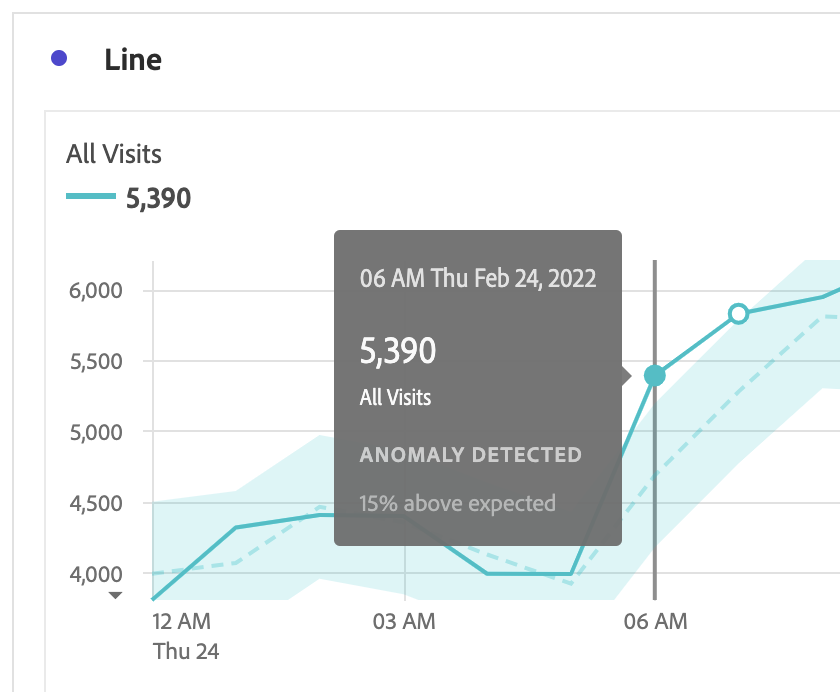

# Visualización de anomalías en Analysis Workspace

Puede ver anomalías en una tabla o un gráfico de líneas.

## Ver las anomalías en una tabla {#section_869A87B92B574A38B017A980ED8A29C5}

Puede ver anomalías en una tabla improvisada de serie temporal.

1. Seleccione el icono de configuración de columna en el encabezado de columna y, a continuación, asegúrese de que la variable [!UICONTROL **Anomalías**] está seleccionada en la lista de opciones. Para obtener más información, consulte [Configuración de columna](/help/analysis-workspace/visualizations/freeform-table/column-row-settings/column-settings.md).

1. Haga clic fuera del menú de configuración para ver la tabla actualizada.

   

1. Las anomalías se muestran en la tabla de la siguiente manera:

   A **triángulo gris oscuro** aparece en la esquina superior derecha de cada fila donde se detecta una anomalía de datos.

   El color **línea vertical** en cada fila indica el valor esperado. El color **área sombreada** en cada fila indica el valor real. El modo en que la línea (valor esperado) se compara con el área sombreada (valor real) determina si hay una anomalía. (Una observación se considera anómala en función de las técnicas estadísticas avanzadas descritas en [Técnicas estadísticas utilizadas en la detección de anomalías](/help/analysis-workspace/virtual-analyst/c-anomaly-detection/statistics-anomaly-detection.md).)

1. Seleccione el triángulo gris en la esquina superior derecha de una fila para ver los detalles de la anomalía. Esto muestra el grado (como porcentaje) en que el valor real difiere por encima o por debajo del valor esperado.

## Ver anomalías en un gráfico de líneas {#section_7C1192AFDB4345A8A2CCFB3AE0C47D82}

Los gráficos de líneas son la única visualización que permite ver anomalías.

Para ver anomalías en un gráfico de líneas:

1. Seleccione el icono de configuración en el encabezado de visualización y, a continuación, asegúrese de que la variable [!UICONTROL **Mostrar anomalías**] está seleccionada en la lista de opciones. Para obtener más información, consulte [Línea](/help/analysis-workspace/visualizations/line.md).

1. (Opcional) Para permitir que el intervalo de confianza escale el gráfico, seleccione el icono de configuración en el encabezado de visualización y, a continuación, seleccione la opción . **[!UICONTROL Permitir que las anomalías escalen el eje Y]**.

   Esta opción no está seleccionada de forma predeterminada porque a veces puede hacer que el gráfico sea menos legible.

1. Haga clic fuera del menú de configuración para ver el gráfico de líneas actualizado.

   

   Las anomalías se muestran en el gráfico de líneas de la siguiente manera:

   A **punto blanco** aparece en la línea donde se detecta una anomalía de datos. (Una observación se considera anómala en función de las técnicas estadísticas avanzadas descritas en [Técnicas estadísticas utilizadas en la detección de anomalías](/help/analysis-workspace/virtual-analyst/c-anomaly-detection/statistics-anomaly-detection.md).)

   La variable **área sombreada clara** es la banda de confianza, o intervalo esperado, donde deben producirse valores. Cualquier valor que quede fuera de este intervalo esperado es una anomalía.

   Si tiene varias métricas en el gráfico de líneas, solo se muestran las anomalías y debe pasar el ratón por encima de cada anomalía para ver la banda de confianza de esa métrica.

   La variable **línea de puntos** es el valor esperado exacto.

1. Haga clic en una anomalía (punto blanco) para ver la siguiente información:

   * La fecha en la que se produjo la anomalía

   * El valor sin procesar de la anomalía

   * El valor de porcentaje por encima o por debajo del valor esperado, que se representa por la línea verde sólida.

