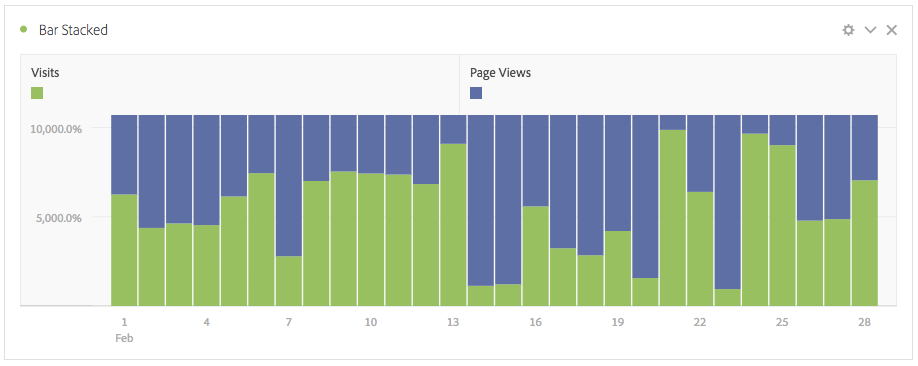

# Barra y barra apilada

>[!NOTE]
>
>Está viendo la documentación de Analysis Workspace en Customer Journey Analytics. Su conjunto de funciones difiere ligeramente del [Analysis Workspace de la versión tradicional de Adobe Analytics](https://docs.adobe.com/content/help/es-ES/analytics/analyze/analysis-workspace/home.html). [Más información...](/help/getting-started/cja-aa.md)

## Barra

Esta visualización muestra las barras verticales que representan los distintos valores de una o varias métricas.

Un menú desplegable de granularidad en la configuración de visualización le permite cambiar una visualización de tendencias (p. ej., una línea o una barra) de diaria a semanal, mensual, etc.

## Barra apilada

Esta visualización es similar a un gráfico de barras, pero con las barras de series apiladas en la parte superior de cada barra.

Una nueva configuración en las visualizaciones de barras apiladas convierte el gráfico en una visualización apilada al 100 %:

