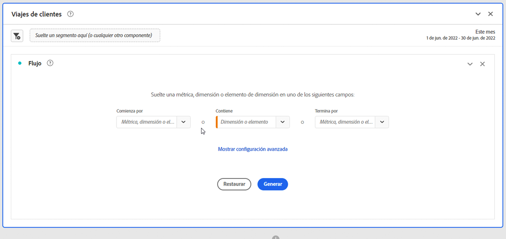
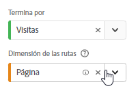
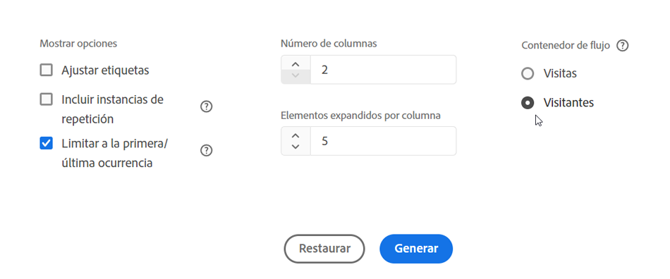
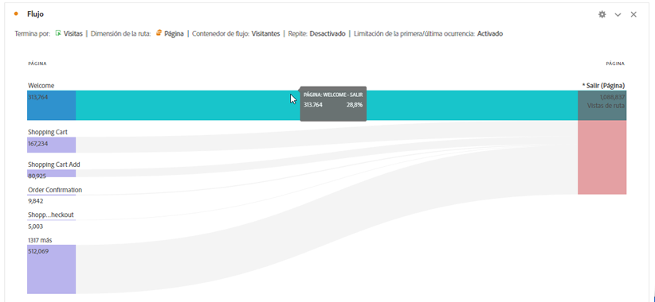
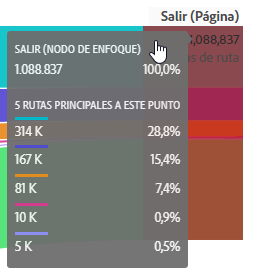

# Configuración de una visualización de flujo

La visualización de flujo actualizada permite comprender los recorridos que se derivan de un evento de conversión específico en el sitio web o la aplicación, o que se generan en él. Rastrea una ruta a través de sus dimensiones (y elementos de dimensión) o métricas. Flujo permite configurar el inicio o el final de la ruta que le interese o analizar todas las rutas que fluyen a través de una dimensión o elemento de dimensión.

El nuevo [!UICONTROL flujo] la experiencia mejora el flujo de trabajo de varias formas:

* Ahora puede elegir iniciar o finalizar la ruta con la combinación de una métrica y una dimensión de rutas.
* Contiene [!UICONTROL Configuración avanzada] para permitirle personalizar aún más el [!UICONTROL flujo].
* El nuevo botón &quot;Generar&quot; ahorra tiempo en análisis al permitirle configurar el recorrido de una sola vez, luego consultar y luego crear automáticamente varias columnas y nodos a la vez &#x200B;.

## Pasos de configuración {#configure}

1. Para empezar a crear un diagrama de flujo, agregue un panel en blanco al proyecto y haga clic en el icono de visualizaciones en el carril izquierdo. A continuación, arrastre la visualización Flujo al panel. O arrastre el [!UICONTROL Flujo] visualización en un proyecto existente.

1. Ancla la visualización Flujo mediante una de las tres opciones:

   * [!UICONTROL Comienza con] (métricas, dimensiones o elementos), o
   * [!UICONTROL Contiene] (dimensiones o elementos), o
   * [!UICONTROL Finaliza con] (métricas, dimensiones o elementos)

   Cada una de estas categorías se muestra como “zona de colocación”. Puede rellenar la zona de colocación de tres formas:

   * Utilice el menú desplegable para seleccionar métricas o dimensiones.
   * Arrastre elementos desde la lista de dimensiones o métricas.
   * Utilice la búsqueda para encontrar las métricas o dimensiones que está buscando.

   Por ejemplo, supongamos que desea rastrear todo lo que conduce a un evento de cierre de compra. Puede arrastrar una dimensión o métrica relacionada con el cierre de compra (por ejemplo, [!UICONTROL El pedido existe]) en el **[!UICONTROL Finaliza con]** zona de colocación.

1. Si elige una métrica, también debe proporcionar una [!UICONTROL Dimension de rutas], como se muestra aquí, que utilizará para crear la ruta. El valor predeterminado es [!UICONTROL Página].

   

   >[!IMPORTANT]
   >
   >Las métricas calculadas no se pueden colocar en la variable  **[!UICONTROL Comienza con]** o **[!UICONTROL Finaliza con]** zonas de colocación.

1. (Opcional) Haga clic en **[!UICONTROL Mostrar configuración avanzada]** para configurar la configuración avanzada:

   

   | Configuración | Descripción |
   | --- | --- |
   | **[!UICONTROL Etiquetas de ajuste]** | Normalmente, las etiquetas de los elementos de flujo se truncan para ahorrar espacio en la pantalla, pero puede hacer la etiqueta entera visible al marcar esta casilla.  Valor predeterminado = sin marcar. |
   | **[!UICONTROL Incluir instancias repetidas]** | Las visualizaciones de flujo se basan en instancias de una dimensión. Esta configuración le da la opción de incluir o excluir instancias repetidas, por ejemplo, recargas de página. Sin embargo, las repeticiones no se pueden eliminar de las visualizaciones de flujo que incluyen dimensiones multivalor, como listVars, listProps, s.product, eVars de comercialización, etc. Valor predeterminado = sin marcar. |
   | **[!UICONTROL Limitar a la primera/última ocurrencia]** | Limite las rutas a aquellas que comienzan/finalizan con la primera/última incidencia de una dimensión, elemento/métrica. Consulte la sección siguiente titulada &quot;Ejemplo de escenario para &quot;limitar a la primera/última incidencia&quot;&quot; para obtener una explicación más detallada. |
   | **[!UICONTROL Número de columnas]** | Determina cuántas columnas desea incluir en el diagrama de flujo. |
   | **[!UICONTROL Elementos expandidos por columna]** | ¿Cuántos elementos desea incluir en cada columna? |
   | **[!UICONTROL Contenedor de flujo]** | <ul><li>Visita</li><li>Visitante.</li></ul> Permite alternar entre visitas y visitantes para analizar las rutas seguidas por los visitantes. Estos ajustes le permiten comprender el compromiso del visitante a nivel de visitante (a lo largo de visitas) o restringir el análisis a una única visita. |

1. Haga clic en **[!UICONTROL Generar]**.

## Ver y cambiar la salida de flujo {#output}

En la parte superior del diagrama aparece un resumen de la configuración de flujo. Las rutas del diagrama son proporcionales. Las rutas con más actividad se muestran más gruesas.

Para profundizar en los datos, tiene varias opciones:

* El diagrama de flujo es interactivo. Pase el ratón por encima del diagrama para cambiar los detalles que se muestran.

* Cuando hace clic en un nodo en el diagrama, se muestran los detalles de dicho nodo. Vuelva a hacer clic en el nodo para contraerlo.

   

* Puede filtrar una columna para mostrar solo ciertos resultados, como incluir y excluir, especificar criterios, etc.

* Haga clic en el signo más (+) de la izquierda para expandir una columna.

* Utilice las opciones del botón derecho que se explican a continuación para personalizar aún más la salida.

* Haga clic en el icono de lápiz situado junto al resumen de la configuración para editar el flujo o reconstruirlo con diferentes opciones.

* También puede exportar y seguir analizando el diagrama de flujo como parte del archivo .CSV de un proyecto. Para ello, vaya a **[!UICONTROL Proyecto]** > **[!UICONTROL Descargar CSV]**.

## Filtro

Por encima de cada columna, aparece un filtro cuando pasa el ratón por encima. Al hacer clic en el filtro, obtiene el mismo cuadro de diálogo de filtro que existe en la tabla improvisada de hoy. Este filtro funciona igual que en la tabla improvisada.

* Utilice la configuración avanzada para incluir o excluir determinados criterios con nuestra lista de operadores.
* Una vez que haya filtrado un elemento de la lista, esa columna específica reflejará el filtrado. (El filtro lo reduce para mostrar solo el elemento permitido en el filtro o elimina todos los elementos excepto el elemento que desee en el filtro.
* Todas las columnas descendentes y ascendentes deben persistir, siempre y cuando haya datos fluyendo a los nodos restantes.
* Una vez aplicado, el icono de filtro aparece en azul encima de la columna que está filtrando.
* Para quitar un filtro, haga clic en el icono de filtro para abrir el menú de filtro. Elimine los filtros aplicados y haga clic en **[!UICONTROL Guardar]**. El flujo debe volver a su estado anterior sin filtrar.

## Opciones con el botón derecho del ratón {#right-click}

| Opción | Descripción |
|--- |--- |
| [!UICONTROL Centrarse en este nodo] | Cambia el interés al nodo seleccionado. El nodo de interés aparece en el centro del diagrama de flujo. |
| [!UICONTROL Volver a empezar] | Le hace regresar al generador de diagramas improvisados, donde puede crear un nuevo diagrama de flujo. |
| [!UICONTROL Crear segmento desde este punto del flujo] | Creación de segmentos. Esto le lleva al Generador de segmentos, donde puede configurar el nuevo segmento. |
| [!UICONTROL Desglosar] | Desglosa el nodo mediante las dimensiones, métricas o tiempo disponibles. |
| [!UICONTROL Tendencia] | Crea un diagrama de tendencia para el nodo. |
| [!UICONTROL Expandir toda la columna] | Expande una columna para mostrar todos los nodos. De forma predeterminada, únicamente se muestran los cinco nodos principales. |
| [!UICONTROL Contraer toda la columna] | Oculta todos los nodos de una columna. |
| [!UICONTROL Excluir elemento]/[!UICONTROL Restaurar elementos excluidos] | Quita un nodo específico de la columna y lo crea automáticamente como filtro en la parte superior de la columna. Para restaurar el elemento excluido, haga clic con el botón derecho de nuevo y seleccione **[!UICONTROL Restaurar elemento excluido]**. también puede abrir el filtro en la parte superior de la columna y quitar la caja de la píldora con el elemento que acaba de excluir. |

## Ejemplo de escenario para &quot;limitar a la primera/última incidencia&quot;

Al utilizar esta opción, tenga en cuenta que:

* **[!UICONTROL Limitar a primera/última incidencia]** solo cuenta la primera/última incidencia de la serie. Todas las demás ocurrencias del **[!UICONTROL Comienza con]** o **[!UICONTROL Finaliza con]** Los criterios de se descartan.
* Si se usa con un **[!UICONTROL Comienza con]** , solo se incluye la primera incidencia que coincida con los criterios de inicio.
* Si se usa con un **[!UICONTROL Finaliza con]** , solo se incluirá la última incidencia que coincida con los criterios finales.
* La serie utilizada difiere según el contenedor. Si se usa la variable **[!UICONTROL Visita]** , la serie de visitas será la sesión. Si se usa la variable **[!UICONTROL Visitante]** , la serie de visitas será todas las visitas de un usuario determinado en el intervalo de fechas proporcionado.
* La variable **[!UICONTROL Limitar a primera/última incidencia]** se puede configurar en la configuración avanzada cuando se utiliza un elemento de métrica o Dimension en los campos &quot;Comienza con&quot; o &quot;Termina con&quot;.

Ejemplo de serie de visitas:

Inicio > Productos > Agregar al carro > Productos > Agregar al carro > Facturación > Confirmación del pedido

### Considere un análisis de flujo con la siguiente configuración:

* Comience por[!UICONTROL  Agregar al carro] (Artículo Dimension)
* [!UICONTROL Página] dimensión de rutas
* [!UICONTROL Visita] container

Si &quot;Limitar a la primera/última incidencia&quot; está deshabilitado, esta única serie de visitas contará dos veces el valor &quot;Agregar al carro&quot;.
Salida de flujo esperada: &quot;Añadir al carro&quot; (2) —> &quot;Productos&quot; (1) -> &quot;Facturación&quot; (1)

Sin embargo, si &quot;Limitar a la primera/última incidencia&quot; está habilitado, solo se incluirá en el análisis la primera incidencia de &quot;Agregar al carro de compras&quot;.
Salida de flujo esperada: &quot;Añadir al carro&quot; (1) —> &quot;Productos&quot; (1)

### Considere la misma serie de visitas pero utilice la siguiente configuración:

* Finaliza con [!UICONTROL Agregar al carro] (Artículo Dimension)
* [!UICONTROL Página] dimensión de rutas
* [!UICONTROL Visita] container

If **[!UICONTROL Limitar a primera/última incidencia]** es *disabled*, esta única serie de visitas contaría 2 ocurrencias de &quot;Agregar al carro de compras&quot;.
Salida de flujo esperada: &quot;Productos&quot; (2) &lt;— &quot;Añadir al carro&quot; (2)

Sin embargo, si **[!UICONTROL Limitar a primera/última incidencia]** es *enabled*, solo la última incidencia de [!UICONTROL Agregar al carro] se incluiría en el análisis.
Salida de flujo esperada: &quot;Productos&quot; (1) &lt;— &quot;Añadir al carro&quot; (1)
