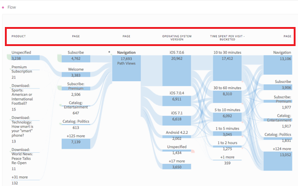

# Flujos interdimensionales

Un flujo interdimensional le permite examinar rutas de usuario entre varias dimensiones. Este artículo muestra cómo utilizar este flujo para dos casos de uso: interacciones y eventos de aplicaciones móviles y cómo las campañas generan visitas web

<!--
A dimension label at the top of each Flow column makes using multiple dimensions in a flow visualization more intuitive:

-->

## Eventos e interacciones de aplicaciones móviles

La dimensión [!UICONTROL Nombre de pantalla] se usa en este flujo de ejemplo para ver cómo utilizan los usuarios las distintas pantallas (escenas) de la aplicación. La pantalla principal devuelta es **[!UICONTROL luma: content: ios: en: home]**, que es la página principal de la aplicación:

Para explorar la interacción entre pantallas y tipos de eventos (como añadir al carro de compras, compras, etc.) en esta aplicación, arrastre y suelte la dimensión **[!UICONTROL Tipos de eventos]**:

* Sobre cualquier paso disponible en el flujo, para reemplazar esa dimensión:

  

* Fuera de la visualización de flujo actual, para añadir la dimensión:

  

La siguiente visualización de flujo muestra el resultado de añadir la dimensión **[!UICONTROL Tipos de eventos]**. La visualización proporciona perspectivas sobre cómo los usuarios de aplicaciones móviles se mueven por varias pantallas de la aplicación antes de añadir productos al carro de compras, cerrar la aplicación, que se les presente una oferta y mucho más.

## Cómo impulsan las campañas las visitas a la web

Desea analizar qué campañas generan visitas al sitio web. Crea una visualización de flujo con **[!UICONTROL Nombre de campaña]** como dimensión

Reemplace la última dimensión **[!UICONTROL Nombre de campaña]** por la dimensión **[!UICONTROL Nombre de página con formato]** y añada otra dimensión **[!UICONTROL Nombre de página con formato]** al final de la visualización del flujo.

Puede pasar el puntero por encima de cualquiera de los flujos para ver más detalles. Por ejemplo, qué campañas han resultado en un cierre de compra del carro de compras.

