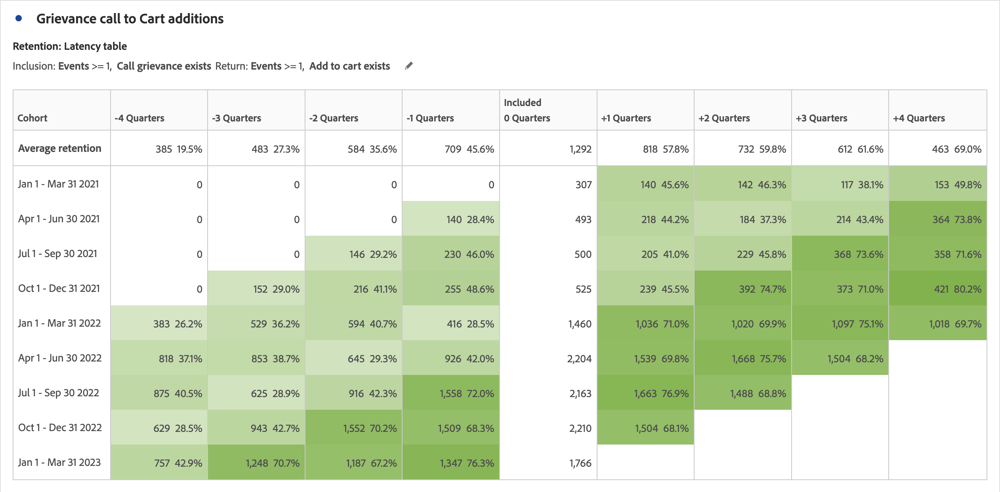

# Configuración de la tabla de cohortes {#cohort-table-overview}

<!-- markdownlint-disable MD034 -->

>[!CONTEXTUALHELP]
>id="workspace_cohorttable_button"
>title="Tabla de cohortes"
>abstract="Cree una visualización de cohorte para agrupar usuarios en función de la finalización de un evento y analice la participación en curso y las cancelaciones a lo largo del tiempo."

<!-- markdownlint-enable MD034 -->

<!-- markdownlint-disable MD034 -->

>[!CONTEXTUALHELP]
>id="workspace_cohorttable_panel"
>title="Tabla de cohortes"
>abstract="Agrupe a los usuarios en función de la finalización de un evento y, a continuación, analice su participación actual y las cancelaciones a lo largo del tiempo. Especifique los ajustes adicionales como granularidad, tipo de análisis de cohorte y si desea utilizar o no el cálculo móvil. Puede establecer opciones avanzadas para crear una tabla de latencia o una cohorte de dimensión personalizada basada en una dimensión seleccionada."

<!-- markdownlint-enable MD034 -->

>[!BEGINSHADEBOX]

_Este artículo documenta la tabla de cohorte en_  _**Customer Journey Analytics**._ _Consulte [Tabla de cohortes](https://experienceleague.adobe.com/en/docs/analytics/analyze/analysis-workspace/visualizations/cohort-table/cohort-analysis) para la_  _**Adobe Analytics** de este artículo._

>[!ENDSHADEBOX]

Una *cohorte* es un grupo de personas que comparten características en común durante un periodo especificado. Una visualización  **[!UICONTROL Tabla de cohortes]** es útil, por ejemplo, cuando se desea saber cómo se relaciona una cohorte con una marca. Puede identificar fácilmente los cambios en tendencias y responder en consecuencia. (Las explicaciones de [!UICONTROL análisis de cohorte] se encuentran disponibles en la web, como en la [Guía básica de análisis de cohorte](https://es.wikipedia.org/wiki/Cohort_analysis)).

Después de crear un informe de cohorte, puede depurar sus componentes (dimensiones, métricas y segmentos específicos), y luego compartir el informe de cohorte con quien desee. Consulte [Depurar y compartir](/help/analysis-workspace/curate-share/curate.md).

Ejemplos de lo que puede hacer con una [!UICONTROL Tabla de cohortes]:

* Iniciar campañas diseñadas para generar una acción deseada.
* Modificar el presupuesto de marketing en el momento justo del ciclo de vida del cliente.
* Reconocer cuándo finalizar una prueba o una oferta para maximizar el valor.
* Obtener ideas para pruebas A/B en áreas como precios, ruta de actualización, etc.

La [!UICONTROL tabla de cohortes] está disponible para todos los clientes de Customer Journey Analytics con derechos de acceso a [!UICONTROL Analysis Workspace].

>[!BEGINSHADEBOX]

Consulte  [Análisis de cohortes en el espacio de trabajo de análisis](https://video.tv.adobe.com/v/23990/?quality=12&learn=on){target="_blank"} para ver un vídeo de demostración.

{{videoaa}}

>[!ENDSHADEBOX]

>[!IMPORTANT]
>
>[!UICONTROL Análisis de cohorte] no admite métricas no segmentables (incluidas las métricas calculadas), métricas no enteras (como Ingresos) u Ocurrencias. Solo se pueden usar las métricas de los segmentos en [!UICONTROL Análisis de cohorte], y solo se pueden incrementar de uno en uno.

Las tablas de cohorte de Customer Journey Analytics admiten métricas basadas en doble base (o en cualquier métrica numérica). Por ejemplo, Purchase.Value (un valor doble) se puede utilizar como Métrica de inclusión/retorno. Además, todas las métricas que se pasan a Adobe Experience Platform a través del conector de origen de Analytics también son dobles.

## Funciones de la tabla de cohortes

Las secciones siguientes describen las funciones de análisis de cohorte que permiten un control preciso de las cohortes que está creando.

Para obtener información más detallada sobre cómo crear una cohorte y ejecutar un informe de [!UICONTROL Análisis de cohorte], consulte [Configurar una tabla de cohortes](/help/analysis-workspace/visualizations/cohort-table/t-cohort.md).

### [!UICONTROL Tabla de retención]

Un tabla de cohortes de [!UICONTROL retención] devuelve la información de personas: cada celda de datos muestra el número sin procesar y el porcentaje de personas en la cohorte que realizó la acción durante ese periodo de tiempo. Se pueden incluir hasta 3 métricas y hasta 10 segmentos.

### Tabla de [!UICONTROL pérdida]

Una tabla de cohortes de [!UICONTROL pérdida] es la inversa de una tabla de retención y muestra a las personas que abandonaron o que no llegaron a satisfacer los criterios de regreso de su cohorte a lo largo del tiempo. Se pueden incluir hasta 3 métricas y hasta 10 segmentos.

### [!UICONTROL Cálculo móvil]

Puede calcular la retención o la pérdida en función de la columna anterior, no de la columna incluida, que se denomina cálculo móvil.

### Tabla de [!UICONTROL latencia]

Una tabla de latencia mide el tiempo que transcurre antes y después de que se produzca el evento de inclusión. La medición de la latencia es una herramienta excelente para el análisis previo y posterior. La columna **[!UICONTROL Incluido]** está en el centro de la tabla y a ambos lados se muestran los períodos de tiempo antes y después del evento de inclusión.

### Cohorte de [!UICONTROL dimensión personalizada]

Puede crear cohortes basadas en una dimensión seleccionada, y no cohortes basadas en el tiempo (que son las predeterminadas). Utilice dimensiones como [!UICONTROL Ciudad geo], [!UICONTROL Canal de marketing], [!UICONTROL campaña], [!UICONTROL producto], [!UICONTROL página], [!UICONTROL región] o cualquier otra dimensión para mostrar cómo cambia la retención. En función de los diferentes valores de estas dimensiones.

>[!MORELIKETHIS]
>
>[Configuración de una tabla de cohortes](/help/analysis-workspace/visualizations/cohort-table/t-cohort.md).
>

