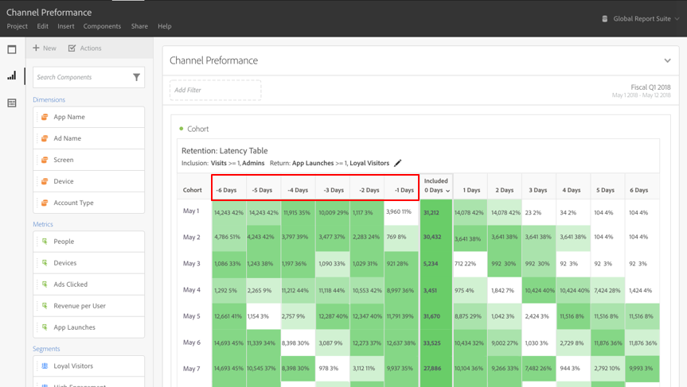

# ¿Qué es el [!UICONTROL análisis de cohorte]?

Una *`cohort`* es un grupo de personas que comparten características en común durante un periodo especificado. El [!UICONTROL análisis de cohorte] es útil, por ejemplo, cuando desea saber cómo se involucra una cohorte con una marca. Puede identificar fácilmente los cambios en tendencias y responder en consecuencia. (Las explicaciones de [!UICONTROL análisis de cohorte] se encuentran disponibles en la web, como en la [Guía básica de análisis de cohorte](https://en.wikipedia.org/wiki/Cohort_analysis)).

Después de crear un informe de cohorte, puede depurar sus componentes (dimensiones, métricas y filtros específicos), y luego compartir el informe de cohorte con quien desee. Consulte [Depurar y compartir](/help/analysis-workspace/curate-share/curate.md).

Ejemplos de lo que puede hacer con el [!UICONTROL análisis de cohorte]:

* Iniciar campañas diseñadas para generar una acción deseada.
* Modificar el presupuesto de marketing en el momento justo del ciclo de vida del cliente.
* Reconocer cuándo finalizar una prueba o una oferta, para maximizar el valor.
* Obtener ideas para pruebas A/B en áreas como precios, ruta de actualización, etc.

El [!UICONTROL análisis de cohorte] está disponible para todos los clientes de Customer Journey Analytics con derechos de acceso a [!UICONTROL Analysis Workspace].

[Tutorial en vídeo de análisis de cohortes](https://experienceleague.adobe.com/docs/analytics-learn/tutorials/analysis-workspace/cohort-analysis/cohort-analysis-workspace.html?lang=es) (4:36)

>[!IMPORTANT]
>
>[!UICONTROL Análisis de cohorte] no admite métricas no filtrables (incluidas las métricas calculadas), métricas no enteras (como Ingresos) u Ocurrencias. Solo se pueden usar las métricas de los filtros en [!UICONTROL Análisis de cohorte], y solamente se pueden incrementar de uno en uno.

## Capacidades del análisis de cohorte

Las siguientes funciones permiten un control preciso de las cohortes que está creando:

### Tabla de [!UICONTROL retención]

Un informe de cohorte [!UICONTROL Retención] devuelve personas: cada celda de datos muestra el número sin procesar y el porcentaje de personas en la cohorte que realizó la acción durante ese período de tiempo. Se pueden incluir hasta 3 métricas y hasta 10 filtros.

### [!UICONTROL Tabla de pérdida]

Una cohorte [!UICONTROL Pérdida] es la inversa de una tabla de retención y muestra a las personas que abandonaron o que no llegaron a satisfacer los criterios de regreso de su cohorte a lo largo del tiempo. Se pueden incluir hasta 3 métricas y hasta 10 filtros.

### [!UICONTROL Cálculo móvil]

Permite calcular la retención o la pérdida en función de la columna previa, no de la columna incluida.

### [!UICONTROL Tabla de latencia]

Mide el tiempo transcurrido antes y después de ocurrir el evento de inclusión. Es una excelente herramienta para el análisis previo/posterior. La columna **[!UICONTROL Incluido]** está en el centro de la tabla y a ambos lados se muestran los periodos de tiempo antes y después del evento de inclusión.

### Cohorte de [!UICONTROL dimensión personalizada]

Cree cohortes basadas en una dimensión seleccionada y no en el tiempo, que es el comportamiento predeterminado. Utilice dimensiones como [!UICONTROL canal de marketing], [!UICONTROL campaña], [!UICONTROL producto], [!UICONTROL página], [!UICONTROL región] o cualquier otra dimensión de Customer Journey Analytics para mostrar cómo cambia la retención en función de los distintos valores que adoptan.

Para obtener instrucciones sobre cómo configurar y ejecutar un informe de cohorte, ve a [Configurar un informe de análisis de cohorte](/help/analysis-workspace/visualizations/cohort-table/t-cohort.md).
