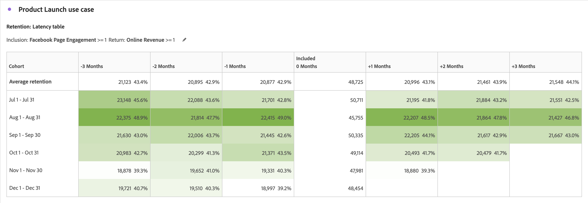

# Casos de uso de análisis de cohorte

Este artículo analiza varios casos de uso típicos en los que las tablas de cohorte son útiles para proporcionar perspectivas útiles para realizar acciones siguientes.

## Participación de aplicación

Imagine que desea analizar de qué manera los usuarios que instalan su aplicación interactúan con ella a lo largo del tiempo. ¿Los usuarios instalan la aplicación y nunca la usan después? ¿O usan la aplicación durante un tiempo y luego dejan de usarla? ¿O los usuarios siguen interactuando con el paso del tiempo?

Puede crear un análisis de cohorte de seis meses. Los visitantes no se cuentan como *`engaged`* en los meses siguientes, a menos que dichos usuarios tengan una sesión o que, al menos, inicien la aplicación. El [!UICONTROL análisis de cohorte] entonces le mostraría patrones de uso donde *`App Install`* siempre ocurre en el Mes 0. Podría observar que el uso cae en el mes 2, independientemente de cuándo instalaron la aplicación los usuarios. Este análisis le permite enviar un correo electrónico o un mensaje push a todos los usuarios durante el segundo mes después de que instalan la aplicación para recordarles que usen la aplicación.

+++ Ejemplo de visualización de tabla de cohorte

+++

## Suscripción

Trabaja en Adobe.com y ofrece una suscripción gratuita a Creative Cloud. El objetivo es que los usuarios actualicen de la versión gratuita a la versión de prueba por 30 días o, en definitiva, la versión paga.

Use [!UICONTROL Análisis de cohorte] para comprender, por ejemplo, que cualquier lugar entre 8% y 10% de usuarios de Creative Cloud gratuito efectúan la actualización en el primer mes después de la instalación, independientemente del momento de la instalación. A continuación, actualice el 12 % al 15 % en el segundo mes de uso. Después, la actualización cae significativamente: del 4 % al 5 % en el mes tres, del 3 % al 4 % en el mes cuatro y del 1 % al 2 % en el mes cinco.

Al reconocer que no desea perder clientes potenciales en el mes tres, configura una campaña de correo electrónico diseñada para que salga a mediados del mes tres para una muestra de usuarios. En esa campaña, ofrece un cupón por 50 dólares a los usuarios que aún no hayan realizado la actualización.

Vuelva a consultar el análisis de cohorte unos meses más tarde. Para las cohortes formadas después del lanzamiento de la campaña, la conversión a suscripciones a Creative Cloud de pago en el mes tres aumentó de un 4 % y 5 % a un 13 % y 14 %. La conversión resulta en cientos de miles de dólares por cohorte, por cada cohorte mensual que llega al mes tres a partir de ese momento.

+++ Ejemplo de visualización de tabla de cohorte

+++

## Segmentos de cohorte complejos

Realiza análisis para una gran cadena hotelera que se dirige a varios grupos de clientes para promociones y realiza un seguimiento de los grupos de clientes en relación con el rendimiento. Para identificar los mejores grupos de cohortes de usuarios a los que dirigirse, debe crear grupos de cohortes muy específicos. Use los criterios aumentados [!UICONTROL Inclusión] y [!UICONTROL Devolver] en las tablas de [!UICONTROL cohorte] para definir las agrupaciones de cohorte exactas con múltiples métricas y segmentos. Este análisis le ayuda a identificar los grupos de clientes con peor rendimiento, de modo que pueda ofrecerles promociones y ofertas para aumentar las reservas.

+++ Ejemplo de visualización de tabla de cohorte

+++

## Adopción de versión de aplicación

Usted es el analista de una gran compañía de seguros que impulsa la participación del cliente mediante el uso de su aplicación móvil. A medida que se añadan nuevas funciones a la aplicación, los clientes deben actualizar a la última versión. Puede analizar y comparar las versiones de las aplicaciones mediante la cohorte [!UICONTROL Dimension personalizado] para ver a qué clientes debe dirigirse, en función de la versión de la aplicación que tengan. Además, puede realizar un seguimiento de la retención y la pérdida para ver si las versiones específicas de la aplicación están alejando a los clientes de su uso a lo largo del tiempo. Mediante esfuerzos de mensajería móvil puede reactivar a estos usuarios para que se actualicen a la versión más reciente y aprovechen las últimas funciones.

+++ Ejemplo de visualización de tabla de cohorte

+++

## Permanencia de campaña

Usted es el analista de una empresa multimedia internacional que utiliza campañas dirigidas para dirigir a los usuarios a sus distintas plataformas y así fomentar la participación. El gasto en publicidad por plataforma se basa en la participación de los clientes y la retención. El éxito de las campañas es fundamental para el éxito del negocio. La nueva función de cohorte [!UICONTROL Dimension] personalizada se usa en las tablas [!UICONTROL Cohorte] para comparar varias campañas e identificar cuáles son las más eficientes a la hora de obtener y retener usuarios, y así aumentar la participación. A continuación, puede identificar qué aspectos hacen que una campaña tenga éxito y aplicar ese conocimiento a otras campañas para aumentar la participación en varias plataformas.

+++ Ejemplo de visualización de tabla de cohorte

+++

## Lanzamiento del producto

Usted es el analista de una gran retailer de ropa que tiene muchos segmentos de clientes específicos que generan gran parte de los ingresos para su negocio. Se diseñan y crean productos específicos para cada uno de esos segmentos. Con cada lanzamiento de producto, desea saber cómo el nuevo producto ha impulsado las ventas a varias cohortes a lo largo del tiempo. Con la nueva configuración de [!UICONTROL Tabla de latencia] en [!UICONTROL Análisis de cohorte], puede analizar el comportamiento y los ingresos de un segmento de clientes dados antes y después del lanzamiento. Con esta información, puede identificar qué productos generan nuevos ingresos y cuáles no llegan a calar en los clientes.

+++ Ejemplo de visualización de tabla de cohorte

+++

## Permanencia individual: usuarios más fieles

Usted es el analista de una gran aerolínea que deriva la mayoría de su éxito e ingresos de clientes fieles y repetidos. En muchos casos, los viajeros fieles representan la mayoría de los ingresos y conservarlos es fundamental para el éxito a largo plazo. A menudo, es difícil identificar a los clientes más fieles y coherentes. Sin embargo, gracias a la nueva configuración de [!UICONTROL Cálculo móvil] en [!UICONTROL Análisis de cohorte], podrá analizar los segmentos de clientes fieles y averiguar cuáles repiten reservas un mes tras otro. A continuación, puede dirigirse a estos viajeros con recompensas y beneficios por su fidelidad. Además, cambiando el tipo de cohorte de retención a pérdida, también puede identificar qué clientes no repiten reservas un mes tras otro. A continuación, puede dirigirse a estos segmentos con promociones para volver a interactuar con estos clientes y que estos permanezcan fieles en el futuro.

+++ Ejemplo de visualizaciones de tabla de cohorte

+++
