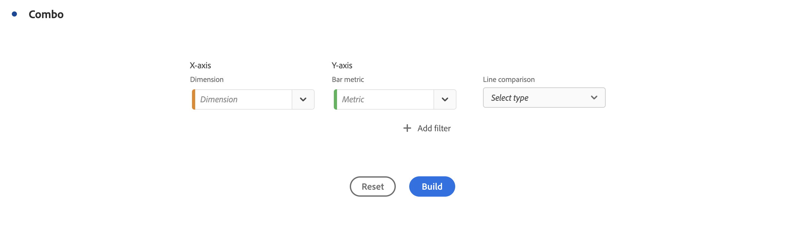
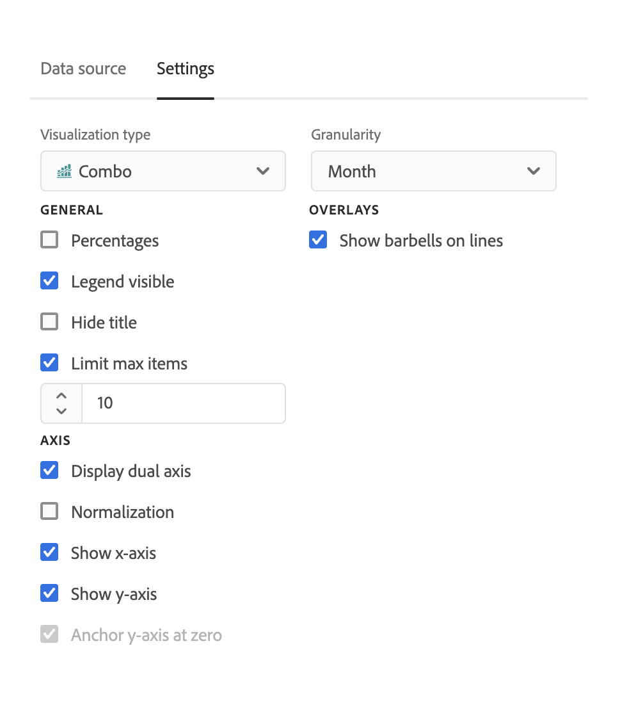

# Gráfico combinado

>[!NOTE]
>
>Actualmente, esta funcionalidad está en [prueba limitada](/help/release-notes/releases.md).

La variable [!UICONTROL Gráfico combinado] la visualización facilita la creación rápida de una visualización de comparación sin tener que crear primero una tabla. Puede ver fácilmente las tendencias de sus datos en una combinación de líneas/barras.

Utilice un [!UICONTROL Gráfico combinado] a

* Compare los pedidos de esta semana con los pedidos de al mismo tiempo el mes pasado (y el año pasado), todo en pocos clics.

* Analice y compare rápidamente varias métricas (por ejemplo, [!UICONTROL Visitantes únicos] y [!UICONTROL Ingresos]) en el mismo gráfico.

* Analizar una métrica con una función (como [!UICONTROL Media acumulada]) en un horizonte temporal.

Tenga en cuenta que puede

* Agregar varias comparaciones en una sola [!UICONTROL Gráfico combinado].
* Si agrega una o más comparaciones, deben ser del mismo tipo, como [!UICONTROL Comparación horaria].
* Se pueden agregar hasta 5 comparaciones.
* Puede aplicar hasta 3 filtros (segmentos) a una métrica.

## Crear un gráfico combinado

1. En la lista desplegable Visualizaciones del carril izquierdo, arrastre el [!UICONTROL Gráfico combinado] visualización en un panel en blanco.

   

1. En las listas desplegables, seleccione una dimensión para el eje X y una métrica para el eje Y.

1. Seleccione el tipo de [!UICONTROL Comparación de líneas] desea utilizar.

   | Tipo de comparación de líneas | Definición |
   | --- | --- |
   | **[!UICONTROL Comparación del tiempo]** | El tipo de comparación más común: comparar este período de tiempo con hace 4 semanas, por ejemplo. Si ha seleccionado [!UICONTROL Comparación horaria], realice una selección secundaria de qué periodo de tiempo desea comparar.
 |
   | **[!UICONTROL Función]** | Puede introducir una función como [!UICONTROL Promedio] en la comparación. Consulte la lista de funciones admitidas a continuación.
 |
   | **[!UICONTROL Métrica secundaria]** | Por ejemplo, podría comparar [!UICONTROL Ingresos] a otra métrica.
 |

   {style=&quot;table-layout:auto&quot;}

1. Haga clic en **[!UICONTROL Generar]**.

   El resultado será similar al siguiente:

   

   El período actual se muestra en el gráfico de barras y el período de comparación se representa mediante el gráfico de líneas. Los puntos en el gráfico de líneas se conocen como &quot;barras&quot;.

## Funciones compatibles

Si elige **[!UICONTROL Función]** como el [!UICONTROL Tipo de comparación de líneas], se devolverá una función de la métrica que haya elegido.

| Función | Definición |
| --- | --- |
| **[!UICONTROL Suma de columna]** | Suma todos los valores numéricos de una métrica dentro de una columna (entre los elementos de una dimensión) |
| **[!UICONTROL Media acumulada]** | Devuelve la media de las últimas N filas. |
| **[!UICONTROL Mediana]** | Devuelve la mediana de una métrica en una columna. La mediana es el número central de un conjunto de números; es decir, la mitad de los valores son mayores o iguales que la mediana y la mitad son menores o iguales que la mediana. |
| **[!UICONTROL Acumulativo]** | La suma acumulativa de N filas. |
| **[!UICONTROL Máximo de columna]** | Devuelve el mayor valor en un conjunto de elementos de una dimensión para una columna de métrica. |
| **[!UICONTROL Media]** | Devuelve la media aritmética o el promedio de una métrica. |
| **[!UICONTROL Mínimo de columna]** | Devuelve el menor valor en un conjunto de elementos de una dimensión para una columna de métrica. |

{style=&quot;table-layout:auto&quot;}

Este es un ejemplo del promedio acumulativo de la métrica Ingresos:

Este es un ejemplo de gráfico combinado con las funciones Cumulative average y Mean :

## Configuración de gráficos combinados

Haga clic en el icono de engranaje en la parte superior derecha de un gráfico combinado para cambiar su configuración.

| Configuración | Definición |
| --- | --- |
| **[!UICONTROL Tipo de visualización]** | Le permite cambiar a otro tipo de visualización. |
| **[!UICONTROL Granularidad]** | En las visualizaciones de tendencias, puede cambiar la granularidad de tiempo (día, semana, mes, etc.) de esta lista desplegable. |
| **[!UICONTROL General]** |  |
| **[!UICONTROL Porcentajes]** | Muestra valores en porcentajes. |
| **[!UICONTROL Leyenda visible]** | Permite ocultar el texto de leyenda detallado para la visualización de gráficos combinados. |
| **[!UICONTROL Límite máximo de elementos]** | Reduce el número de elementos en el eje X. Si tiene un conjunto de datos grande, solo puede mostrar los primeros 10 elementos (o el valor que elija). |
| **[!UICONTROL Superposiciones]** | Muestre u oculte los barriles en líneas. |
| **[!UICONTROL Eje]** |  |
| **[!UICONTROL Mostrar eje doble]** | Solo es aplicable si cuenta con dos métricas: puede tener un eje Y a la izquierda (para una métrica) y a la derecha (para otra métrica). Esto resulta útil cuando las métricas trazadas son de magnitudes muy diferentes. El color del eje doble coincide con el color de la tabla, a menos que haya varias comparaciones. En ese caso, el color de todas las comparaciones es gris. |
| **[!UICONTROL Normalización]** | Fuerza métricas para igualar proporciones. Esto resulta útil cuando las métricas trazadas son de magnitudes muy diferentes. |
| **[!UICONTROL Mostrar eje x]** | Muestre el eje x u oculte. |
| **[!UICONTROL Mostrar eje Y]** | Muestre el eje y u oculte el elemento. |
| **[!UICONTROL Eje Y delimitador a cero]** | Si todos los valores marcados en el gráfico están considerablemente por encima de cero, el gráfico mostrará el valor base del eje Y distinto a cero. Si marca esta casilla, el eje Y se forzará a ser cero (y se redibujará el gráfico). |

{style=&quot;table-layout:auto&quot;}
