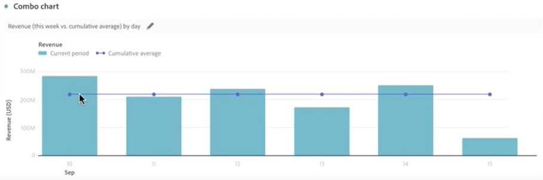

# Combo {#combo}

<!-- markdownlint-disable MD034 -->

>[!CONTEXTUALHELP]
>id="workspace_combo_button"
>title="Combo"
>abstract="Cree una visualización de gráfico combinado rápido, sin necesidad de crear primero una tabla de forma libre."

<!-- markdownlint-enable MD034 -->

>[!BEGINSHADEBOX]

*Este artículo documenta la visualización Combinada en **Customer Journey Analytics**. Vea [Combo](https://experienceleague.adobe.com/en/docs/analytics/analyze/analysis-workspace/visualizations/combo-charts) para la versión de **Adobe Analytics**de este artículo.*

>[!ENDSHADEBOX]

La visualización  **[!UICONTROL Combo]** facilita la generación rápida de una visualización de comparación sin tener que generar una tabla primero. Puede ver fácilmente las tendencias en sus datos en una combinación de líneas/barras.

Use un [!UICONTROL Combo] para:

* Comparar los pedidos de esta semana con los del mismo período del mes pasado (y del año pasado).
* Analice y compare rápidamente varias métricas (por ejemplo, [!UICONTROL Personas] e [!UICONTROL Ingresos]) en el mismo gráfico.
* Analizar una métrica con una función (como [!UICONTROL Promedio acumulado]) en un horizonte temporal.

Tenga en cuenta que:

* Puede agregar varias comparaciones en un solo [!UICONTROL Gráfico combinado].
* Si añade una o más comparaciones, deben ser del mismo tipo, como una [!UICONTROL Comparación temporal].
* Se pueden añadir hasta cinco comparaciones.
* Puede aplicar hasta 3 filtros a una métrica.
* Las métricas calculadas no son compatibles con los gráficos combinados.

## Utiliza

1. Agregar una visualización  [!UICONTROL Combo]. Ver [Agregar una visualización a un panel](freeform-analysis-visualizations.md#add-visualizations-to-a-panel)

1. En las listas desplegables, seleccione una dimensión para el eje X y una métrica para el eje Y.

1. Seleccione el tipo de [!UICONTROL Comparación de líneas] que desea utilizar.

   | Tipo de comparación de líneas | Definición |
   | --- | --- |
   | **[!UICONTROL Comparación del tiempo]** | El tipo de comparación más común: comparar este período de tiempo con hace cuatro semanas, por ejemplo. Si ha seleccionado [!UICONTROL Comparación temporal], realice una selección secundaria de qué período de tiempo quiere comparar.
 |
   | **[!UICONTROL Función]** | Puede introducir una función como [!UICONTROL Promedio] en la comparación. Ver la lista de [funciones compatibles](#supported-functions).
 |
   | **[!UICONTROL Métrica secundaria]** | Por ejemplo, podría comparar [!UICONTROL Ingresos] con otra métrica.
 |

   {style="table-layout:auto"}

1. Seleccione **[!UICONTROL Generar]**.

   El resultado es similar al siguiente:

   

   El periodo actual se muestra en el gráfico de barras. El gráfico de líneas representa el periodo de comparación. Los puntos del gráfico de líneas se conocen como *marcadores*.

## Funciones compatibles

Si selecciona **[!UICONTROL Function]** como el [!UICONTROL tipo de comparación de líneas], se devuelve una función de la métrica elegida.

| Función | Definición |
| --- | --- |
| **[!UICONTROL Suma de la columna]** | Suma todos los valores numéricos de una métrica dentro de una columna (entre los elementos de una dimensión) |
| **[!UICONTROL Promedio acumulado]** | Devuelve el promedio de las últimas N filas. |
| **[!UICONTROL Mediana]** | Devuelve la mediana de una métrica en una columna. La mediana es el número situado en medio de un conjunto de números. La mitad de los números tienen valores mayores o iguales a la mediana y la mitad de los números tienen valores menores o iguales a la mediana. |
| **[!UICONTROL Acumulativo]** | La suma acumulada de N filas. |
| **[!UICONTROL Máximo de la columna]** | Devuelve el mayor valor en un conjunto de elementos de una dimensión para una columna de métrica. |
| **[!UICONTROL Media]** | Devuelve la media aritmética o el promedio de una métrica. |
| **[!UICONTROL Mínimo de columna]** | Devuelve el menor valor en un conjunto de elementos de una dimensión para una columna de métrica. |

{style="table-layout:auto"}

Este es un ejemplo de la media acumulada de la métrica Ingresos:

Este es un ejemplo de un gráfico combinado con las funciones Media acumulada y Media:

>[!MORELIKETHIS]
>
>[Agregar una visualización a un panel](/help/analysis-workspace/visualizations/freeform-analysis-visualizations.md#add-visualizations-to-a-panel)
>[Configuración de visualización](/help/analysis-workspace/visualizations/freeform-analysis-visualizations.md#settings)
>[Menú contextual de visualización ](/help/analysis-workspace/visualizations/freeform-analysis-visualizations.md#context-menu)
>