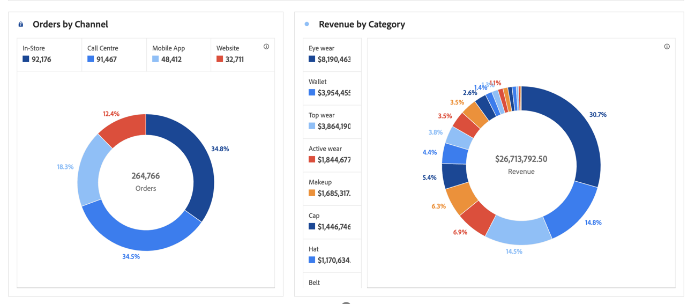

# Anillo

>[!NOTE]
>
>Está viendo la documentación de Analysis Workspace en Customer Journey Analytics. Su conjunto de funciones difiere ligeramente del [Analysis Workspace de la versión tradicional de Adobe Analytics](https://experienceleague.adobe.com/docs/analytics/analyze/analysis-workspace/home.html?lang=es). [Más información...](/help/getting-started/cja-aa.md)

Al igual que un gráfico circular, esta visualización muestra los datos como partes o filtros de un todo. Utilice un gráfico de anillo para comparar porcentajes de un total, normalmente con un número reducido de elementos.

