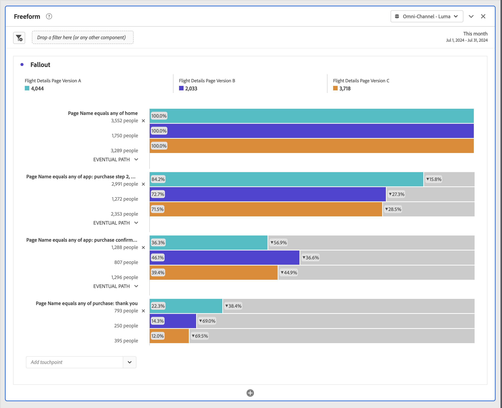

# Aplicación de segmentos en el análisis de abandonos

Puede crear segmentos a partir de un punto de contacto, añadir segmentos como punto de contacto y comparar flujos de trabajo clave entre diversos segmentos en Analysis Workspace.

>[!IMPORTANT]
>
>Los segmentos utilizados como puntos de comprobación de abandonos deben utilizar un contenedor que esté en un nivel inferior al contexto general de la visualización de abandonos. Con las visitas en orden previsto respectivas a las personas, los segmentos utilizados como puntos de comprobación deben ser segmentos basados en sesiones o eventos. Con los abandonos respectivos a las sesiones, los segmentos utilizados como puntos de comprobación deben ser segmentos basados en eventos. Si utiliza una combinación no válida, el resultado de visitas en orden previsto es del 100 %. Verá una advertencia en la visualización de abandonos cuando añada un segmento incompatible como punto de contacto. Determinadas combinaciones de contenedores de segmentos no válidas producen diagramas de abandonos no válidos, como:
>
>* Cuando se usa un segmento basado en personas como punto de contacto dentro de una visualización de abandonos de contexto de persona.
>* Cuando se usa un segmento basado en personas como punto de contacto dentro de una visualización de abandonos de sesión.
>* Cuando se usa un segmento basado en sesión como punto de contacto dentro de una visualización de abandonos de sesión.

<!-- 
Should we add B2B context here?
* [!BADGE B2B Edition]{type=Informative url="https://experienceleague.adobe.com/es/docs/analytics-platform/using/cja-overview/cja-b2b/cja-b2b-edition" newtab=true tooltip="Customer Journey Analytics B2B Edition"} Usimg a B2B container based segment as a touchpoint inside a non-container based context Fallout visualization.
* 
-->

## Creación de segmentos a partir de un punto de contacto

1. Cree un segmento a partir de un punto de contacto específico en el que esté especialmente interesado y que pueda ser útil para su aplicación en otros informes. Haga clic con el botón derecho en el punto de contacto y seleccione **[!UICONTROL Crear segmento a partir del punto de contacto]**.

   

   Se abre el [!UICONTROL Generador de segmentos], previamente completado con el segmento secuencial generado previamente que coincide con el punto de contacto seleccionado:

   

1. Ponga un título y una descripción al segmento y guárdelo.

   Ahora puede utilizar este segmento en cualquier proyecto que desee.

## Añadir un segmento como punto de contacto

Si desea ver, por ejemplo, la tendencia de los usuarios de Estados Unidos y cómo afectan a las visitas en el orden previsto, solo tiene que arrastrar el segmento correspondiente a la visita en el orden previsto:

O puede crear un punto de contacto AND arrastrando el segmento de usuarios de Estados Unidos a otro punto de comprobación.

## Comparar segmentos en abandonos

Puede comparar una cantidad ilimitada de segmentos en la visualización de visitas en el orden previsto.

1. Seleccione los segmentos que quiera comparar en el panel [!UICONTROL Segmento] de la izquierda. En el ejemplo, se seleccionaron tres segmentos: *Detalles del vuelo: Versión de página A*, *Detalles del vuelo: Versión de página B* y *Detalles del vuelo: Versión de página C*.
1. Puede arrastrar los tres segmentos a la zona de colocación de Segmento en la parte superior de la visualización.

1. Opcional: puede mantener *Todas las personas* como el contenedor predeterminado o eliminar el contenedor.

   

1. Ahora puede comparar las visitas en el orden previsto de los tres segmentos como, por ejemplo, cuando un segmento supera a otro u otra información.
