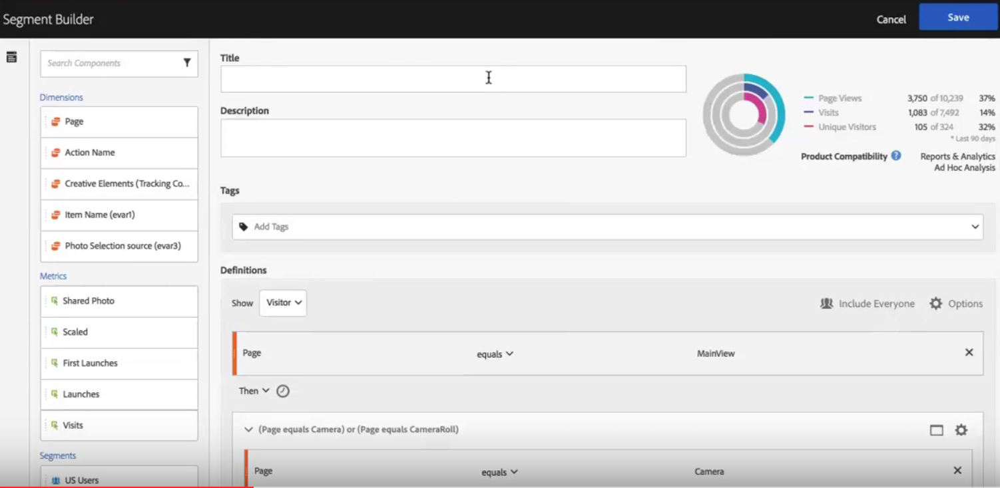

# Aplicar filtros en un análisis de visitas en orden previsto

>[!NOTE]
>
>Está viendo la documentación de Analysis Workspace en Customer Journey Analytics. Su conjunto de funciones difiere ligeramente del [Analysis Workspace de la versión tradicional de Adobe Analytics](https://experienceleague.adobe.com/docs/analytics/analyze/analysis-workspace/home.html). [Más información...](/help/getting-started/cja-aa.md)

Puede crear filtros a partir de un punto de contacto, añadir filtros como punto de contacto y comparar flujos de trabajo clave entre distintos filtros de Analysis Workspace.

>[!IMPORTANT]
>
>Los filtros utilizados como puntos de comprobación de abandonos deben utilizar un contenedor que esté en un nivel inferior al contexto general de la visualización de abandonos. Con las visitas en el orden previsto de un contexto de visitante, los filtros utilizados como puntos de comprobación deben ser filtros basados en visitas o visitas individuales. Con las visitas en el orden previsto, los filtros utilizados como puntos de comprobación deben ser filtros basados en visitas individuales. Si utiliza una combinación no válida, el resultado de abandonos será del 100%. Se ha añadido una advertencia a la visualización de abandonos que se mostrará cuando añada un filtro incompatible como punto de contacto. Algunas combinaciones de contenedores de filtro no válidas producirán diagramas de visitas en el orden previsto no válidos, como:

* Uso de un filtro basado en visitantes como punto de contacto dentro de una visualización de abandonos de visitantes
* Uso de un filtro basado en visitantes como punto de contacto dentro de una visualización de abandonos de visitas.
* Uso de un filtro basado en visitas como punto de contacto dentro de una visualización de abandonos de visitas.

## Crear un filtro a partir de un punto de contacto {#section_915E8FBF35CD4F34828F860C1CCC2272}

1. Cree un filtro a partir de un punto de contacto específico en el que esté especialmente interesado y que pueda resultar útil para aplicarlo a otros informes. Para ello, haga clic con el botón derecho en el punto de contacto y seleccione **[!UICONTROL Create filter from touchpoint]**.

   

   Se abre el Generador de filtros, previamente completado con el filtro secuencial creado previamente que coincide con el punto de contacto seleccionado:

   

1. Asigne un título y una descripción al filtro y guárdelo.

   Ahora puede utilizar este filtro en cualquier proyecto que desee.

## Añadir un filtro como punto de contacto {#section_17611C1A07444BE891DC21EE8FC03EFC}

Si desea ver, por ejemplo, la tendencia de los usuarios de EE. UU. y cómo afectan a las visitas en el orden previsto, solo tiene que arrastrar el filtro de los usuarios de EE. UU. a las visitas en el orden previsto:

O puede crear un punto de contacto AND arrastrando los usuarios de EE. UU. a otro punto de comprobación.

## Comparar filtros en abandonos {#section_E0B761A69B1545908B52E05379277B56}

Puede comparar un número ilimitado de filtros en la visualización de abandonos.

1. Seleccione los filtros que desee comparar en el carril [!UICONTROL Filter] de la izquierda. En nuestro ejemplo, hemos seleccionado 2 filtros: Usuarios de EE. UU. y usuarios de fuera de EE. UU.
1. Arrástrelos a la zona de colocación Filtro en la parte superior.

   

1. Opcional: puede mantener “Todas las visitas” como el contenedor predeterminado o eliminarlo.

   

1. Ahora puede comparar las visitas en el orden previsto entre los dos filtros, como cuando un filtro supera a otro u otras perspectivas.
