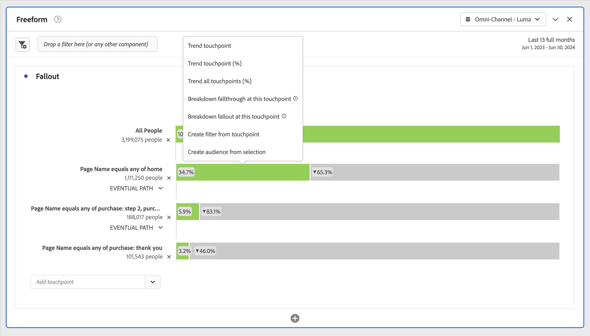

# Configurar una visualización de abandonos {#configure-fallout-visualization}

Puede especificar los puntos de contacto para crear una secuencia de visitas en el orden previsto multidimensional. Normalmente, un punto de contacto es una página de su sitio web. Sin embargo, los puntos de contacto no están limitados a páginas. Por ejemplo, puede agregar eventos, como unidades, así como personas únicas y visitas recurrentes. También puede añadir dimensiones, como categoría, tipo de navegador o término de búsqueda interno.

Incluso puede añadir filtros dentro de un punto de contacto. Por ejemplo, es posible que desee comparar filtros como los usuarios de iOS y Android™. Arrastre los filtros deseados sobre las visitas en el orden previsto y la información acerca de esos filtros se añadirá al informe de visitas en el orden previsto. Si desea mostrar solo esos filtros, puede quitar la línea de base de Todas las visitas.

No hay limitación en el número de pasos que se pueden añadir o en el número de dimensiones utilizadas.

Puede realizar el control de rutas en dimensiones, métricas y filtros. Por ejemplo, supongamos que alguien está mirando zapatos y camisetas en una página y en la siguiente mira camisetas y calcetines. El siguiente informe de flujo de productos desde zapatos será camiseta y calcetines, NO camiseta.

## Utiliza

1. Agregar una visualización de  **[!UICONTROL Abandonos]**. Consulte [Agregar una visualización a un panel](../freeform-analysis-visualizations.md#add-visualizations-to-a-panel).
1. Arrastre una página, por ejemplo, inicio, desde la dimensión Página al menú desplegable *Agregar punto de contacto*.

   

   Pase el ratón sobre un punto de contacto para ver si las visitas en el orden previsto y otra información sobre ese nivel, como el nombre del punto de contacto y el recuento de personas en ese punto. Y vea la tasa de éxito para ese punto de contacto (así como comparar la tasa de éxito con otros puntos de contacto).

   Los números dentro de un círculo en la parte gris de la barra muestran la visita en el orden previsto entre puntos de contacto (no la visita en el orden previsto total hasta ese punto). El **[!UICONTROL punto de contacto %]** muestra el recorrido correcto desde el paso anterior al paso actual en el informe de visitas en el orden previsto.

   También puede agregar una única página al informe de visitas en el orden previsto, en vez de toda la dimensión. Haga clic en la flecha derecha  de la dimensión de página para seleccionar una página específica y agregarla al informe de visitas en el orden previsto.

1. Siga añadiendo puntos de contacto hasta que la secuencia se haya completado.

   Puede **combinar varios puntos de contacto** arrastrando uno o más componentes adicionales a un punto de contacto.

   >[!NOTE]
   >
   >Los filtros se unen con AND, mientras que los elementos (como elementos de dimensión y métricas) se unen con OR.

   

1. También puede **restringir puntos de contacto individuales al siguiente evento** (a diferencia de *eventualmente*) dentro de la ruta. Debajo de cada punto de contacto hay un selector con las opciones **[!UICONTROL Ruta de acceso eventual]** y **[!UICONTROL Siguiente evento]**, como se muestra a continuación:

   

   | Opción | Descripción |
   |---|---|
   | **[!UICONTROL Ruta de acceso final]** (predeterminada) | Se cuentan las personas que *eventualmente* aterrizarán en la siguiente página de la ruta, pero no necesariamente en el siguiente evento. |
   | **[!UICONTROL Siguiente evento]** | Se cuentan los que aterrizarán en la siguiente página de la ruta en el siguiente evento. |

## Configuración {#settings}

>[!CONTEXTUALHELP]
>id="workspace_fallout_container"
>title="Contenedor de visitas en orden previsto"
>abstract="Seleccione un contenedor para analizar las rutas. Esta selección le ayuda a comprender la participación y limita el análisis al contenedor seleccionado."

Como parte de la visualización, hay disponibles ajustes específicos.

| Contenedor de visitas en orden previsto | Descripción |
|--- |--- |
| **[!UICONTROL Sesión]** o **[!UICONTROL Persona]** | Cambie entre [!UICONTROL Sesión] y [!UICONTROL Persona] para analizar las rutas de las personas. El valor predeterminado es [!UICONTROL Persona]. Esta configuración le permite comprender el compromiso de la persona a nivel de persona (a lo largo de las sesiones) o restringir el análisis a una única sesión. |

## Menú contextual

Como parte de la visualización, hay opciones específicas de menú contextual disponibles.

| Opción | Descripción |
|--- |--- |
| **[!UICONTROL Punto de contacto de tendencia]** | Consulte los datos de tendencia para un punto de contacto en un gráfico de líneas en el cual se hayan incorporado previamente algunos datos de detección de anomalías. |
| **[!UICONTROL Punto de contacto de tendencia (%)]** | Realiza la tendencia del porcentaje total de visitas en el orden previsto. |
| **[!UICONTROL Tendencia de todos los puntos de contacto (%)]** | Obtiene la tendencia de todos los porcentajes de puntos de contacto en la visita en el orden previsto (excepto **[!UICONTROL Todas las personas]**, si se incluye) en el mismo gráfico. |
| **[!UICONTROL Desglosar visitas en orden previsto en este punto de contacto]** | Vea qué hicieron las personas entre dos puntos de contacto (este punto de contacto y el siguiente) si continuaron hasta el siguiente punto de contacto. Así se crea una tabla improvisada que muestra sus dimensiones. Puede sustituir las dimensiones y otros elementos de la tabla. |
| **[!UICONTROL Desglosar visitas en orden previsto en este punto de contacto]** | Vea qué han hecho las personas que no han seguido el embudo inmediatamente tras el paso seleccionado. |
| **[!UICONTROL Crear filtro a partir del punto de contacto]** | Cree un nuevo filtro a partir de un punto de contacto seleccionado. |

>[!MORELIKETHIS]
>
>[Añadir una visualización a un panel](/help/analysis-workspace/visualizations/freeform-analysis-visualizations.md#add-visualizations-to-a-panel)
>[Configuración de visualización](/help/analysis-workspace/visualizations/freeform-analysis-visualizations.md#settings)
>[Menú contextual de visualización ](/help/analysis-workspace/visualizations/freeform-analysis-visualizations.md#context-menu)
>

