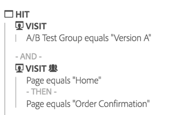

# Resumen de abandonos

>[!NOTE]
>
>Está viendo la documentación de Analysis Workspace en Customer Journey Analytics. Su conjunto de funciones difiere ligeramente del [Analysis Workspace de la versión tradicional de Adobe Analytics](https://docs.adobe.com/content/help/es-ES/analytics/analyze/analysis-workspace/home.html). [Más información...](/help/getting-started/cja-aa.md)

Las visualizaciones de visitas en el orden previsto ofrecen más opciones para crear sus informes de visitas en el orden previsto. Los informes de visitas en el orden previsto muestran dónde abandonaron los visitantes y continuaron en una secuencia de páginas predefinidas.

Las visualizaciones de visitas en el orden previsto le permiten:

* Realizar comparaciones paralelas de dos segmentos distintos en el mismo informe
* Arrastrar, soltar y reorganizar pasos de embudo (puntos de contacto).
* Mezclar valores de distintas dimensiones y métricas
* Crear un informe de visitas en el orden previsto multidimensional
* Identificar a qué lugar van los clientes inmediatamente tras la visita en el orden previsto

Las visitas en el orden previsto muestran la conversión y las tasas de visitas en el orden previsto entre cada paso o punto de contacto en una secuencia.

Por ejemplo, se puede hacer un seguimiento de dónde los visitantes abandonan la secuencia prevista a lo largo del proceso de compra. Para ello, basta con seleccionar un punto de contacto inicial y otro de conclusión, y luego añadir puntos de contacto intermedios para crear una ruta de navegación por el sitio web. Pero también puede crear visitas en el orden previsto multidimensionales.

La visualización de visitas en el orden previsto es útil para analizar:

* Las tasas de conversión a través de procesos específicos en el sitio (tales como un proceso de registro o de compra).
* Flujos de tráfico generales, con un alcance más amplio: entre las personas que visitaron la página principal, este flujo muestra cuántas fueron de allí a realizar una búsqueda y cuántas continuaron para ver un elemento específico.
* Correlaciones entre los eventos del sitio. Las correlaciones muestran el porcentaje de personas que leyeron la política de privacidad y procedieron a realizar la compra de un producto.

[Visualización de abandonos en YouTube](https://www.youtube.com/watch?v=VcrfHSyIoj8&amp;index=52&amp;list=PL2tCx83mn7GuNnQdYGOtlyCu0V5mEZ8sS) (4:15)

## La segmentación como base para Flujo y Abandonos {#section_654F37A398C24DDDB1552A543EE29AA9}

Los segmentos aplicados a los paneles de Workspace funcionan de un modo ligeramente distinto a los aplicados a los informes de visitas en el orden previsto y flujo tanto en Reports &amp; Analytics como en los Ad Hoc Analysis. La mayoría de las veces ofrecen los mismos resultados. La principal diferencia radica en que tanto Reports &amp; Analytics como los Ad Hoc Analysis aplican el segmento en cada paso de la secuencia. Esto puede producir resultados ligeramente distintos.

Veamos un ejemplo de visitas en el orden previsto con dos pasos:

Si a continuación aplica un segmento en el nivel de panel de Workspace, el segmento se combina con las visitas en el orden previsto de este modo:

Por el contrario, cuando Reports &amp; Analytics y los Ad Hoc Analysis calculan el segmento, este se combina del siguiente modo:

Tanto Reports &amp; Analytics como los Ad Hoc Analysis combinan el segmente con cada paso. Cuando los contenedores se encuentran en el mismo nivel que las visitas en el orden previsto (p. ej., el nivel de visita o de visitante), el resultado es una coincidencia con el número de visitas o visitantes.

Sin embargo, si el segmento aplicado al panel es menor que el nivel de las visitas en el orden previsto (p. ej., el nivel de visita individual), muestra resultados diferentes por el modo en que el informe lo combina. Para reiterar, en la mayoría de las circunstancias, los números de Analysis Workspace coinciden con los de Reports &amp; Analytics y los de los Ad Hoc Analysis. **No** coincidirán únicamente si se cumplen todas las condiciones siguientes:

* El segmento no está en el mismo nivel que los abandonos.
* El segmento incluye una variable por la que el visitante/visita puede adoptar distintos valores durante una visita/visitante.

En el extraño caso de que necesite que Analysis Workspace refleje el modo de Reports &amp; Analytics de aplicar segmentos a visitas en el orden previsto/flujo, solo tiene que incluir el segmento en cada paso de las visitas en el orden previsto en Workspace. De este modo, los resultados serán idénticos.
