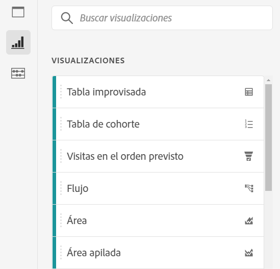
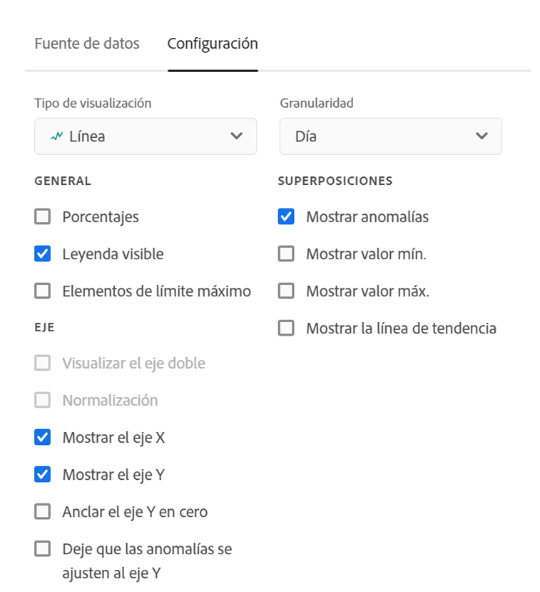
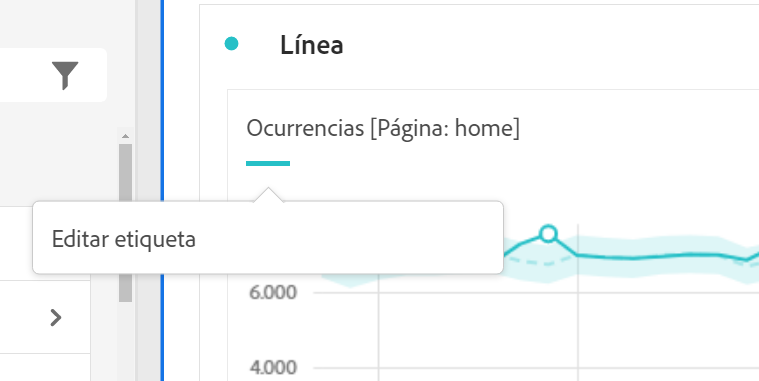
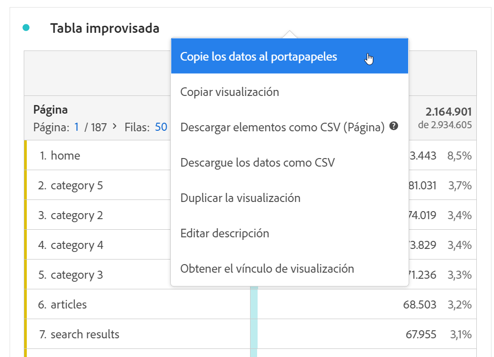
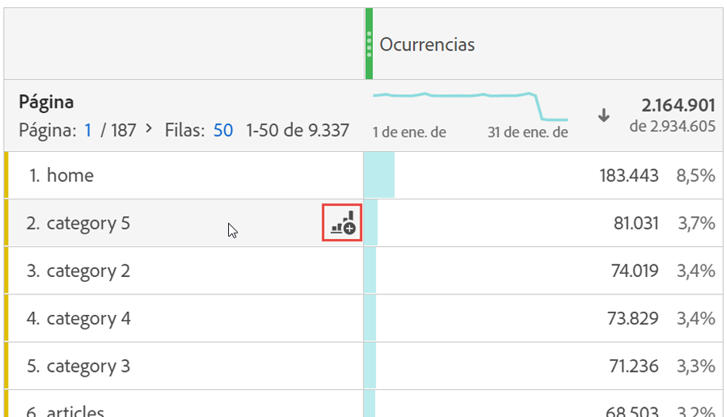

# Resumen de las visualizaciones

Workspace oferta una serie de visualizaciones que le permiten generar representaciones visuales de sus datos, como gráficos de barras, gráficos circulares, histogramas, gráficos de líneas, mapas, gráficos de dispersión, etc. La mayoría de los tipos de visualización le resultarán familiares si utiliza Customer Journey Analytics. Sin embargo, Analysis Workspace proporciona una configuración de visualización y múltiples tipos de visualización únicos o nuevos con funciones interactivas.

Puede acceder a las visualizaciones desde el icono superior izquierdo de Workspace, un [panel en blanco](/help/analysis-workspace/c-panels/blank-panel.md) o a través del menú que aparece al hacer clic con el botón derecho en el flujo de trabajo.

Los siguientes tipos de visualización están disponibles en Analysis Workspace:

| Nombre de la visualización | Descripción |
| --- | --- |
| [Área](/help/analysis-workspace/visualizations/area.md) | Es similar a un gráfico de líneas, pero incluye una zona coloreada bajo la línea. Utilice un gráfico de áreas cuando tenga varias métricas y desee visualizar el área a la que hace referencia la intersección de dos o más métricas. |
| [Barra](/help/analysis-workspace/visualizations/bar.md) | Muestra las barras verticales que representan los distintos valores de una o varias métricas. |
| [Gráfico de viñetas](/help/analysis-workspace/visualizations/bullet-graph.md) | Muestra cómo se compara un valor que le interese con otros rangos de rendimiento (objetivos). |
| [Tabla de cohorte](/help/analysis-workspace/visualizations/cohort-table/cohort-analysis.md) | Una *`cohort`* es un grupo de personas que comparten características en común durante un periodo especificado. El análisis de cohorte es útil para el análisis de retención, pérdida o latencia. |
| [Anillo](/help/analysis-workspace/visualizations/donut.md) | Al igual que un gráfico circular, esta visualización muestra los datos como partes o filtros de un todo. |
| [Abandono](/help/analysis-workspace/visualizations/fallout/fallout-flow.md) | Los informes de visitas en el orden previsto muestran dónde abandonaron los visitantes y continuaron en una secuencia de páginas predefinidas. Se puede establecer en secuencias posibles o exactas |
| [Flujo](/help/analysis-workspace/visualizations/c-flow/flow.md) | Muestra las rutas del cliente en sus sitios web y aplicaciones. |
| [Tabla de forma libre](/help/analysis-workspace/visualizations/freeform-table/freeform-table.md) | Una tabla improvisada no es solamente una tabla de datos, sino también una visualización interactiva. Es la base del análisis de datos en Workspace. |
| [Histograma](/help/analysis-workspace/visualizations/histogram.md) | Un histograma agrupa a visitantes, visitas o visitas individuales en bloques en función de un volumen de métrica. |
| [Barra horizontal](/help/analysis-workspace/visualizations/horizontal-bar.md) | Muestra las barras horizontales que representan los distintos valores de una o varias métricas. |
| [Líneas](/help/analysis-workspace/visualizations/line.md) | Representa las métricas con una línea para mostrar cómo cambian los valores con el paso del tiempo. Un gráfico de líneas utiliza el tiempo a lo largo del eje x. |
| [Diagrama de dispersión](/help/analysis-workspace/visualizations/scatterplot.md) | Muestra la relación entre los elementos de dimensión y hasta tres métricas. |
| [Número de resumen](/help/analysis-workspace/visualizations/summary-number-change.md) | Muestra la celda seleccionada como 1 número grande. |
| [Cambio de resumen](/help/analysis-workspace/visualizations/summary-number-change.md) | Muestra el cambio entre las celdas seleccionadas como 1 gran número/porcentaje. |
| [Texto](/help/analysis-workspace/visualizations/text.md) | Le permite agregar texto definido por el usuario a Workspace. Útil para añadir contexto adicional a los análisis y perspectivas, además de aprovechar las descripciones de paneles/visualizaciones |
| [Gráfico de rectángulos](/help/analysis-workspace/visualizations/treemap.md) | Muestra datos de forma jerárquica (con estructura de árbol) como un conjunto de rectángulos anidados. |
| [Venn](/help/analysis-workspace/visualizations/venn.md) | Utiliza círculos para mostrar la superposición de métricas de hasta 3 filtros. |

## Configuración {#settings}

Cada visualización tiene su propia configuración que puede administrar. Para acceder a [!UICONTROL Configuración de visualización], haga clic en el icono de engranaje [!UICONTROL Configuración de visualización].

| Configuración | Descripción |
| --- | --- |
| Tipo de visualización | Cambie el tipo de imagen que se utiliza para representar los datos. |
| Granularidad | En las visualizaciones de tendencias, puede cambiar la granularidad de tiempo (día, semana, mes, etc.) de esta lista desplegable. Este cambio también se aplica a la tabla de fuente de datos. |
| Porcentajes | Muestra valores en porcentajes. |
| Apilada al 100 % | Esta configuración en las visualizaciones de áreas apiladas, barras apiladas o barras horizontales apiladas convierte el gráfico en una visualización “apilada al 100 %”. Ejemplo:  |
| Leyenda visible | Le permite ocultar el texto de detalles de la leyenda para la visualización de Número de resumen/Resumen del cambio. |
| Límite máximo de elementos | Le permite limitar el número de elementos que se muestran en una visualización. |
| Eje Y delimitador a cero | Si todos los valores marcados en el gráfico están considerablemente por encima de cero, el gráfico mostrará el valor base del eje Y distinto a cero. Si marca esta casilla, el eje Y se forzará a ser cero (y se redibujará el gráfico). |
| Normalización | Fuerza métricas para igualar proporciones. Esto resulta útil cuando las métricas trazadas son de magnitudes muy diferentes. |
| Mostrar eje doble | Solo es aplicable si cuenta con dos métricas: puede tener un eje Y a la izquierda (para una métrica) y a la derecha (para otra métrica). Esto resulta útil cuando las métricas trazadas son de magnitudes muy diferentes. |
| Mostrar anomalías | Mejora los gráficos de líneas y las tablas improvisadas al mostrar la detección de anomalías. La detección de anomalías en las visualizaciones de líneas incluye un valor esperado (línea discontinua) y un intervalo esperado (banda sombreada). |

## Leyenda {#legend}

Una leyenda de visualización le ayuda a relacionar fechas en una tabla de origen con series trazadas en la visualización. La leyenda es interactiva: puede hacer clic en un elemento de leyenda para mostrar u ocultar una serie en la visualización. Esto resulta útil si desea simplificar los datos que se visualizan.

Además, puede cambiar el nombre de las etiquetas de leyenda para que los elementos visuales sean más legibles. Nota: la edición de leyendas **no** se aplica a: visualizaciones de rectángulos, viñetas, número o cambio de resumen, texto, forma libre, histograma, cohorte o flujo.

Para editar una etiqueta de leyenda:

1. Haga clic con el botón derecho en una de las etiquetas de leyenda.
1. Haga clic en **[!UICONTROL Editar etiqueta]**.

   

1. Introduzca el nuevo texto de etiqueta.
1. Pulse **[!UICONTROL Intro]** para guardar.

Aquí tiene un [vínculo que dirige a un vídeo](https://experienceleague.adobe.com/docs/analytics-learn/tutorials/analysis-workspace/visualizations/series-label-editing.html) sobre este tema.

## Haga clic con el botón derecho en el menú {#right-click}

Hay funcionalidad adicional disponible para una visualización haciendo clic con el botón derecho en el encabezado de visualización. La configuración variará según la visualización. Algunos de los ajustes disponibles son:

| Configuración | Descripción |
| --- | --- |
| Insertar panel copiado/visualización | Permite pegar (“insertar”) un panel copiado o una visualización en otro lugar del proyecto, o en otro proyecto diferente. |
| Copiar visualización | Permite hacer clic con el botón derecho y copiar una visualización para poder insertarlo en otro lugar del proyecto o en un proyecto completamente diferente. |
| [Descargar elementos como CSV](/help/analysis-workspace/curate-share/download-send.md) | Descargue hasta 50 000 elementos de dimensión para la dimensión seleccionada como CSV. |
| [Descargue los datos como CSV](/help/analysis-workspace/curate-share/download-send.md) | Descargue la fuente de datos de visualización como CSV. |
| Duplicar visualización | Crea un duplicado exacto de la visualización actual, el cual puede modificar a continuación. |
| Editar descripción | Añade (o edite) una descripción de texto para la visualización. |
| Obtener vínculo de visualización | Le permite dirigir a los usuarios a una visualización específica en un proyecto. Al hacer clic en el vínculo, el destinatario deberá iniciar sesión antes de que se le dirija a la visualización exacta a la que está vinculado. |
| Volver a empezar | (Funciona en Flujo, Venn e Histograma) Elimina la configuración de la visualización actual para que pueda volver a configurarla desde cero. |

## Icono Crear imagen {#quick-viz}

Si no está seguro de qué visualización escoger, haga clic en el icono **[!UICONTROL Crear visualización]** en cualquier fila de la tabla (disponible al pasar el ratón por encima). Esta es la forma más rápida de agregar una visualización. Si hace clic en él, Analysis Workspace le dirá qué visualización sería la más adecuada para sus datos. Por ejemplo, si tiene 1 fila seleccionada, se creará un gráfico de líneas de tendencias. Si tiene 3 filas de filtro seleccionadas, se creará un diagrama de Venn.

