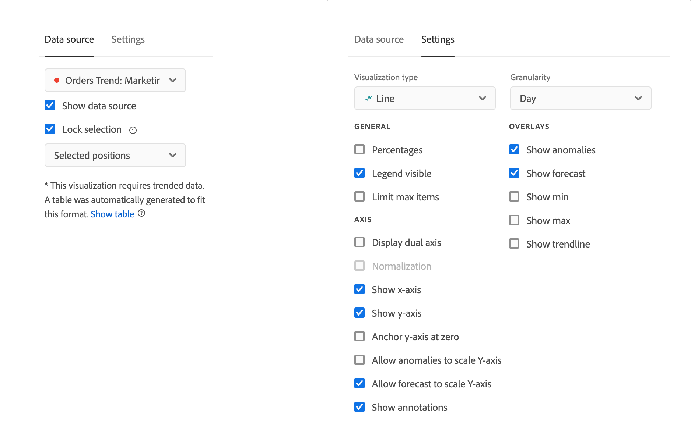

# Resumen de las visualizaciones

Workspace ofrece varias visualizaciones que le permiten generar representaciones visuales de sus datos. Como gráficos de barras, gráficos circulares, histogramas, gráficos de líneas, mapas, gráficos de dispersión, etc.

## Tipos

Los siguientes tipos de visualización están disponibles en Analysis Workspace:

| Icono | Nombre | Descripción |
| :---: | --- | ---| 
|  | [Área](/help/analysis-workspace/visualizations/area.md) | Una visualización de gráfico de áreas. Es similar a un gráfico de líneas, pero incluye una zona coloreada bajo la línea. Utilice un gráfico de áreas cuando tenga varias métricas y desee visualizar el área a la que hace referencia la intersección de dos o más métricas. |
|  | [Barra](/help/analysis-workspace/visualizations/bar.md) | Una visualización de gráfico de barras con barras verticales que representan varios valores en una o varias métricas. |
|  | [Barra apilada](/help/analysis-workspace/visualizations/bar.md) | Una visualización de gráfico de barras apiladas con barras verticales que representan varios valores en una o varias métricas. |
| 
 | [Viñeta](/help/analysis-workspace/visualizations/bullet-graph.md) | Una visualización de gráfico de viñetas, que muestra cómo se compara un valor que le interese con otros rangos de rendimiento (objetivos). |
|  | [Tabla de cohorte](/help/analysis-workspace/visualizations/cohort-table/cohort-analysis.md) | Una visualización de cohorte es un grupo de personas que comparten características comunes durante un periodo especificado. Una tabla de cohorte es útil para el análisis de retención, pérdida o latencia. |
|  | [Combinado](combo-charts.md) | Un gráfico combinado le permite crear rápidamente una visualización de comparación sin tener que generar una tabla primero. |
|  | [Anillo](/help/analysis-workspace/visualizations/donut.md) | Similar a un gráfico circular, una visualización de anillo muestra los datos como partes o filtros de un todo. |
|  | [Visita en orden previsto](/help/analysis-workspace/visualizations/fallout/fallout-flow.md) | Una visualización de visitas en el orden previsto muestra dónde abandonaron las personas y continuaron en una secuencia de páginas predefinidas. |
|  | [Flujo](/help/analysis-workspace/visualizations/c-flow/flow.md) | Una visualización de flujo muestra las rutas del cliente exactas a través de sus sitios web y aplicaciones. |
| 
 | [Tabla de forma libre](/help/analysis-workspace/visualizations/freeform-table/freeform-table.md) | Una visualización de tabla de forma libre es una visualización interactiva. La visualización de tablas de forma libre es la base del análisis de datos en Workspace. |
|  | [Histograma](/help/analysis-workspace/visualizations/histogram.md) | Una visualización de histograma agrupa a personas, visitas o eventos en bloques en función de un volumen de métrica. |
|  | [Barra horizontal](/help/analysis-workspace/visualizations/horizontal-bar.md) | Una visualización de barras horizontales muestra las barras horizontales que representan los distintos valores de una o varias métricas. |
|  | [Barra horizontal apilada](/help/analysis-workspace/visualizations/horizontal-bar.md) | Una visualización de barras horizontales apiladas muestra barras horizontales que representan varios valores en una o varias métricas. |
|  | [lienzo de Recorrido](/help/analysis-workspace/visualizations/journey-canvas/journey-canvas.md) | Una visualización de lienzo de recorrido le ayuda a analizar y obtener perspectivas sobre los recorridos que proporciona a sus usuarios y clientes. |
|  | [Resumen de métricas clave](/help/analysis-workspace/visualizations/key-metric.md) | Una visualización de resumen de métricas clave combina las visualizaciones de líneas, resumen de cambios y resumen de números. |
|  | [Líneas](/help/analysis-workspace/visualizations/line.md) | Una visualización de líneas representa las métricas con una línea para mostrar cómo cambian los valores con el paso del tiempo. Un gráfico de líneas utiliza el tiempo a lo largo del eje x. |
|  | [Dispersión](/help/analysis-workspace/visualizations/scatterplot.md) | Una visualización de diagrama de dispersión muestra la relación entre los elementos de dimensión y hasta tres métricas. |
|  | [Encabezado de sección](section-header.md) | Identificar y articular secciones dentro de un panel. |
|  | [Cambio de resumen](/help/analysis-workspace/visualizations/summary-number-change.md) | Una visualización de cambio de resumen muestra el cambio entre las celdas seleccionadas como un número o porcentaje grande. |
| 
 | [Número de resumen](/help/analysis-workspace/visualizations/summary-number-change.md) | Una visualización de número de resumen muestra la celda seleccionada como un número grande. |
|  | [Texto](/help/analysis-workspace/visualizations/text.md) | Una visualización de texto permite agregar texto definido por el usuario a Workspace. Útil para añadir contexto adicional a los análisis y perspectivas, además de aprovechar las descripciones de paneles/visualizaciones |
|  | [Gráfico de rectángulos](/help/analysis-workspace/visualizations/treemap.md)
 | Una visualización de diagrama muestra datos jerárquicos (con estructura de árbol) como un conjunto de rectángulos anidados. |
|  | [Venn](/help/analysis-workspace/visualizations/venn.md) | Una visualización de Venn utiliza círculos para mostrar la superposición de métricas de hasta 3 filtros. |

<!-- Add beneath Horizontal bar in the table above: | [Journey canvas](/help/analysis-workspace/visualizations/journey-canvas/journey-canvas.md) | Similar to Fallout, Journey canvas shows where persons left (fell out) and continued through (fell through) a predefined sequence of pages. 
Unlike Fallout, Journey canvas supports not only linear journeys, but any number of entry points and paths. Furthermore, journeys can be created in Adobe Journey Optimizer and then analyzed in Journey canvas.
 | -->

## Adición de visualizaciones a un panel

1. Abra el proyecto de Workspace donde desee agregar una visualización.

1. Utilice cualquiera de los siguientes métodos para añadir la visualización:

   

   * En el panel izquierdo, seleccione  **Visualizaciones** y, a continuación, arrastre una visualización al panel al que desee agregar la visualización.

   * En el panel donde desea agregar la visualización, seleccione  y, a continuación, elija el icono que representa la visualización que desea agregar. Pase el ratón sobre el icono de cada visualización para ver el nombre.

   * Agregue un [panel en blanco](https://experienceleague.adobe.com/en/docs/analytics/analyze/analysis-workspace/panels/blank-panel) y, a continuación, seleccione la visualización que desee agregar.

   * En el menú contextual de una visualización existente en su proyecto de Analysis Workspace, seleccione **[!UICONTROL Duplicar visualización]** o **[!UICONTROL Copiar visualización]**.

   * Utilice el menú Workspace **[!UICONTROL Insert]** para insertar una visualización.

   * En el menú contextual de una tabla de forma libre, seleccione **[!UICONTROL Visualizar]**. A continuación, seleccione la visualización en el submenú. En función de la selección actual en la tabla, Workspace determina qué visualización ofrecer e interpreta los datos para crear la visualización solicitada.

## Leyenda

Una leyenda de visualización le ayuda a relacionar fechas en una tabla de origen con series trazadas en la visualización. La leyenda es interactiva: puede seleccionar un elemento de leyenda para mostrar u ocultar una serie en la visualización, lo que resulta útil si desea simplificar los datos que se visualizan.

Además, puede cambiar el nombre de las etiquetas de leyenda para que los elementos visuales sean más legibles. Nota: la edición de leyendas **no** se aplica a: visualizaciones de rectángulos, viñetas, número o cambio de resumen, texto, forma libre, histograma, cohorte o flujo.

Para editar una etiqueta de leyenda:

1. Haga clic con el botón derecho en una de las etiquetas de leyenda.
1. Haga clic en **[!UICONTROL Editar etiqueta]**.

   

1. Introduzca el nuevo texto de etiqueta.
1. Pulse **[!UICONTROL Intro]** para guardar.

## Configuración

Cada visualización tiene su propia configuración. Para acceder a la configuración de visualización, seleccione  **[!UICONTROL Settings]** en el encabezado de visualización para mostrar una ventana emergente.

Según la visualización, puede configurar lo siguiente

* detalles sobre el origen de datos de la visualización a través de la pestaña [**[!UICONTROL Fuente de datos]**](#data-source), y
* Configuración para la visualización a través de la ficha [**[!UICONTROL Configuración]**](#settings-1).

### Fuente de datos

Puede controlar qué origen de datos y elementos o posiciones dentro de ese origen de datos corresponden a una visualización. Consulte [Administrar fuentes de datos](t-sync-visualization.md) para obtener más información.

### Configuración

Los ajustes de visualización disponibles dependen de la visualización. La tabla siguiente resume las configuraciones más comunes. Algunas visualizaciones sí tienen una configuración específica. Consulte la documentación de visualización individual para obtener más información.

| Opción | Descripción |
| --- | --- |
| **[!UICONTROL Tipo de visualización]** | Cambie el tipo de visualización utilizado para visualizar los datos. |
| **[!UICONTROL Granularidad]** | Cambie la granularidad de tiempo de las visualizaciones de tendencias. Este cambio también se aplica a la tabla de fuente de datos. |
| **[!UICONTROL Porcentajes]** | Mostrar valores en porcentajes. |
| **[!UICONTROL 100% apilado]** | Convierta el gráfico en una visualización apilada al 100 %.  Solo se aplica a una visualización apilada de áreas, barras y barras horizontales. |
| **[!UICONTROL Leyenda visible]** | Muestra el texto de la leyenda. |
| **[!UICONTROL Límite máximo de elementos]** | Limite el número de elementos que muestra una visualización. Cuando se selecciona, define el número máximo de elementos. |
| **[!UICONTROL Mostrar anotaciones]** | Muestre las anotaciones realizadas para esta visualización. |
| **[!UICONTROL Ocultar título]** | Oculte el título de la visualización. |
| **[!UICONTROL Anclar eje Y a cero]** | Fuerza la parte inferior del eje Y a cero. Si todos los valores marcados en el gráfico están considerablemente por encima de cero, el gráfico establece de forma predeterminada que la parte inferior del eje Y sea distinta a cero. Si activa esta opción, el eje Y se fuerza en cero (y se vuelve a dibujar el gráfico). |
| **[!UICONTROL Mostrar eje doble]** | Mostrar los ejes Y izquierdo y derecho de dos métricas diferentes. Esta opción solo se aplica si tiene dos métricas. Los ejes dobles son útiles cuando las métricas trazadas son de diferentes magnitudes. |
| **[!UICONTROL Mostrar eje X]** | Mostrar el eje x en la visualización. |
| **[!UICONTROL Mostrar eje Y]** | Mostrar el eje Y en la visualización. |
| **[!UICONTROL Mostrar puntos en las líneas]** | Mostrar puntos en la visualización de líneas en una visualización de gráfico combinado. |
| **[!UICONTROL Normalización]** | Forzar métricas para que igualen proporciones. Las proporciones iguales son útiles cuando las métricas trazadas son de diferentes magnitudes. |
| **[!UICONTROL Mostrar anomalías]** | Mejore los gráficos de líneas y las tablas improvisadas mostrando la detección de anomalías. La detección de anomalías en las visualizaciones de líneas incluye un valor esperado (línea discontinua) y un intervalo esperado (banda sombreada). |
| **[!UICONTROL Mostrar previsión]** | Mejore los gráficos de líneas y las tablas improvisadas mostrando los valores de previsión. |
| **[!UICONTROL Mostrar min]** | Mostrar el valor mínimo en la visualización. |
| **[!UICONTROL Mostrar máximo]** | Mostrar el valor máximo en la visualización. |
| **[!UICONTROL Mostrar línea de tendencia]** | Mostrar una línea de tendencia en la visualización. Cuando se selecciona, puede seleccionar el tipo de línea de tendencia en el menú desplegable. |

Puede personalizar la configuración de todas las visualizaciones que cree. Para obtener más información, consulte [Preferencias de usuario](/help/analysis-workspace/user-preferences.md).

## Menú contextual {#right-click}

Utilice el menú contextual (disponible a través de una selección alternativa, por ejemplo, hacer clic con el botón derecho cuando utilice un ratón) en un encabezado de visualización para acceder a funciones adicionales para una visualización. No todas las opciones están disponibles para todas las visualizaciones.

| Opción | Descripción |
| --- | --- |
| **[!UICONTROL Insertar visualización copiada]** | Pegue (inserte) una visualización copiada en otro lugar del proyecto o en un proyecto completamente diferente. |
| **[!UICONTROL Copiar datos al portapapeles]** | Copie los datos de la visualización en el portapapeles. |
| **[!UICONTROL Copiar selección al portapapeles]** | Copie la selección de la visualización en el portapapeles. |
| **[!UICONTROL Descargar elementos como CSV (*nombre de dimensión*)]** | Descargue los elementos de dimensión (hasta un máximo de 50 000) de la visualización en su dispositivo local. Un máximo de 50 000 elementos de dimensión para la dimensión seleccionada. |
| **[!UICONTROL Copiar visualización]** | Copie la visualización para poder insertarla en otro lugar del proyecto o en un proyecto completamente diferente. |
| **[!UICONTROL Descargar CSV de datos]** | Descargue los datos mostrados de la visualización en su dispositivo local. |
| **[!UICONTROL Exportar tabla completa]** | Exporte la tabla completa a las ubicaciones de nube designadas. Ver [Exporta informes de Customer Journey Analytics a la nube](../export/export-cloud.md) |
| **[!UICONTROL Duplicar visualización]** | Cree un duplicado exacto de la visualización. |
| **[!UICONTROL Editar descripción]** | Añada (o edite) una descripción de texto para la visualización. Ver [Texto](text.md). |
| **[!UICONTROL Obtener vínculo de visualización]** | Copie y comparta un vínculo directamente en la visualización. El cuadro de diálogo Compartir vínculo muestra el vínculo. Seleccione Copiar para copiar el vínculo en el portapapeles. |
| **[!UICONTROL Volver a empezar]** | Elimine la configuración de la visualización actual para poder volver a configurarla desde cero. |

## Configuración

Algunas visualizaciones (como Tabla de cohortes, Visitas en el orden previsto, Flujo y otras) tienen un cuadro de diálogo de configuración para ayudarle a crear la visualización. Use  en la parte superior de la visualización para acceder y cambiar la configuración.

## Visualizar

Si no está seguro de qué visualización escoger, seleccione  **[!UICONTROL Visualizar]** en cualquier fila de la tabla de forma libre (disponible al pasar el ratón por encima). Esta selección es la forma más rápida de agregar una visualización. Analysis Workspace realiza una suposición detallada sobre la visualización que mejor se ajustaría a sus datos. Por ejemplo, si tiene una fila seleccionada, se crea un [gráfico de líneas](line.md) con tendencias. Si tiene tres filas de filtros seleccionadas, se crea un diagrama [venn](venn.md).

