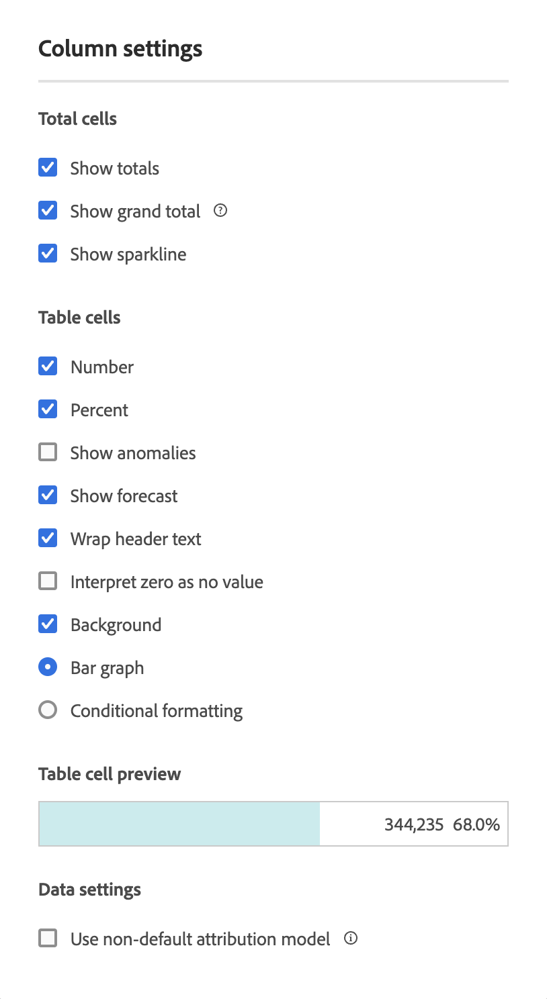

# Configuración de columna

[!UICONTROL La configuración de columna] le permite configurar el formato de la columna, aunque algunas opciones de formato pueden ser condicionales.

>[!BEGINSHADEBOX]

Consulte  [Configuración de fila y columna en una tabla de forma libre](https://experienceleague.adobe.com/en/docs/analytics-learn/tutorials/analysis-workspace/building-freeform-tables/row-and-column-settings-in-freeform-tables){target="_blank"} para ver un vídeo de demostración.

{{videoaa}}

>[!ENDSHADEBOX]

Para obtener acceso a [!UICONTROL Configuración de columna], seleccione  en el encabezado de la columna.

Puede editar la configuración de varias columnas a la vez. Seleccione varias columnas y seleccione  en cualquiera de las columnas seleccionadas. Los cambios que realice se aplicarán a todas las columnas que tengan celdas seleccionadas. 

| Opción | Descripción |
| --- | --- |
| **[!UICONTROL Mostrar total]** | Mostrar una suma de la columna del lado del cliente. Este total **no** anula la duplicación de métricas como sesiones o personas. |
| **[!UICONTROL Mostrar el total]** | Mostrar una suma de la columna del lado del servidor. El total general anula la duplicación de métricas como sesiones o personas. |
| **[!UICONTROL Mostrar minigráfico]** | Mostrar un gráfico de líneas en el encabezado de la columna. |
| **[!UICONTROL Número]** | Determina si una celda muestra u oculta el valor numérico de la métrica. Por ejemplo, si la métrica es Vistas de página, el valor numérico es el número de vistas de página para el elemento de fila. |
| **[!UICONTROL Percent]** | Determina si una celda muestra u oculta el valor porcentual de la métrica. Por ejemplo, si la métrica es Visualizaciones de la página, el valor porcentual es el número de visualizaciones de la página para el elemento de fila, dividido por el total de visualizaciones de la página para la columna. Nota: Es posible garantizar que los porcentajes superiores al 100 % sean precisos. El límite superior puede moverse al 1000 % para evitar que el ancho de las columnas sea demasiado grande. |
| **[!UICONTROL Mostrar anomalías]** | Determine si se ha ejecutado una detección de anomalías en los valores de esta columna. |
| **[!UICONTROL Mostrar previsión]** | Determine si los valores de previsión se muestran en esta columna. |
| **[!UICONTROL Justificar el texto del encabezado]** | Justifique el texto del encabezado en las tablas de forma libre para que los encabezados sean más legibles y las tablas se puedan compartir con mayor facilidad. La justificación resulta útil en el renderizado de archivos .pdf y en las métricas con nombres largos. Está habilitada de forma predeterminada. |
| **[!UICONTROL La interpretación de cero no tiene valor]** | Determine, para las celdas con un valor de 0, si se va a mostrar un 0 o una celda en blanco. Esta interpretación es útil si desea analizar los datos de todos los días de un mes y todavía faltan algunos días.  En vez de mostrar 0 para las fechas futuras, se pueden mostrar celdas en blanco. Los gráficos también respetan esta configuración (es decir, los gráficos no muestran una línea o barra con valores de 0). |
| **[!UICONTROL Fondo]** | Determine si una celda muestra u oculta todo el formato de la celda, que incluye la gráfico de barras y el formato condicional. |
| **[!UICONTROL Gráfico de barras]** | Muestre un gráfico de barras horizontal que representa el valor de la celda con relación al total de la columna. |
| **[!UICONTROL Formato condicional]** | Especifique un formato condicional. Consulte la siguiente [sección](#conditional-formatting). |
| **[!UICONTROL Vista previa de celdas de tabla]** | Una vista previa del aspecto de cada una de las celdas con las opciones de formato seleccionadas actualmente aplicadas. |
| **[!UICONTROL Uso de modelos de atribución no predeterminados]** | Uso de modelos de atribución no predeterminados. Consulte la siguiente [sección](#use-non-default-attribution-model). |

## Formato condicional {#conditional-formatting}

El formato condicional aplica formato que puede definir a los límites superior, medio e inferior. La aplicación de formato condicional en tablas de forma libre también está habilitada automáticamente en los desgloses, a menos que los límites [!UICONTROL Personalizados] estén seleccionados.

| Opciones de formato condicional | Descripción |
| --- | --- |
| **[!UICONTROL Usar límites porcentuales]** | Cambie el rango de límite en función de los porcentajes, no en función de los valores absolutos. Este rango de límite de porcentaje sirve para métricas que solo se basan en porcentajes (como el porcentaje de rechazo) y para las métricas que tienen un recuento y un porcentaje (como las vistas de la página). |
| **[!UICONTROL Generado automáticamente]** | Calcule automáticamente los límites superior/medio/inferior en función de los datos. El límite superior es el valor máximo de esta columna. El límite inferior es el valor más bajo y el punto medio es la media entre los límites superior e inferior. |
| **[!UICONTROL Personalizado]** | Asigne manualmente **[!UICONTROL límite superior]**, **[!UICONTROL punto medio]** y **[!UICONTROL límite inferior]**. Los límites proporcionan la flexibilidad para determinar si el valor de una columna es bueno, medio o malo. |
| **[!UICONTROL Paleta de formato condicional]** | Aplique un conjunto de colores preconfigurado a las celdas. Dependiendo de cuál de los cuatro esquemas de color disponibles seleccione, se asignan diferentes colores a valores altos, medios y bajos.   Sustituir una dimensión en la tabla restablece los límites de formato condicional. Cuando se sustituye una métrica se vuelven a calcular los límites de dicha columna (donde las métricas se encuentran en el eje X y las dimensiones se encuentran en el eje Y). |

## Uso de modelos de atribución no predeterminados {#use-non-default-attribution-model}

<!-- markdownlint-disable MD034 -->

>[!CONTEXTUALHELP]
>id="workspace_freeformtable_column_usenondefaultattributionmodel"
>title="Uso de modelos de atribución no predeterminados"
>abstract="Habilite un modelo de atribución no predeterminado para las columnas seleccionadas."

<!-- markdownlint-enable MD034 -->

<!-- markdownlint-disable MD034 -->

>[!CONTEXTUALHELP]
>id="workspace_freeformtable_column_usenondefaultattributionmodel_disabled"
>title="Uso de modelos de atribución no predeterminados"
>abstract="El modo de atribución no predeterminado no está disponible para esta métrica."

<!-- markdownlint-enable MD034 -->

Puede anular el modelo de atribución predeterminado configurado en [Vistas de datos](/help/data-views/component-settings/attribution.md).

>[!NOTE]
>
>Tenga en cuenta lo siguiente al habilitar un modelo de atribución no predeterminado en una métrica:
>
>* **Al usar la métrica en un informe con *una sola dimensión*:** La atribución de la métrica anula el modelo de asignación establecido en la dimensión. Por ejemplo, una métrica con una atribución de &quot;primer contacto&quot; anula una asignación de dimensión &quot;más reciente&quot;.
>
>* **Al usar la métrica en un informe con *varias dimensiones*:** La atribución de la métrica se aplica sobre el modelo de asignación para cada dimensión. Por ejemplo, una métrica con una atribución de &quot;primer contacto&quot; se aplica sobre una asignación de dimensión &quot;más reciente&quot;.
>
> Para obtener más información sobre la asignación, consulte [Configuración del componente de persistencia](/help/data-views/component-settings/persistence.md).

Para utilizar un modelo de atribución no predeterminado para una métrica en una Analysis Workspace:

1. Haga clic en **[!UICONTROL Utilizar modelo de atribución no predeterminado]**. Cuando ya esté seleccionado, use **[!UICONTROL Editar]** para editar el modelo de atribución. O bien, anule la selección para volver al modelo de atribución predeterminado.

   

2. En **[!UICONTROL Modelo de atribución de columna]**, seleccione un **[!UICONTROL Modelo]** y una **[!UICONTROL ventana retrospectiva]**. Esta ventana retrospectiva determina la ventana de atribución de datos que se aplicará a cada conversión.

   

### Modelos de atribución

{{attribution-models-details}}

### Contenedor

{{attribution-container}}

### Período de retroactividad

{{attribution-lookback-window}}

### Ejemplo

{{attribution-example}}

>[!MORELIKETHIS]
>
>* [Administración de fuentes de datos](/help/analysis-workspace/visualizations/t-sync-visualization.md)
