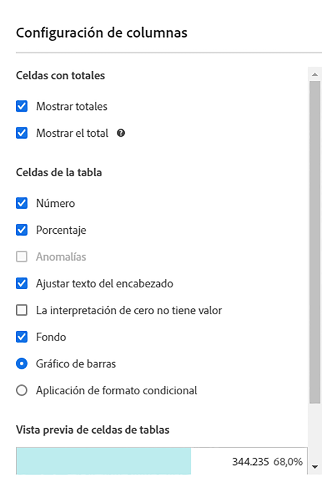
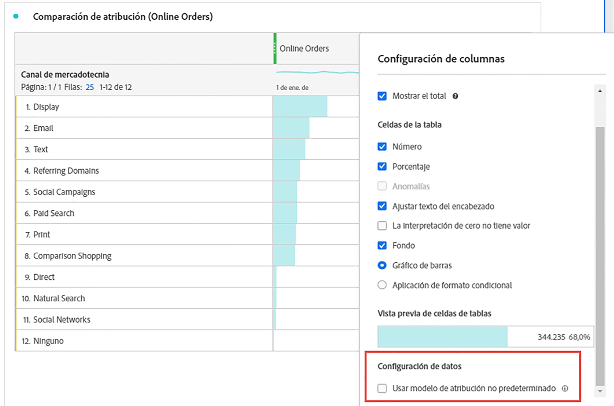
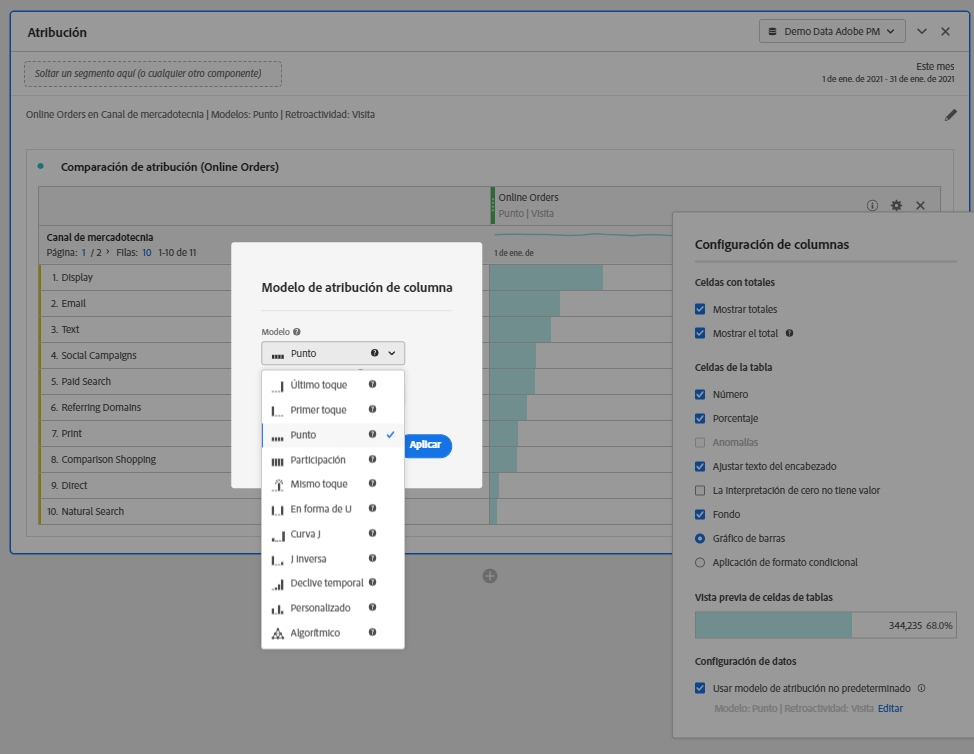

# [!UICONTROL Configuración de columna]

[!UICONTROL La configuración de columna] le permite configurar el formato de la columna, aunque algunas opciones de formato pueden ser condicionales.

Vea aquí un vídeo sobre la configuración de filas y columnas:

>[!VIDEO](https://video.tv.adobe.com/v/40382/?quality=12)

## Editar [!UICONTROL configuración de columna] {#edit-column-settings}

Para acceder a la [!UICONTROL Configuración de columna], arrastre una tabla de forma libre al proyecto y, a continuación, haga clic en el icono de engranaje en el encabezado de la columna.

Puede editar la configuración **de varias columnas a la vez**. Basta con seleccionar varias columnas y hacer clic en el icono de configuración de cualquiera de ellas. Los cambios realizados se aplicarán a todas las columnas que tengan celdas seleccionadas.

| Elemento | Descripción |
| --- | --- |
| Número | Determina si una celda muestra u oculta el valor numérico de la métrica. Por ejemplo, si la métrica es Visualizaciones de la página, el valor numérico es el número de visualizaciones de la página para el elemento de fila. |
| Porcentaje | Determina si una celda muestra u oculta el valor porcentual de la métrica. Por ejemplo, si la métrica es Visualizaciones de la página, el valor porcentual es el número de visualizaciones de la página para el elemento de fila dividido por el total de visualizaciones de la página para la columna. Nota: Se pueden mostrar porcentajes superiores al 100 % para mejorar la precisión. También se ha he incrementado el límite superior hasta el 1000 % para garantizar que la anchura de las columnas se pueda ampliar. |
| Anomalías | Determina si se ha ejecutado una detección de anomalías en los valores de esta columna. |
| Justificar el texto del encabezado | Permite justificar el texto del encabezado en las tablas de forma libre para que los encabezados sean más legibles y las tablas se puedan compartir con mayor facilidad. Esto resulta útil en el procesamiento de archivos .pdf y en las métricas con nombres largos. Está activada de forma predeterminada. |
| La interpretación de cero no tiene valor | Para las celdas con un valor de 0, determina si se va a mostrar un 0 o una celda en blanco. Esto es útil si desea analizar los datos de todos los días de un mes y todavía faltan algunos días.  En vez de mostrar 0 para las fechas futuras, se pueden mostrar celdas en blanco. Los gráficos también respetan estas opciones de configuración (por ejemplo, si esta opción de configuración está marcada, no muestran ninguna línea ni ninguna barra con el valor 0). |
| Contexto | Determina si una celda muestra u oculta todo el formato de la celda, que incluye la gráfico de barras y el formato condicional. |
| Gráfico de barras | Muestra un gráfico de barras horizontal que representa el valor de la celda con relación al total de la columna. |
| Formato condicional | Consulte la siguiente sección. |
| Vista previa de celdas de tabla | Muestra una vista previa del aspecto de cada una de las celdas con las opciones de formato seleccionadas actualmente aplicadas. |

## Formato condicional {#conditional-formatting}

El formato condicional aplica formato que puede definir a los límites superior, medio e inferior. La aplicación de formato condicional (colores, etc.) en tablas de forma libre también está activada automáticamente en los desgloses, a menos que los límites “Personalizados” estén seleccionados.

| Elemento | Descripción |
| --- | --- |
| Formato condicional | Aplica a las celdas el conjunto de colores preconfigurado que desee. Dependiendo de cuál de los 4 esquemas de color disponibles seleccione, se asignan diferentes colores a valores altos, valores medios y valores bajos.   Sustituir una dimensión en la tabla restablece los límites de formato condicional. Cuando se sustituye una métrica se vuelven a calcular los límites de dicha columna (donde las métricas se encuentran en el eje X y las dimensiones se encuentran en el eje Y). |
| Usar límites porcentuales | Cambie el rango de límite en función de los porcentajes, no en función de los valores absolutos. Esto sirve para métricas que solo se basan en porcentajes (como el porcentaje de rebote), así como para métricas que tienen un recuento y un porcentaje (como las vistas de la página). |
| Generación automática | Calcule automáticamente los límites superior/medio/inferior en función de los datos. El límite superior es el valor máximo de esta columna. El límite inferior es el valor más bajo y el punto medio es la media entre los límites superior e inferior. |
| Personalizado | Asigne los límites superior/medio/inferior en forma manual. Esto le proporciona la flexibilidad para determinar si el valor de una columna es bueno, medio o malo. |
| Paleta de formato condicional | Elija cuál de los 4 esquemas de color disponibles va a utilizar para el formato condicional. |

## Uso de modelos de atribución no predeterminados {#attribution}

Permite anular el modelo de atribución predeterminado configurado en [Vistas de datos](/help/data-views/component-settings/attribution.md).

1. Haga clic en el icono Configuración (engranaje) en una columna de Tabla de forma libre.

   

2. En **[!UICONTROL Configuración de datos]**, active **[!UICONTROL Utilizar modelo de atribución no predeterminado]**. Para obtener más información sobre los diferentes modelos de atribución, consulte [Modelos de atribución](/help/data-views/component-settings/attribution.md).

   

>[!MORELIKETHIS]
>
>* [Administración de fuentes de datos](/help/analysis-workspace/visualizations/t-sync-visualization.md)

