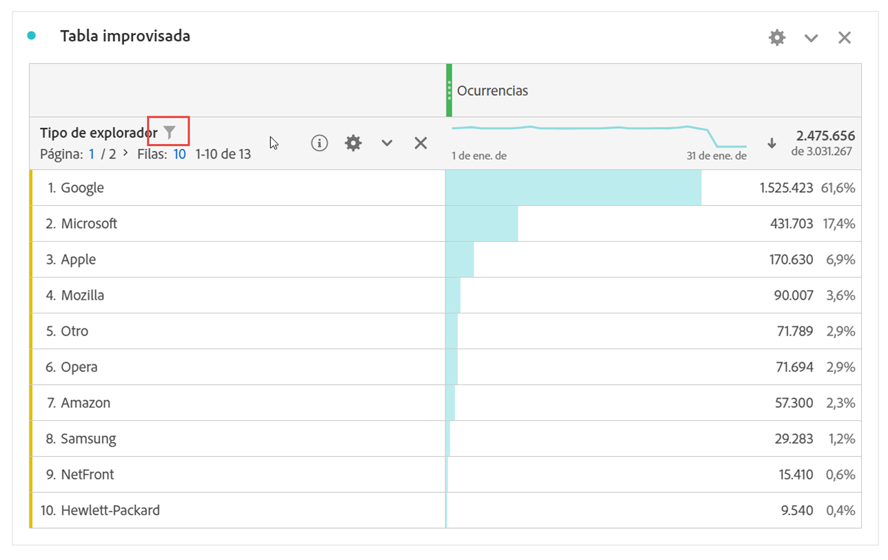
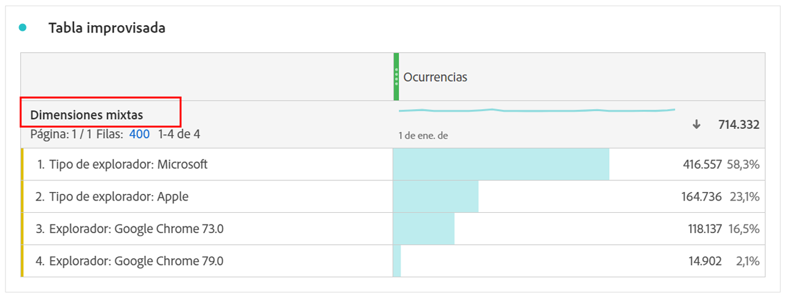

# Elementos de dimensión dinámicos o estáticos en tablas de forma libre

En las tablas improvisadas, las filas y columnas pueden contener varios valores de componente. Estos valores pueden ser dinámicos (cambian con el tiempo) o estáticos (no cambian con el tiempo), según el análisis que desee generar.

## Elementos de dimensión dinámicos

Los elementos de dimensión dinámicos cambian con el tiempo y dependen de la métrica por la que se ordena en la tabla de forma libre. Se prefieren los elementos de dimensión dinámicos cuando desea analizar los elementos principales de un período de tiempo determinado.

Cuando se coloca una dimensión en una tabla de forma libre, se devuelven filas dinámicas. Representan los elementos principales que corresponden a la dimensión de una métrica y un período de tiempo determinados. También puede colocar una dimensión en columnas de tabla de forma libre y esta se expande automáticamente a los 5 elementos de dimensión principales.

Por ejemplo, cuando arrastra la dimensión Tipo de explorador a la tabla, los elementos de dimensión Tipo de explorador principales (por ejemplo, Microsoft, Apple, Google, etc.) se devuelven de forma dinámica a las filas de la tabla. Si se sueltan en una columna, los 5 elementos de dimensión Tipo de explorador principales se devuelven de forma dinámica.

Los elementos de dimensión dinámicos tienen la opción de filtro de fila y los iconos X, y sí **not** tienen el icono de candado presente. <!--do they have the lock icon? --> Al hacer clic en la x junto a un elemento de dimensión dinámica, se aplica un filtro automáticamente. Para obtener más información sobre la aplicación de filtros a tablas, consulte [Filtrado y ordenación de tablas](/help/analysis-workspace/visualizations/freeform-table/filter-and-sort.md).

## Elementos de dimensión estáticos

Los elementos de dimensión estáticos no cambian con el tiempo; son componentes fijos que siempre se devuelven en una tabla de forma libre. Se prefieren los elementos de dimensión estáticos cuando se desea analizar siempre el mismo elemento, ya sean campañas específicas o días específicos de la semana.

Cada vez que selecciona y suelta manualmente valores de componente específicos (dimensión, métrica, filtro, intervalo de fechas) en una tabla, el resultado es una lista estática de filas o columnas. También se pueden crear elementos de dimensión estáticos si elige:

* En las filas, haga clic con el botón derecho en > [!UICONTROL Mostrar solo las filas seleccionadas]
* En las columnas, haga clic con el botón derecho en > [!UICONTROL Convertir el elemento en estático]

Por ejemplo, cuando arrastra elementos específicos de Tipo de explorador como Microsoft y Apple, esos dos elementos específicos siempre se arrastran a la tabla.

Los elementos de dimensión estáticos **no** tienen la opción de filtro de fila. En cambio, los iconos de bloqueo y X están presentes en cada elemento. Haga clic en el icono X para eliminar ese elemento de dimensión de la tabla.

## Elementos de dimensión mixtos

Los elementos de dimensión de diferentes dimensiones se pueden agregar a la misma tabla. En estos casos, el encabezado de fila indica “Dimensiones mixtas”. Estos elementos de dimensión son estáticos. Por ejemplo, si agrega elementos de dimensión específicos desde la dimensión Tipo de explorador y otros elementos de dimensión desde la dimensión Explorador.

## Filas totales improvisadas

Las filas dinámicas y estáticas se comportan de forma diferente en la fila total improvisada. De forma predeterminada:

* Las filas dinámicas se suman a las métricas del lado del servidor y a las duplicadas, como visitas o visitantes
* Las filas estáticas se suman al lado del cliente y **no** eliminan las métricas duplicadas. Para calcular el total de filas del lado del servidor, cambie la configuración fila a **Mostrar total general**. [Más información](https://experienceleague.adobe.com/docs/analytics/analyze/analysis-workspace/visualizations/freeform-table/workspace-totals.html?lang=es)
