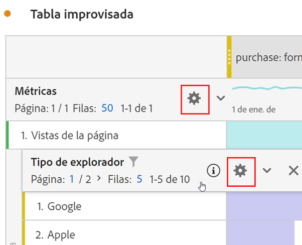
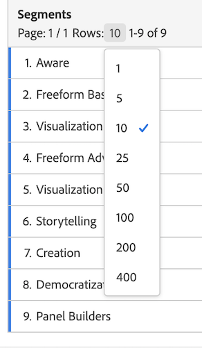

# Configuración de filas

Vea aquí un vídeo sobre la configuración de filas y columnas:

>[!VIDEO](https://video.tv.adobe.com/v/40382/?quality=12)

La configuración de filas varía en función del componente que haya arrastrado a la tabla. Para obtener acceso a la configuración de fila de la tabla, haga clic en el icono [!UICONTROL Configuración] junto a una dimensión, filtro, métrica, período de tiempo o desglose dentro de cada uno de estos elementos:

| Configuración | Descripción |
| --- | --- |
| Alinear fechas | Esta es una configuración de nivel de tabla que alinea las fechas de cada columna con todos los inicios de la misma fila. La alineación de fechas está habilitada de forma predeterminada cuando se utiliza una dimensión de tiempo en las filas de la tabla y se aplican diferentes intervalos de fechas en las columnas. Por ejemplo, en una tabla diaria con octubre y septiembre aplicados en las columnas, la columna izquierda inicia con el 1 de octubre y la columna derecha inicia con el 1 de septiembre. |
| Desglose por posición | De forma predeterminada, esta configuración está deshabilitada y los desgloses se corrigen a elementos de fila estáticos. Por ejemplo, supongamos que desglosa los 3 elementos de dimensión de página principales (página principal, resultados de búsqueda, cierre de compra) por canal de marketing. Después abandona el proyecto y regresa dos semanas más tarde. Al volver a abrir el proyecto, las 3 páginas principales han cambiado, y ahora la página principal, los resultados de búsqueda y el cierre de compra son las 4 o 6 páginas principales. De forma predeterminada, los desgloses del canal de marketing seguirán apareciendo en la página principal, los resultados de búsqueda y el cierre de compra, aunque ahora se encuentren en las filas 4-6.   Por el contrario, **Desglose por posición** siempre desglosará los tres elementos principales, independientemente de cuáles sean. En referencia a nuestro ejemplo, cuando vuelva a abrir el proyecto, los desgloses de canal de marketing se vincularán a las 3 páginas principales de la tabla, no a la página principal, los resultados de búsqueda y el cierre de compra, que ahora están en las filas 4-6. |
| Porcentajes | **Calcular porcentajes por columna** es la configuración predeterminada; los porcentajes visibles en una columna se calculan en función del total de la columna.  **Calcular porcentajes por fila** obliga a la tabla improvisada a calcular los porcentajes de las celdas en la fila en lugar de en la columna, con el total general como denominador. Esto es muy útil en los porcentajes de tendencias. Esta configuración está habilitada de forma predeterminada al utilizar el icono Visualizar. |
| Totales de columna | Esta configuración solo está disponible para [filas estáticas](/help/analysis-workspace/visualizations/freeform-table/column-row-settings/manual-vs-dynamic-rows.md).   **Mostrar como la suma de las filas actuales** muestra una suma del lado del cliente de las filas de la tabla, lo que significa que el total *no* deduplicará las métricas como visitas o visitantes.   **Mostrar el total general** muestra una suma del lado del servidor, lo que significa que el total anulará el duplicado de las métricas. |

## Cambio del recuento de filas

Para cambiar el número de filas que se muestran:

1. Haga clic en el número situado junto a [!UICONTROL Filas] en la parte superior de la tabla.

   

1. En la lista desplegable, seleccione el número de filas que desee que muestre la tabla.