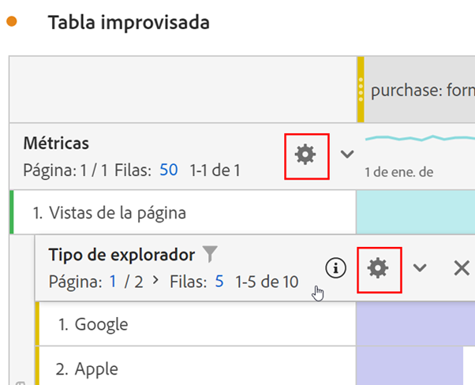
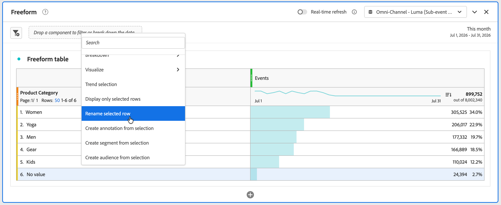
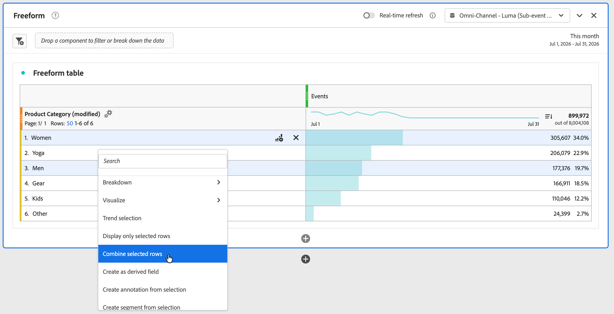
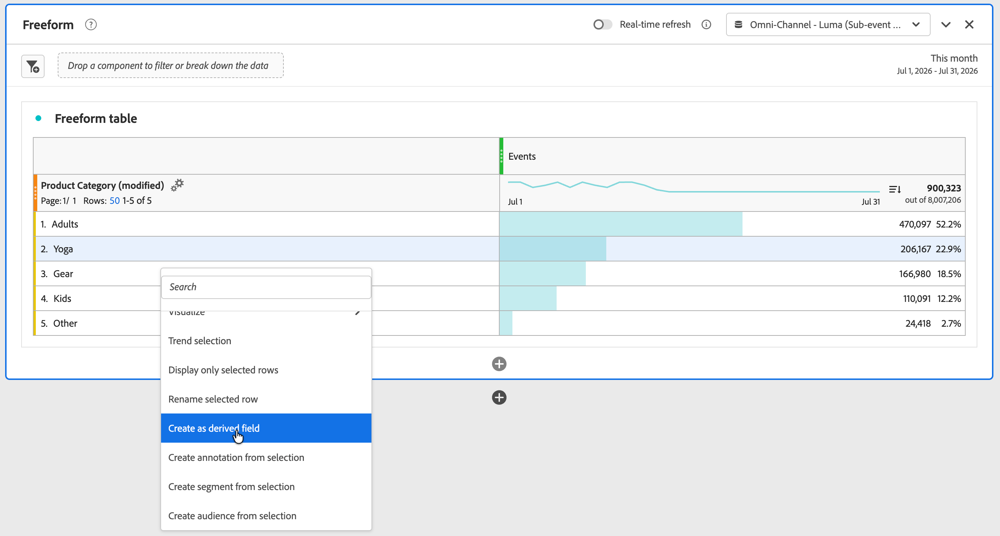

# Configuración de filas

La configuración de filas varía en función del componente que haya arrastrado a la tabla. Para obtener acceso a la configuración de fila de la tabla, seleccione  **[!UICONTROL Configuración]** junto a una dimensión, segmento, métrica, período de tiempo o desglose dentro de cada uno de estos objetos.

| Configuración | Descripción |
| --- | --- |
| **[!UICONTROL Desglose por posición]** | De forma predeterminada, esta configuración está deshabilitada y los desgloses se corrigen a elementos de fila estáticos. Por ejemplo, supongamos que desglosa los 3 elementos de dimensión de página principales (página principal, resultados de búsqueda, cierre de compra) por canal de marketing. Después abandona el proyecto y regresa dos semanas más tarde. Al volver a abrir el proyecto, las 3 páginas principales han cambiado, y ahora la página principal, los resultados de búsqueda y el cierre de compra son las 4 o 6 páginas principales. De manera predeterminada, los desgloses del canal de marketing siguen apareciendo en la página principal, los resultados de búsqueda y el cierre de compra, aunque ahora se encuentren en las filas 4-6.   Por el contrario, **Desglose por posición** siempre desglosa los 3 elementos principales, independientemente de cuáles sean. En referencia al ejemplo anterior, cuando vuelva a abrir el proyecto, los desgloses de canal de marketing se vinculan a las 3 páginas principales de la tabla. Y no a la página principal, los resultados de búsqueda y el cierre de compra, que ahora están en las filas 4-6. |
| **[!UICONTROL Porcentajes]** | **Calcular porcentajes por columna** (por defecto): los porcentajes visibles en las celdas se calculan en función del total de la columna.  **Calcular porcentajes por fila**: los porcentajes de las celdas se calculan a lo largo de la fila, en lugar de a lo largo de la columna, con el total general como denominador. Este cálculo resulta útil en los porcentajes de tendencias. |
| **[!UICONTROL Totales de columna]** | Esta configuración solo está disponible para [filas estáticas](/help/analysis-workspace/visualizations/freeform-table/column-row-settings/manual-vs-dynamic-rows.md).   **Mostrar como suma de las filas actuales** muestra una suma del lado del cliente de las filas de la tabla, lo que significa que el total *no* desduplica métricas como las visitas o las personas.   **Mostrar total general** muestra una suma del lado del servidor, es decir, el total de las métricas deduplicadas. |

>[!BEGINSHADEBOX]

Consulte  [Configuración de fila y columna en una tabla de forma libre](https://experienceleague.adobe.com/en/docs/analytics-learn/tutorials/analysis-workspace/building-freeform-tables/row-and-column-settings-in-freeform-tables){target="_blank"} para ver un vídeo de demostración.

{{videoaa}}

>[!ENDSHADEBOX]

## Cambio del recuento de filas

Para cambiar el número de filas que se muestran:

1. Haga clic en el número que aparece junto a **[!UICONTROL Filas]** en la parte superior de la primera columna de la tabla.

   

1. En el menú desplegable, seleccione el número de filas que desee que muestre la tabla.

## Menú contextual

Las siguientes opciones de menú contextual están disponibles al seleccionar el encabezado de la dimensión.

| Opción | Descripción |
| --- | --- |
| **[!UICONTROL Copiar selección al portapapeles]** | Copia la selección de la visualización en el portapapeles. |
| **[!UICONTROL Descargar elementos como CSV (*nombre de dimensión*)]** | Descarga inmediatamente los elementos de dimensión (hasta un máximo de 50 000) de la visualización en su dispositivo local. Un máximo de 50 000 elementos de dimensión para la dimensión seleccionada. |
| **[!UICONTROL Descargar selección como CSV]** | Descargue inmediatamente los elementos de dimensión de la visualización en su dispositivo local. |
| **[!UICONTROL Crear hipervínculos para todos los elementos de dimensión]** | Cree hipervínculos para todos los elementos de dimensión. Consulte [Hipervínculos para dimensiones en una tabla de forma libre](../freeform-table-hyperlinks.md) |
| **[!UICONTROL Editar hipervínculos para todos los elementos de dimensión]** | Editar hipervínculos para todos los elementos de dimensión. Consulte [Hipervínculos para dimensiones en una tabla de forma libre](../freeform-table-hyperlinks.md) |
| **[!UICONTROL Quitar hipervínculos de todos los elementos de dimensión]** | Quite hipervínculos de todos los elementos de dimensión. Consulte [Hipervínculos para dimensiones en una tabla de forma libre](../freeform-table-hyperlinks.md) |
| **[!UICONTROL Eliminar]** | Elimina la dimensión de la tabla. |
| **[!UICONTROL Visualizar]** | Visualice la dimensión con cualquiera de las visualizaciones disponibles. |
| **[!UICONTROL Mostrar solamente las filas seleccionadas]** | Muestre solo los elementos seleccionados en la visualización. |
| **[!UICONTROL Crear anotación a partir de la selección]** | Abra **[!UICONTROL Detalles de anotación]** para añadir una anotación. |

Las siguientes opciones de menú contextual adicionales están disponibles al seleccionar uno o más elementos de dimensión (primera columna) o una o más celdas individuales en la tabla de forma libre.

| Opción | Descripción |
| --- | --- |
| **[!UICONTROL Copiar selección al portapapeles]** | Copie la información de las celdas seleccionadas de la tabla de forma libre. |
| **[!UICONTROL Descargar elementos como CSV (*nombre de dimensión*)]** | Descarga inmediatamente los elementos de dimensión (hasta un máximo de 50 000) de la visualización en su dispositivo local. Un máximo de 50 000 elementos de dimensión para la dimensión seleccionada. |
| **[!UICONTROL Crear hipervínculo]** | Cree un hipervínculo para el elemento. Consulte [Hipervínculos para dimensiones en una tabla de forma libre](../freeform-table-hyperlinks.md) |
| **[!UICONTROL Editar hipervínculo]** | Edite un hipervínculo para el elemento. Consulte [Hipervínculos para dimensiones en una tabla de forma libre](../freeform-table-hyperlinks.md) |
| **[!UICONTROL Quitar hipervínculo]** | Quite un hipervínculo para el elemento. Consulte [Hipervínculos para dimensiones en una tabla de forma libre](../freeform-table-hyperlinks.md) |
| **[!UICONTROL Descargar selección como CSV]** | Descargue inmediatamente los elementos de dimensión de la visualización en su dispositivo local. |
| **[!UICONTROL Eliminar selección]** | Eliminar las filas seleccionadas. |
| **[!UICONTROL Crear alerta a partir de la selección]** | Abra [Generador de alertas](/help/components/c-intelligent-alerts/alert-builder.md) para generar una alerta a partir de la selección. |
| **[!UICONTROL Desglose]** | Desglose del elemento de dimensión. Seleccione de la lista de **[!UICONTROL dimensiones]**, **[!UICONTROL métricas]**, **[!UICONTROL segmentos]** o **[!UICONTROL intervalos de fechas]**. Búsqueda alternativa para un componente, usando *Buscar*. |
| **[!UICONTROL Visualizar]** | Visualice la selección utilizando cualquiera de las visualizaciones disponibles. |
| **[!UICONTROL Selección de tendencia]** | Cree una visualización de gráfico de líneas de tendencias para la selección. |
| **[!UICONTROL Mostrar solamente las filas seleccionadas]** | Mostrar solo las filas seleccionadas en la visualización. |
| **[!UICONTROL Mostrar todas las filas]** | Mostrar todas las filas de la visualización. |
| **[!UICONTROL Cambiar el nombre de la fila seleccionada]** | Cambie el nombre de la fila seleccionada. Escriba un **[!UICONTROL Nombre]** en el cuadro de diálogo **[!UICONTROL Cambiar nombre de fila seleccionada]**. Seleccione **[!UICONTROL Aceptar]** para confirmar o **[!UICONTROL Cancelar]** para cancelar. Una vez que se cambia el nombre de una fila de una tabla de forma libre, el nombre de la dimensión de la columna de encabezado se anexa con **[!UICONTROL (modificado)]** y un icono  está disponible para restablecer las filas con el nombre cambiado en la columna de encabezado de dimensión. Consulte [Ejemplo de clasificación en línea](#inline-classifications-example). |
| **[!UICONTROL Combinar filas seleccionadas]** | Combine las filas seleccionadas. Escriba un **[!UICONTROL Nombre]** en el cuadro de diálogo **[!UICONTROL Combinar filas seleccionadas]**. Seleccione **[!UICONTROL Aceptar]** para confirmar o **[!UICONTROL Cancelar]** para cancelar. Una vez combinadas las filas de una tabla de forma libre, el nombre de dimensión de la columna de encabezado se anexa con **[!UICONTROL (modificado)]** y un icono  está disponible para restablecer las filas con nombre cambiado en la columna de encabezado de dimensión. Consulte [Ejemplo de clasificación en línea](#inline-classifications-example). |
| **[!UICONTROL Crear como campo derivado]** | *Debe ser administrador de productos de Customer Journey Analytics para ver esta opción de menú contextual.*  Disponible en cualquier fila seleccionada de una tabla de forma libre que se modifique como resultado de cambiar el nombre de las filas o combinarlas. Cuando se selecciona, la [interfaz de campo derivada](/help/data-views/derived-fields/derived-fields.md#create-a-derived-field) se abre con las modificaciones que ya se han prerrellenado en la tabla de forma libre. Consulte [Ejemplo de clasificación en línea](#inline-classifications-example). |
| **[!UICONTROL Crear anotación a partir de la selección]** | Abra [Generador de anotaciones](/help/components/annotations/create-annotations.md#annotation-builder) para generar una anotación para la selección. |
| **[!UICONTROL Crear segmento de selección]** | Abra [Generador de segmentos](/help/components/segments/seg-builder.md) para generar un segmento a partir de la selección. |
| **[!UICONTROL Crear público a partir de la selección]** | Abra [Generador de audiencias](/help/components/audiences/publish.md#audience-builder) para generar una audiencia a partir de la selección. |

Las siguientes opciones de menú contextual adicionales están disponibles al seleccionar un encabezado de columna de métrica.

| Opción | Descripción |
|---|---|
| **[!UICONTROL Crear métrica a partir de la selección]** | Cree una nueva métrica a partir de la métrica seleccionada. La métrica puede ser Media, Mediana, Máx. columna, Mín. columna, Suma columna. También puede seleccionar Abrir en el creador de métricas calculadas para crear una métrica calculada. |
| **[!UICONTROL Añadir columna de período de tiempo]** | Añadir una columna de periodo de tiempo. Se le ofrecen varias opciones, donde el intervalo de calendario del panel determina el *intervalo de fechas*: <ul><li>**[!UICONTROL *Intervalo de fechas* anterior a este intervalo de fechas]**</li><li>**[!UICONTROL Estos *intervalos de fechas* a este intervalo de fechas]**.</li><li>**[!UICONTROL Intervalo de fechas personalizado a este intervalo de fechas]**. Abre el **[!UICONTROL Generador de intervalos de fechas]** para especificar el intervalo de fechas.</li></ul>Consulte [Comparación de fechas](/help/components/date-ranges/time-comparison.md) para obtener más información. |
| **[!UICONTROL Comparar períodos de tiempo]** | Añade columnas de período de tiempo de comparación. Solo está disponible cuando la dimensión no está basada en el tiempo. Se le ofrecen varias opciones para determinar el *intervalo de fechas*: <ul><li>**[!UICONTROL *Intervalo de fechas* anterior a este intervalo de fechas]**</li><li>**[!UICONTROL Intervalo de fechas personalizado a este intervalo de fechas]**. Abre el **[!UICONTROL Generador de intervalos de fechas]** para especificar el intervalo de fechas.</li></ul>Consulte [Comparación de fechas](/help/components/date-ranges/time-comparison.md) para obtener más información. |
| **[!UICONTROL Modificar modelos de atribución]** | Modifique el modelo de atribución para la columna. |
| **[!UICONTROL Comparar modelo de atribución]** | Especifique un nuevo modelo de atribución y compárelo con el modelo de atribución de la columna seleccionada. Se añade una nueva columna con las nuevas métricas del modelo de atribución. Además, se añade una columna Cambio porcentual para la comparación. |
| **[!UICONTROL Restablecer anchos de columna]** | Restablezca el ancho de columna predeterminado. |
| **[!UICONTROL Crear anotación a partir de la selección]** | Abra **[!UICONTROL Detalles de anotación]** para añadir una anotación. |
| **[!UICONTROL Crear segmento de selección]** | Abra **[!UICONTROL Generador de segmentos]** para generar un segmento a partir de la selección. |
| **[!UICONTROL Crear público a partir de la selección]** | Abra el cuadro de diálogo **[!UICONTROL Crear público]** para generar un público a partir de la selección. |

## Cambiar altura de fila

Puede establecer la [densidad de visualización](https://experienceleague.adobe.com/en/docs/analytics-platform/using/cja-workspace/build-workspace-project/view-density) de un proyecto en **[!UICONTROL Compacto]**, **[!UICONTROL Cómodo]** y **[!UICONTROL Expandido]**.

## Ejemplo de clasificaciones en línea

Este ejemplo ilustra cómo usar las opciones de menú contextual **[!UICONTROL Cambiar nombre de fila seleccionada]**, **[!UICONTROL Combinar filas seleccionadas]** y **[!UICONTROL Crear como campo derivado]**. Y cómo restablecer la tabla de forma libre modificada.

* Cambie el nombre de la fila **[!UICONTROL Sin valor]** a **[!UICONTROL Otro]**.

   1. Seleccione **[!UICONTROL Cambiar el nombre de la fila seleccionada]** en el menú contextual de la fila **[!UICONTROL Sin valor]** seleccionada.

      

   1. En el cuadro de diálogo **[!UICONTROL Cambiar nombre de fila seleccionada]**:

      

      1. Escriba <code>Otro</code> para **[!UICONTROL Name]**.
      1. Seleccione **[!UICONTROL Aceptar]**.

* Combine **[!UICONTROL Hombres]** y **[!UICONTROL Mujeres]** filas a una fila de **[!UICONTROL Adultos]**.

   1. Seleccione la fila **[!UICONTROL Hombres]** y **[!UICONTROL Mujeres]**.
   1. Seleccione **[!UICONTROL Combinar filas seleccionadas]** en el menú contextual de cualquiera de las filas seleccionadas.

      

   1. En el diálogo **[!UICONTROL Combinar filas seleccionadas]**:

      

      1. Ingresar <code>adultos</code> para **[!UICONTROL Name]**.
      1. Seleccione **[!UICONTROL Aceptar]**.

* Cree un campo derivado de las modificaciones en la tabla de forma libre.

   1. Seleccione **[!UICONTROL Crear como campo derivado]** del menú contextual para cualquier fila seleccionada en la tabla modificada.

      

   1. Inspeccione, modifique y guarde opcionalmente la definición del campo derivado en función de todas las modificaciones realizadas en la tabla.

      

* Restablezca la tabla de forma libre al estado antes de realizar modificaciones.

   1. Seleccione  junto al **[!UICONTROL _nombre de dimensión _(modificado)]**.
   1. Seleccione **[!UICONTROL Restablecer filas con nombre cambiado]** en la ventana emergente **[!UICONTROL Filas con nombre cambiado]**.

      
