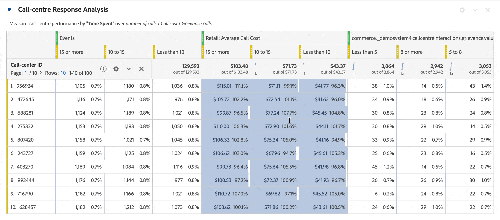

# Configuración de filas

+++ Vea un vídeo de demostración de esta funcionalidad.

>[!VIDEO](https://video.tv.adobe.com/v/40382/?quality=12)

{{videoaa}}

+++

La configuración de filas varía en función del componente que haya arrastrado a la tabla. Para obtener acceso a la configuración de fila de la tabla, seleccione  **[!UICONTROL Configuración]** junto a una dimensión, filtro, métrica, período de tiempo o desglose dentro de cada uno de estos objetos.

| Configuración | Descripción |
| --- | --- |
| **[!UICONTROL Desglose por posición]** | De forma predeterminada, esta configuración está deshabilitada y los desgloses se corrigen a elementos de fila estáticos. Por ejemplo, imagine que desglosa los 3 elementos de dimensión de página principales (página principal, resultados de búsqueda, cierre de compra) por canal de marketing. Después abandona el proyecto y regresa dos semanas más tarde. Al volver a abrir el proyecto, las 3 páginas principales han cambiado, y ahora la página principal, los resultados de búsqueda y el cierre de compra son las 4 o 6 páginas principales. De forma predeterminada, los desgloses del canal de marketing siguen apareciendo en la página principal, los resultados de búsqueda y el cierre de compra, aunque ahora se encuentren en las filas 4-6.   Por el contrario, **Desglose por posición** siempre desglosará los tres elementos principales, independientemente de cuáles sean. En referencia al ejemplo anterior, cuando vuelva a abrir el proyecto, los desgloses de canal de marketing se vinculan a las 3 páginas principales de la tabla. Y no a la página principal, los resultados de búsqueda y el cierre de compra, que ahora están en las filas 4-6. |
| **[!UICONTROL Porcentajes]** | **Calcular porcentajes por columna** (predeterminado): los porcentajes visibles en una celda se calculan basándose en el total de la columna.  **Calcular porcentajes por fila**: los porcentajes de las celdas se calculan en toda la fila, en lugar de en la columna, con el total general como denominador. Este cálculo es útil para los porcentajes de tendencias. |
| **[!UICONTROL Totales de columna]** | Esta configuración solo está disponible para [filas estáticas](/help/analysis-workspace/visualizations/freeform-table/column-row-settings/manual-vs-dynamic-rows.md).   **Mostrar como la suma de las filas actuales** muestra una suma del lado del cliente de las filas de la tabla, lo que significa que el total *no* anula la duplicación de métricas como visitas o personas.   **Mostrar total general** muestra una suma del lado del servidor, lo que significa el total de métricas deduplicadas. |

## Cambio del recuento de filas

Para cambiar el número de filas que se muestran:

1. Haga clic en el número situado junto a **[!UICONTROL Filas]** en la parte superior de la primera columna de la tabla.

   

1. En la lista desplegable, seleccione el número de filas que desee que muestre la tabla.

## Menú contextual

Las siguientes opciones de menú contextual están disponibles al seleccionar el encabezado de la dimensión.

| Opción | Descripción |
| --- | --- |
| **[!UICONTROL Copiar selección al portapapeles]** | Copie la selección de la visualización en el portapapeles. |
| **[!UICONTROL Descargar elementos como CSV (*nombre de dimensión*)]** | Descargue inmediatamente los elementos de dimensión (hasta un máximo de 50 000) de la visualización en su dispositivo local. Un máximo de 50 000 elementos de dimensión para la dimensión seleccionada. |
| **[!UICONTROL Descargar selección como CSV]** | Descargue inmediatamente los elementos de dimensión de la visualización en su dispositivo local. |
| **[!UICONTROL Crear hipervínculo para todos los elementos de dimensión]** | Cree hipervínculos para todos los elementos de dimensión. Ver [hipervínculos para dimensiones en una tabla de forma libre](../freeform-table-hyperlinks.md) |
| **[!UICONTROL Editar hipervínculo para todos los elementos de dimensión]** | Edite los hipervínculos de todos los elementos de dimensión. Ver [hipervínculos para dimensiones en una tabla de forma libre](../freeform-table-hyperlinks.md) |
| **[!UICONTROL Quitar hipervínculo para todos los elementos de dimensión]** | Elimine los hipervínculos de todos los elementos de dimensión. Ver [hipervínculos para dimensiones en una tabla de forma libre](../freeform-table-hyperlinks.md) |
| **[!UICONTROL Eliminar]** | Elimina la dimensión de la tabla. |
| **[!UICONTROL Visualizar]** | Visualice la dimensión con cualquiera de las visualizaciones disponibles. |
| **[!UICONTROL Mostrar solo las filas seleccionadas]** | Mostrar solo los elementos seleccionados en la visualización. |
| **[!UICONTROL Crear anotación a partir de la selección]** | Abra **[!UICONTROL Detalles de anotación]** para agregar una anotación. |

Las siguientes opciones de menú contextual adicionales están disponibles al seleccionar uno o más elementos de dimensión (primera columna) o una o más celdas individuales en la tabla de forma libre.

| Opción | Descripción |
| --- | --- |
| **[!UICONTROL Crear hipervínculo]** | Cree un hipervínculo para el elemento. Ver [hipervínculos para dimensiones en una tabla de forma libre](../freeform-table-hyperlinks.md) |
| **[!UICONTROL Editar hipervínculo]** | Editar un hipervínculo para el elemento. Ver [hipervínculos para dimensiones en una tabla de forma libre](../freeform-table-hyperlinks.md) |
| **[!UICONTROL Quitar hipervínculo]** | Quitar un hipervínculo para el elemento. Ver [hipervínculos para dimensiones en una tabla de forma libre](../freeform-table-hyperlinks.md) |
| **[!UICONTROL Desglose]** | Desglose el elemento de dimensión. Seleccione de la lista de **[!UICONTROL Dimension]**, **[!UICONTROL Métricas]**, **[!UICONTROL Filtros]** o **[!UICONTROL Intervalos de fechas]**. Búsqueda alternativa para un componente, usando *Search*. |
| **[!UICONTROL Eliminar selección]** | Eliminar las filas seleccionadas (elementos). |
| **[!UICONTROL Selección de tendencia]** | Cree una visualización de gráfico de líneas de tendencias para la selección. |
| **[!UICONTROL Mostrar solo las filas seleccionadas]** | Mostrar solo las filas seleccionadas en la visualización. |
| **[!UICONTROL Mostrar todas las filas]** | Mostrar todas las filas de la visualización. |
| **[!UICONTROL Crear filtro a partir de la selección]** | Abra **[!UICONTROL Generador de filtros]** para generar un filtro a partir de la selección. |
| **[!UICONTROL Crear audiencia a partir de la selección]** | Abra el cuadro de diálogo **[!UICONTROL Crear audiencia]** para generar una audiencia a partir de la selección. |

Las siguientes opciones de menú contextual adicionales están disponibles al seleccionar un encabezado de columna de métrica.

| Opción | Descripción |
|---|---|
| **[!UICONTROL Crear métrica a partir de la selección]** | Cree una nueva métrica a partir de la métrica seleccionada. La métrica puede ser Media, Media, Máximo de columna, Mínimo de columna y Suma de columna. También puede seleccionar Abrir en el creador de métricas calculadas para crear una métrica calculada. |
| **[!UICONTROL Añadir columna de periodo de tiempo]** | Agregue una columna Periodo de tiempo. Se le ofrecen varias opciones, donde el intervalo de calendario del panel determina el *intervalo de fecha*: <li>**[!UICONTROL Intervalo de fechas *anterior a este intervalo de fechas]***</li><li>**[!UICONTROL Estos *intervalos de fechas* a este intervalo de fechas]**.</li><li>**[!UICONTROL Intervalo de fechas personalizado a este intervalo de fechas]**. Abre el **[!UICONTROL Generador de intervalos de fechas]** para especificar el intervalo de fechas.</li>Consulte [Comparación de fechas](/help/components/date-ranges/time-comparison.md) para obtener más información. |
| **[!UICONTROL Comparar periodos de tiempo]** | Agrega columnas de período de tiempo de comparación. Solo está disponible cuando la dimensión no está basada en el tiempo. Se le ofrecen varias opciones para determinar el *intervalo de fechas*: <li>**[!UICONTROL Intervalo de fechas *anterior a este intervalo de fechas]***</li><li>**[!UICONTROL Intervalo de fechas personalizado a este intervalo de fechas]**. Abre el **[!UICONTROL Generador de intervalos de fechas]** para especificar el intervalo de fechas.</li>Consulte [Comparación de fechas](/help/components/date-ranges/time-comparison.md) para obtener más información. |
| **[!UICONTROL Modificar modelos de atribución]** | Modifique el modelo de atribución para la columna. |
| **[!UICONTROL Comparar modelo de atribución]** | Especifique un nuevo modelo de atribución y compárelo con el modelo de atribución de la columna seleccionada. Se agrega una nueva columna con las nuevas métricas del modelo de atribución. Además, se agrega una columna Cambio porcentual para la comparación. |
| **[!UICONTROL Restablecer anchos de columna]** | Restablezca el ancho de columna predeterminado. |
| **[!UICONTROL Crear anotación a partir de la selección]** | Abra **[!UICONTROL Detalles de anotación]** para agregar una anotación. |
| **[!UICONTROL Crear filtro a partir de la selección]** | Abra **[!UICONTROL Generador de filtros]** para generar un filtro a partir de la selección. |
| **[!UICONTROL Crear audiencia a partir de la selección]** | Abra el cuadro de diálogo **[!UICONTROL Crear audiencia]** para generar una audiencia a partir de la selección. |
