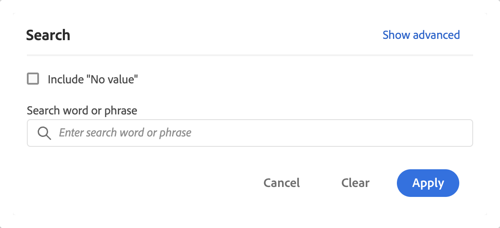

# Filtrado y ordenación de tablas de forma libre

Las tablas de forma libre en Analysis Workspace son la base del análisis interactivo de datos. Como tal, pueden contener miles de filas de información. Filtrar y ordenar los datos puede ser una parte fundamental para que la información más importante aparezca de forma eficaz.

<!--The following video covers filter and sort options in Analysis Workspace, in addition to pagination options:

>[!VIDEO](https://video.tv.adobe.com/v/327344?captions=spa)-->

## Filtrado de tablas

Los filtros de Analysis Workspace le ayudan a mostrar la información más importante.

>[!NOTE]
>
> Solo se pueden filtrar los elementos de dimensión dinámicos como se describe en esta sección. Los elementos de dimensión estáticos no se pueden filtrar. Para obtener más información, consulte [Elementos de dimensión dinámicos o estáticos en tablas de forma libre](/help/analysis-workspace/visualizations/freeform-table/column-row-settings/manual-vs-dynamic-rows.md).

Puede utilizar varios métodos para filtrar filas de una tabla de forma libre.

- Excluir filas específicas de una tabla
- Aplicar filtros a una tabla
- Usar segmentos de público

Asegúrese de leer cómo afecta cada método a los [Totales de tablas de forma libre](/help/analysis-workspace/visualizations/freeform-table/workspace-totals.md).

### Excluir filas específicas de una tabla

Puede excluir rápidamente filas específicas de la tabla sin necesidad de usar  **[!UICONTROL Filtro]**.

>[!NOTE]
>
>Cuando excluye filas como se describe en esta sección, se añade automáticamente una regla [!UICONTROL Excluir artículos siempre] en el cuadro de diálogo de filtro [!UICONTROL Avanzado]. Para ver la regla aplicada, seleccione el icono  Filtro y a continuación, [**[!UICONTROL Mostrar avanzado]**](#apply-a-simple-or-advanced-filter-to-a-table).

Para excluir filas específicas de una tabla de forma libre:

1. Pase el puntero por encima de la fila que quiera excluir y a continuación, seleccione .

   Mantenga presionado ***mayús*** para seleccionar un rango de filas, o bien mantenga presionada la tecla ***cmd*** (en Mac) o la tecla ***ctrl*** (en Windows) para seleccionar varias filas.

<!--### Right-click > Delete selected rows

Note: this option does not seem to work. AN-338422

1. Select 1 or more rows. 
1. Right-click and select **[!UICONTROL Delete Selected Rows]**. 

   This action will remove the rows from the table and apply a table filter.-->

### Aplicar un filtro simple o avanzado a una tabla

Para filtrar datos en tablas de forma libre:

1. Pase el puntero por encima de la columna que contiene los datos que desea filtrar. <!--only some types of columns show the filter... Which? Just Dimensions?-->

1. Seleccione el icono de  **Filtro** cuando aparezca.

   

   Las siguientes opciones están disponibles en el cuadro de diálogo **[!UICONTROL Búsqueda]**:

   {width="500"}

   | Opción | Función |
   |---------|----------|
   | [!UICONTROL **Incluir “Sin valor”**] | Seleccione esta opción para mostrar una fila **[!UICONTROL Sin valor]** en la tabla para los datos que no tengan ningún valor para la dimensión seleccionada. Desmarque esta opción para ocultar la fila **[!UICONTROL Sin valor]**. |
   | [!UICONTROL **Palabra o frase de búsqueda**] | Especifique una palabra o frase por la que desee filtrar. Solo se muestran las filas que contienen la palabra o la frase exacta especificada. |

1. (Opcional) Para filtrar por diferentes criterios o por varios criterios, seleccione [!UICONTROL **Mostrar avanzadas**].

   Las opciones de filtro avanzado disponibles son las siguientes:

   {width=500}

   | Opción | Función |
   |---------|----------|
   | [!UICONTROL **Incluir “Sin valor”**] | Seleccione esta opción para mostrar una fila **[!UICONTROL Sin valor]** en la tabla para los datos que no tengan ningún valor para la dimensión seleccionada. Desmarque esta opción para ocultar la fila **[!UICONTROL Sin valor]**. |
   | [!UICONTROL **Coincidencias**] | Seleccione [!UICONTROL **Si se cumplen todos los criterios**] para mostrar solo los datos que cumplan todos los criterios especificados. Esta opción suele dar como resultado datos más precisos.  Seleccione [!UICONTROL **Si se cumple alguno de los criterios**] para mostrar los datos que cumplen cualquiera de los criterios de filtro especificados. Esta opción suele dar como resultado datos menos precisos. |
   | [!UICONTROL **Criterios**] | Seleccione entre las siguientes opciones de filtro: <ul><li>[!UICONTROL **Contiene la frase**] (valor predeterminado): solo los datos que contienen la frase exacta que especifique se incluirán en los resultados filtrados. Las palabras deben estar en el orden especificado en el [!UICONTROL **campo Buscar palabra o frase**].</li><li>[!UICONTROL **Contiene cualquier término**]: en los resultados filtrados solo se incluyen los datos que contienen una o más palabras de la frase especificada. </li><li>[!UICONTROL **Contiene todos los términos**]: en los resultados filtrados solo se incluyen los datos que contienen todas las palabras de la frase especificada. Las palabras no tienen que estar en el orden especificado en el [!UICONTROL **campo Buscar palabra o frase**].</li><li>[!UICONTROL **No contiene ningún término**]: en los resultados filtrados solo se incluyen los datos que no contienen ninguna de las palabras de la frase especificada. </li><li>[!UICONTROL **No contiene la frase**]: en los resultados filtrados solo se incluyen los datos que no contienen la frase exacta especificada. Las palabras deben estar en el orden especificado en el [!UICONTROL **campo Buscar palabra o frase**].</li><li>[!UICONTROL **Es igual a**]: en los resultados filtrados solo se incluyen los datos que coinciden exactamente con la frase especificada. </li><li>[!UICONTROL **No es igual a**]: en los resultados filtrados solo se incluyen los datos que no coinciden exactamente con la frase especificada. </li><li>[!UICONTROL **Comienza con**]: en los resultados filtrados solo se incluyen los datos que comienzan con la palabra o frase exacta que especifique. </li><li>[!UICONTROL **Finaliza con**]: en los resultados filtrados solo se incluyen los datos que terminan con la palabra o frase exacta que especifique. </li></ul>Seleccione  [!UICONTROL **Añadir fila**] para añadir varios criterios de filtro. La opción que seleccione para [!UICONTROL **Coincidencia**] determina **[!UICONTROL Si se cumplen todos los criterios]** o **[!UICONTROL Si se cumple alguno de los criterios]**. |
   | [!UICONTROL **Excluir artículos siempre**] | Especifique el nombre de cualquier elemento que desee excluir de los datos filtrados. |

1. Seleccione **[!UICONTROL Aplicar]** para filtrar los datos. Seleccione **[!UICONTROL Borrar]** para borrar todos los campos de entrada. Seleccione **[!UICONTROL Cancelar]** para cancelar y cerrar el cuadro de diálogo.  Un icono  **Filtro** de color indica y muestra detalles cuando se aplica un filtro a la tabla.

### Usar segmentos de público

Consulte [Resumen de segmentación](/help/components/segments/seg-overview.md) para obtener más información.

## Orden de tablas

Puede ordenar los datos de una tabla de forma libre según cualquier columna de Analysis Workspace que sea una dimensión o una métrica. Una flecha indica cómo se ordenan los datos (**↓** para descendente o **↑** para ascendente).

