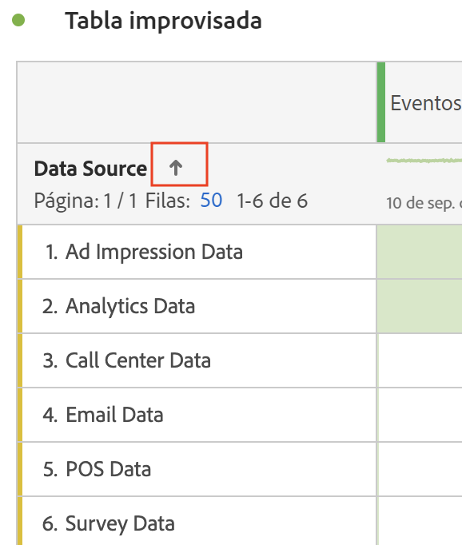

# Filtrado y ordenación de tablas

Las tablas de forma libre en Analysis Workspace son la base del análisis interactivo de datos. Como tal, pueden contener miles de filas de información. Filtrar y ordenar los datos puede ser una parte fundamental para que la información más importante aparezca de forma eficaz.

<!--The following video covers filter and sort options in Analysis Workspace, in addition to pagination options:

>[!VIDEO](https://video.tv.adobe.com/v/23968)-->

## Filtrado de tablas {#section_36E92E31442B4EBCB052073590C1F025}

Los filtros de Analysis Workspace le ayudan a mostrar la información más importante.

>[!NOTE]
>
> Solo se pueden filtrar los elementos de dimensión dinámicos como se describe en esta sección. Los elementos de dimensión estáticos no se pueden filtrar. Para obtener más información, consulte [Elementos de dimensión dinámicos o estáticos en tablas improvisadas](/help/analysis-workspace/visualizations/freeform-table/column-row-settings/manual-vs-dynamic-rows.md).

### Excluir rápidamente filas específicas de una tabla

Puede excluir rápidamente filas específicas de la tabla sin tener que abrir el cuadro de diálogo Filtro .

>[!NOTE]
>
>Cuando excluye filas como se describe en esta sección, una [!UICONTROL **Excluir siempre elementos**] se aplica automáticamente en el cuadro de diálogo de filtro avanzado. (Puede ver la regla aplicada seleccionando el icono Filtro y, a continuación, [**[!UICONTROL Mostrar avanzado]**](#apply-a-simple-or-advanced-filter-to-a-table).)

Para excluir rápidamente filas específicas de una tabla improvisada:

1. Pase el ratón sobre la fila que quiera excluir y, a continuación, seleccione el icono x .

   Mantenga pulsada la tecla Mayús para seleccionar un rango de filas o mantenga pulsada la tecla Comando (en Mac) o la tecla Ctrl (en Windows) para seleccionar varias filas.

### Aplicar un filtro simple o avanzado a una tabla

Para filtrar datos en tablas de forma libre:

1. Pase el ratón sobre la columna que contiene los datos que desea filtrar. <!--only some types of columns show the filter... Which? Just Dimensions?-->

1. Seleccione el icono de **Filtro** cuando aparezca.

   

   Las opciones disponibles son las siguientes:

   | Opción | Función |
   |---------|----------|
   | [!UICONTROL **Palabra o frase de búsqueda**] | Especifique una palabra o frase por la que desee filtrar. Solo se muestran las filas que contienen la palabra o la frase exacta especificada. |
   | [!UICONTROL **Incluir no especificado (ninguno)**] | Seleccione esta opción para mostrar los datos de la tabla que no estén dentro de ninguna de sus dimensiones. <!--what is this?--> |

1. (Opcional) Para filtrar por diferentes criterios o por varios criterios, seleccione [!UICONTROL **Mostrar avanzadas**].

   Las opciones disponibles son las siguientes

   | Opción | Función |
   |---------|----------|
   | [!UICONTROL **Incluir no especificado (ninguno)**] | Seleccione esta opción para mostrar los datos de la tabla que no estén dentro de ninguna de sus dimensiones. <!--what is this?--> |
   | [!UICONTROL **Coincidencias**] | 
Seleccione [!UICONTROL **Si se cumplen todos los criterios**] para mostrar solo los datos que cumplan todos los criterios especificados. Esta opción suele dar como resultado datos más precisos.
 
Seleccione [!UICONTROL **Si se cumplen algunos criterios**] para mostrar los datos que cumplan cualquiera de los criterios de filtro especificados. Esta opción suele dar como resultado datos menos precisos.
 |
   | [!UICONTROL **Criterios**] | 
Seleccione entre las siguientes opciones de filtro:

(Seleccione [!UICONTROL **Agregar fila**] para añadir varios criterios de filtro. La opción que seleccione en la sección [!UICONTROL **Coincidencia**] determina si se deben cumplir todos o cualquiera de los criterios agregados).
<ul><li>
[!UICONTROL **Contiene la frase**]: en los resultados filtrados solo se incluyen los datos que contienen la frase exacta especificada. Las palabras deben estar en el orden especificado en el [!UICONTROL **campo Buscar palabra o frase**].
Esta es la configuración predeterminada al realizar una búsqueda simple.

</li><li>
[!UICONTROL **Contiene cualquier término**]: en los resultados filtrados solo se incluyen los datos que contienen una o más palabras de la frase especificada. 
</li><li>
[!UICONTROL **Contiene todos los términos**]: en los resultados filtrados solo se incluyen los datos que contienen todas las palabras de la frase especificada. Las palabras no tienen que estar en el orden especificado en el [!UICONTROL **campo Buscar palabra o frase**].
</li><li>
[!UICONTROL **No contiene ningún término**]: en los resultados filtrados solo se incluyen los datos que no contienen ninguna de las palabras de la frase especificada. 
</li><li>
[!UICONTROL **No contiene la frase**]: en los resultados filtrados solo se incluyen los datos que no contienen la frase exacta especificada. Las palabras deben estar en el orden especificado en el [!UICONTROL **campo Buscar palabra o frase**].
</li><li>
[!UICONTROL **Es igual a**]: en los resultados filtrados solo se incluyen los datos que coinciden exactamente con la frase especificada. 
</li><li>
[!UICONTROL **No es igual a**]: en los resultados filtrados solo se incluyen los datos que no coinciden exactamente con la frase especificada. 
</li><li>
[!UICONTROL **Comienza con**]: en los resultados filtrados solo se incluyen los datos que comienzan con la palabra o frase exacta que especifique. 
</li><li>
[!UICONTROL **Finaliza con**]: en los resultados filtrados solo se incluyen los datos que terminan con la palabra o frase exacta que especifique. 
</li></ul> |
   | [!UICONTROL **Excluir artículos siempre**] | Especifique el nombre de cualquier elemento que desee excluir de los datos filtrados. |

1. Seleccione [!UICONTROL **Aplicar**] para filtrar los datos.

   El icono de **filtro** de la  se vuelve azul cuando se aplica un filtro a la tabla.

## Ordenar tablas

Puede ordenar los datos de una tabla de forma libre según cualquier columna de Analysis Workspace que sea Dimensión o Métrica.

El icono de flecha hacia abajo en la  es visible en el encabezado de la columna por la que se ordenan actualmente los datos.

1. En cualquier tabla de forma libre de Analysis Workspace, haga clic en la flecha situada junto al nombre de la dimensión o métrica.

   Tenga en cuenta lo siguiente al ordenar:

   * La flecha hacia abajo ordena en orden de bajada y la flecha hacia arriba (predeterminada) lo hace en orden de subida.
   * Puede ordenar las dimensiones de manera alfabética o numérica. Por ejemplo, es posible que haya numerado los pasos de un flujo de trabajo y que desee ordenarlos por el número de paso. Puede ordenar una dimensión relacionada con la fecha por fecha. Asimismo, puede ordenar las fuentes de datos alfabéticamente como en la imagen siguiente.

   

