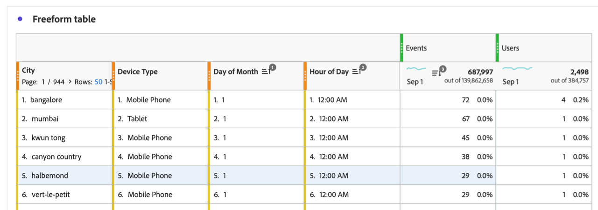

# Filtrado y ordenación de tablas de forma libre

Las tablas de forma libre en Analysis Workspace son la base del análisis interactivo de datos. Como tal, pueden contener miles de filas de información. Filtrar y ordenar los datos puede ser una parte fundamental para que la información más importante aparezca de forma eficaz.

## Filtrado de tablas

Los filtros de Analysis Workspace le ayudan a mostrar la información más importante.

>[!NOTE]
>
> Solo se pueden filtrar los elementos de dimensión dinámicos como se describe en esta sección. Los elementos de dimensión estáticos no se pueden filtrar. Para obtener más información, consulte [Elementos de dimensión dinámicos o estáticos en tablas de forma libre](/help/analysis-workspace/visualizations/freeform-table/column-row-settings/manual-vs-dynamic-rows.md).

Puede utilizar varios métodos para filtrar filas de una tabla de forma libre.

* Excluir filas específicas de una tabla
* Aplicar filtros a una tabla
* Usar segmentos de público

Asegúrese de leer cómo afecta cada método a [totales de tabla de forma libre](/help/analysis-workspace/visualizations/freeform-table/workspace-totals.md).

### Excluir filas específicas de una tabla

Puede excluir rápidamente filas específicas de la tabla sin necesidad de usar  **[!UICONTROL Filtro]**.

>[!NOTE]
>
>Cuando excluye filas como se describe en esta sección, se añade automáticamente una regla [!UICONTROL Excluir artículos siempre] en el cuadro de diálogo de filtro [!UICONTROL Avanzado]. Para ver la regla aplicada, seleccione el icono  Filtro y a continuación, [**[!UICONTROL Mostrar avanzado]**](#apply-a-simple-or-advanced-filter-to-a-table).

Para excluir filas específicas de una tabla de forma libre:

1. Pase el puntero por encima de la fila que quiera excluir y a continuación, seleccione .

   Mantenga presionada la tecla ***Mayús*** para seleccionar un rango de filas, o bien mantenga presionada la tecla ***Comando*** (en Mac) o la tecla ***Ctrl*** (en Windows) para seleccionar varias filas.

<!--### Right-click > Delete selected rows

Note: this option does not seem to work. AN-338422

1. Select 1 or more rows. 
1. Right-click and select **[!UICONTROL Delete Selected Rows]**. 

   This action will remove the rows from the table and apply a table filter.-->

### Aplicación de filtros simples o avanzados a una tabla

Para filtrar datos en tablas de forma libre:

1. Pase el puntero por encima de la columna que contiene los datos que desea filtrar. <!--only some types of columns show the filter... Which? Just Dimensions?-->

1. Seleccione el icono de  **Filtro** cuando aparezca.

   

   Las siguientes opciones están disponibles en el cuadro de diálogo **[!UICONTROL Búsqueda]**:

   {width="500"}

   | Opción | Función |
   |---------|----------|
   | [!UICONTROL **Incluir “Sin valor”**] | Seleccione esta opción para mostrar una fila **[!UICONTROL Sin valor]** en la tabla para los datos que no tengan ningún valor para la dimensión seleccionada. Anule la selección de esta opción para ocultar las **[!UICONTROL filas sin valor]**.<!-- Add at multi dim GA: When tables include multiple dimension columns, you can deselect this option to show data only when it applies to each dimension column in the table.--> |
   | [!UICONTROL **Palabra o frase de búsqueda**] | Especifique una palabra o frase por la que desee filtrar. Solo se muestran las filas que contienen la palabra o la frase exacta especificada. |

1. (Opcional) Para filtrar por diferentes criterios o por varios criterios, seleccione [!UICONTROL **Mostrar avanzadas**].

   Las opciones de filtro avanzado disponibles son las siguientes:

   {width=500}

   | Opción | Función |
   |---------|----------|
   | [!UICONTROL **Incluir “Sin valor”**] | Seleccione esta opción para mostrar una fila **[!UICONTROL Sin valor]** en la tabla para los datos que no tengan ningún valor para la dimensión seleccionada. Anule la selección de esta opción para ocultar la fila **[!UICONTROL Sin valor]**. |
   | [!UICONTROL **Coincidencias**] | Seleccione [!UICONTROL **Si se cumplen todos los criterios**] para mostrar solo los datos que cumplan todos los criterios especificados. Esta opción suele dar como resultado datos más precisos.  Seleccione [!UICONTROL **Si se cumple alguno de los criterios**] para mostrar los datos que cumplen cualquiera de los criterios de filtro especificados. Esta opción suele dar como resultado datos menos precisos. |
   | [!UICONTROL **Criterios**] | Seleccione entre las siguientes opciones de filtro: <ul><li>[!UICONTROL **Contiene la frase**] (valor predeterminado): solo los datos que contienen la frase exacta que especifique se incluirán en los resultados filtrados. Las palabras deben estar en el orden especificado en el [!UICONTROL **campo Buscar palabra o frase**].</li><li>[!UICONTROL **Contiene cualquier término**]: en los resultados filtrados solo se incluyen los datos que contienen una o más palabras de la frase especificada. </li><li>[!UICONTROL **Contiene todos los términos**]: en los resultados filtrados solo se incluyen los datos que contienen todas las palabras de la frase especificada. Las palabras no tienen que estar en el orden especificado en el [!UICONTROL **campo Buscar palabra o frase**].</li><li>[!UICONTROL **No contiene ningún término**]: en los resultados filtrados solo se incluyen los datos que no contienen ninguna de las palabras de la frase especificada. </li><li>[!UICONTROL **No contiene la frase**]: en los resultados filtrados solo se incluyen los datos que no contienen la frase exacta especificada. Las palabras deben estar en el orden especificado en el [!UICONTROL **campo Buscar palabra o frase**].</li><li>[!UICONTROL **Es igual a**]: en los resultados filtrados solo se incluyen los datos que coinciden exactamente con la frase especificada. </li><li>[!UICONTROL **No es igual a**]: en los resultados filtrados solo se incluyen los datos que no coinciden exactamente con la frase especificada. </li><li>[!UICONTROL **Comienza con**]: en los resultados filtrados solo se incluyen los datos que comienzan con la palabra o frase exacta que especifique. </li><li>[!UICONTROL **Finaliza con**]: en los resultados filtrados solo se incluyen los datos que terminan con la palabra o frase exacta que especifique. </li></ul>Seleccione  [!UICONTROL **Añadir fila**] para añadir varios criterios de filtro. La opción que seleccione para [!UICONTROL **Coincidencia**] determina **[!UICONTROL Si se cumplen todos los criterios]** o **[!UICONTROL Si se cumple alguno de los criterios]**. |
   | [!UICONTROL **Excluir artículos siempre**] | Especifique el nombre de cualquier elemento que desee excluir de los datos filtrados. |

1. Seleccione **[!UICONTROL Aplicar]** para filtrar los datos. Seleccione **[!UICONTROL Borrar]** para borrar todos los campos de entrada. Seleccione **[!UICONTROL Cancelar]** para cancelar y cerrar el cuadro de diálogo.  Un icono  **Filtro** de color indica y muestra detalles cuando se aplica un filtro a la tabla.

### Incluya criterios de filtro en los datos de tendencias en los minigráficos y las visualizaciones de líneas {#include-filter-criteria}

Cualquier criterio de filtro de búsqueda aplicado a la dimensión de tabla de una tabla de forma libre se incluye siempre en los minigráficos.

Además de los minigráficos, puede configurar criterios de filtro para que se incluyan en las visualizaciones de líneas conectadas. (De forma predeterminada, los criterios de filtro no se incluyen en las visualizaciones de líneas. Las visualizaciones de líneas muestran datos para la fila seleccionada en la tabla conectada. Si no se selecciona ninguna fila, sólo se muestran los datos de la primera dimensión de la tabla conectada.)

Para obtener más información sobre minigráficos y visualizaciones de líneas, consulte [Ver datos de tendencias de una tabla de forma libre](/help/analysis-workspace/visualizations/freeform-table/freeform-table-trended-data.md).

#### Configurar visualizaciones de líneas para incluir criterios de filtro

1. Seleccione el minigráfico en el encabezado de la columna de métrica.

   Cuando se selecciona la celda del minigráfico, aparece en gris oscuro. Esto indica que los criterios de filtro se incluyen en la visualización de línea conectada. Los criterios de filtro se aplican como un segmento en la columna. <!--show how to see it? Show what the segment looks like when it's applied? -->

   

#### Comprender cuándo los totales de columna pueden ser inexactos

Es posible que los totales de columna no sean exactos en los siguientes casos:

* Cuando se usan componentes estáticos en la columna izquierda y los totales de [columna se calculan como una suma de las filas](/help/analysis-workspace/visualizations/freeform-table/column-row-settings/table-settings.md)

  Si los elementos de fila contienen datos superpuestos en este escenario, los totales de columna serán inexactos.

  Por ejemplo, si agrega segmentos estáticos a la columna izquierda y, a continuación, agrega Usuarios como métrica en la columna derecha, algunos de esos usuarios podrían formar parte de más de un segmento estático. En este caso, Workspace no anula la duplicación de los usuarios para cada segmento estático. Esto puede aumentar el número total de usuarios, ya que algunos se pueden contar más de una vez.

* Al utilizar dimensiones de varios valores

>[!NOTE]
>
>El minigráfico y el gráfico de líneas siguen mostrando los totales exactos en estos casos.

### Usar segmentos de público

Consulte [Resumen de segmentación](/help/components/segments/seg-overview.md) para obtener más información.

## Orden de tablas

En Analysis Workspace, puede ordenar los datos de una tabla de forma libre por cualquier columna, ya sean dimensiones o métricas. Incluso puede ordenar por varias columnas al mismo tiempo.

De forma predeterminada, las dimensiones se ordenan en orden ascendente, mientras que las métricas se ordenan en orden descendente.

### Ordenar tablas por una sola columna

Al ordenar los datos de una sola columna como se describe en esta sección, se quitará cualquier [ordenación avanzada](#sort-tables-by-multiple-columns-advanced-sorting) que se haya aplicado a la tabla.

Para ordenar los datos de las tablas por una sola columna:

1. Pase el cursor sobre el encabezado de la columna que quiera ordenar y, a continuación, seleccione el icono **Ordenar**  cuando aparezca.

   

1. Seleccione **[!UICONTROL Ascendente]** o **[!UICONTROL Descendente]**.

   El icono de ordenación permanece visible cuando se aplica la ordenación a la columna. Una flecha indica cómo se ordenan los datos ( en orden ascendente o  en orden descendente).

### Ordenar tablas por varias columnas (ordenación avanzada)

{{release-limited-testing-section}}

#### Aplicar la ordenación a varias columnas

Para ordenar los datos de las tablas por varias columnas:

1. Pase el cursor sobre el encabezado de cualquier columna que desee ordenar y, a continuación, seleccione el icono **Ordenar**  cuando aparezca.

   

1. Seleccione **[!UICONTROL Clasificación avanzada]**.

   

1. En el cuadro de diálogo Ordenación avanzada, realice una de las siguientes acciones:

   * Agregue columnas que aún no se estén ordenando seleccionando el botón **[!UICONTROL Agregar columna de ordenación]**.

   * Elimine las columnas que ya no desee ordenar seleccionando el icono **Quitar** .

   * Arrastre las columnas hacia arriba o hacia abajo en la lista para ajustar la prioridad de ordenación.

     Para obtener más información, consulte [Ordenar prioridad](#sort-priority).

   * Cambie el valor de ordenación seleccionando **[!UICONTROL Ascendente]** o **[!UICONTROL Descendente]** en el menú desplegable.

   * Seleccione una columna diferente seleccionando el menú desplegable de nombre de columna.

1. Seleccione **[!UICONTROL Aplicar]**.

El icono de ordenación permanece visible cuando se aplica la ordenación a una columna. Una flecha indica cómo se ordenan los datos ( en orden ascendente o  en orden descendente).

#### Prioridad de ordenación

Al ordenar los datos de varias columnas, los datos se ordenan según la prioridad asignada a cada columna. La numeración de prioridades se muestra junto al icono de ordenación ➊.

La columna con prioridad principal decide el orden principal; la columna con prioridad secundaria decide el orden cuando las filas tienen el mismo valor en la columna principal; la columna con prioridad terciaria decide el orden cuando las filas tienen el mismo valor en las columnas principal y secundaria; y así sucesivamente.

Por ejemplo, considere una tabla con las siguientes columnas:

* Día del mes (dimensión)

* Hora del día (dimensión)

* Eventos (métrica)

Puede asignar una prioridad de ordenación a cada columna de la siguiente manera:

| Nombre de la columna (componente) | Tipo de componente | Prioridad de ordenación |
|---------|----------|---------|
| Día del mes | Dimensión | 1 |
| Hora del día | Dimensión | 2 |
| Eventos | Métrica | 3 |

Al asignar una prioridad de ordenación a cada columna, puede controlar exactamente cómo se muestran los datos en la tabla. En este ejemplo, la información se ordena primero por Día del mes, después por Hora del día y, por último, por Eventos.

