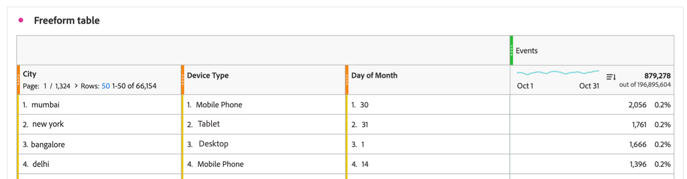
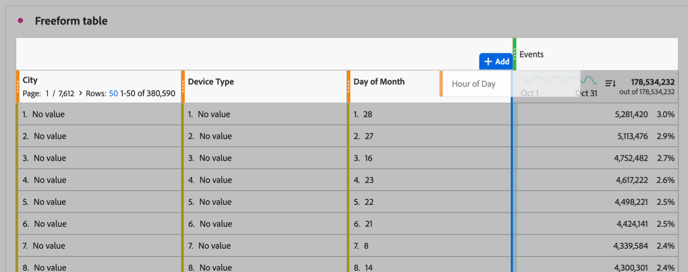
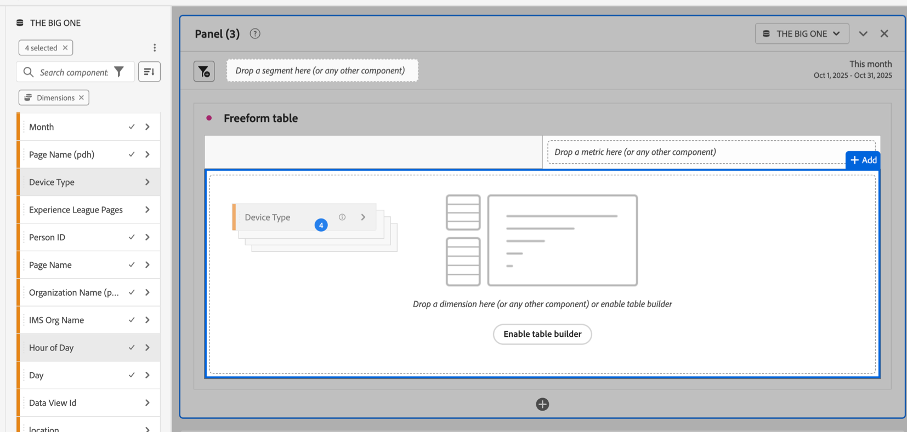
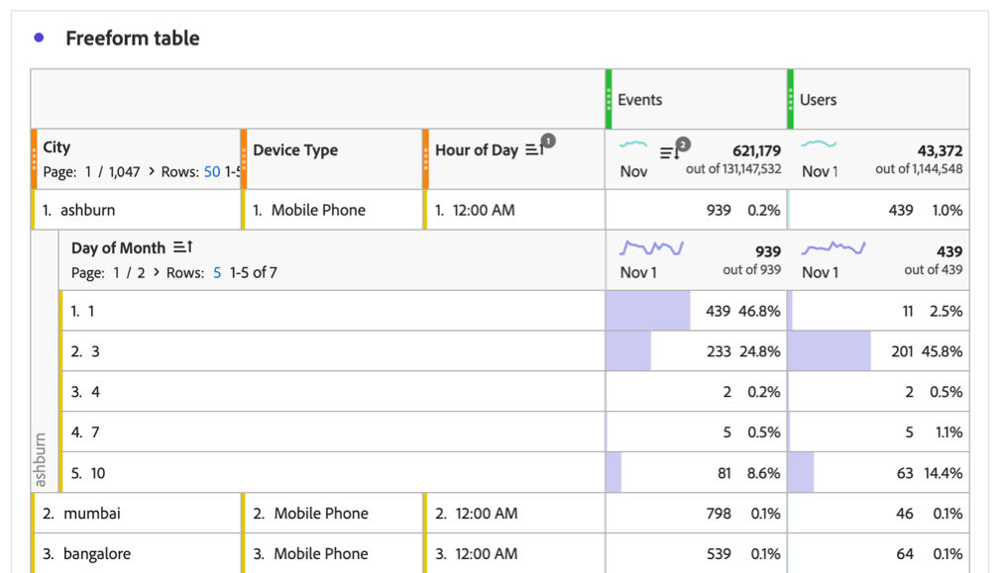

# Incluir varias columnas de dimensión en una tabla de forma libre

{{release-limited-testing}}

Puede incluir hasta 5 columnas de dimensión en una tabla de forma libre, lo que le permite ver varios elementos de dimensión en paralelo. Cada fila de elementos de dimensión se comporta como un solo elemento de dimensión concatenado.

Puede aplicar filtros, clasificaciones, desgloses y mucho más a las tablas de forma libre con varias columnas de dimensión para crear un análisis más profundo y personalizado.

## Elementos de dimensión concatenados

Cuando [agrega varias columnas de dimensión a una tabla de forma libre](#add-multiple-dimension-columns), cada fila de elementos de dimensión se comporta como un solo elemento de dimensión concatenado. Esta funcionalidad le permite ver datos de métricas para combinaciones específicas de dimensiones.

Por ejemplo, considere una tabla de forma libre en la que las columnas de dimensión son _Ciudad_, _Tipo de dispositivo_ y _Día del mes_, y la métrica es _Eventos_. Los 3 elementos de dimensión de la primera fila de esta tabla se convierten en un solo elemento de dimensión concatenado que muestra que hubo 2056 eventos que tuvieron lugar en Mumbai desde teléfonos móviles el día 30 del mes.

| Dimension: City | Dimension: Tipo de dispositivo | Dimension: Día del mes | Métrica: Eventos |
|---------|----------|---------|---------|
| Bombay | Teléfono móvil | 30 | 2.056 |
| Nueva York | Tableta | 31 | 1.761 |
| Bangalore | Escritorio | 1 | 1.666 |
| Delhi | Teléfono móvil | 14 | 1.396 |

A continuación, se muestra cómo aparece esta tabla en Analysis Workspace:

## Adición de varias columnas de dimensión

Puede agregar varias columnas de dimensión de una en una o de forma masiva.

1. En Analysis Workspace, cree una tabla de forma libre.

   Para obtener más información, consulte [Agregar visualizaciones a un panel](/help/analysis-workspace/visualizations/freeform-analysis-visualizations.md#add-visualizations-to-a-panel) en [Información general sobre visualizaciones](/help/analysis-workspace/visualizations/freeform-analysis-visualizations.md).

1. Añada dimensiones a la tabla de forma libre. Puede agregar dimensiones de una en una o puede agregar varias dimensiones a la vez.

   * Arrastre las dimensiones de una en una a la tabla de forma libre. Coloque columnas de dimensión adicionales a la izquierda o a la derecha de columnas de dimensión existentes en la tabla. Se muestra una línea **[!UICONTROL Add]** vertical azul donde se creará la nueva columna.

     

   * Seleccione hasta 5 dimensiones en el menú de componentes y arrástrelas a la tabla de forma libre. Las dimensiones se añaden a la tabla de izquierda a derecha en el orden en que se seleccionan.

     Para seleccionar varias dimensiones, mantenga presionada la tecla ***Comando*** (en Mac) o la tecla ***Ctrl*** (en Windows).

     

1. Ver cada fila de la tabla como un solo elemento de dimensión. Para obtener más información, consulte [Elementos de dimensión concatenados](#concatenated-dimension-items).

## Filtrado y ordenación de tablas

Puede aplicar el filtrado y la ordenación a las columnas de una tabla de forma libre. Puede ordenar los datos de una tabla de forma libre por cualquier columna, ya sean dimensiones o métricas. Incluso puede ordenar por varias columnas al mismo tiempo.

Para obtener más información, consulte [Filtrar y ordenar tablas improvisadas](/help/analysis-workspace/visualizations/freeform-table/filter-and-sort.md).

## Varias columnas y desgloses de dimensión

Analysis Workspace proporciona las siguientes formas de agregar varias dimensiones dentro de una tabla de forma libre:

* Incluya varias columnas de dimensión (como se describe en este artículo)

* [Agregar desgloses](/help/components/dimensions/t-breakdown-fa.md)

Ambos métodos permiten analizar dimensiones con respecto a otras dimensiones. Sin embargo, existen diferencias importantes y ambos métodos se pueden utilizar en la misma tabla para un análisis aún más profundo.

### Diferencias entre columnas de dimensión y desgloses

Varias columnas de dimensión permiten:

* Concatenar elementos de dimensión en distintas filas de datos en varias dimensiones.

* Incluya elementos de dimensión en filas concatenadas solo cuando los elementos de dimensión se apliquen a cada columna de dimensión de la tabla. Para ello, use el filtro de columna para anular la selección de la configuración **[!UICONTROL Incluir &quot;Sin valor&quot;]** en cada columna de dimensión.

  Para obtener más información, vea [Ordenar tablas por varias columnas (Ordenación avanzada)](#sort-tables-by-multiple-columns-advanced-sorting).

* Ordene los datos por varias columnas de dimensiones y métricas para ver datos más personalizados.

  Para obtener más información, vea [Ordenar tablas por varias columnas (Ordenación avanzada)](#sort-tables-by-multiple-columns-advanced-sorting)

Los desgloses le permiten:

* Desglose un elemento de dimensión de la tabla de forma libre por una dimensión secundaria. Puede mostrar hasta 400 elementos de dimensión para la dimensión secundaria.

### Adición de desgloses a una tabla con varias columnas de dimensión

Cuando se agrega un desglose a una tabla que tiene varias columnas de dimensión, el desglose se aplica al elemento de dimensión concatenado (en todas las columnas de dimensión) en la fila donde se agrega.

Además, puede añadir varias columnas de dimensión dentro de un desglose. Cada fila de elementos de dimensión dentro del desglose también se comporta como un solo elemento de dimensión concatenado.

<!-- Add a screenshot of a breakdown with multiple cllumns, then add this sentence: "For example, you can break down the first dimension item in this table by a new concatenated dimension item that shows..." -->

Para obtener más información sobre cómo agregar un desglose, consulte [Desglosar dimensiones](/help/components/dimensions/t-breakdown-fa.md).

## Cree un segmento basado en un elemento de dimensión que incluya varias columnas de dimensión

Cuando crea un segmento basado en un elemento de dimensión que abarca varias columnas de dimensión, cada elemento de dimensión se incluye en la definición del segmento, con los operadores Y que se unen a ellos.

Para obtener información sobre cómo crear un segmento, consulte [Crear segmentos](/help/components/segments/seg-create.md).

## Dimensiones y funciones no compatibles {#unsupported}

Las siguientes combinaciones y funciones de dimensión no son compatibles cuando se utilizan varias columnas de dimensión y Analysis Workspace prohíbe su uso o muestra un mensaje de error:

* Varias dimensiones que proceden de campos que hacen referencia a [matrices de objetos](/help/use-cases/object-arrays.md) diferentes que se utilizan juntas en la misma tabla de forma libre.

  Se permiten varias dimensiones juntas en la misma tabla de forma libre si hacen referencia a la misma matriz de objetos.

* [Elementos de dimensión estáticos](/help/analysis-workspace/visualizations/freeform-table/column-row-settings/manual-vs-dynamic-rows.md#static-dimension-items).
