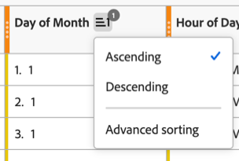
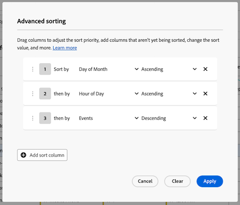
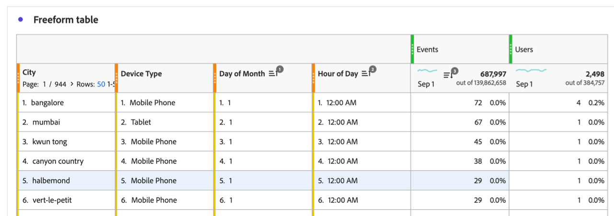

# Incluir varias columnas de dimensión en una tabla de forma libre

{{release-limited-testing}}

Puede incluir hasta 5 columnas de dimensión en una tabla de forma libre, lo que le permite ver varios elementos de dimensión en paralelo. Cada fila de elementos de dimensión se comporta como un solo elemento de dimensión concatenado.

Puede aplicar filtros, clasificaciones, desgloses y mucho más a tablas de forma libre con varias columnas de dimensión para crear un análisis más profundo y personalizado.

## Elementos de dimensión concatenados

Cuando se agregan varias columnas de dimensión a una tabla de forma libre, cada fila de elementos de dimensión se comporta como un solo elemento de dimensión concatenado. Esta funcionalidad le permite ver datos de métricas para combinaciones específicas de dimensiones.

Por ejemplo, imagine una tabla de forma libre en la que las dimensiones son _Ciudad_, _Tipo de dispositivo_ y _Día del mes_ y la métrica es _Eventos_. Los 3 elementos de dimensión de la primera fila de esta tabla se convierten en un solo elemento de dimensión concatenado que muestra que hubo 2056 eventos que tuvieron lugar en Mumbai desde teléfonos móviles el día 30 del mes.

| Dimension: City | Dimension: Tipo de dispositivo | Dimension: Día del mes | Métrica: Eventos |
|---------|----------|---------|---------|
| Bombay | Teléfono móvil | 30 | 2.056 |
| Nueva York | Tableta | 31 | 1.761 |
| Bangalore | Escritorio | 1 | 1.666 |
| Delhi | Teléfono móvil | 14 | 1.396 |

A continuación, se muestra cómo aparece esta tabla en Analysis Workspace:

## Adición de varias columnas de dimensión

Puede agregar varias columnas de dimensión de una en una o de forma masiva.

1. En Analysis Workspace, cree una tabla de forma libre.

   Para obtener más información, consulte [Agregar visualizaciones a un panel](/help/analysis-workspace/visualizations/freeform-analysis-visualizations.md#add-visualizations-to-a-panel) en [Información general sobre visualizaciones](/help/analysis-workspace/visualizations/freeform-analysis-visualizations.md).

1. Añada dimensiones a la tabla de forma libre. Puede agregar dimensiones de una en una o puede agregar varias dimensiones a la vez.

   * Arrastre las dimensiones de una en una a la tabla de forma libre. Coloque columnas de dimensión adicionales a la izquierda o a la derecha de columnas de dimensión existentes en la tabla. Se muestra una línea **[!UICONTROL Add]** vertical azul donde se creará la nueva columna.

     

   * Seleccione hasta 5 dimensiones en el menú de componentes y arrástrelas a la tabla de forma libre. Las dimensiones se añaden a la tabla de izquierda a derecha en el orden en que se seleccionan.

     Para seleccionar varias dimensiones, mantenga presionada la tecla ***Comando*** (en Mac) o la tecla ***Ctrl*** (en Windows).

     

1. Ver cada fila de la tabla como un solo elemento de dimensión. Para obtener más información, consulte [Ver elementos de dimensión concatenados](#view-concatenated-dimension-items).

## Filtrado de tablas

Puede aplicar filtros a una o varias columnas de dimensión de una tabla de forma libre.

Para obtener información sobre el filtrado de tablas, consulte [Filtrar tablas](/help/analysis-workspace/visualizations/freeform-table/filter-and-sort.md#filter-tables) en [Filtrar y ordenar tablas](/help/analysis-workspace/visualizations/freeform-table/filter-and-sort.md).

## Orden de tablas {#sort-tables}

<!--At GA, move this section into the "Filter and sort tables" article and replace the current "Sort tables" section. Change the "Filter tables" section above to "Filter and sort tables" and link to the other article. Also add row to Guardrails -->

Puede ordenar los datos de una tabla de forma libre por cualquier columna de Analysis Workspace, ya sean dimensiones o métricas.

De forma predeterminada, las dimensiones se ordenan en orden ascendente, mientras que las métricas se ordenan en orden descendente.

### Ordenar tablas por una sola columna

Al ordenar los datos de una sola columna como se describe en esta sección, se quitará cualquier [ordenación avanzada](#sort-tables-by-multiple-columns-advanced-sorting) que se haya aplicado a la tabla.

Para ordenar los datos de las tablas por una sola columna:

1. Pase el cursor sobre el encabezado de la columna que quiera ordenar y, a continuación, seleccione el icono **Ordenar**  cuando aparezca.

   

1. Seleccione **[!UICONTROL Ascendente]** o **[!UICONTROL Descendente]**.

   El icono de ordenación permanece visible cuando se aplica la ordenación a la columna. Una flecha indica cómo se ordenan los datos ( en orden ascendente o  en orden descendente).

### Ordenar tablas por varias columnas (ordenación avanzada)

{{release-limited-testing-section}}

#### Aplicar la ordenación a varias columnas

Para ordenar los datos de las tablas por varias columnas:

1. Pase el cursor sobre el encabezado de cualquier columna que desee ordenar y, a continuación, seleccione el icono **Ordenar**  cuando aparezca.

   

1. Seleccione **[!UICONTROL Clasificación avanzada]**.

   

1. En el cuadro de diálogo Ordenación avanzada, realice una de las siguientes acciones:

   * Agregue columnas que aún no se estén ordenando seleccionando el botón **[!UICONTROL Agregar columna de ordenación]**.

   * Elimine las columnas que ya no desee ordenar seleccionando el icono **Quitar** .

   * Arrastre las columnas hacia arriba o hacia abajo en la lista para ajustar la prioridad de ordenación.

     Para obtener más información, consulte [Ordenar prioridad](#sort-priority).

   * Cambie el valor de ordenación seleccionando **[!UICONTROL Ascendente]** o **[!UICONTROL Descendente]** en el menú desplegable.

   * Seleccione una columna diferente seleccionando el menú desplegable de nombre de columna.

1. Seleccione **[!UICONTROL Aplicar]**.

El icono de ordenación permanece visible cuando se aplica la ordenación a una columna. Una flecha indica cómo se ordenan los datos ( en orden ascendente o  en orden descendente).

#### Prioridad de ordenación

Al ordenar los datos de varias columnas, los datos se ordenan según la prioridad asignada a cada columna. La numeración de prioridades se muestra junto al icono de ordenación .

La columna con prioridad principal decide el orden principal; la columna con prioridad secundaria decide el orden cuando las filas tienen el mismo valor en la columna principal; la columna con prioridad terciaria decide el orden cuando las filas tienen el mismo valor en las columnas principal y secundaria; y así sucesivamente.

Por ejemplo, considere una tabla con las siguientes columnas:

* Día del mes (dimensión)

* Hora del día (dimensión)

* Eventos (métrica)

Puede asignar una prioridad de ordenación a cada columna de la siguiente manera:

| Nombre de la columna (componente) | Tipo de componente | Prioridad de ordenación |
|---------|----------|---------|
| Día del mes | Dimensión | 1 |
| Hora del día | Dimensión | 2 |
| Eventos | Métrica | 3 |

Al asignar una prioridad de ordenación a cada columna, puede controlar exactamente cómo se muestran los datos en la tabla. En este ejemplo, la información se ordena primero por Día del mes, después por Hora del día y, por último, por Eventos.

## Varias columnas y desgloses de dimensión

Analysis Workspace proporciona las siguientes formas de agregar varias dimensiones dentro de una tabla de forma libre:

* Incluya varias columnas de dimensión (como se describe en este artículo)

* [Agregar desgloses](/help/components/dimensions/t-breakdown-fa.md)

Ambos métodos permiten analizar dimensiones con respecto a otras dimensiones. Sin embargo, existen diferencias importantes y ambos métodos se pueden utilizar en la misma tabla para un análisis aún más profundo.

### Diferencias entre columnas de dimensión y desgloses

Varias columnas de dimensión permiten:

* Concatenar elementos de dimensión en distintas filas de datos en varias dimensiones.

* Incluya elementos de dimensión en filas concatenadas solo cuando los elementos de dimensión se apliquen a cada columna de dimensión de la tabla. Para ello, use el filtro de columna para anular la selección de la configuración **[!UICONTROL Incluir &quot;Sin valor&quot;]** en cada columna de dimensión.

  Para obtener más información, vea [Ordenar tablas por varias columnas (Ordenación avanzada)](#sort-tables-by-multiple-columns-advanced-sorting).

* Ordene los datos por varias columnas de dimensiones y métricas para ver datos más personalizados.

  Para obtener más información, vea [Ordenar tablas por varias columnas (Ordenación avanzada)](#sort-tables-by-multiple-columns-advanced-sorting)

Los desgloses le permiten:

* Desglose un elemento de dimensión de la tabla de forma libre por una dimensión secundaria. Puede mostrar hasta 200 elementos de dimensión para la dimensión secundaria.

### Adición de desgloses a una tabla con varias columnas de dimensión

Cuando se agrega un desglose a una tabla que tiene varias columnas de dimensión, el desglose se aplica al elemento de dimensión concatenado (en todas las columnas de dimensión) en la fila donde se agrega.

Además, puede añadir varias columnas de dimensión dentro de un desglose. Cada fila de elementos de dimensión dentro del desglose también se comporta como un solo elemento de dimensión concatenado.

<!-- update screenshot to show the breakdown, and include this introductory sentence: "For example, you can break down the first dimension item in this table by a new concatenated dimension item that shows... " -->

Para obtener más información sobre cómo agregar un desglose, consulte [Desglosar dimensiones](/help/components/dimensions/t-breakdown-fa.md).

## Cree un segmento basado en un elemento de dimensión que incluya varias columnas de dimensión

Cuando crea un segmento basado en un elemento de dimensión que abarca varias columnas de dimensión, cada elemento de dimensión se incluye en la definición del segmento, con los operadores Y que se unen a ellos.

Para obtener información sobre cómo crear un segmento, consulte [Crear segmentos](/help/components/segments/seg-create.md).

## Dimensiones no admitidas {#unsupported}

Las siguientes combinaciones de dimensiones no son compatibles y Analysis Workspace prohíbe que se agreguen o muestra un mensaje de error después de agregarlas:

* Varias dimensiones que proceden de campos que hacen referencia a [matrices de objetos](/help/use-cases/object-arrays.md) diferentes que se utilizan juntas en la misma tabla de forma libre.

  Se permiten varias dimensiones juntas en la misma tabla de forma libre si hacen referencia a la misma matriz de objetos.