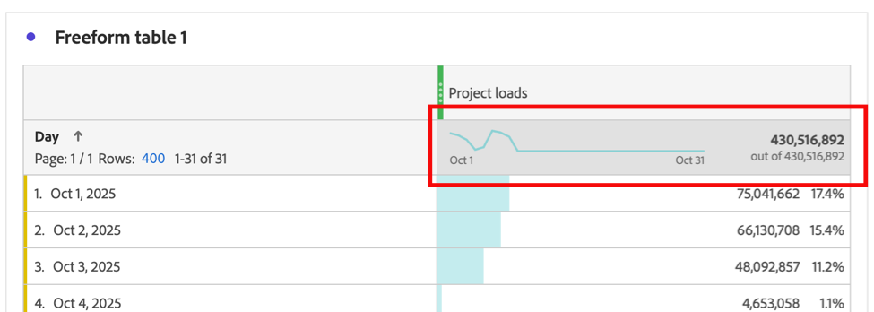

# Visualización de datos de tendencias de una tabla de forma libre

Puede ver la tendencia de los datos que se incluyen en una tabla de forma libre. Estos datos de tendencias se muestran en las siguientes áreas de Analysis Workspace:

* [minigráficos](#use-sparklines-to-view-trended-data)

* [Visualizaciones de líneas](#use-line-visualizations-to-view-trended-data)

## Uso de minigráficos para ver datos de tendencias

Los minigráficos se muestran en el encabezado de columna de métrica de las tablas de forma libre.

Los minigráficos siempre incluyen:

* Datos de tendencias para todos los datos de la columna

* Cualquier criterio de filtro de búsqueda aplicado a la dimensión de tabla.

  Para obtener más información, vea [Filtrar y ordenar](/help/analysis-workspace/visualizations/freeform-table/filter-and-sort.md).

## Uso de visualizaciones de líneas para ver datos de tendencias

Las visualizaciones [Line](/help/analysis-workspace/visualizations/line.md) muestran los datos de la tabla de forma libre a la que están conectadas.

### Conectar una visualización de líneas a una tabla de forma libre

Según cómo y cuándo se añadió la visualización de líneas al proyecto, es posible que ya esté conectada a la tabla de forma libre deseada. Siga estos pasos para marcar o conectar manualmente:

1. Añada una visualización de líneas a un proyecto de Analysis Workspace.

1. Seleccione el punto al lado del nombre de la visualización, seleccione la pestaña **[!UICONTROL Fuente de datos]** y, a continuación, seleccione el nombre de la tabla de forma libre que desea conectar con la visualización de líneas.

   

### Elija los datos que se incluyen en la visualización de líneas

Los datos que se incluyen en la visualización de línea conectada difieren según la celda seleccionada en la tabla de forma libre.

Para ver una tendencia de todos los datos de la tabla de forma libre, seleccione la celda del minigráfico en la tabla de forma libre.

Cuando se selecciona la celda del minigráfico, la celda se muestra en gris oscuro.

Cuando se selecciona la celda del minigráfico de la tabla conectada, las visualizaciones de líneas incluyen:

* Datos de tendencias para todos los datos de la columna

* Cualquier criterio de filtro de búsqueda aplicado a la dimensión de tabla.

  Para obtener más información, vea [Filtrar y ordenar](/help/analysis-workspace/visualizations/freeform-table/filter-and-sort.md).

Cuando no se selecciona el minigráfico de la tabla conectada, las visualizaciones de líneas incluyen:

* Datos de la fila seleccionada en la tabla conectada. Si no se selecciona ninguna fila, solo se muestran los datos de la primera dimensión de la tabla conectada.

* Se ignorará cualquier criterio de filtro de búsqueda aplicado a la dimensión de tabla

  Para obtener más información, vea [Filtrar y ordenar](/help/analysis-workspace/visualizations/freeform-table/filter-and-sort.md).

## Incluir criterios de filtro en visualizaciones de líneas conectadas

Para obtener información sobre cuándo se incluyen los criterios de filtro en las visualizaciones de líneas conectadas, consulte [Incluir criterios de filtro en datos de tendencias en minigráficos y visualizaciones de líneas](/help/analysis-workspace/visualizations/freeform-table/filter-and-sort.md#include-filter-criteria-in-trended-data-in-sparklines-and-line-visualizations)

