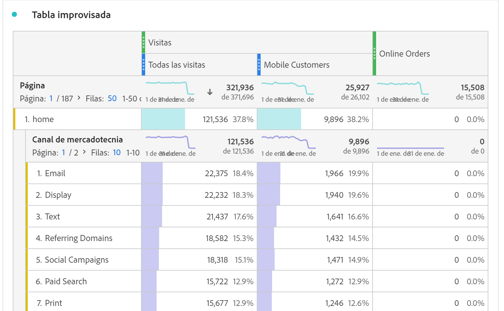

# Tabla improvisada

En Analysis Workspace, una tabla improvisada es la base de la análisis de datos interactiva. Puede arrastrar y soltar una combinación de [componentes](https://docs.adobe.com/content/help/es-ES/analytics/analyze/analysis-workspace/components/analysis-workspace-components.html) en filas y columnas para crear una tabla personalizada para la análisis. A medida que se suelta cada componente, la tabla se actualiza inmediatamente para que pueda analizar rápidamente y explorar en mayor profundidad.

## Tablas automatizadas

La forma más rápida de crear una tabla es soltar componentes directamente en un proyecto, panel o tabla improvisada en blanco. Se creará automáticamente una tabla improvisada en un formato recomendado. [Vea el tutorial](https://experienceleague.adobe.com/docs/analytics-learn/tutorials/analysis-workspace/building-freeform-tables/auto-build-freeform-tables-in-analysis-workspace.html).

## Generador de tablas improvisado

Si prefiere primero agregar varios componentes a la tabla y luego procesar los datos, puede habilitar el Generador de tablas improvisadas. Con el Generador de tablas improvisadas, puede arrastrar y soltar varias dimensiones, desgloses, métricas y segmentos para crear tablas que respondan a preguntas más complejas. Los datos no se actualizarán sobre la marcha, sino una vez que haga clic en **[!UICONTROL Generar]**.

## Interacciones de tabla

Puede interactuar con una tabla improvisada y personalizarla de diversas formas:

* **Filas**
   * Puede visualizar más filas en una sola pantalla ajustando la [densidad de vista](https://docs.adobe.com/content/help/es-ES/analytics/analyze/analysis-workspace/build-workspace-project/view-density.html) del proyecto.
   * Cada fila de dimensión puede mostrar hasta 400 filas antes de que se produzca la paginación. Haga clic en el número junto a &quot;Filas&quot; para mostrar más filas en una página. Navegue a otra página utilizando la flecha de página en el encabezado.
   * Las filas se pueden desglosar en componentes adicionales. Para desglosar muchas filas a la vez solo tiene que seleccionar varias filas y arrastrar el siguiente componente sobre las filas seleccionadas. Obtenga más información sobre los [desgloses](https://docs.adobe.com/content/help/es-ES/analytics/analyze/analysis-workspace/components/dimensions/t-breakdown-fa.html).
   * Las filas se pueden [filtrar](https://experienceleague.adobe.com/docs/analytics/analyze/analysis-workspace/visualizations/freeform-table/pagination-filtering-sorting.html?lang=es-ES) para mostrar un conjunto reducido de elementos. Hay opciones de configuración adicionales disponibles en [Configuración de fila](https://docs.adobe.com/content/help/en/analytics/analyze/analysis-workspace/visualizations/freeform-table/column-row-settings/table-settings.html).

* **Columnas**
   * Los componentes se pueden apilar en columnas para crear métricas segmentadas, análisis entre fichas, etcétera.
   * La vista de cada columna se ajusta en la [configuración de columna](https://docs.adobe.com/content/help/es-ES/analytics/analyze/analysis-workspace/build-workspace-project/column-row-settings/column-settings.html).
   * Hay varias acciones disponibles a través del [menú accesible mediante el botón secundario](https://docs.adobe.com/content/help/en/analytics-learn/tutorials/analysis-workspace/building-freeform-tables/using-the-right-click-menu.html). El menú proporciona diferentes acciones en función de si se hace clic en el encabezado de tabla, en las filas o en las columnas.

## Exportar datos de tabla improvisada

Obtenga más información sobre todas las [opciones de exportación](https://experienceleague.adobe.com/docs/analytics/analyze/analysis-workspace/curate-share/download-send.html) de datos para Analysis Workspace.

* Haga clic con el botón derecho > **[!UICONTROL Copiar datos al portapapeles]** exporta los datos de tabla mostrados. Si se realiza una selección de tabla, esta opción dirá **[!UICONTROL Copiar selección al portapapeles]**. La tecla de acceso directo **Ctrl+C** también copia los datos seleccionados.
* Al hacer clic con el botón derecho > **[!UICONTROL Descargar datos como CSV]**, se descargan los datos de la tabla mostrados como CSV. Si se selecciona una tabla, esta opción dirá **[!UICONTROL Descargar selección como CSV]**.
* Haga clic con el botón derecho > **[!UICONTROL Proyecto > Descargar elementos como CSV]** exportará hasta 50.000 elementos de dimensión para la dimensión seleccionada.

Obtenga más información sobre todas las [opciones de exportación](https://experienceleague.adobe.com/docs/analytics/analyze/analysis-workspace/curate-share/download-send.html) de datos para Analysis Workspace.

