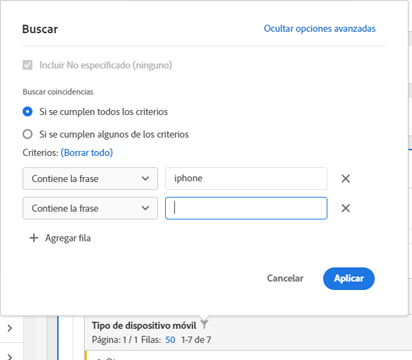

# Paginación, filtrado y ordenación de tablas

>[!NOTE]
>
>Está viendo la documentación de Analysis Workspace en Customer Journey Analytics. Su conjunto de funciones difiere ligeramente del [Analysis Workspace de la versión tradicional de Adobe Analytics](https://docs.adobe.com/content/help/es-ES/analytics/analyze/analysis-workspace/home.html). [Más información...](/help/getting-started/cja-aa.md)

Para obtener una descripción general de la paginación, el filtrado y la ordenación de tablas en Analysis Workspace, consulte este tutorial de vídeo:

>[!VIDEO](https://video.tv.adobe.com/v/23968)

## Opciones de filtrado avanzadas {#section_36E92E31442B4EBCB052073590C1F025}

Al hacer clic en el icono de filtro y, luego, en **[!UICONTROL Mostrar avanzado]** junto a una dimensión de una tabla improvisada, podrá filtrar según los criterios siguientes. Puede aplicar varias reglas de filtrado.

* Contiene
* No contiene
* Contiene todos los términos
* Contiene cualquier término
* Contiene la frase
* No contiene ningún término
* No contiene la frase
* Es igual a
* No es igual a
* Comienza con
* Finaliza con

## Ordenación de dimensiones en tablas improvisadas

>[!NOTE]
>
>La ordenación de dimensiones se aplica solamente a tablas improvisadas de Customer Journey Analytics, no de Adobe Analytics tradicional. La ordenación de métricas se puede realizar en ambas versiones de Analytics.

1. En cualquier tabla improvisada de un proyecto, haga clic en la flecha situada junto al nombre de la dimensión:

* La flecha hacia abajo ordena en orden descendente y la flecha hacia arriba (predeterminada) lo hace en orden ascendente.
* Puede ordenar las dimensiones de manera alfabética o numérica. Por ejemplo, es posible que haya numerado los pasos de un flujo de trabajo y que desee ordenarlos por el número de paso. Puede ordenar una dimensión relacionada con la fecha por fecha. Asimismo, puede ordenar las fuentes de datos alfabéticamente como en la captura de pantalla que se muestra arriba.
