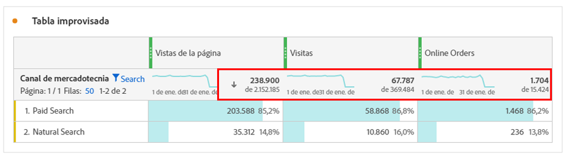
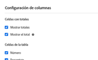
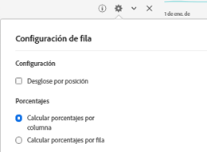

# Totales de Workspace

En las tablas de forma libre, aparece una fila total en cada nivel de desglose y puede mostrar dos totales:

* **[!UICONTROL Total general]** (número &quot;de&quot; gris): este total representa todas las visitas recopiladas. Cuando se aplica un filtro en el nivel de panel o en la tabla improvisada, este total se ajusta para reflejar todas las visitas que coincidan con los criterios de filtro.
* **[!UICONTROL Total de tabla]** (número negro): Este total suele ser igual o un subconjunto del [!UICONTROL total general]. Refleja cualquier filtro de tabla aplicado en la tabla de forma libre, incluida la opción [!UICONTROL Incluir ninguno].

## Mostrar configuración total

En **[!UICONTROL Configuración de columna]** hay opciones para **[!UICONTROL Mostrar totales]** y **[!UICONTROL Mostrar total general]**. Si esta configuración no está marcada, los totales se eliminarán de la tabla. Esto puede ser útil en casos en los que los totales no tengan sentido, por ejemplo, en ciertos [casos de métricas calculadas](https://experienceleague.adobe.com/docs/analytics/components/calculated-metrics/calcmetrics-reference/cm-totals.html?lang=es).

## Configuración total de fila estática

Los totales de [filas estáticas](/help/analysis-workspace/visualizations/freeform-table/column-row-settings/manual-vs-dynamic-rows.md) se comportan de forma diferente y se controlan desde **[!UICONTROL Configuración de fila]**.

* **[!UICONTROL Mostrar la suma de las filas actuales como el total]**: muestra una suma del lado del cliente de las filas de la tabla, lo que significa que el total **no** eliminará las métricas duplicadas como visitas o visitantes.
* **[!UICONTROL Mostrar total general]**: muestra una suma del lado del servidor, lo que significa que el total eliminará la duplicación de métricas como visitas o visitantes.

## Preguntas frecuentes

| Preguntas | Respuesta |
|---|---|
| ¿En qué “total” se basan los porcentajes de la columna gris? | Esto depende de la selección de configuración **[!UICONTROL Porcentajes]** en **[!UICONTROL Configuración de fila]**:<ul><li>Calcular porcentajes por columna: Esta es la configuración predeterminada. Los porcentajes se basarán en el total de la tabla.</li><li>Calcular porcentajes por fila: los porcentajes se basarán en el total general.</li></ul> |
| ¿Cómo afecta la configuración **[!UICONTROL Incluir no especificado (Ninguno)]** a los totales? | Si la opción **[!UICONTROL Incluir no especificado (Ninguno)]** está desactivada, la fila Ninguno/No especificado se eliminará de la tabla, el Total de tabla y se aplicará a cualquier métrica calculada que utilice [tipos de métrica “Total”](https://experienceleague.adobe.com/docs/analytics/components/calculated-metrics/calcmetric-workflow/m-metric-type-alloc.html?lang=es) |
| Cuando se aplican filtros de tabla personalizados a una tabla de forma libre, ¿tienen en cuenta todas mis métricas calculadas y el formato condicional para el filtro? | Actualmente no. **[!UICONTROL Incluir No especificado (Ninguno)]** se contabilizará, pero los filtros de tabla personalizados no afectarán a lo siguiente:<ul><li>El rango máximo/mínimo de columna que utiliza el formato condicional comprobará todos los datos.</li><li>Métricas calculadas que aprovechan los tipos de métricas **[!UICONTROL Total general]**.</li><li>Métricas calculadas con funciones que calculan en filas de una tabla improvisada, por ejemplo: Suma de columna, Máximo de columna, Mínimo de columna, Recuento, Media, Mediana, Percentil, Cuartil, Recuento de filas, Desviación estándar, Variación, Acumulativo, Promedio Acumulado, Variantes de regresión, Puntuación T, Prueba T, Puntuación Z, Prueba Z.</li></ul> |
| En Métricas calculadas, ¿qué refleja el tipo de métrica **[!UICONTROL Total general]**? | **[!UICONTROL Total general]** sigue haciendo referencia al **[!UICONTROL Total general]** y no refleja los filtros aplicados a una tabla o al **[!UICONTROL Total de tabla]**. |
| ¿Qué total se muestra cuando los datos se copian y pegan desde una tabla improvisada o se descargan mediante CSV? | La fila total reflejará únicamente el **[!UICONTROL Total de tabla]** y respetará la configuración de la columna **[!UICONTROL Mostrar totales]**. |
