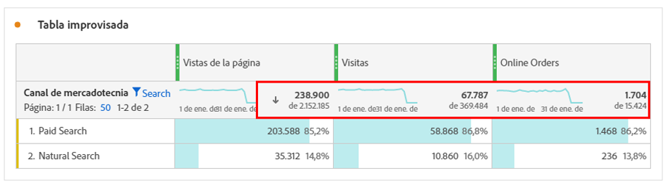

# Totales {#workspace-totals}

>[!CONTEXTUALHELP]
>id="workspace_freeformtable_grandtotal"
>title="Total general"
>abstract="El total general no es compatible con tablas o desgloses con filas estáticas."

En las tablas de forma libre, aparece una fila total en cada nivel de desglose y puede mostrar dos totales:

* **[!UICONTROL Total de tabla]** ➊: este total suele ser igual o un subconjunto de [!UICONTROL Total general]. El total refleja cualquier segmento de tabla aplicado en la tabla de forma libre, incluida la opción [!UICONTROL No incluir ninguno].
* **[!UICONTROL Total general]** (**[!UICONTROL de]** *número*) ➋: este total representa todos los eventos que se han recopilado. Cuando se aplica un segmento en el nivel de panel o en la tabla de forma libre, este total se ajusta para reflejar todos los eventos que coinciden con los criterios del segmento.

## Mostrar totales

En  **[!UICONTROL Configuración de columna]** hay opciones para **[!UICONTROL Mostrar totales]** y **[!UICONTROL Mostrar total general]**. Si esta configuración no está activada, los totales se eliminarán de la tabla, lo que puede ser útil en los casos en los que los totales no tengan sentido.

En una tabla de forma libre que contiene [filas estáticas](/help/analysis-workspace/visualizations/freeform-table/column-row-settings/manual-vs-dynamic-rows.md), los totales se comportan de manera diferente. Y se controlan usando  **[!UICONTROL Configuración de fila]**.

| Opción | Descripción |
|---|---|
| **[!UICONTROL Mostrar la suma de las filas actuales como el total]** | Muestra una suma del lado del cliente de las filas de la tabla. Este total **no** anula la duplicación de métricas como sesiones o personas. |
| **[!UICONTROL Mostrar el total]** | Mostrar una suma del lado del servidor. Este total anula la duplicación de métricas como sesiones o personas. |

Consulte [Elementos de dimensión dinámicos o estáticos en tablas de forma libre](column-row-settings/manual-vs-dynamic-rows.md).

## Preguntas frecuentes

| Preguntas | Respuesta |
|---|---|
| ¿En qué *total* se basan los porcentajes de la columna gris? | Este *total* depende de la selección de la configuración **[!UICONTROL Porcentajes]** en **[!UICONTROL Configuración de la fila]**:<ul><li>Calcular porcentajes por columna: esta configuración es la predeterminada. Los porcentajes se basan en el total de la tabla.</li><li>Calcular porcentajes por fila: los porcentajes se basan en el total general.</li></ul> |
| ¿Cómo afecta la configuración **[!UICONTROL Incluir &quot;Sin valor&quot;]** a los totales? | Si la opción **[!UICONTROL Incluir &quot;Sin valor&quot;]** está desactivada, la fila **[!UICONTROL Sin valor]** se quitará de la tabla, el Total de la tabla y se trasladará a cualquier métrica calculada que utilice los tipos de métrica [*Total*](/help/components/calc-metrics/cm-workflow/m-metric-type-alloc.md). |
| Cuando se aplican segmentos de tabla personalizados a una tabla de forma libre, ¿se tienen en cuenta todas mis métricas calculadas y el formato condicional para el segmento? | Actualmente no. **[!UICONTROL Incluir “Sin valor”]** se contabilizará, pero los filtros de tabla personalizados no tendrán ningún efecto sobre lo siguiente:<ul><li>El rango máximo/mínimo de columna que utiliza el formato condicional abarca todos los datos.</li><li>Las métricas calculadas que aprovechan los tipos de métricas **[!UICONTROL Total general]**.</li><li>Las métricas calculadas con funciones que se calculan en las filas de una tabla de forma libre, por ejemplo: Suma de la columna, Máximo de columna, Mínimo de columna, Recuento, Media, Mediana, Percentil, Cuartil, Recuento de filas, Desviación estándar, Variación, Acumulativo, Promedio acumulado, Variantes de regresión, Puntuación T, Prueba T, Puntuación Z, Prueba Z.</li></ul> |
| En Métricas calculadas, ¿qué refleja el tipo de métrica **[!UICONTROL Total general]**? | **[!UICONTROL Total general]** sigue refiriéndose al **[!UICONTROL Total general]**, y no refleja los segmentos aplicados a una tabla ni el **[!UICONTROL Total de la tabla]**. |
| ¿Qué total se muestra cuando los datos se copian y pegan desde una tabla de forma libre o se descargan mediante CSV? | La fila total reflejará únicamente el **[!UICONTROL Total de la tabla]** y respeta la configuración de la columna **[!UICONTROL Mostrar totales]**. |
