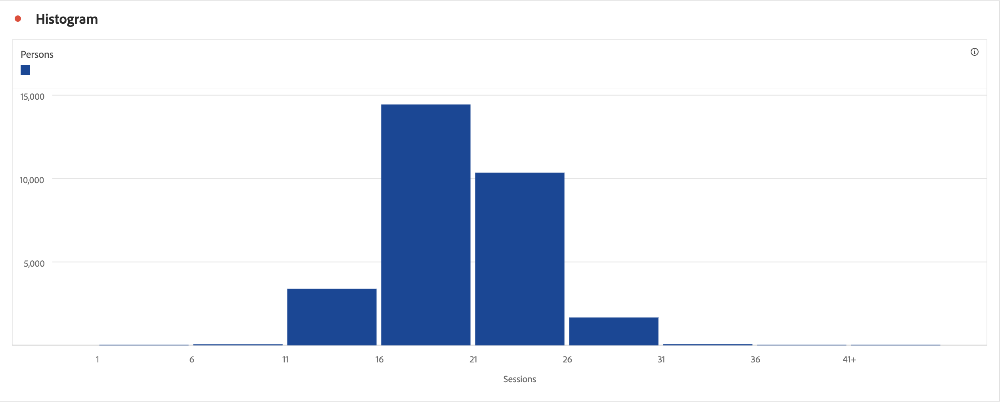

# Histograma {#histogram}

<!-- markdownlint-disable MD034 -->

>[!CONTEXTUALHELP]
>id="workspace_histogram_button"
>title="Histograma"
>abstract="Cree una visualización de histograma para representar la distribución de datos numéricos en grupos de intervalos."

<!-- markdownlint-enable MD034 -->

>[!BEGINSHADEBOX]

_Este artículo documenta la visualización del histograma en_  _**Customer Journey Analytics**._ _Consulte [Histograma](https://experienceleague.adobe.com/en/docs/analytics/analyze/analysis-workspace/visualizations/histogram) para la_  _**Adobe Analytics** de este artículo._

>[!ENDSHADEBOX]

La visualización  **[!UICONTROL Histograma]** es similar a una visualización de [!UICONTROL Barras], pero agrupa los números en rangos (contenedores). Analytics automatiza la creación de contenedores de números en rangos, pero puede modificar la configuración en [ajustes avanzados](#advanced-settings).

## Usar

Para crear un histograma, haga lo siguiente:

1. Añada una visualización de  **[!UICONTROL Histograma]**. Consulte [Añadir una visualización a un panel](freeform-analysis-visualizations.md#add-visualizations-to-a-panel).
1. Arrastre una métrica de la lista de componentes **[!UICONTROL Métricas]** o seleccione una métrica del menú desplegable [!UICONTROL *Añadir una métrica*].
1. (opcional) Seleccione **[!UICONTROL Mostrar ajustes avanzados]**. Consulte [Ajustes avanzados](#advanced-settings).
1. Seleccione **[!UICONTROL Generar]**.

>[!NOTE]
>
>Los histogramas únicamente admiten métricas estándar, pero no métricas calculadas.

En el ejemplo siguiente, se utiliza un histograma para agrupar las sesiones por el número de personas. El histograma muestra que la mayoría de las personas tienen entre 16 y 21 sesiones para el intervalo de fechas seleccionado.

## Ajustes avanzados

Como parte de la visualización, hay disponibles ajustes específicos de histograma.

| Configuración de histograma | Descripción |
|---|---|
| **[!UICONTROL Contenedor inicial]** | Determina por qué contenedor empieza el histograma. La opción predeterminada es “1”. Puede ajustar los números iniciales de 0 hasta el infinito (sin números negativos). |
| **[!UICONTROL Contenedor de métricas]** | Le permite aumentar/disminuir el número de rangos de datos (contenedores). El número máximo de contenedores es 50. |
| **[!UICONTROL Tamaño del contenedor de métricas]** | Le permite establecer el tamaño de cada contenedor. Por ejemplo, puede cambiar el tamaño del contenedor de 1 vista de página a 2 vistas de página. |
| **[!UICONTROL Método de recuento]** | Seleccione entre **[!UICONTROL Cuenta global]** [!BADGE B2B edition]{type=Informative url="https://experienceleague.adobe.com/en/docs/analytics-platform/using/cja-overview/cja-b2b/cja-b2b-edition" newtab=true tooltip="Customer Journey Analytics B2B edition"}, **[!UICONTROL Cuenta]** [!BADGE B2B edition]{type=Informative url="https://experienceleague.adobe.com/en/docs/analytics-platform/using/cja-overview/cja-b2b/cja-b2b-edition" newtab=true tooltip="Customer Journey Analytics B2B edition"}, **[!UICONTROL Grupo de compra]** [!BADGE B2B edition]{type=Informative url="https://experienceleague.adobe.com/en/docs/analytics-platform/using/cja-overview/cja-b2b/cja-b2b-edition" newtab=true tooltip="Customer Journey Analytics B2B edition"}, **[!UICONTROL Oportunidad]** [!BADGE B2B edition]{type=Informative url="https://experienceleague.adobe.com/en/docs/analytics-platform/using/cja-overview/cja-b2b/cja-b2b-edition" newtab=true tooltip="Customer Journey Analytics B2B edition"}, **[!UICONTROL Persona]**, **[!UICONTROL Sesión]** o **[!UICONTROL Evento]**. Por ejemplo, vistas de página por cuenta [!BADGE B2B edition]{type=Informative url="https://experienceleague.adobe.com/en/docs/analytics-platform/using/cja-overview/cja-b2b/cja-b2b-edition" newtab=true tooltip="Customer Journey Analytics B2B edition"}, vistas de página por sesión o vistas de página por persona o vistas de página por evento. |

<!--Russ or Meike - Check Hit Type link above. -->

**Ejemplos**:

| Contenedor inicial | Contenedores de métricas | Tamaño del contenedor de métricas | Resultado  |
|:----:|:--:|:--:|:--|
| 1 | 5 | 2 |  |
| 0 | 3 | 5 |  |

>[!MORELIKETHIS]
>
>[Añadir una visualización a un panel](/help/analysis-workspace/visualizations/freeform-analysis-visualizations.md#add-visualizations-to-a-panel)
>[Configuración de visualización](/help/analysis-workspace/visualizations/freeform-analysis-visualizations.md#settings)
>[Menú contextual de visualización](/help/analysis-workspace/visualizations/freeform-analysis-visualizations.md#context-menu)
>[Usando histogramas para identificar valores de datos inesperados](https://experienceleaguecommunities.adobe.com/t5/adobe-analytics-blogs/using-histograms-to-identify-unexpected-data-values/ba-p/596168)

