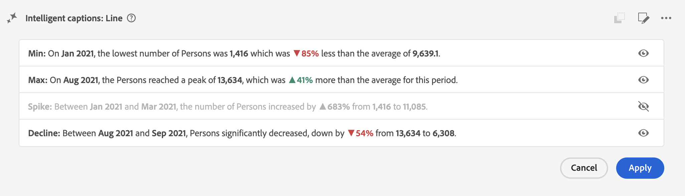
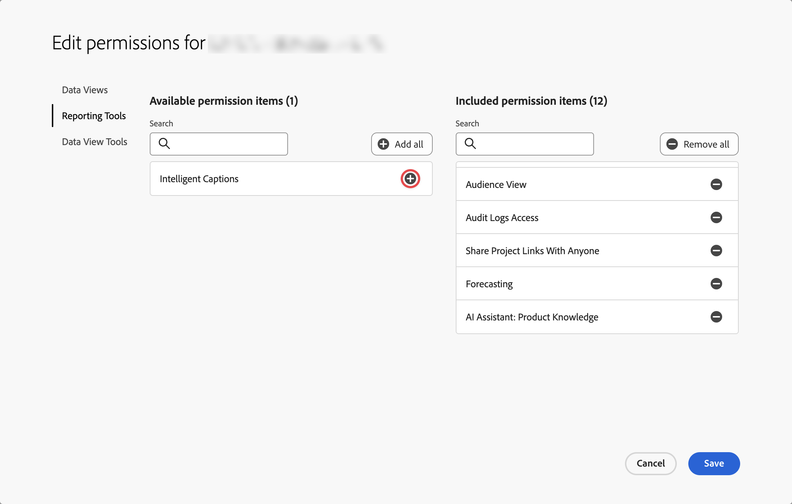

# Pies de ilustración inteligentes

Los subtítulos inteligentes utilizan aprendizaje automático avanzado e IA generativa para proporcionar información valiosa en lenguaje natural para las visualizaciones de Workspace. La versión inicial proporciona información generada automáticamente para la visualización [Line](line.md). A continuación, se muestran otras visualizaciones.

Los subtítulos inteligentes están orientados a:

* Analistas que necesitan narrativas para compartir con otros usuarios. Los analistas necesitan estas perspectivas para poder proporcionar contexto a sus usuarios.
* Usuarios empresariales que deseen descubrir rápidamente los consejos de alto nivel.

Los subtítulos están disponibles para todos los usuarios de Customer Journey Analytics y no requieren permisos especiales.

## Iniciar subtítulos inteligentes {#launch}

Para iniciar subtítulos generados automáticamente para una visualización de líneas, haga clic en el icono **[!UICONTROL Subtítulos inteligentes]** en la parte superior derecha de la visualización.

Ahora se están generando perspectivas en lenguaje natural.

Tenga en cuenta que

* Necesita un mínimo de 3 puntos de datos para generar subtítulos correctamente. De lo contrario, podría recibir un error como **[!UICONTROL No hay suficientes datos para analizar]**.

* Los subtítulos se generan cada vez que los datos seleccionados subyacentes cambian en la tabla que alimenta la visualización.

* Si hay varias métricas en la tabla, los subtítulos solo se generan para la primera métrica o la métrica seleccionada actualmente por el usuario.

* Si guarda el proyecto en un punto específico y lo vuelve a cargar más adelante, los subtítulos se actualizan automáticamente con nuevos datos. Lo mismo se aplica a los proyectos programados y a los archivos de PDF exportados desde un proyecto.

A continuación se muestra un ejemplo del aspecto que podrían tener los subtítulos inteligentes:

## Acciones

Puede realizar las siguientes acciones en los subtítulos inteligentes:

### Copiar al portapapeles {#copy}

Puede copiar los subtítulos en un portapapeles y pegarlos en un PowerPoint u otras herramientas. Seleccione  en la parte superior derecha del cuadro de diálogo de subtítulos.

### Editar pantalla {#edit}

Puede editar la visualización de subtítulos, como ocultar o mostrar una categoría particular de perspectivas.

1. Seleccione  en el cuadro de diálogo Subtítulos inteligentes.

1. Alterne entre  para mostrar una perspectiva específica (como **[!UICONTROL Mín.]**) o  para ocultar una perspectiva específica (como **[!UICONTROL Pico]**).

   

1. Seleccione **[!UICONTROL Aplicar]**.

### Proporcionar comentarios

Puede proporcionar comentarios sobre los subtítulos inteligentes generados.

1. Seleccione  en el cuadro de diálogo Subtítulos inteligentes.

1. Seleccione  **[!UICONTROL Buena respuesta]**,  **[!UICONTROL Respuesta incorrecta]** o  **[!UICONTROL Informe]**.

1. En el cuadro de diálogo **[!UICONTROL Gracias por sus comentarios]**, proporcione sus comentarios y seleccione **[!UICONTROL Enviar]** para enviar los comentarios.

### Exportar {#export}

Puede exportar subtítulos inteligentes como parte de un PDF, siempre y cuando el proyecto se guarde con los subtítulos inteligentes generados.

### Alternar desactivado {#toggle}

Si prefiere no mostrar subtítulos inteligentes, puede desactivar la función.

1. Vaya a [Preferencias de visualizaciones](/help/analysis-workspace/user-preferences.md#visualizations-preferences).
1. Desmarque **[!UICONTROL Mostrar subtítulos inteligentes]**.

   

1. Seleccione **[!UICONTROL Guardar]** para guardar la preferencia.

## Subtítulos inteligentes en cuadros de resultados móviles

Los subtítulos inteligentes también están disponibles en los [cuadros de resultados móviles](https://experienceleague.adobe.com/es/docs/analytics-platform/using/cja-dashboards/manage-scorecard#captions) del Customer Journey Analytics.

## Acceso a funciones

Los siguientes parámetros rigen el acceso a los subtítulos inteligentes:

* **Acceso a la solución**: la característica Subtítulos inteligentes está disponible en Customer Journey Analytics, pero no en Adobe Analytics.

* **Acceso contractual**: Si no puedes usar subtítulos inteligentes, ponte en contacto con el administrador de tu organización o con el representante de cuentas de Adobe. Antes de poder usar Intelligent en su organización, debe aceptar ciertos términos legales relacionados con GenAI.

* **Permisos**: en [!UICONTROL Adobe Admin Console], el permiso de [!UICONTROL Herramientas de informes] **[!UICONTROL Subtítulos inteligentes]** determina el acceso. Un [administrador de perfil de producto](https://helpx.adobe.com/es/enterprise/using/manage-product-profiles.html) debe seguir estos pasos en el [!UICONTROL Admin Console]:
   1. Vaya a **[!UICONTROL Admin Console]** > **[!UICONTROL Productos y servicios]** > **[!UICONTROL Customer Journey Analytics]** > **[!UICONTROL Perfiles de productos]**.
   1. Seleccione el título del perfil de producto para el que desea proporcionar acceso a Subtítulos inteligentes.
   1. En el perfil de producto específico, seleccione **[!UICONTROL Permisos]**.
   1. Seleccione  para editar **[!UICONTROL Herramientas de informes]**.
   1. Seleccione  para agregar **Subtítulos inteligentes** a **[!UICONTROL Elementos de permiso incluidos]**.

      

   1. Seleccione **[!UICONTROL Guardar]** para guardar los permisos.

Consulte [Control de acceso](/help/technotes/access-control.md#access-control) para obtener más información.
