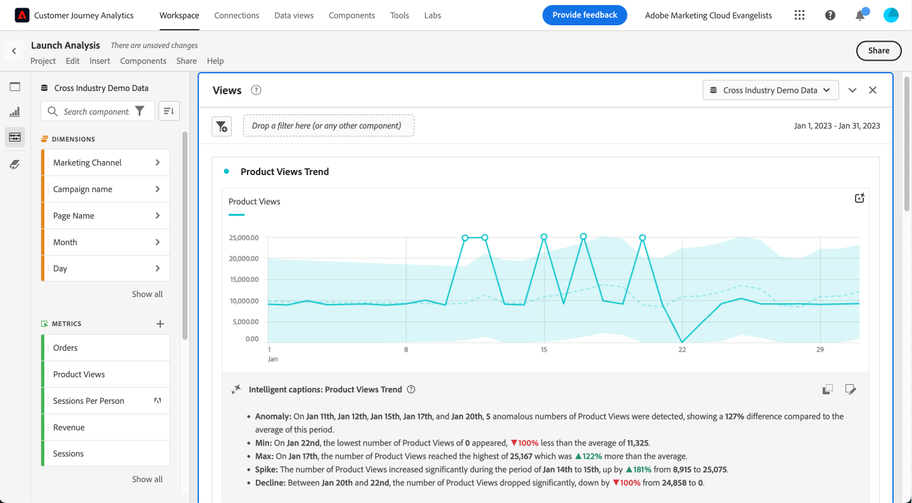
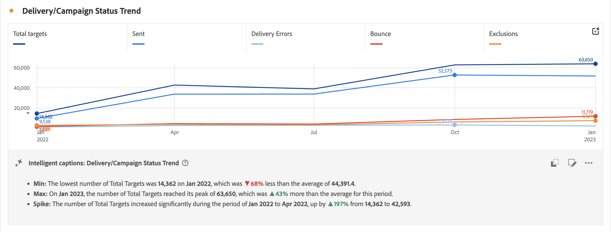
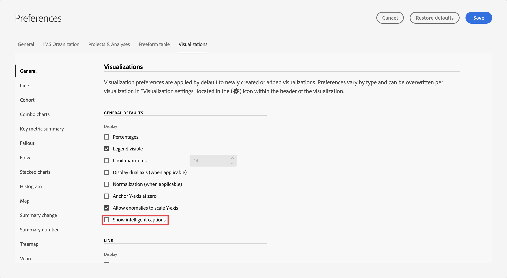

# Subtítulos inteligentes

{{release-limited-testing}}

Los subtítulos inteligentes utilizan la ciencia de datos para proporcionar perspectivas de lenguaje natural valiosas para las visualizaciones de Workspace. La versión inicial proporciona perspectivas autogeneradas para el [Línea](line.md) visualización. (Seguirán otras visualizaciones).

Los subtítulos inteligentes están orientados a:

* Analistas que necesitan narrativas para compartirlas con otros usuarios. Los analistas necesitan estas perspectivas para poder proporcionar contexto a sus usuarios.
* Usuarios empresariales que desean descubrir rápidamente las principales conversiones.

Los subtítulos están disponibles para todos los usuarios de CJA y no requieren permisos especiales.

## Iniciar subtítulos inteligentes {#launch}

Para iniciar subtítulos generados automáticamente para una visualización de líneas, haga clic en el botón **[!UICONTROL Subtítulos inteligentes]** en la parte superior derecha de la visualización.

Ahora se están generando perspectivas en lenguaje natural.

Si guarda el proyecto en este momento y lo vuelve a cargar más adelante, los rótulos se actualizan automáticamente con nuevos datos. Lo mismo se aplica a los proyectos programados y a los archivos de PDF exportados desde este proyecto.

## Ver e interpretar subtítulos {#view}

Este es un ejemplo de cómo podrían verse los subtítulos:

## Copiar al portapapeles {#copy}

Puede copiar los rótulos en un portapapeles y pegarlos en un PowerPoint u otra herramienta. Busque la **[!UICONTROL Copiar rótulos al portapapeles]** en la parte superior derecha del cuadro de diálogo rótulos.

## Editar rótulos {#edit}

Puede editar los rótulos, como ocultar o mostrar una categoría concreta de perspectivas. Por ejemplo, si no desea obtener información sobre el orden mínimo, puede ocultarlo y hacer clic en Aplicar y no se mostrará de nuevo.

1. Haga clic en **[!UICONTROL Editar visualización de subtítulos inteligentes]** junto al icono del portapapeles.

1. En el cuadro de diálogo de edición, haga clic en el icono de ojo situado junto a la perspectiva que desee ocultar.

1. Haga clic en **[!UICONTROL Aplicar]**.

Utilice el mismo proceso para mostrar los rótulos.

## Exportar rótulos {#export}

Puede **exportar subtítulos a través del PDF**, siempre que el proyecto se guarde con los rótulos generados.

## Desactivar rótulos {#toggle}

Si no desea que se generen subtítulos inteligentes, puede desactivar esta función si va a las preferencias de visualización y desmarca **[!UICONTROL Mostrar rótulos inteligentes]**.

## Reordenar rótulos {#reorder}

Para cambiar el orden en que se muestran los rótulos, arrastre el rótulo a una nueva posición.