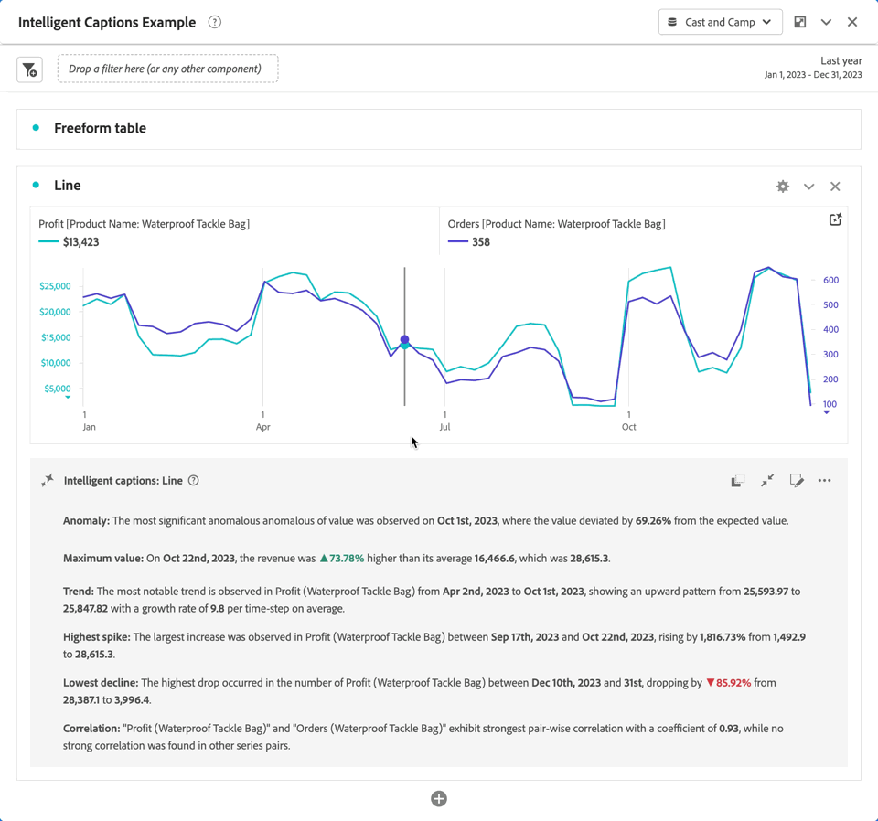

# Subtítulos inteligentes {#intelligent-captions}

<!-- markdownlint-disable MD034 -->

>[!CONTEXTUALHELP]
>id="workspace_intelligentcaptions"
>title="Subtítulos inteligentes"
>abstract="Genere perspectivas en lenguaje natural para ayudarle a comprender e interpretar los datos de esta visualización con mayor facilidad."

La funcionalidad Subtítulos inteligentes utiliza IA generativa avanzada para proporcionar información clave para las visualizaciones de Workspace utilizadas con más frecuencia en forma de lenguaje natural.

Los subtítulos inteligentes están destinados a las siguientes personas:

* Analistas, que necesitan narrativas para compartir con otros usuarios. Los analistas necesitan esta información para poder proporcionar contexto a sus usuarios.
* Usuarios empresariales que deseen descubrir rápidamente conocimientos de alto nivel.

>[!BEGINSHADEBOX]

Consulte  [Subtítulos inteligentes](https://video.tv.adobe.com/v/3420131/?quality=12&learn=on){target="_blank"} para ver un vídeo de demostración.

>[!ENDSHADEBOX]

## Lanzamiento de subtítulos inteligentes {#launch}

Para lanzar subtítulos inteligentes generados automáticamente para una visualización, seleccione  en la parte superior derecha de la visualización. Esta selección genera información en forma de lenguaje natural.

Tenga en cuenta lo siguiente:

* Necesita un mínimo de 3 puntos de datos para generar subtítulos correctamente. De lo contrario, podría recibir un error de tipo **[!UICONTROL No hay suficientes datos para analizar]**.

* Los subtítulos se generan cada vez que los datos seleccionados subyacentes cambian en la tabla que alimenta la visualización.

* Si hay varias métricas en una tabla de forma libre asociada, los subtítulos solo se generan para la primera métrica o la métrica seleccionada actualmente por el usuario. Sin embargo, se pueden generar subtítulos para varias métricas en las visualizaciones de línea y área.

* Si guarda el proyecto en un punto específico y lo vuelve a cargar más adelante, los subtítulos se actualizarán automáticamente con nuevos datos. Lo mismo se aplica a los proyectos programados y a los archivos PDF exportados desde un proyecto.

## Visualizaciones {#visualizations}

Los subtítulos inteligentes son compatibles con las siguientes visualizaciones:

* [Línea](line.md) (incluidas varias líneas)
* [Barra](bar.md)
* [Barra horizontal](horizontal-bar.md)
* [Área](area.md) (incluidas varias líneas de área)
* [Anillo](donut.md)
* [Visita en orden previsto](fallout/fallout-flow.md)
* [Flujo](c-flow/flow.md)

<!--
Here is an example of what intelligent captions could look like:

-->

## Acciones

Puede realizar las siguientes acciones en los subtítulos inteligentes:

### Copiar en el portapapeles {#copy}

Puede copiar los subtítulos en un portapapeles y pegarlos en un PowerPoint u otras herramientas. Puede copiar subtítulos individuales en la vista uno por uno, o bien puede copiar todos los subtítulos a la vez en la vista de títulos expandidos.

* Para copiar los subtítulos, seleccione  en la parte superior derecha del cuadro de diálogo de subtítulos.

### Mostrar todos los subtítulos inteligentes o subtítulos inteligentes individuales  {#show-all-or-individual}

Puede mostrar todos los subtítulos inteligentes a la vez en una vista expandida o puede mostrar subtítulos inteligentes individuales en una vista uno por uno. 

* Para mostrar todos los subtítulos inteligentes, seleccione .
* Para mostrar subtítulos inteligentes individuales, uno por uno, seleccione .

### Edición de la visualización {#edit}

Puede editar la visualización de subtítulos, como ocultar o mostrar una categoría particular de información.

1. Seleccione  en el cuadro de diálogo de subtítulos inteligentes.

1. Alterne entre  para mostrar una información específica (como **[!UICONTROL Mínimo]**) o  para ocultar una información específica (como **[!UICONTROL Pico]**).

   

1. Seleccione **[!UICONTROL Aplicar]**.

### Proporcionar comentarios

Puede proporcionar comentarios sobre los subtítulos inteligentes generados (solo se pueden realizar comentarios en la vista de subtítulos expandidos).

1. Seleccione  en el cuadro de diálogo de subtítulos inteligentes.

1. Seleccione  **[!UICONTROL Respuesta apropiada]**,  **[!UICONTROL Respuesta inapropiada]** o  **[!UICONTROL Informe]**.

1. En el cuadro de diálogo **[!UICONTROL Gracias por sus comentarios]**, escriba sus comentarios y seleccione **[!UICONTROL Enviar]** para enviarlos.

### Exportar {#export}

Puede exportar subtítulos inteligentes como parte de un archivo PDF, siempre y cuando el proyecto se guarde con los subtítulos inteligentes generados.

### Alternar desactivado {#toggle}

Si prefiere no mostrar subtítulos inteligentes, puede desactivar la función.

1. Vaya a [Preferencias de las visualizaciones](/help/analysis-workspace/user-preferences.md#visualizations-preferences).
1. Desmarque **[!UICONTROL Mostrar subtítulos inteligentes]**

   

1. Seleccione **[!UICONTROL Guardar]** para guardar la preferencia.

## Subtítulos inteligentes en cuadros de resultados móviles

Los subtítulos inteligentes también están disponibles en los [cuadros de resultados móviles](https://experienceleague.adobe.com/es/docs/analytics-platform/using/cja-dashboards/manage-scorecard#captions) de Customer Journey Analytics.

## Acceso a las funciones

Los siguientes parámetros rigen el acceso a los subtítulos inteligentes:

* **Acceso a la solución**: la función Subtítulos inteligentes está disponible en Customer Journey Analytics, pero no en Adobe Analytics.

* **Acceso contractual**: si no puede usar subtítulos inteligentes, póngase en contacto con el administrador de su organización o con el representante de cuentas de Adobe (administrador). Para poder utilizar subtítulos inteligentes en su organización, debe aceptar determinados términos legales relacionados con la inteligencia artificial generativa.

* **Permisos**: en [!UICONTROL Adobe Admin Console], el permiso para **[!UICONTROL Subtítulos inteligentes]** de las [!UICONTROL herramientas de creación de informes determina el acceso]. Un [administrador de perfil de producto](https://helpx.adobe.com/es/enterprise/using/manage-product-profiles.html) debe seguir estos pasos en [!UICONTROL Admin Console]:
   1. Vaya a **[!UICONTROL Admin Console]** > **[!UICONTROL Productos y servicios]** > **[!UICONTROL Customer Journey Analytics]** > **[!UICONTROL Perfiles de productos]**.
   1. Seleccione el título del perfil de producto para el que desea proporcionar acceso a Subtítulos inteligentes.
   1. En el perfil de producto específico, seleccione **[!UICONTROL Permisos]**.
   1. Seleccione  para editar **[!UICONTROL Herramientas de creación de informes]**.
   1. Seleccione  para añadir **Subtítulos inteligentes** a **[!UICONTROL Elementos de permiso incluidos]**.

      

   1. Seleccione **[!UICONTROL Guardar]** para guardar el esquema.

Consulte [Control de acceso](/help/technotes/access-control.md#access-control) para obtener más información.
