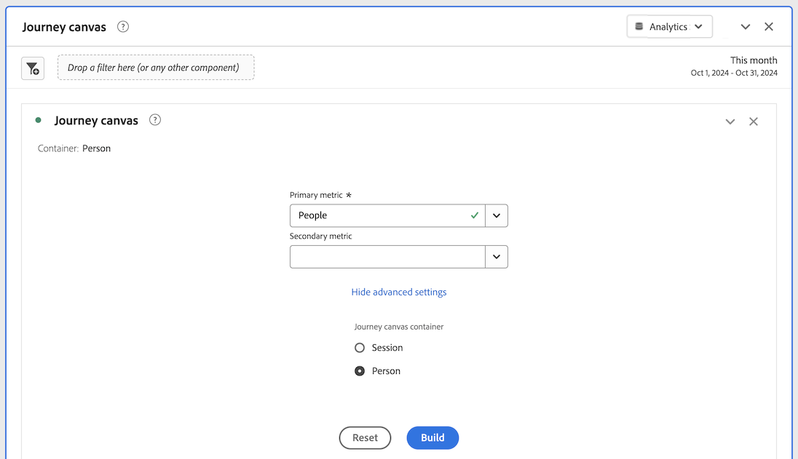
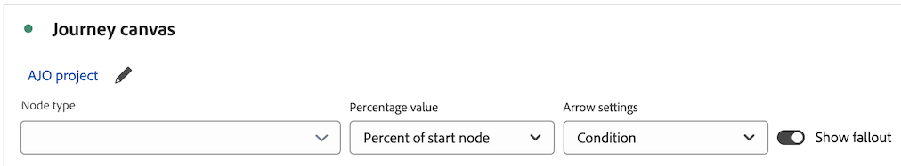
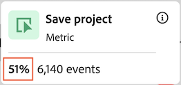
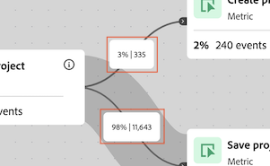
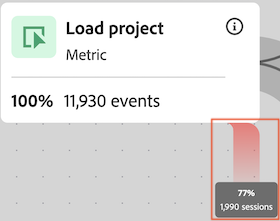
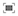

# Configuración de una visualización de lienzo de recorrido

{{release-limited-testing}}

La visualización del lienzo de Recorrido le permite analizar y obtener perspectivas profundas sobre los recorridos que proporciona a sus usuarios y clientes.

## Información general del lienzo de recorrido

Consulte [descripción general del lienzo de Recorrido](/help/analysis-workspace/visualizations/journey-canvas/journey-canvas.md) para obtener más información sobre el lienzo de Recorrido, incluyendo:

* Funciones principales

* Perspectivas potenciales

* Diferencias entre el lienzo de Recorrido y las visitas en orden previsto

* Detalles sobre el análisis de Journey Optimizer recorrido

* Y más

## Empezar a crear una visualización de lienzo de Recorrido

1. Agregue un panel en blanco al proyecto, seleccione el icono [!UICONTROL **Visualizaciones**] en el carril izquierdo y, a continuación, arrastre la visualización  [!UICONTROL **lienzo de Recorrido**] al panel.

   O

   Agregue una visualización de lienzo de Recorrido de cualquiera de las formas descritas en la sección [Agregar visualizaciones a un panel](/help/analysis-workspace/visualizations/freeform-analysis-visualizations.md#add-visualizations-to-a-panel) de [Información general sobre visualizaciones](/help/analysis-workspace/visualizations/freeform-analysis-visualizations.md).

   

1. Especifique la siguiente información básica para configurar el lienzo de Recorrido:

   | Campo | Función |
   |---------|----------|
   | [!UICONTROL **Métrica principal**] | Determina la métrica que se usa al calcular los valores porcentuales y numéricos en cada nodo del recorrido. 
**Nota**: el ámbito de los datos incluidos en cada valor porcentual y numérico viene determinado por la métrica que elija en el campo **[!UICONTROL contenedor de lienzo de Recorrido]**. Por ejemplo, si **[!UICONTROL Persona]** se establece como contenedor, las estadísticas que se muestran en el recorrido abarcan varias sesiones para una persona determinada. Si **[!UICONTROL Session]** se establece como contenedor, las estadísticas que se muestran en el recorrido se limitan a una sola sesión definida para una persona determinada.

Veamos los siguientes ejemplos:
<ul><li>Si _Personas_ es la métrica principal y _Persona_ es el contenedor, solo aquellas personas que tengan un evento que coincida con los criterios de cada nodo sucesivo en el recorrido se moverán a través del recorrido. La visita en orden previsto se produce en un nodo cuando una persona nunca llegó a ninguno de los nodos inmediatamente siguientes del recorrido. Es posible que hayan realizado otras acciones en el sitio, pero no cumplieron los criterios definidos por ninguno de los nodos que siguen inmediatamente.</li><li>Si _Personas_ es la métrica principal y _Sesión_ es el contenedor, solo se moverán por el recorrido aquellas personas que tengan un evento que coincida con los criterios de cada nodo en el recorrido dentro de una sola sesión. Las visitas en el orden previsto se producen en un nodo cuando una persona nunca llegó a ninguno de los nodos inmediatamente siguientes del recorrido en una sola sesión. Es posible que hayan realizado otras acciones en el sitio dentro de la sesión, pero no cumplieron los criterios definidos por ninguno de los nodos que siguen inmediatamente.</li></ul> 
La métrica principal afecta a los siguientes aspectos de la visualización del lienzo de Recorrido:
<ul><li>El número total que se muestra en cada nodo.  
Por ejemplo, si Eventos es la métrica principal, cada nodo muestra el número de personas que tuvieron un evento que coincide con los criterios de ese nodo (y con cada nodo anterior que lo precedió en el recorrido).
</li><li>El porcentaje que se muestra en cada nodo. (Una vez creada la visualización, puede usar el menú desplegable **[!UICONTROL Valor de porcentaje]** para elegir mostrar el porcentaje del total, el porcentaje del nodo anterior o el porcentaje del nodo de inicio).</li>
Por ejemplo, si Eventos es la métrica principal, cada nodo muestra el porcentaje de personas que tuvieron un evento que coincide con los criterios de ese nodo (y con cada nodo anterior que lo precedió en el recorrido).
</li><li>Cuando se añade una dimensión a la visualización, se añaden los 3 nodos principales de la visualización en función de la métrica principal.</li></ul> |
   | [!UICONTROL **Métrica secundaria**] | Determina la métrica secundaria que se usa al calcular los valores porcentuales y numéricos en cada nodo del recorrido. La métrica secundaria es opcional. 
**Nota**: el ámbito de los datos incluidos en cada valor porcentual y numérico viene determinado por la métrica que elija en el campo **[!UICONTROL contenedor de lienzo de Recorrido]**. Por ejemplo, si **[!UICONTROL Persona]** se establece como contenedor, las estadísticas que se muestran en el recorrido abarcan varias sesiones para una persona determinada. Si **[!UICONTROL Session]** se establece como contenedor, las estadísticas que se muestran en el recorrido se limitan a una sola sesión definida para una persona determinada.

Cuando se selecciona una métrica secundaria, afecta a los siguientes aspectos de la visualización del lienzo de Recorrido:
<ul><li>El número total que se muestra en cada nodo debajo de la métrica principal. 
Por ejemplo, si Cuentas es la métrica secundaria, el número de cuentas se muestra en el nodo para todas las personas que llegaron a ese nodo solo para esas personas. Cada nodo muestra el número de sesiones que llegaron a ese nodo en el recorrido.
</li><li>El porcentaje que se muestra en cada nodo debajo de la métrica principal. (Una vez creada la visualización, puede elegir mostrar el porcentaje del total o del nodo de inicio).</li>
Por ejemplo, si Sesiones es la métrica secundaria, cada nodo muestra el porcentaje de sesiones que alcanzaron ese nodo en el recorrido (el porcentaje del total o del nodo de inicio).
</li></ul> |
   | [!UICONTROL **recorrido Journey Optimizer**]<!-- name? --> | Seleccione el recorrido de Journey Optimizer que desee utilizar como base para el análisis en lienzo de Recorrido. Están disponibles los recorridos con cualquiera de los siguientes estados: Activo, Detenido o Finalizado 
También puede dejar esta opción en blanco si desea un lienzo en blanco desde el que generar el análisis en Analysis Workspace.
 
Cuando se analiza un recorrido de Journey Optimizer en lienzo de Recorrido, el recorrido se muestra con el mismo orden, secuencia y estructura que en Journey Optimizer. Para obtener más información, consulte [Analizar recorridos de Journey Optimizer](/help/analysis-workspace/visualizations/journey-canvas/journey-canvas.md#analyze-journey-optimizer-journeys) en [descripción general del lienzo de Recorrido](/help/analysis-workspace/visualizations/journey-canvas/journey-canvas.md).

**Nota**: esta opción solo se muestra cuando se detectan datos de Journey Optimizer en la misma vista de datos seleccionada en el panel de Analysis Workspace donde está agregando la visualización. Para obtener información sobre cómo cambiar la vista de datos en un panel de Analysis Workspace, consulte [Información general de Analysis Workspace](/help/analysis-workspace/home.md).
 |

1. (Opcional) Seleccione [!UICONTROL **Mostrar configuración avanzada**] y, a continuación, especifique la siguiente información:

   | Campo | Función |
   |---------|----------|
   | [!UICONTROL **contenedor de lienzo de Recorrido**] | Elija el contenedor en el que desea centrarse en todo el recorrido. El contenedor que elija determina el ámbito de los datos capturados en el recorrido. Esto afecta a las estadísticas que se muestran en la visualización. (Si los nombres de contenedor difieren de los nombres predeterminados que se muestran a continuación, se personalizaron en la vista de datos).<ul><li>**Sesión:** Restringe las estadísticas de la visualización para que se incluyan en una sola sesión definida para una persona determinada. Esto significa que los números y porcentajes que aparecen en cada nodo (que se basan en las métricas principal y secundaria) deben producirse en una sola sesión para cada persona. En otras palabras, una persona puede representarse varias veces en un solo recorrido.
Este contenedor utiliza la métrica Sesiones.
</li><li>**Persona:** (Predeterminado) Permite que las estadísticas de la visualización abarquen varias sesiones para una persona determinada. Esto significa que los números y porcentajes que aparecen en cada nodo (que se basan en las métricas principal y secundaria) pueden producirse en cualquier número de sesiones, siempre y cuando las sesiones pertenezcan a la misma persona. En otras palabras, una persona solo puede representarse una vez en un solo recorrido.
Este contenedor utiliza la métrica Personas.
</li></ul> |

1. Seleccione [!UICONTROL **Generar**].

   Si tiene Journey Optimizer y ha seleccionado un recorrido de Journey Optimizer, el recorrido se muestra con el mismo orden, secuencia y estructura que en Journey Optimizer.

   <!-- add screen shot -->

   Si no tiene Journey Optimizer o si no ha seleccionado ningún recorrido de Journey Optimizer, aparece un lienzo en blanco donde puede empezar a añadir nodos al recorrido.

   <!-- add screen shot -->

1. Tanto si está creando un nuevo análisis a partir de un lienzo en blanco como si está analizando un recorrido de Journey Optimizer, puede configurar el recorrido como se describe en [Configuración de la visualización](#configure-visualization-settings).

## Configuración de visualización

Hay varias opciones de configuración disponibles en el encabezado del lienzo de Recorrido.

Para definir la configuración de la visualización del lienzo de Recorrido:

1. En Analysis Workspace, abra una visualización de lienzo de Recorrido existente o [empiece a crear una nueva](#begin-building-a-journey-canvas-visualization).

   Las opciones que le permiten configurar la visualización del lienzo de Recorrido están disponibles en el encabezado:

   

1. Configure cualquiera de las siguientes opciones que se muestran en la parte superior de la visualización:

   | Configuración | Función |
   |---------|----------|
   | [!UICONTROL **Tipo de nodo**] | Permite configurar qué tipos de nodos se muestran en la visualización.
Para ocultar un tipo de nodo de la visualización, seleccione la (x) junto al tipo de nodo o anule su selección en el menú desplegable. Para mostrar un tipo de nodo oculto, selecciónelo en el menú desplegable. (Los nodos no se eliminan del recorrido cuando se ocultan. Para obtener información acerca de cómo eliminar un nodo, vea [Eliminar nodos](#delete-nodes).)

Los tipos de nodo disponibles en este campo dependen de los siguientes factores:
<ul><li>**Para los recorridos que se originaron en el lienzo de Recorrido**, están disponibles los siguientes tipos de nodos:<ul><li>Dimensión</li><li>Métrica</li><li>Filtro</li><li>Intervalo de fechas</li></ul></li><li>**Para los recorridos que se originaron en Journey Optimizer y que se han modificado significativamente en el lienzo de Recorrido**, están disponibles los siguientes tipos de nodos: (Las modificaciones importantes incluyen agregar o quitar nodos, agregar o quitar flechas o cambiar los componentes de un nodo.)<ul><li>Dimensión</li><li>Métrica</li><li>Filtro</li><li>Intervalo de fechas</li><li>Tipos de nodos de Journey Optimizer, como Segmento de lectura, Final, etc</li></ul></li><li>**Para los recorridos que se originaron en Journey Optimizer y que no se modificaron significativamente en el lienzo de Recorrido**, están disponibles los siguientes tipos de nodos: (Las modificaciones importantes incluyen agregar o quitar nodos, agregar o quitar flechas o cambiar los componentes de un nodo.)<ul><li>Tipos de nodos de Journey Optimizer, como Segmento de lectura, Final, etc</li></ul></li></ul> |
   | [!UICONTROL **Valor porcentual**] | El valor porcentual que se muestra en cada nodo del recorrido.

 
Tenga en cuenta lo siguiente al configurar los valores porcentuales que se muestran en los nodos del recorrido:
<ul><li>En cada nodo de la métrica principal se muestra un porcentaje. También se muestra un porcentaje para la métrica secundaria si hay una configurada. (Para obtener más información acerca de la configuración de la métrica principal y secundaria, consulte [Comenzar a crear una visualización de lienzo de Recorrido](#begin-building-a-journey-canvas-visualization)).</li><li>Los porcentajes incluyen todas las personas o sesiones que se incluyen en la vista de datos dentro del intervalo de fechas del panel. El uso de _personas_ o _sesiones_ depende de la configuración del contenedor. (Para obtener más información acerca de la configuración del contenedor, vea [Comenzar a crear una visualización de lienzo de Recorrido](#begin-building-a-journey-canvas-visualization).)</li></ul> 
Elija entre las siguientes opciones:
 <ul><li>[!UICONTROL **Porcentaje del nodo de inicio**]: calcula los porcentajes mostrados en cada nodo en relación con el nodo de inicio. Los porcentajes se basan en la métrica principal y secundaria que haya seleccionado. 
Un _nodo de inicio_ es un nodo que no tiene nodos conectados antes de él.

Un recorrido puede contener varios nodos de inicio. Sin embargo, se usa [!UICONTROL **Porcentaje del total**] si el recorrido contiene 2 o más nodos de inicio que conducen a un nodo común. Si desea usar [!UICONTROL **Porcentaje del nodo de inicio**], actualice el recorrido para que cada nodo del recorrido pueda rastrearse hasta un solo nodo de inicio.
</li><li>[!UICONTROL **Porcentaje del nodo anterior**]: Calcula los porcentajes mostrados en cada nodo en relación con el nodo anterior. Los porcentajes se basan en la métrica principal y secundaria que haya seleccionado.</li><li>[!UICONTROL **Porcentaje del total**]: calcula los porcentajes mostrados en cada nodo en relación con todos los datos de la vista de datos. Los porcentajes se basan en la métrica principal y secundaria que haya seleccionado.</li></ul> |
   | [!UICONTROL **Configuración de flecha**] | Las flechas que aparecen entre los nodos del lienzo de Recorrido se pueden configurar para mostrar etiquetas y valores personalizados. 

_Etiquetas_ son nombres personalizados que aparecen en las flechas. En una flecha determinada solo se muestra una etiqueta. Las etiquetas pueden ser cualquiera de las siguientes y se muestran en este orden de preferencia:
<ol><li>Se agregó un nombre personalizado desde el lienzo de Recorrido (como se describe en [Agregar o actualizar una etiqueta en una flecha](#add-or-update-a-label-on-an-arrow))</li><li>Una etiqueta de Journey Optimizer</li><li>Una condición de Journey Optimizer</li></ol>
_Valores_ son los números y porcentajes que aparecen en las flechas e indican las personas o sesiones que se movieron de un nodo al siguiente en el recorrido. (En otras palabras, aquellos que no cayeron del recorrido en un paso determinado). 

Las siguientes opciones están disponibles para los recorridos que no se originaron desde Journey Optimizer y para los recorridos de Journey Optimizer que no se han modificado significativamente en el lienzo de Recorrido: (Las modificaciones significativas incluyen agregar o quitar nodos, agregar o quitar flechas o cambiar los componentes de un nodo).
<ul><li>[!UICONTROL **Sin etiquetas**]: no se muestran etiquetas en las flechas del recorrido.   Esta opción solo está disponible si el recorrido se ha modificado en </li><li>[!UICONTROL **Solo etiquetas**]: Las etiquetas se muestran en las flechas del recorrido.</li></ul>
Las siguientes opciones están disponibles para los recorridos de Journey Optimizer que se han modificado significativamente en el lienzo de Recorrido: (Las modificaciones importantes incluyen agregar o quitar nodos, agregar o quitar flechas o cambiar los componentes de un nodo).(**Nota**: estas opciones solo se muestran cuando se detectan datos de Journey Optimizer en la misma vista de datos seleccionada en el panel de Analysis Workspace donde está agregando la visualización. Para obtener información sobre cómo cambiar la vista de datos en un panel de Analysis Workspace, consulte [Información general de Analysis Workspace](/help/analysis-workspace/home.md).)
<ul><li>[!UICONTROL **Sin etiquetas ni valores**]: no se muestran etiquetas ni valores en las flechas del recorrido.</li><li>[!UICONTROL **Solo etiquetas**]: en las flechas del recorrido solo se muestran etiquetas. No se muestran valores.</li><li>[!UICONTROL **Solo valores**]: solo se muestran valores en las flechas del recorrido. No se muestran las etiquetas.</li><li>[!UICONTROL **Valores y etiquetas**]: tanto las etiquetas como los valores se muestran en las flechas del recorrido.</li></ul> |
   | [!UICONTROL **Mostrar visitas en el orden previsto**] | Los datos de visitas en el orden previsto muestran un porcentaje y un número de visitas en el orden previsto de cada nodo del recorrido. Los datos de visitas en el orden previsto se basan en la métrica asociada a la configuración del contenedor del recorrido; no se basan en la métrica principal o secundaria. 

De manera predeterminada, el contenedor es _Persona_, por lo que la métrica utilizada para los datos de visitas en el orden previsto es _Personas_. Si el contenedor se cambia a _Session_, la métrica usada para los datos de visitas en el orden previsto es _Sessions_, y así sucesivamente.

Por ejemplo, con _Persona_ como configuración del contenedor, la visita en orden previsto muestra el porcentaje y el número de personas en cada nodo del recorrido que nunca llegaron a ninguno de los nodos inmediatamente siguientes. Es posible que hayan realizado otras acciones en el sitio, pero no cumplieron los criterios definidos por ninguno de los nodos que siguen inmediatamente.
 
Para obtener más información acerca de la configuración del contenedor de lienzo de Recorrido, vea [Comenzar a crear una visualización de lienzo de Recorrido](#begin-building-a-journey-canvas-visualization). |
   | **Controles de zoom** | Los siguientes controles de zoom están disponibles en la esquina superior derecha del lienzo:<ul><li>**Acercar** : amplía áreas específicas de la visualización.
También puede utilizar controles del ratón, como pellizcar en un panel táctil.
</li><li>**Alejar** : Reduce la visualización para permitir más espacio en el lienzo.
También puede utilizar controles del ratón, como pellizcar en un panel táctil.
</li><li>**Ajustar pantalla** : Ajusta la configuración actual de zoom y desplazamiento para llenar la pantalla con la visualización completa.</li></ul>
Para desplazarse por el lienzo después de ampliar o reducir, haga clic con el ratón y arrastre a la ubicación deseada.
 |

1. Continúe con [Agregar nodos](#add-nodes).

## Agregar nodos

Los nodos de una visualización de lienzo de Recorrido representan los eventos o las acciones de un recorrido de usuario.

Los nodos se crean de las siguientes maneras: arrastrando componentes de Workspace del carril izquierdo al lienzo; permitiendo que el lienzo de Recorrido elija los nodos superiores siguientes o anteriores en función de los nodos existentes; o duplicando nodos existentes.

### Arrastre componentes desde el carril izquierdo

1. En Analysis Workspace, abra una visualización de lienzo de Recorrido existente o [empiece a crear una nueva](#begin-building-a-journey-canvas-visualization).

1. Arrastre métricas, dimensiones, elementos de dimensión, filtros o intervalos de fechas desde el carril izquierdo al lienzo. Se admiten las métricas basadas en un [campo derivado](/help/data-views/derived-fields/derived-fields.md). Sin embargo, no se admiten las métricas calculadas ni las métricas o dimensiones basadas en un [conjunto de datos de resumen](/help/data-views/summary-data.md).

   Para seleccionar varios componentes en el carril izquierdo, mantenga pulsada la tecla Mayús o Comando (en Mac) o Ctrl (en Windows).

   La visualización se actualiza de la siguiente manera, según el tipo de componente y el área del lienzo donde se coloque:

   | Tipo de componente | Colocación del componente | Actualizaciones de la visualización después de añadir un nodo |
   |---------|----------|----------|
   | Métrica | Área en blanco del lienzo | El nodo muestra dónde se colocó el componente, sin conexión con ningún nodo existente. |
   | Métrica | Un nodo existente | El componente se combina automáticamente con el nodo existente. (Consulte [Combinar nodos](#combine-nodes) para obtener más información).
 |
   | Métrica | Una flecha entre 2 nodos existentes | El nodo se muestra entre los dos nodos existentes donde se colocó el componente y está conectado a ambos nodos existentes. (Consulte [Conectar nodos](#connect-nodes) para obtener más información).
 |
   | Dimensión | Área en blanco del lienzo | Se crean 3 nodos para los 3 elementos de dimensión principales en los que se soltó el componente, sin conexión con ningún nodo existente. (**Nota:** Si solo se muestran 1 o 2 nodos, significa que los datos solo están disponibles para 1 o 2 de los elementos de dimensión. Si no se muestran nodos, significa que no hay datos disponibles para ninguno de los elementos de dimensión. En este caso, intente agregarla a un punto diferente del recorrido, ajustar el intervalo de fechas de la visualización o elegir una dimensión diferente).
Mantenga pulsada la tecla Mayús cuando suelte la dimensión en el lienzo para añadirla como un solo nodo con 3 elementos de dimensión.

 |
   | Dimensión | Un nodo existente | Se aplica automáticamente un desglose al nodo con los 5 elementos de dimensión principales mostrados.<!--what happens if you hold Shift?-->
Para ver el desglose en una nueva visualización de tabla de forma libre, seleccione el vínculo [!UICONTROL **Abrir en una tabla de forma libre**] en el nodo.
 |
   | Dimensión | Una flecha que conecta 2 nodos existentes | Se crean 3 nodos para los 3 elementos de dimensión principales que siguen al primer evento después del primer nodo (de personas/sesiones que finalmente llegan al segundo nodo). Los nodos se muestran entre los dos nodos existentes en los que se soltó el componente y cada nodo está conectado a los dos nodos existentes. (**Nota:** Si solo se muestran 1 o 2 nodos, significa que los datos solo están disponibles para 1 o 2 de los elementos de dimensión. Si no se muestran nodos, significa que no hay datos disponibles para ninguno de los elementos de dimensión. En este caso, intente agregarla a un punto diferente del recorrido, ajustar el intervalo de fechas de la visualización o elegir una dimensión diferente).
Mantenga pulsada la tecla Mayús cuando suelte la dimensión en el lienzo para añadirla como un solo nodo con 3 elementos de dimensión. (Consulte [Conectar nodos](#connect-nodes) para obtener más información).
 |
   | Elemento de dimensión | Área en blanco del lienzo | El nodo muestra dónde se colocó el componente, sin conexión con ningún nodo existente. |
   | Elemento de dimensión | Un nodo existente | El componente se combina automáticamente con el nodo existente. |
   | Elemento de dimensión | Una flecha que conecta 2 nodos existentes | El nodo se muestra entre los dos nodos existentes donde se colocó el componente y está conectado a ambos nodos existentes. (Consulte [Conectar nodos](#connect-nodes) para obtener más información).
 |
   | Filtro | Área en blanco del lienzo | El nodo muestra dónde se colocó el componente sin estar conectado con ningún otro nodo.
El número y el porcentaje que aparecen en el nodo incluyen el total de la métrica principal, filtrada por el filtro seleccionado.
 
Por ejemplo, si se selecciona Personas como métrica principal para el recorrido, al agregar un filtro de Hoy a un área en blanco del lienzo se mostrarán todas las personas que hayan tenido un evento hoy.
 |
   | Filtro | Un nodo existente | Aplica el filtro al nodo existente. |
   | Filtro | Una flecha que conecta 2 nodos | El nodo se muestra entre los dos nodos existentes donde se colocó el componente y está conectado a ambos nodos existentes. (Consulte [Conectar nodos](#connect-nodes) para obtener más información).

Aplica el filtro al punto de la ruta en el que se soltó el componente.
 |
   | Intervalo de fechas | Área en blanco del lienzo | El nodo muestra dónde se colocó el componente, sin conexión con ningún otro nodo.
El número y el porcentaje que aparecen en el nodo incluyen el total de la métrica principal, filtrada por el intervalo de fechas seleccionado.
 
Por ejemplo, si se selecciona Personas como métrica principal para el recorrido y, a continuación, se agrega un intervalo de fechas de Este mes a un área en blanco del lienzo para mostrar todas las personas que tuvieron un evento durante el mes actual.
 |
   | Intervalo de fechas | Un nodo existente | Aplica el intervalo de fechas al nodo existente. |
   | Intervalo de fechas | Una flecha que conecta 2 nodos | El nodo se muestra entre los dos nodos existentes donde se colocó el componente y está conectado a ambos nodos existentes. (Consulte [Conectar nodos](#connect-nodes) para obtener más información).

Aplica el intervalo de fechas al punto de la ruta en el que se soltó el componente.
 |
   | Múltiples componentes | Un área en blanco del lienzo | **Si ninguno de los componentes es una dimensión:**
Cada componente se muestra como un nodo independiente donde se soltaron los componentes, sin conexión con ningún nodo existente.

Mantenga pulsada la tecla Mayús cuando suelte los componentes en el lienzo para añadirlos como un nodo combinado. 

**Si alguno de los componentes que está agregando son dimensiones:**

Cada componente se muestra como un nodo independiente donde se soltaron los componentes, sin conexión con ningún nodo existente.

Solo se puede añadir una dimensión a la vez. Cuando se añade la dimensión, se crean 3 nodos para los 3 elementos de dimensión principales en los que se soltó el componente.

Mantenga pulsada la tecla Mayús cuando suelte los componentes en el lienzo para añadirlos como un nodo combinado. Los 3 elementos de dimensión principales se combinan con cada nodo. (Consulte [Combinar nodos](#combine-nodes) para obtener más información).
 |
   | Múltiples componentes | Un nodo existente | Todos los componentes se combinan con el nodo existente.
Si alguno de los componentes que está agregando es una dimensión, los 3 elementos de dimensión principales se combinan con el nodo.
 
Solo se puede añadir una dimensión a la vez.
 |
   | Múltiples componentes | Una flecha que conecta 2 nodos existentes | **Si ninguno de los componentes es una dimensión:**
Cada componente se muestra como un nodo independiente donde los componentes se soltaron y cada nodo está conectado a ambos nodos existentes. (Consulte [Conectar nodos](#connect-nodes) para obtener más información).

Mantenga pulsada la tecla Mayús cuando suelte los componentes en el lienzo para añadirlos como un nodo combinado. (Los componentes deben ser del mismo tipo para combinarse en un solo nodo). (Consulte [Combinar nodos](#combine-nodes) para obtener más información).

**Si alguno de los componentes que está agregando son dimensiones:**

Cada componente se muestra como un nodo independiente donde los componentes se soltaron y cada nodo está conectado a ambos nodos existentes.

Solo se puede añadir una dimensión a la vez. Cuando se agrega la dimensión, se crean 3 nodos para los 3 elementos principales de la dimensión que siguen al primer evento después del primer nodo (de personas/sesiones que finalmente llegan al segundo nodo). Cada nodo está conectado a los dos nodos existentes. (Consulte [Conectar nodos](#connect-nodes) para obtener más información).

Mantenga pulsada la tecla Mayús cuando suelte los componentes en el lienzo para añadirlos como un nodo combinado. Los 3 elementos de dimensión principales se combinan con cada nodo y cada nodo está conectado a los dos nodos existentes. (Consulte [Combinar nodos](#combine-nodes) para obtener más información).
 |

   Los nodos se muestran como un cuadro rectangular con la siguiente información:

   * Nombre del componente

   * El tipo de componente (como métrica o dimensión)

   * Estadísticas de métrica principal (total y porcentaje)

   * Estadísticas de métricas secundarias (total y porcentaje)

   Un nodo pulsante o brillante indica que se están cargando datos para ese nodo.

1. Repita este proceso para continuar agregando nodos para crear el recorrido.

1. Siga personalizando el recorrido como se describe en las secciones siguientes. Puede conectar nodos, cambiar el nombre de nodos, aplicar desgloses, crear audiencias, añadir restricciones de tiempo y mucho más.

### Mostrar los nodos principales en función de los nodos existentes

Puede mostrar automáticamente los nodos principales en función de los nodos que ya están en el lienzo. Puede agregar los nodos principales al lienzo de Recorrido o verlos en una tabla de forma libre.

Esta opción está disponible para los siguientes objetos del lienzo:

* Nodos individuales

* La flecha entre los nodos

#### Mostrar nodos principales después de un nodo existente

Puede seleccionar un nodo y mostrar en el recorrido los elementos de dimensión principales que le siguen. Puede agregar los 3 elementos de dimensión principales al lienzo de Recorrido como nodos independientes o puede ver todos los elementos de dimensión principales en una tabla de forma libre.

1. Haga clic con el botón derecho en el nodo en el que desee mostrar los elementos de dimensión principales que le siguen en el recorrido.

   El nodo no puede tener ningún nodo existente saliendo de él en la recorrido.

1. Seleccione [!UICONTROL **Mostrar nodos principales después de este nodo**].

1. Seleccione dónde desea mostrar los elementos de dimensión:

   * [!UICONTROL **En lienzo de Recorrido**]: agrega los 3 nodos principales al lienzo que va después de este nodo en el recorrido. Cada nodo está conectado al nodo seleccionado como una rama independiente en el lienzo.

   * [!UICONTROL **En una tabla de forma libre**]: crea una visualización de tabla de forma libre que muestra todos los elementos de dimensión principales que van después de este nodo en el recorrido.

1. Seleccione la dimensión que desee en la lista de dimensiones.

   Según lo que haya elegido en el paso anterior, los 3 elementos de dimensión principales se añaden al lienzo como 3 nodos independientes o todos los elementos de dimensión principales se muestran en una tabla de forma libre.

#### Mostrar nodos principales antes de un nodo existente

Puede seleccionar un nodo y mostrar en el recorrido los elementos de dimensión principales que le preceden. Puede agregar los 3 elementos de dimensión principales al lienzo de Recorrido como nodos independientes o puede ver todos los elementos de dimensión principales en una tabla de forma libre.

1. Haga clic con el botón derecho en el nodo en el que desee mostrar los elementos de dimensión principales que le preceden en el recorrido.

   Este nodo no puede tener ningún nodo existente entrando en él en el recorrido.

1. Seleccione [!UICONTROL **Mostrar nodos principales antes de este nodo**].

1. Seleccione dónde desea mostrar los elementos de dimensión:

   * [!UICONTROL **En lienzo de Recorrido**]: agrega los 3 nodos principales al lienzo que precede a este nodo en el recorrido. Cada nodo está conectado al nodo seleccionado como una rama independiente en el lienzo.

   * [!UICONTROL **En una tabla de forma libre**]: crea una visualización de tabla de forma libre que muestra todos los elementos de dimensión principales que preceden a este nodo en el recorrido.

1. Seleccione la dimensión que desee en la lista de dimensiones.

   Según lo que haya elegido en el paso anterior, los 3 elementos de dimensión principales se añaden al lienzo como 3 nodos independientes o todos los elementos de dimensión principales se muestran en una tabla de forma libre.

#### Mostrar nodos principales entre nodos existentes

Puede seleccionar una flecha y mostrar los elementos de dimensión principales que se encuentran entre 2 nodos existentes en el recorrido. Puede agregar los 3 elementos de dimensión principales al lienzo de Recorrido como nodos independientes o puede ver todos los elementos de dimensión principales en una tabla de forma libre.

1. Haga clic con el botón derecho en la flecha entre los 2 nodos donde desea mostrar los elementos de dimensión principales.

1. Seleccione [!UICONTROL **Mostrar nodos principales entre estos nodos**].

1. Seleccione dónde desea mostrar los elementos de dimensión:

   * [!UICONTROL **En lienzo de Recorrido**]: agrega los 3 nodos principales al lienzo que se encuentra entre los 2 nodos existentes. Cada nodo está conectado a los nodos adyacentes como una rama independiente en el lienzo.

   * [!UICONTROL **En una tabla de forma libre**]: crea una visualización de tabla de forma libre que muestra todos los elementos de dimensión principales que se encuentran entre los 2 nodos existentes.

1. Seleccione la dimensión que desee en la lista de dimensiones.

   Según lo que haya elegido en el paso anterior, los 3 elementos de dimensión principales se añaden al lienzo como 3 nodos independientes o todos los elementos de dimensión principales se muestran en una tabla de forma libre.

### Duplicar nodos

La opción de duplicado está disponible para los siguientes objetos del lienzo:

* Nodos individuales

* Varios nodos

Para duplicar nodos:

1. Seleccione uno o varios nodos que desee duplicar.

   Para seleccionar varios nodos, mantenga presionada la tecla Comando (en Mac) o Ctrl (en Windows).

1. Haga clic con el botón derecho en uno de los nodos seleccionados y, a continuación, seleccione [!UICONTROL **Duplicar**].

## Diseño del recorrido

El orden de los nodos y las conexiones entre ellos afectan a los datos del lienzo de Recorrido. Los recorridos deben reflejar de forma visual y precisa la secuencia de eventos de los que desee informar.

Una vez añadidos los nodos al lienzo, puede reorganizarlos, combinarlos, conectarlos y añadir restricciones de tiempo entre ellos.

### Reorganizar nodos

Los recorridos del lienzo de Recorrido constan de un gráfico flexible de nodos y flechas que representan cualquier combinación de eventos, elementos de dimensión y filtros.

Puede arrastrar nodos en el lienzo para reorganizar los eventos y las condiciones del recorrido.

A medida que reorganiza el orden de los nodos en la recorrido, los datos se actualizan en consecuencia.

### Combinar nodos

Un nodo combinado en el lienzo de Recorrido es un solo punto del recorrido del usuario (nodo) que contiene 2 o más componentes unidos mediante lógica.

#### Creación de nodos combinados

Puede realizar cualquiera de las siguientes acciones para combinar nodos en lienzo de Recorrido:

* Desde el carril izquierdo, arrastre un solo componente a un nodo del lienzo.

* Desde el carril izquierdo, arrastre varios componentes simultáneamente a un nodo del lienzo.

* Desde el carril izquierdo, arrastre varios componentes simultáneamente a una zona en blanco del lienzo mientras mantiene pulsada la tecla Mayús.

<!-- * On the canvas, select the nodes that you want to combine, right-click one of the selected nodes, then select **Combine**. Is there a limit on how many you can combine? -->

#### Lógica al combinar nodos

La lógica que se aplica a los nodos cuando se combinan difiere según los tipos de componente que se combinen, de la siguiente manera:

>[!TIP]
>
>Para ver la lógica de un nodo combinado, haga clic con el botón derecho en el nodo y seleccione [!UICONTROL **Crear filtro a partir del nodo**]. La lógica se muestra en la sección [!UICONTROL **Definición**].

| Tipos de componente que se combinarán | Lógica (operador) utilizada |
|---------|----------|
| Métrica + Métrica | Unido con OR |
| artículo Dimension + artículo Dimension (de la misma dimensión principal) | Unido con OR |
| Artículo de Dimension + artículo de Dimension (de diferentes dimensiones principales) | Unido con AND |
| Filtro + Filtro | Unido con AND |
| Dimension + Métrica, Intervalo de fecha o Filtro | Unido con AND |
| Intervalo de fechas + Métrica, Filtro o Dimension | Unido con AND |
| Filtro + Métrica, Intervalo de fecha u Dimension | Unido con AND |

### Conectar nodos

Puede conectar nodos que ya están en el lienzo o puede conectar un nodo al agregarlo al lienzo.

Los nodos se conectan para definir la secuencia de eventos del recorrido.

#### Flechas entre nodos

Los nodos se conectan mediante una flecha. Tanto la dirección de la flecha como la anchura tienen significado:

* **Dirección**: indica la secuencia de eventos del recorrido

* **Anchura**: indica el volumen porcentual de un nodo a otro

  

#### Lógica al conectar nodos

Cuando se conectan nodos en lienzo de Recorrido, se conectan mediante el operador THEN. Esto también se conoce como [filtrado secuencial](/help/components/filters/seg-sequential-build.md).

Los nodos están conectados como una &quot;ruta eventual&quot;, lo que significa que los visitantes se cuentan siempre y cuando finalmente se muevan de un nodo a otro, independientemente de los eventos que se produzcan entre los 2 nodos. El tiempo asignado para que los usuarios se muevan por la ruta viene determinado por la configuración del contenedor. <!-- It can also be controlled by [adding a time constraint](#add-a-time-constraint-between-nodes). -->

Para ver la lógica de los nodos conectados, haga clic con el botón secundario en el nodo y seleccione [!UICONTROL **Crear filtro a partir del nodo**]. La lógica se muestra en la sección [!UICONTROL **Definición**].

#### Conectar nodos existentes

Los recorridos no pueden ser circulares, y se pueden volver a conectar con nodos previamente conectados.

Para conectar nodos en lienzo de Recorrido:

1. En una visualización de lienzo de Recorrido, pase el ratón sobre el nodo que aparece primero en la secuencia de recorrido que desea conectar a otro nodo.

   Aparecen 4 puntos azules a cada lado del nodo seleccionado.

1. Arrastre cualquiera de los 4 puntos azules a cualquiera de los 4 lados del nodo al que desee conectarse.

   Aparece una flecha que conecta los 2 nodos. Vea [Flechas entre nodos](#arrows-between-nodes) para obtener más información.

#### Conectar nodos al añadir un nodo

Al agregar un nodo al lienzo, puede colocarlo entre dos nodos conectados. El nodo se agrega al flujo del recorrido entre los 2 nodos existentes.

Para obtener más información, consulte [Agregar nodos](#add-nodes).

<!--

### Add a time constraint between nodes

>[!AVAILABILITY]
>
>This feature is not yet available.

You can set a time constraint between nodes. When a time constraint is in place, people are considered to have fallen out of the journey if they follow the defined journey but take longer than the allotted time period to move between the nodes.

The option to add a time constraint is available for the following objects on the canvas:

* The arrow between nodes

To add a time constraint:

1. In a Journey canvas visualization, right-click the arrow between 2 nodes, then select [!UICONTROL **Add time constraint**].

from Travis: You can set time to be within X amount of time or after X amount of time (those are the only two options I think, but we can check with Brandon). 
1. Choose from the following options: 

-->

## Administración de nodos o flechas

<!--

### Change the color of a node or arrow

>[!AVAILABILITY]
>
>This feature is not yet available.

You can visually customize a journey by changing the color of any node or arrow on the canvas. For example, you could adjust colors to indicate a desirable or undesirable event.

The option to change the color is available for the following objects on the canvas:

* Individual nodes

* The arrow between nodes

To change the color of a node or arrow:

1. In a Journey canvas visualization, right-click the node or arrow whose color you want to change.

1. Select [!UICONTROL **Change color**]. 

1. Select the desired color. 

   The following colors are available: 

-->

### Cambiar el nombre de un nodo

Al arrastrar un componente a una visualización de lienzo de Recorrido, se crea un nodo con el mismo nombre que el nombre del componente. Puede cambiar el nombre del nodo para que coincida mejor con el paso del recorrido que representa el nodo.

La opción para cambiar el nombre está disponible para los siguientes objetos del lienzo:

* Nodos individuales

Para cambiar el nombre de un nodo:

1. En una visualización de lienzo de Recorrido, haga clic con el botón derecho en el nodo al que desee cambiar el nombre.

1. Seleccione [!UICONTROL **Cambiar nombre**].

1. Especifique un nombre nuevo y, a continuación, presione Entrar.<!--is that right?-->

### Agregar o actualizar una etiqueta en una flecha

Las flechas que aparecen entre los nodos del lienzo de Recorrido se pueden configurar para mostrar etiquetas y valores personalizados.

Las etiquetas son nombres personalizados que aparecen en las flechas. En una flecha determinada solo se muestra una etiqueta.

Para obtener más información sobre las etiquetas y los valores que aparecen en las flechas, consulte &quot;Configuración de flechas&quot; en [Configurar opciones de visualización](#configure-visualization-settings).

La opción para añadir o actualizar una etiqueta está disponible para los siguientes objetos del lienzo:

* La flecha entre los nodos

Para añadir una etiqueta a una flecha:

1. En una visualización de lienzo de Recorrido, haga clic con el botón derecho en la flecha donde desee agregar una etiqueta.

1. Seleccione **[!UICONTROL Agregar etiqueta]**.

1. Especifique un nombre para la etiqueta y, a continuación, pulse Intro.

   Si la configuración de flecha está actualmente configurada para ocultar etiquetas, aparece un mensaje que le solicita que muestre las etiquetas.

Para actualizar una etiqueta existente en una flecha:

1. En una visualización de lienzo de Recorrido, haga clic con el botón derecho en la flecha donde desee agregar una etiqueta.

1. Seleccione **[!UICONTROL Actualizar etiqueta]**.

1. Especifique un nombre para la etiqueta y, a continuación, pulse Intro.

   Si la configuración de flecha está actualmente configurada para ocultar etiquetas, aparece un mensaje que le solicita que muestre las etiquetas.

### Aplicar un desglose

La opción para aplicar un desglose a los datos está disponible para los siguientes objetos del lienzo:

* Nodos individuales

* Varios nodos

* La flecha entre los nodos

* Varias flechas entre nodos

Al aplicar un desglose, tenga en cuenta lo siguiente:

* Los desgloses se aplican a la métrica principal. La métrica secundaria no se ve afectada.

* La aplicación de un desglose no cambia el recorrido. En su lugar, simplemente muestra un desglose de los datos del nodo donde se aplican.

* Si un nodo ya tiene un desglose, la aplicación de un nuevo desglose sustituye al existente.

* Los datos de desglose se actualizan si los cambios se realizan en un punto anterior del recorrido.

#### Aplicar un desglose a uno o varios nodos o flechas

1. En una visualización del lienzo del Recorrido, seleccione uno o varios nodos en los que desee aplicar un desglose y, a continuación, haga clic con el botón derecho en uno de los nodos seleccionados.

   O

   En una visualización de lienzo de Recorrido, seleccione una o más flechas entre 2 nodos donde desee aplicar el desglose y, a continuación, haga clic con el botón derecho en una de las flechas seleccionadas.

   Para seleccionar varios nodos o flechas, mantenga presionada la tecla Comando (en Mac) o Ctrl (en Windows).

1. Seleccionar [!UICONTROL **desglose**].

1. Elija dónde desea ver el desglose:

   * [!UICONTROL **En lienzo de Recorrido**]

   * [!UICONTROL **En una tabla de forma libre**]

1. Seleccione la dimensión que desee utilizar para el desglose.

   Si elige ver el desglose en lienzo de Recorrido, los 5 elementos de dimensión principales se muestran en el nodo. Hay una opción disponible en el nodo para abrir el desglose en una tabla de forma libre.

   Si elige ver el desglose en una tabla de forma libre, los elementos de dimensión principales se muestran en una nueva tabla de forma libre inmediatamente encima de la visualización del lienzo de Recorrido.

#### Aplicación de un desglose a un nodo individual

Puede arrastrar una dimensión desde el carril izquierdo al nodo del lienzo en el que desea aplicar el desglose.

Para obtener más información, consulte [Agregar nodos](#add-nodes).

#### Eliminación de un desglose

Para eliminar un desglose que se haya aplicado:

1. Haga clic con el botón derecho en el nodo que tenga aplicado el desglose.

1. Seleccione **[!UICONTROL Quitar desglose]**.

### Crear un público

La opción para crear una audiencia está disponible para los siguientes objetos del lienzo:

* Nodos individuales

* Varios nodos

* La flecha entre los nodos

* Varias flechas entre nodos

Cuando se crea una audiencia a partir de varios nodos o flechas, estos se unen al operador OR.

Para crear una audiencia:

1. En una visualización del lienzo de Recorrido, seleccione uno o varios nodos en los que desee crear una audiencia y, a continuación, haga clic con el botón derecho en uno de los nodos seleccionados.

   O

   En una visualización de lienzo de Recorrido, seleccione una o más flechas entre 2 nodos donde desee crear una audiencia y, a continuación, haga clic con el botón derecho en una de las flechas seleccionadas.

   Para seleccionar varios nodos o flechas, mantenga presionada la tecla Comando (en Mac) o Ctrl (en Windows).

   >[!NOTE]
   >
   >Las audiencias no pueden incluir métricas calculadas ni métricas basadas en un [conjunto de datos de resumen](/help/data-views/summary-data.md). Si intenta crear una audiencia a partir de cualquier área del lienzo de Recorrido que contenga una métrica calculada o una métrica basada en un conjunto de datos de resumen, la métrica calculada no se incluirá en la definición de audiencia.

1. Seleccione [!UICONTROL **Crear audiencia desde el nodo**] o [!UICONTROL **Crear audiencia desde la flecha**].

1. Siga creando y publicando la audiencia tal como se describe en [Crear y publicar audiencias](/help/components/audiences/publish.md).

### Ver datos de tendencia

Los datos de tendencia se pueden ver en un gráfico de líneas para los objetos del lienzo de Recorrido. <!--, with some prebuilt anomaly detection data (this is the definition in Fallout) -->

La opción tendencia está disponible para los siguientes objetos del lienzo:

* Nodos individuales

* Varios nodos

* Las flechas entre los nodos

* Varias flechas entre nodos

Para ver datos de tendencia:

1. En una visualización de lienzo de Recorrido, seleccione uno o varios nodos para los que desee ver datos de tendencia y, a continuación, haga clic con el botón derecho en uno de los nodos seleccionados.

   O

   En una visualización de lienzo de Recorrido, seleccione una o más flechas entre 2 nodos para los que desee ver datos de tendencia y, a continuación, haga clic con el botón derecho en una de las flechas seleccionadas.

   Para seleccionar varios nodos o flechas, mantenga presionada la tecla Comando (en Mac) o Ctrl (en Windows).

1. Seleccione [!UICONTROL **Tendencia**].

### Creación de un filtro basado en un nodo o una flecha

Puede crear un nuevo filtro basado en un nodo o una flecha dentro de un recorrido. Una vez creado el filtro, puede utilizarlo en cualquier lugar de Analysis Workspace.

Los filtros creados a partir de lienzo de Recorrido utilizan [filtrado secuencial](/help/components/filters/seg-sequential-build.md). Esto significa que el filtro utiliza el operador THEN para vincular la secuencia de eventos (el recorrido) por los que fluyeron las personas, hasta el nodo o la flecha seleccionados. Todos los eventos que coinciden con el nodo o la flecha seleccionados se incluyen en el filtro.

Si crea un filtro basado en un nodo que tiene varias rutas que fluyen a él, todas las rutas se incluyen en el filtro. Las rutas independientes se unen con el operador OR.

Para crear un filtro:

1. En una visualización de lienzo de Recorrido, haga clic con el botón derecho en el nodo o la flecha que desee utilizar para crear el filtro.

1. Seleccione [!UICONTROL **Crear filtro desde el nodo**] o [!UICONTROL **Crear filtro desde la flecha**].

   Se muestra el Generador de filtros. En la sección [!UICONTROL **Definition**], la definición del filtro se crea en función del nodo o la flecha que seleccionó y de su contexto dentro del recorrido.

1. Especifique un título para el filtro y realice cualquier otro cambio. Para obtener más información sobre cómo crear un filtro, consulte [Generador de filtros](/help/components/filters/filter-builder.md).

1. Seleccione [!UICONTROL **Guardar**] para guardar el filtro.

### Eliminar nodos

Puede eliminar uno o varios nodos a la vez dentro de un recorrido. Cuando se elimina un nodo que está conectado entre dos nodos dentro del recorrido, los dos nodos restantes se conectan directamente.

Para eliminar nodos en lienzo de Recorrido:

1. En una visualización de lienzo de Recorrido, seleccione uno o varios nodos que desee eliminar y, a continuación, haga clic con el botón derecho en uno de los nodos seleccionados.

1. Seleccione [!UICONTROL **Eliminar**].

### Eliminar flechas entre nodos

Puede eliminar una o más flechas a la vez dentro de un recorrido. Cuando se elimina una flecha entre 2 nodos, los nodos ya no están conectados. Si la flecha formaba parte de una trayectoria más larga, la trayectoria está desconectada.

Para eliminar flechas entre nodos en lienzo de Recorrido:

1. En una visualización de lienzo de Recorrido, seleccione una o más flechas entre 2 nodos que desee eliminar y, a continuación, haga clic con el botón derecho en una de las flechas seleccionadas.

1. Seleccione [!UICONTROL **Eliminar**].

## Apertura de un recorrido desde Journey Optimizer

Cuando vea un recorrido en Journey Optimizer, puede elegir verlo en lienzo de Recorrido.

1. En Journey Optimizer, abra el recorrido que desee analizar en el lienzo del Recorrido.

1. Seleccione [!UICONTROL **Analizar en CJA**]. <!-- ?? -->
