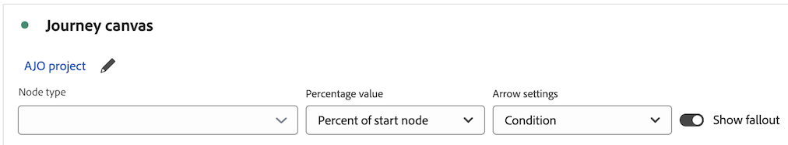

# Configuración de una visualización de lienzo de recorrido

La visualización de lienzo de recorrido le permite analizar y obtener información detallada sobre los recorridos que proporciona a sus usuarios y clientes.

## Información general sobre el lienzo de recorrido

Consulte [Información general sobre el lienzo de recorrido](/help/analysis-workspace/visualizations/journey-canvas/journey-canvas.md) para obtener más información sobre el lienzo de recorrido, que incluye lo siguiente:

* Funciones principales

* Información potencial

* Diferencias entre el lienzo de recorrido y abandonos

* Detalles sobre el análisis de recorridos de Journey Optimizer

* Y mucho más

## Empezar a crear una visualización de lienzo de recorrido

1. Añada un panel en blanco al proyecto, seleccione el icono [!UICONTROL **Visualizaciones**] en el carril izquierdo y, a continuación, arrastre la visualización  [!UICONTROL **Lienzo de recorrido**] al panel.

   O bien

   Añada una visualización de lienzo de recorrido de cualquiera de las formas descritas en la sección [Añadir visualizaciones a un panel](/help/analysis-workspace/visualizations/freeform-analysis-visualizations.md#add-visualizations-to-a-panel) en [Información general sobre las visualizaciones](/help/analysis-workspace/visualizations/freeform-analysis-visualizations.md).

   

1. Especifique la siguiente información básica para configurar el lienzo de recorrido:

   | Campo | Función |
   |---------|----------|
   | [!UICONTROL **Métrica principal**] | Determina la métrica que se usa al calcular los valores porcentuales y numéricos en cada nodo del recorrido.
**Nota**: El ámbito de los datos incluidos en cada valor porcentual y numérico viene determinado por la métrica que elija en el campo **[!UICONTROL Contenedor de lienzo de recorrido]**. Por ejemplo, si **[!UICONTROL Persona]** se establece como contenedor, las estadísticas que se muestran en el recorrido abarcan varias sesiones para una persona determinada. Si **[!UICONTROL Sesión]** se establece como contenedor, las estadísticas que se muestran en el recorrido se limitan a una sola sesión definida para una persona determinada.

Veamos los siguientes ejemplos de cómo afecta la métrica principal a los valores porcentuales y numéricos de cada nodo:
<ul><li>Si _Personas_ es la métrica principal y _Persona_ es el contenedor, solo aquellas personas que tengan un evento que coincida con los criterios de cada nodo sucesivo en el recorrido avanzan por el recorrido. El abandono se produce en un nodo cuando una persona nunca llegó a ninguno de los nodos inmediatamente posteriores del recorrido. Es posible que hayan realizado otras acciones en el sitio, pero no cumplieron los criterios definidos por ninguno de los nodos que siguen inmediatamente.</li><li>Si _Personas_ es la métrica principal y _Sesión_ es el contenedor, solo avanzarán por el recorrido aquellas personas que tengan un evento que cumpla los criterios de cada nodo en el recorrido dentro de una sola sesión. El abandono se produce en un nodo cuando una persona nunca llegó a ninguno de los nodos inmediatamente posteriores del recorrido en una sola sesión. Es posible que hayan realizado otras acciones en el sitio dentro de la sesión, pero no cumplieron los criterios definidos por ninguno de los nodos que siguen inmediatamente.</li></ul> 
La métrica principal afecta a los siguientes aspectos de la visualización del lienzo de recorrido:
<ul><li>El número total que se muestra en cada nodo.  
Por ejemplo, si Eventos es la métrica principal, cada nodo muestra el número de personas que tuvieron un evento que cumple los criterios de ese nodo (y de cada nodo anterior que conduce a él en el recorrido).
</li><li>El porcentaje que se muestra en cada nodo. (Una vez creada la visualización, puede usar el menú desplegable **[!UICONTROL Valor porcentual]** para elegir mostrar el porcentaje del total, el porcentaje del nodo anterior o bien el porcentaje del nodo de inicio).
Por ejemplo, si Eventos es la métrica principal, cada nodo muestra el porcentaje de personas que tuvieron un evento que cumple los criterios de ese nodo (y de cada nodo anterior que conduce a él en el recorrido).
</li><li>Cuando se añade una dimensión a la visualización, se añaden los tres nodos principales de la visualización en función de la métrica principal.</li></ul> |
   | [!UICONTROL **Métrica secundaria**] | Determina la métrica secundaria que se usa al calcular los valores porcentuales y numéricos en cada nodo del recorrido. La métrica secundaria es opcional. 
**Nota**: El ámbito de los datos incluidos en cada valor porcentual y numérico viene determinado por la métrica que elija en el campo **[!UICONTROL Contenedor de lienzo de recorrido]**. Por ejemplo, si **[!UICONTROL Persona]** se establece como contenedor, las estadísticas que se muestran en el recorrido abarcan varias sesiones para una persona determinada. Si **[!UICONTROL Sesión]** se establece como contenedor, las estadísticas que se muestran en el recorrido se limitan a una sola sesión definida para una persona determinada.

Cuando se configura una métrica secundaria, afecta a los siguientes aspectos de la visualización del lienzo de recorrido:
<ul><li>El número total que se muestra en cada nodo debajo de la métrica principal. 
Por ejemplo, si Cuentas es la métrica secundaria, el número de cuentas se muestra en el nodo para todas las personas que llegaron a ese nodo en el recorrido.
</li><li>El porcentaje que se muestra en cada nodo debajo de la métrica principal. (Una vez creada la visualización, puede elegir mostrar el porcentaje del total o bien del nodo de inicio).</li>
Por ejemplo, si Sesiones es la métrica secundaria, cada nodo muestra el porcentaje de sesiones que alcanzaron ese nodo en el recorrido (el porcentaje del total o del nodo de inicio).
</li></ul> |
   | [!UICONTROL **Recorrido de Journey Optimizer**]<!-- name? --> | Seleccione el recorrido de Journey Optimizer que desee utilizar como base para el análisis en el lienzo de recorrido. Están disponibles los recorridos con cualquiera de los siguientes estados: Activo, Detenido o Finalizado 
También puede dejar esta opción en blanco si desea un lienzo en blanco desde el que generar el análisis en Analysis Workspace.
 
Cuando se analiza un recorrido de Journey Optimizer en el lienzo de recorrido, el recorrido se muestra con el mismo orden, la misma secuencia y misma estructura que en Journey Optimizer. Para obtener más información, consulte [Analizar recorridos de Journey Optimizer](/help/analysis-workspace/visualizations/journey-canvas/journey-canvas.md#analyze-journey-optimizer-journeys) en [Información general sobre el lienzo de recorrido](/help/analysis-workspace/visualizations/journey-canvas/journey-canvas.md).

**Nota**: Esta opción solo se muestra cuando se detectan datos de Journey Optimizer en la misma vista de datos seleccionada en el panel de Analysis Workspace donde está añadiendo la visualización. Para obtener información sobre cómo cambiar la vista de datos en un panel de Analysis Workspace, consulte [Descripción general de Analysis Workspace](/help/analysis-workspace/home.md).
 |

1. (Opcional) Seleccione [!UICONTROL **Mostrar configuración avanzada**] y, a continuación, especifique la siguiente información:

   | Campo | Función |
   |---------|----------|
   | [!UICONTROL **Contenedor de lienzo de recorrido**] | Seleccione el contenedor en el que desea centrarse durante todo el recorrido. El contenedor que elija determina el ámbito de los datos capturados en el recorrido. Esto afecta a las estadísticas que se muestran en la visualización. (Si los nombres de contenedor difieren de los nombres predeterminados que se muestran a continuación, se personalizaron en la vista de datos).<ul><li>**Sesión:** restringe las estadísticas de la visualización para que se incluyan en una sola sesión definida para una persona determinada. Esto significa que los números y porcentajes que aparecen en cada nodo (que se basan en las métricas principal y secundaria) deben producirse en una sola sesión para cada persona. Es decir, una persona puede representarse varias veces en un solo recorrido.
Esta plantilla usa la métrica Sesiones.
</li><li>**Persona:** (predeterminado) permite que las estadísticas de la visualización abarquen varias sesiones para una persona determinada. Esto significa que los números y porcentajes que aparecen en cada nodo (que se basan en las métricas principal y secundaria) pueden producirse en cualquier número de sesiones, siempre y cuando las sesiones pertenezcan a la misma persona. Es decir, una persona solo puede representarse una vez en un solo recorrido.
Este contenedor utiliza la métrica Personas.
</li></ul> |

1. Seleccione [!UICONTROL **Generar**].

   Si analiza un recorrido de Journey Optimizer en el lienzo de recorrido, el recorrido se muestra con el mismo orden, la misma secuencia y la misma estructura que en Journey Optimizer. (Solo los usuarios con acceso a Journey optimizer pueden seleccionar un recorrido de Journey Optimizer).

   <!-- add screen shot -->

   Si no ha seleccionado ningún recorrido de Journey Optimizer, aparece un lienzo en blanco en el que puede empezar a añadir nodos al recorrido. (Solo los usuarios con acceso a Journey optimizer pueden seleccionar un recorrido de Journey Optimizer).

   <!-- add screen shot -->

1. Tanto si está creando un nuevo análisis a partir de un lienzo en blanco como si está analizando un recorrido de Journey Optimizer, puede configurar el recorrido tal como se describe en [Configuración de opciones de visualización](#configure-visualization-settings).

## Configuración de opciones de visualización

Hay varias opciones de configuración disponibles en el encabezado del lienzo de recorrido.

Para definir la configuración de la visualización del lienzo de recorrido:

1. En Analysis Workspace, abra una visualización de lienzo de recorrido existente o [empiece a crear una nueva](#begin-building-a-journey-canvas-visualization).

   Las opciones que le permiten configurar la visualización del lienzo de recorrido están disponibles en el encabezado:

   

1. Configure cualquiera de las siguientes opciones que se muestran en la parte superior de la visualización:

   | Configuración | Función |
   |---------|----------|
   | [!UICONTROL **Valor porcentual**] | El valor porcentual que se muestra en cada nodo del recorrido.

 
Tenga en cuenta lo siguiente al configurar los valores porcentuales que se muestran en los nodos del recorrido:
<ul><li>En cada nodo de la métrica principal se muestra un porcentaje. También se muestra un porcentaje para la métrica secundaria si hay una configurada. (Para obtener más información sobre la configuración de la métrica principal y secundaria, consulte [Empezar a crear una visualización de lienzo de recorrido](#begin-building-a-journey-canvas-visualization)).</li><li>Los porcentajes incluyen todas las personas o sesiones que están incluidas en la vista de datos dentro del intervalo de fecha del panel. El uso de _personas_ o _sesiones_ depende de la configuración del contenedor. (Para obtener más información sobre la configuración del contenedor, consulte [Empezar a crear una visualización de lienzo de recorrido](#begin-building-a-journey-canvas-visualization)).</li></ul> 
Elija entre las siguientes opciones:
 <ul><li>[!UICONTROL **Porcentaje del nodo de inicio**]: calcula los porcentajes mostrados en cada nodo en relación con el nodo de inicio. Los porcentajes se basan en la métrica principal y secundaria que haya seleccionado. 
Un _nodo de inicio_ es un nodo que no tiene nodos conectados que lo precedan.

Un recorrido puede contener varios nodos de inicio. Sin embargo, se utiliza [!UICONTROL **Porcentaje del total**] si el recorrido contiene dos o más nodos de inicio que llevan a un nodo común. Si desea utilizar [!UICONTROL **Porcentaje del nodo de inicio**], actualice el recorrido para que cada nodo del recorrido pueda rastrearse hasta un solo nodo de inicio.
</li><li>[!UICONTROL **Porcentaje del nodo anterior**]: calcula los porcentajes mostrados en cada nodo en relación con el nodo anterior. Los porcentajes se basan en la métrica principal y secundaria que haya seleccionado.</li><li>[!UICONTROL **Porcentaje del total**]: calcula los porcentajes mostrados en cada nodo en relación con todos los datos de la vista de datos. Los porcentajes se basan en la métrica principal y secundaria que haya seleccionado.</li></ul> |
   | [!UICONTROL **Configuración de flecha**] | Las flechas que aparecen entre los nodos del lienzo de recorrido se pueden configurar para que muestren etiquetas y valores personalizados. 

_Etiquetas_ son nombres personalizados que aparecen en las flechas. En una flecha determinada solo se muestra una etiqueta. Las etiquetas pueden ser cualquiera de las siguientes y se muestran en este orden de preferencia:
<ol><li>Se ha añadido un nombre personalizado desde el lienzo de recorrido (tal como se describe en [Añadir o actualizar una etiqueta en una flecha](#add-or-update-a-label-on-an-arrow))</li><li>Una etiqueta de Journey Optimizer</li><li>Una condición de Journey Optimizer</li></ol>
_Valores_ son los números y porcentajes que aparecen en las flechas e indican las personas o sesiones que se movieron de un nodo al siguiente en el recorrido. (Es decir, quienes no abandonaron el recorrido en un paso determinado). 

Las siguientes opciones están disponibles para los recorridos que no se originaron en Journey Optimizer y para los recorridos de Journey Optimizer que no se han modificado significativamente en el lienzo de recorrido: (las modificaciones significativas incluyen añadir o quitar nodos, añadir o quitar flechas o cambiar los componentes de un nodo).
<ul><li>[!UICONTROL **Sin etiquetas**]: no se muestran etiquetas en las flechas del recorrido.   Esta opción solo está disponible si el recorrido se ha modificado en </li><li>[!UICONTROL **Solo etiquetas**]: las etiquetas se muestran en las flechas del recorrido.</li></ul>
Las siguientes opciones están disponibles para los recorridos de Journey Optimizer que se han modificado significativamente en el lienzo de Recorrido: (Las modificaciones importantes incluyen agregar o quitar nodos, agregar o quitar flechas o cambiar los componentes de un nodo).(**Nota**: Estas opciones solo se muestran cuando se detectan datos de Journey Optimizer en la misma vista de datos seleccionada en el panel de Analysis Workspace donde está agregando la visualización. Para obtener información sobre cómo cambiar la vista de datos en un panel de Analysis Workspace, consulte [Descripción general de Analysis Workspace](/help/analysis-workspace/home.md)).
<ul><li>[!UICONTROL **Sin etiquetas ni valores**]: no se muestran etiquetas ni valores en las flechas del recorrido.</li><li>[!UICONTROL **Solo etiquetas**]: en las flechas del recorrido solo se muestran etiquetas. No se muestran valores.</li><li>[!UICONTROL **Solo valores**]: en las flechas del recorrido solo se muestran valores. No se muestran las etiquetas.</li><li>[!UICONTROL **Valores y etiquetas**]: tanto las etiquetas como los valores se muestran en las flechas del recorrido.</li></ul> |
   | [!UICONTROL **Mostrar visitas**] | Los datos de visitas en orden previsto muestran un porcentaje y un número que abandonan cada nodo del recorrido. Los datos de visitas en orden previsto se basan en la métrica asociada a la configuración del contenedor del recorrido; no se basan en la métrica principal o secundaria. 

De manera predeterminada, el contenedor es _Persona_, por lo que la métrica utilizada para los datos de visitas en el orden previsto es _Personas_. Si el contenedor cambia a _Sesión_, la métrica usada para los datos de visitas en el orden previsto es _Sesiones_, y así sucesivamente.

Por ejemplo, con _Persona_ como configuración del contenedor, el abandono muestra el porcentaje y el número de personas en cada nodo del recorrido que nunca llegaron a ninguno de los nodos inmediatamente posteriores. Es posible que hayan realizado otras acciones en el sitio, pero no cumplieron los criterios definidos por ninguno de los nodos que siguen inmediatamente.
 
Para obtener más información acerca de la configuración del contenedor de lienzo de recorrido, consulte [Empezar a crear una visualización de lienzo de recorrido](#begin-building-a-journey-canvas-visualization). |
   | **Controles de zoom** | Los siguientes controles de zoom están disponibles en la esquina superior derecha del lienzo:<ul><li>**Aumentar** : amplía áreas específicas de la visualización.
También puede utilizar controles del ratón, como pellizcar en un panel táctil.</li><li>**Reducir** : reduce la visualización para permitir más espacio en el lienzo.
También puede utilizar controles del ratón, como pellizcar en un panel táctil.
</li><li>**Ajustar pantalla** : ajusta la configuración actual de zoom y de desplazamiento para que la visualización completa ocupe toda la pantalla.</li></ul>
Para desplazarse por el lienzo después de aumentar o reducir, haga clic con el ratón y arrastre hasta la ubicación deseada.
 |

1. Continúe con [Adición de nodos](#add-nodes).

## Adición de nodos

Los nodos de una visualización de lienzo de recorrido representan los eventos o las acciones de un recorrido de usuario.

Los nodos se crean de las siguientes maneras: arrastrando componentes de Workspace del carril izquierdo al lienzo; permitiendo que el lienzo de recorrido elija los nodos principales siguientes o anteriores en función de los nodos existentes; o duplicando nodos existentes.

### Arrastre de componentes desde el carril izquierdo

1. En Analysis Workspace, abra una visualización de lienzo de recorrido existente o [empiece a crear una nueva](#begin-building-a-journey-canvas-visualization).

1. Arrastre métricas, dimensiones, elementos de dimensión, segmentos o intervalos de fechas desde el carril izquierdo al lienzo. Se admiten las métricas basadas en un [campo derivado](/help/data-views/derived-fields/derived-fields.md). Sin embargo, no se admiten las métricas calculadas ni las métricas o dimensiones basadas en un [conjunto de datos de resumen](/help/data-views/summary-data.md).

   Puede seleccionar varios componentes manteniendo pulsada la tecla Mayús o Comando (en Mac) o Ctrl (en Windows).

   La visualización se actualiza en función de la métrica principal de la siguiente manera (según el tipo de componente y del área del lienzo donde se coloque):

   | Tipo de componente | Ubicación del componente | Actualizaciones de la visualización después de añadir un nodo |
   |---------|----------|----------|
   | Métrica | Área en blanco del lienzo | El nodo muestra dónde se soltó el componente, sin conexión con ningún nodo existente. |
   | Métrica | Un nodo existente | El componente se combina automáticamente con el nodo existente. (Consulte [Combinación de nodos](#combine-nodes) para obtener más información). |
   | Métrica | Una flecha entre dos nodos existentes | El nodo se muestra entre los dos nodos existentes donde se soltó el componente y está conectado a ambos nodos existentes. Consulte [Conexión de nodos](#connect-nodes) para obtener más información. |
   | Dimensión | Área en blanco del lienzo | Se crean tres nodos para los tres elementos de dimensión principales en los que se soltó el componente, sin conexión con ningún nodo existente. (**Nota:** Si solo se muestran uno o dos nodos, significa que los datos solo están disponibles para uno o dos de los elementos de dimensión. Si no se muestran nodos, significa que no hay datos disponibles para ninguno de los elementos de dimensión. En este caso, intente añadirlos a un punto diferente del recorrido, ajustar el intervalo de fechas de la visualización o elegir una dimensión diferente).
Mantenga pulsada la tecla Mayús cuando suelte la dimensión en el lienzo para añadirla como un solo nodo con tres elementos de dimensión.
 |
   | Dimensión | Un nodo existente | Se aplica automáticamente un desglose al nodo con los cinco elementos de dimensión principales mostrados.<!--what happens if you hold Shift?-->
Para ver el desglose en una nueva visualización de tabla de forma libre, seleccione el vínculo [!UICONTROL **Abrir en tabla de forma libre**] en el nodo.
 |
   | Dimensión | Una flecha que conecta dos nodos existentes | Se crean tres nodos para los tres elementos de dimensión principales que siguen al primer evento después del primer nodo (de personas/sesiones que finalmente llegan al segundo nodo). Los nodos se muestran entre los dos nodos existentes en los que se soltó el componente y cada nodo está conectado a los dos nodos existentes. (**Nota:** Si solo se muestran uno o dos nodos, significa que los datos solo están disponibles para uno o dos de los elementos de dimensión. Si no se muestran nodos, significa que no hay datos disponibles para ninguno de los elementos de dimensión. En este caso, intente añadirlos a un punto diferente del recorrido, ajustar el intervalo de fechas de la visualización o elegir una dimensión diferente).
Mantenga pulsada la tecla Mayús cuando suelte la dimensión en el lienzo para añadirla como un solo nodo con tres elementos de dimensión. (Consulte [Conexión de nodos](#connect-nodes) para obtener más información).
 |
   | Elemento de dimensión | Área en blanco del lienzo | El nodo muestra dónde se soltó el componente, sin conexión con ningún nodo existente. |
   | Elemento de dimensión | Un nodo existente | El componente se combina automáticamente con el nodo existente. |
   | Elemento de dimensión | Una flecha que conecta dos nodos existentes | El nodo se muestra entre los dos nodos existentes donde se soltó el componente y está conectado a ambos nodos existentes. Consulte [Conexión de nodos](#connect-nodes) para obtener más información. |
   | Segmento | Área en blanco del lienzo | El nodo muestra dónde se soltó el componente sin estar conectado con ningún otro nodo.
El número y el porcentaje que aparecen en el nodo incluyen el total de la métrica principal, segmentada por el segmento seleccionado.
 
Por ejemplo, si se selecciona Personas como métrica principal para el recorrido y luego se añade un segmento de Hoy a un área en blanco del lienzo, se muestran todas las personas que tuvieron un evento hoy.
 |
   | Segmento | Un nodo existente | Aplica el segmento al nodo existente. |
   | Segmento | Una flecha que conecta dos nodos | El nodo se muestra entre los dos nodos existentes donde se soltó el componente y está conectado a ambos nodos existentes. Consulte [Conexión de nodos](#connect-nodes) para obtener más información.
Aplica el segmento al punto de la ruta donde se soltó el componente.
 |
   | Intervalo de fecha | Área en blanco del lienzo | El nodo muestra dónde se soltó el componente, sin conexión con ningún otro nodo.
El número y el porcentaje que aparecen en el nodo incluyen el total de la métrica principal, segmentado por el intervalo de fecha seleccionado.
 
Por ejemplo, si se selecciona Personas como métrica principal para el recorrido, al añadir después un intervalo de fecha de Este mes a un área en blanco del lienzo se muestran todas las personas que tuvieron un evento durante el mes actual.
 |
   | Intervalo de fecha | Un nodo existente | Aplica el intervalo de fecha únicamente a este panel. |
   | Intervalo de fecha | Una flecha que conecta dos nodos | El nodo se muestra entre los dos nodos existentes donde se soltó el componente y está conectado a ambos nodos existentes. Consulte [Conexión de nodos](#connect-nodes) para obtener más información.
Aplica el intervalo de fecha al punto de la ruta donde se soltó el componente.
 |
   | Múltiples componentes | Un área en blanco del lienzo | **Si ninguno de los componentes es una dimensión:**
Cada componente se muestra como un nodo independiente donde se soltaron los componentes, sin conexión con ningún nodo existente.

Mantenga pulsada la tecla Mayús cuando suelte los componentes en el lienzo para añadirlos como un nodo combinado. 

**Si alguno de los componentes que está añadiendo son dimensiones:**

Cada componente se muestra como un nodo independiente donde se soltaron los componentes, sin conexión con ningún nodo existente.

Solo se puede añadir una dimensión a la vez. Cuando se añade la dimensión, se crean tres nodos para los tres elementos de dimensión principales en los que se soltó el componente.

Mantenga pulsada la tecla Mayús cuando suelte los componentes en el lienzo para añadirlos como un nodo combinado. Los tres elementos de dimensión principales se combinan con cada nodo. (Consulte [Combinación de nodos](#combine-nodes) para obtener más información).
 |
   | Múltiples componentes | Un nodo existente | Todos los componentes se combinan con el nodo existente.
Si alguno de los componentes que está añadiendo es una dimensión, los tres elementos de dimensión principales se combinan con el nodo.
 
Solo se puede añadir una dimensión a la vez.
 |
   | Múltiples componentes | Una flecha que conecta dos nodos existentes | **Si ninguno de los componentes es una dimensión:**
Cada componente se muestra como un nodo independiente en el lugar donde se soltaron los componentes y cada nodo está conectado a ambos nodos existentes. Consulte [Conexión de nodos](#connect-nodes) para obtener más información.
Mantenga pulsada la tecla Mayús cuando suelte los componentes en el lienzo para añadirlos como un nodo combinado. (Los componentes deben ser del mismo tipo para combinarse en un solo nodo). (Consulte [Combinación de nodos](#combine-nodes) para obtener más información).

**Si alguno de los componentes que está añadiendo son dimensiones:**

Cada componente se muestra como un nodo independiente en el lugar donde se soltaron los componentes y cada nodo está conectado a ambos nodos existentes.

Solo se puede añadir una dimensión a la vez. Cuando se añade la dimensión, se crean tres nodos para los tres elementos principales de la dimensión que siguen al primer evento después del primer nodo (de personas o sesiones que finalmente llegan al segundo nodo). Cada nodo está conectado a ambos nodos existentes. Consulte [Conexión de nodos](#connect-nodes) para obtener más información.

Mantenga pulsada la tecla Mayús cuando suelte los componentes en el lienzo para añadirlos como un nodo combinado. Los tres elementos de dimensión principales se combinan con cada nodo y cada nodo está conectado a ambos nodos existentes. Consulte [Combinación de nodos](#combine-nodes) para obtener más información.
 |

   Los nodos se muestran como un cuadro rectangular con la siguiente información:

   * Nombre del componente

   * El tipo de componente (como métrica o dimensión)

   * Estadísticas de métrica principales (total y porcentaje)

   * Estadísticas de métricas secundarias (total y porcentaje)

   Un nodo parpadeante o brillante indica que se están cargando datos para ese nodo.

1. Repita este proceso para continuar añadiendo nodos para construir el recorrido.

1. Siga personalizando el recorrido tal como se describe en las secciones siguientes. Puede conectar nodos, cambiarles el nombre, aplicar desgloses, crear públicos, añadir restricciones de tiempo y mucho más.

### Mostrar los nodos principales en función de los nodos existentes

Puede mostrar automáticamente los nodos inmediatos principales en función de los nodos que ya están en el lienzo. Puede añadir los nodos principales al lienzo de recorrido o verlos en una tabla de forma libre.

El lienzo de recorrido utiliza la métrica principal para determinar qué nodos mostrar.

Esta opción está disponible para los siguientes objetos del lienzo:

* Nodos individuales

* La flecha entre los nodos

#### Mostrar los nodos principales después de un nodo existente

Puede seleccionar un nodo y mostrar en el recorrido los elementos de dimensión principales que aparecen inmediatamente después de él. Puede añadir los tres elementos de dimensión principales al lienzo de recorrido como nodos independientes o puede ver todos los elementos de dimensión principales en una tabla de forma libre.

1. Haga clic con el botón derecho en el nodo en el que desee mostrar los elementos de dimensión principales que van después de él en el recorrido.

   El nodo no puede tener ningún nodo existente que salga de él en el recorrido.

1. Seleccione [!UICONTROL **Mostrar los nodos principales después de este nodo**].

1. Seleccione dónde desea mostrar los elementos de dimensión:

   * [!UICONTROL **En lienzo de recorrido**]: añade los tres nodos principales al lienzo que va después de este nodo en el recorrido. Cada nodo está conectado al nodo que ha seleccionado como una rama independiente en el lienzo.

   * [!UICONTROL **En una tabla de forma libre**]: crea una visualización de tabla de forma libre que muestra todos los elementos de dimensión principales que van después de este nodo en el recorrido.

1. Seleccione la dimensión que desee en la lista de dimensiones.

   Según lo que haya elegido en el paso anterior, los tres elementos de dimensión principales se añaden al lienzo como tres nodos independientes o todos los elementos de dimensión principales se muestran en una tabla de forma libre.

#### Mostrar los nodos principales antes de un nodo existente

Puede seleccionar un nodo y mostrar en el recorrido los elementos de dimensión principales que aparecen inmediatamente antes de él en el recorrido. Puede añadir los tres elementos de dimensión principales al lienzo de recorrido como nodos independientes o puede ver todos los elementos de dimensión principales en una tabla de forma libre.

1. Haga clic con el botón derecho en el nodo en el que desea mostrar los elementos de dimensión principales que le preceden en el recorrido.

   Este nodo no puede tener ningún nodo existente que llegue a él en el recorrido.

1. Seleccione [!UICONTROL **Mostrar los nodos principales antes de este nodo**].

1. Seleccione dónde desea mostrar los elementos de dimensión:

   * [!UICONTROL **En lienzo de recorrido**]: añade los tres nodos principales al lienzo que precede a este nodo en el recorrido. Cada nodo está conectado al nodo que ha seleccionado como una rama independiente en el lienzo.

   * [!UICONTROL **En una tabla de forma libre**]: crea una visualización de tabla de forma libre que muestra todos los elementos de dimensión principales que preceden a este nodo en el recorrido.

1. Seleccione la dimensión que desee en la lista de dimensiones.

   Según lo que haya elegido en el paso anterior, los tres elementos de dimensión principales se añaden al lienzo como tres nodos independientes o todos los elementos de dimensión principales se muestran en una tabla de forma libre.

#### Mostrar los nodos principales entre los nodos existentes

Puede seleccionar una flecha y mostrar los elementos de dimensión principales que se encuentran entre dos nodos existentes en el recorrido. Puede añadir los tres elementos de dimensión principales al lienzo de recorrido como nodos independientes o puede ver todos los elementos de dimensión principales en una tabla de forma libre.

1. Haga clic con el botón derecho en la flecha entre los dos nodos donde desea mostrar los elementos de dimensión principales.

1. Seleccione [!UICONTROL **Mostrar los nodos principales entre estos nodos**].

1. Seleccione dónde desea mostrar los elementos de dimensión:

   * [!UICONTROL **En lienzo de recorrido**]: añade los tres nodos principales al lienzo que se encuentra entre los dos nodos existentes. Cada nodo está conectado a los nodos adyacentes como una rama independiente en el lienzo.

   * [!UICONTROL **En una tabla de forma libre**]: crea una visualización de tabla de forma libre que muestra todos los elementos de dimensión principales que se encuentran entre los dos nodos existentes.

1. Seleccione la dimensión que desee en la lista de dimensiones.

   Según lo que haya elegido en el paso anterior, los tres elementos de dimensión principales se añaden al lienzo como tres nodos independientes o todos los elementos de dimensión principales se muestran en una tabla de forma libre.

### Duplicado de nodos

La opción de duplicado está disponible para los siguientes objetos del lienzo:

* Nodos individuales

* Varios nodos

Para duplicar nodos:

1. Seleccione uno o varios nodos que desee duplicar.

   Para seleccionar varios nodos, mantenga presionada la tecla Comando (en Mac) o Ctrl (en Windows).

1. Haga clic con el botón derecho en uno de los nodos seleccionados y, a continuación, seleccione [!UICONTROL **Duplicar**].

## Diseño del recorrido

El orden de los nodos y las conexiones entre ellos afectan a los datos del lienzo de recorrido. Los recorridos deben reflejar de forma visual y precisa la secuencia de eventos de los que desee informar.

Una vez añadidos los nodos al lienzo, puede reorganizarlos, combinarlos, conectarlos y añadir restricciones de tiempo entre ellos.

### Reorganización de nodos

Los recorridos del lienzo de recorrido consisten en un gráfico flexible de nodos y flechas que representan cualquier combinación de eventos, elementos de dimensión y segmentos.

Arrastre los nodos en el lienzo para reorganizar los eventos y las condiciones del recorrido.

A medida que reorganiza el orden de los nodos en el recorrido, los datos se actualizan en consecuencia.

### Combinación de nodos

Un nodo combinado en el lienzo de recorrido es un solo punto del recorrido del usuario (nodo) que contiene dos o más componentes unidos mediante lógica.

#### Creación de nodos combinados

Puede realizar cualquiera de las siguientes acciones para combinar nodos en Lienzo de recorrido:

* Desde el carril izquierdo, arrastre un solo componente a un nodo del lienzo.

* Desde el carril izquierdo, arrastre varios componentes simultáneamente a un nodo del lienzo.

* Desde el carril izquierdo, arrastre varios componentes simultáneamente a una zona en blanco del lienzo mientras mantiene pulsada la tecla Mayús.

<!-- * On the canvas, select the nodes that you want to combine, right-click one of the selected nodes, then select **Combine**. Is there a limit on how many you can combine? -->

#### Lógica al combinar nodos

La lógica que se aplica a los nodos cuando se combinan es diferente según los tipos de componente que se combinen, tal como se indica a continuación:

>[!TIP]
>
>Para ver la lógica de un nodo combinado, haga clic con el botón derecho en el nodo y seleccione [!UICONTROL **Crear segmento de nodo**]. La lógica se muestra en la sección [!UICONTROL **Definición**].

| Tipos de componentes para combinar | Lógica (operador) empleada |
|---------|----------|
| Métrica + Métrica | Unido con OR |
| Elemento de dimensión + Elemento de dimensión (de la misma dimensión principal) | Unido con OR |
| Elemento de dimensión + Elemento de dimensión (de diferentes dimensiones principales) | Unido con AND |
| Segmento + Segmento | Unido con AND |
| Dimensión + Métrica, Intervalo de fecha o Segmento | Unido con AND |
| Intervalo de fecha + Métrica, Segmento o Dimensión | Unido con AND |
| Segmento + Métrica, Intervalo de fecha o Dimensión | Unido con AND |

### Conexión de nodos

Puede conectar nodos que ya están en el lienzo o puede conectar un nodo cuando lo añada al lienzo.

Conecte los nodos para definir la secuencia de eventos del recorrido.

#### Flechas entre nodos

Los nodos están conectados por una flecha. Tanto la dirección como la anchura de la flecha tienen importancia:

* **Dirección**: indica la secuencia de eventos del recorrido

* **Anchura**: indica el volumen porcentual de un nodo a otro

  

#### Lógica al conectar nodos

Cuando se conectan nodos en Lienzo de recorrido, se conectan mediante el operador THEN. Esto también se conoce como [segmentación secuencial](/help/components/segments/seg-sequential-build.md).

Los nodos se conectan como una “ruta eventual”, lo que significa que los visitantes se contabilizan siempre y cuando finalmente se desplacen un nodo al otro, independientemente de los eventos que se produzcan entre los dos nodos. El tiempo asignado para que los usuarios se desplacen por la ruta viene determinado por la configuración del contenedor. <!-- It can also be controlled by [adding a time constraint](#add-a-time-constraint-between-nodes). -->

Para ver la lógica de los nodos conectados, haga clic con el botón derecho del ratón en el nodo y seleccione [!UICONTROL **Crear segmento de nodo**]. La lógica se muestra en la sección [!UICONTROL **Definición**].

#### Conexión de los nodos existentes

Los recorridos no pueden ser circulares, y se pueden volver a conectar en bucle con los nodos previamente conectados.

Para conectar nodos en el lienzo de recorrido:

1. En una visualización de Lienzo de recorrido, pase el puntero por encima del nodo que aparece primero en la secuencia de recorrido que desea conectar a otro nodo.

   Aparecen cuatro puntos azules a cada lado del nodo seleccionado.

1. Arrastre cualquiera de los cuatro puntos azules a cualquiera de los cuatro lados del nodo al que desee conectarse.

   Aparecerá una flecha que conecta los dos nodos. Consulte [Flechas entre nodos](#arrows-between-nodes) para obtener más información.

#### Conexión de nodos al añadir un nodo

Al añadir un nodo al lienzo, puede colocarlo entre dos nodos conectados. El nodo se añade al flujo del recorrido entre los dos nodos existentes.

Para obtener más información, consulte [Adición de nodos](#add-nodes).

<!--

### Add a time constraint between nodes

>[!AVAILABILITY]
>
>This feature is not yet available.

You can set a time constraint between nodes. When a time constraint is in place, people are considered to have fallen out of the journey if they follow the defined journey but take longer than the allotted time period to move between the nodes.

The option to add a time constraint is available for the following objects on the canvas:

* The arrow between nodes

To add a time constraint:

1. In a Journey canvas visualization, right-click the arrow between 2 nodes, then select [!UICONTROL **Add time constraint**].

from Travis: You can set time to be within X amount of time or after X amount of time (those are the only two options I think, but we can check with Brandon). 
1. Choose from the following options: 

-->

## Administración de nodos o flechas

<!--

### Change the color of a node or arrow

>[!AVAILABILITY]
>
>This feature is not yet available.

You can visually customize a journey by changing the color of any node or arrow on the canvas. For example, you could adjust colors to indicate a desirable or undesirable event.

The option to change the color is available for the following objects on the canvas:

* Individual nodes

* The arrow between nodes

To change the color of a node or arrow:

1. In a Journey canvas visualization, right-click the node or arrow whose color you want to change.

1. Select [!UICONTROL **Change color**]. 

1. Select the desired color. 

   The following colors are available: 

-->

### Cambiar el nombre de un nodo

Al arrastrar un componente a una visualización de lienzo de recorrido, se crea un nodo con el mismo nombre que el nombre del componente. Puede cambiar el nombre del nodo para que coincida mejor con el paso del recorrido que representa el nodo.

La opción para cambiar el nombre está disponible para los siguientes objetos del lienzo:

* Nodos individuales

Para cambiar el nombre de un nodo:

1. En una visualización de Lienzo de recorrido, haga clic con el botón derecho en el nodo cuyo nombre desee cambiar.

1. Seleccione [!UICONTROL **Cambiar nombre**].

1. Especifique un nombre nuevo y, a continuación, pulse Entrar.<!--is that right?-->

### Adición o actualización de una etiqueta en una flecha

Las flechas que aparecen entre los nodos del lienzo de recorrido se pueden configurar para que muestren etiquetas y valores personalizados.

Las etiquetas son nombres personalizados que aparecen en las flechas. En una flecha determinada solo se muestra una etiqueta.

Para obtener más información sobre las etiquetas y los valores que aparecen en las flechas, consulte “Configuración de flecha” en [Configuración de opciones de visualización](#configure-visualization-settings).

La opción para añadir o actualizar una etiqueta está disponible para los siguientes objetos del lienzo:

* La flecha entre los nodos

Para añadir una etiqueta a una flecha:

1. En una visualización de Lienzo de recorrido, haga clic con el botón derecho en la flecha donde desea añadir una etiqueta.

1. Seleccione **[!UICONTROL Añadir etiqueta]**.

1. Especifique un nombre para la etiqueta y, a continuación, pulse Entrar.

   Si la configuración de flecha está actualmente configurada para ocultar etiquetas, aparecerá un mensaje que le solicitará que muestre las etiquetas.

Para actualizar una etiqueta existente en una flecha:

1. En una visualización de Lienzo de recorrido, haga clic con el botón derecho en la flecha donde desea añadir una etiqueta.

1. Seleccione **[!UICONTROL Actualizar etiqueta]**.

1. Especifique un nombre para la etiqueta y, a continuación, pulse Entrar.

   Si la configuración de flecha está actualmente configurada para ocultar etiquetas, aparecerá un mensaje que le solicitará que muestre las etiquetas.

### Aplicación de un desglose

La opción para aplicar un desglose a los datos está disponible para los siguientes objetos del lienzo:

* Nodos individuales

* Varios nodos

* La flecha entre los nodos

* Varias flechas entre nodos

* Datos de visitas en el orden previsto (cuando este se muestra en un nodo)

Al aplicar un desglose, tenga en cuenta lo siguiente:

* Los desgloses se aplican a la métrica principal. La métrica secundaria no se verá afectada.

* Al aplicar un desglose no se cambia el recorrido. En su lugar, simplemente muestra un desglose de los datos del nodo donde se aplica.

* Si un nodo ya tiene un desglose, la aplicación de un nuevo desglose sustituye al existente.

* Los datos de desglose se actualizan si los cambios se realizan en un punto anterior del recorrido.

#### Aplicar un desglose a nodos, flechas o datos de visitas en el orden previsto

1. En una visualización de lienzo de Recorrido, realice una de las siguientes acciones:

   * Haga clic con el botón derecho en la visita en orden previsto que se produce en un nodo (cuando se muestra la visita en orden previsto) al que desee aplicar un desglose.

   * Seleccione uno o varios nodos a los que desee aplicar un desglose y, a continuación, haga clic con el botón derecho en uno de los nodos seleccionados.

   * Seleccione una o más flechas entre 2 nodos a los que desee aplicar un desglose y, a continuación, haga clic con el botón derecho en una de las flechas seleccionadas.

     Para seleccionar varios nodos o flechas, mantenga presionada la tecla Comando (en Mac) o Ctrl (en Windows).

1. Seleccione [!UICONTROL **Desglose**].

1. Seleccione dónde desea ver el desglose:

   * [!UICONTROL **En lienzo de recorrido**]

   * [!UICONTROL **En una tabla de forma libre**]

1. Seleccione la dimensión que desee utilizar para el desglose.

   Si decide que desea ver el desglose en Lienzo de recorrido, en el nodo se mostrarán los cinco elementos de dimensión principales. Hay una opción disponible en el nodo para abrir el desglose en una tabla de forma libre.

   Si decide que desea ver el desglose en una tabla de forma libre, los elementos de dimensión principales se mostrarán en una nueva tabla de forma libre inmediatamente encima de la visualización de Lienzo de recorrido.

#### Aplicación de un desglose a un nodo individual

Puede arrastrar una dimensión desde el carril izquierdo al nodo del lienzo al que desea aplicar el desglose.

Para obtener más información, consulte [Adición de nodos](#add-nodes).

#### Quitar un desglose

Para quitar un desglose que se haya aplicado:

1. Haga clic con el botón derecho en el nodo que tenga aplicado el desglose.

1. Seleccione **[!UICONTROL Quitar desglose]**.

### Crear un público

La opción para crear un público está disponible para los siguientes objetos del lienzo:

* Nodos individuales

* Varios nodos

* La flecha entre los nodos

* Varias flechas entre nodos

* Datos de visitas en el orden previsto (cuando este se muestra en un nodo)

Cuando se crea un público desde varios nodos o flechas, estos se unen con el operador OR.

Para crear un público:

1. En una visualización de lienzo de Recorrido, realice una de las siguientes acciones:

   * Haga clic con el botón derecho en la visita en orden previsto que se produce en un nodo (cuando se muestra la visita en orden previsto) para el que desee crear una audiencia.

   * Seleccione uno o varios nodos para los que desee crear una audiencia y, a continuación, haga clic con el botón derecho en uno de los nodos seleccionados.

   * Seleccione una o más flechas entre 2 nodos para los que desea crear una audiencia y, a continuación, haga clic con el botón derecho en una de las flechas seleccionadas.

     Para seleccionar varios nodos o flechas, mantenga presionada la tecla Comando (en Mac) o Ctrl (en Windows).

   >[!NOTE]
   >
   >Los públicos no pueden incluir métricas calculadas ni métricas basadas en un [conjunto de datos de resumen](/help/data-views/summary-data.md). Si intenta crear un público desde cualquier área del lienzo de recorrido que contenga una métrica calculada o una métrica basada en un conjunto de datos de resumen, la métrica calculada no se incluirá en la definición de público.

1. Seleccione [!UICONTROL **Crear público desde el nodo**] o [!UICONTROL **Crear público a partir de la flecha**].

1. Siga creando y publicando el público tal como se describe en [Creación y publicación de públicos](/help/components/audiences/publish.md).

### Visualización de datos de tendencias

Los datos de tendencias se pueden ver en un gráfico de líneas para los objetos de Lienzo de recorrido. <!--, with some prebuilt anomaly detection data (this is the definition in Fallout) -->

La opción para ver las tendencias está disponible para los siguientes objetos del lienzo:

* Nodos individuales

* Varios nodos

* Las flechas entre los nodos

* Varias flechas entre nodos

* Datos de visitas en el orden previsto (cuando este se muestra en un nodo)

Para ver los datos de tendencias:

1. En una visualización de lienzo de Recorrido, realice una de las siguientes acciones:

   * Haga clic con el botón secundario del mouse (ratón) en la visita en orden previsto que se produce en un nodo (cuando se muestra la visita en orden previsto) cuyos datos de tendencia desee ver.

   * Seleccione uno o varios nodos para los que desee ver datos de tendencia y, a continuación, haga clic con el botón derecho en uno de los nodos seleccionados.

   * Seleccione una o más flechas entre 2 nodos para los que desee ver datos de tendencia y, a continuación, haga clic con el botón derecho en una de las flechas seleccionadas.

     Para seleccionar varios nodos o flechas, mantenga presionada la tecla Comando (en Mac) o Ctrl (en Windows).

1. Seleccione [!UICONTROL **Tendencia**].

### Cree un segmento basado en un nodo, una flecha o datos de visitas en el orden previsto

La opción para crear un segmento está disponible para los siguientes objetos del lienzo:

* Nodos individuales

* Las flechas entre los nodos

* Datos de visitas en el orden previsto (cuando este se muestra en un nodo)

Una vez creado el segmento, puede utilizarlo en cualquier lugar de Analysis Workspace.

Los segmentos creados en Lienzo de Recorrido utilizan la [segmentación secuencial](/help/components/segments/seg-sequential-build.md). Esto significa que el segmento utiliza el operador THEN para vincular la secuencia de eventos (el recorrido) por los que fluyeron las personas, hasta el nodo o la flecha seleccionados. Todos los eventos que coincidan con el nodo o la flecha seleccionados se incluirán en el segmento.

Si crea un segmento basado en un nodo que tenga varias rutas que fluyen hacia él, todas las rutas se incluirán en el segmento. Las rutas independientes se unen con el operador OR.

Para crear un segmento:

1. En una visualización de lienzo de Recorrido, haga clic con el botón derecho en el nodo, la flecha o los datos de visitas en el orden previsto que desee utilizar para crear el segmento.

1. Seleccione [!UICONTROL **Crear segmento a partir del nodo**], [!UICONTROL **Crear segmento a partir de la flecha**] o [!UICONTROL **Crear segmento a partir de la visita en orden previsto**].

   Aparecerá el generador de segmentos. En la sección [!UICONTROL **Definición**], la definición del segmento se crea en función del nodo, la flecha o la visita en orden previsto que haya seleccionado y su contexto dentro del recorrido.

1. Especifique un título para el segmento y realice cualquier otro cambio. Para obtener más información sobre cómo crear un segmento, consulte [Generador de segmentos](/help/components/segments/seg-builder.md).

1. Seleccione [!UICONTROL **Guardar**] para guardar el segmento.

### Eliminar nodos

Puede eliminar uno o varios nodos a la vez dentro de un recorrido. Cuando se elimina un nodo que está conectado entre dos nodos dentro del recorrido, los dos nodos restantes se conectan directamente.

Para eliminar nodos en Lienzo de recorrido:

1. En una visualización de Lienzo de recorrido, seleccione uno o varios nodos que desee eliminar y, a continuación, haga clic con el botón derecho en uno de los nodos seleccionados.

1. Seleccione [!UICONTROL **Eliminar**].

### Excluir nodos

Cuando se excluye un nodo de un recorrido, los datos del recorrido se actualizan para excluir los recorridos que pasaron por ese nodo. La definición del segmento para el recorrido también se actualiza para excluir los recorridos que pasaron por ese nodo.

Para excluir un nodo de un recorrido:

1. En una visualización de lienzo de Recorrido, haga clic con el botón derecho en el nodo que desee excluir.

1. Seleccione [!UICONTROL **Excluir del recorrido**].

Para volver a incluir un nodo excluido en la recorrido:

1. En una visualización de lienzo de Recorrido, haga clic con el botón derecho en el nodo excluido.

1. Seleccione [!UICONTROL **Quitar exclusión de recorrido**].

### Eliminación de flechas entre nodos

Puede eliminar una o varias flechas a la vez dentro de un recorrido. Cuando se elimina una flecha entre dos nodos, los nodos dejan de estar conectados. Si la flecha formaba parte de una ruta más larga, la ruta se desconecta.

Para eliminar flechas entre nodos en Lienzo de recorrido:

1. En una visualización de Lienzo de recorrido, seleccione una o varias flechas entre dos nodos que desee eliminar y, a continuación, haga clic con el botón derecho en una de las flechas seleccionadas.

1. Seleccione [!UICONTROL **Eliminar**].

## Apertura de un recorrido desde Journey Optimizer

Cuando vea un recorrido en Journey Optimizer, puede elegir verlo en Lienzo de recorrido.

1. En Journey Optimizer, abra el recorrido que desea analizar en Lienzo de recorrido.

1. Seleccione [!UICONTROL **Analizar en CJA**]. <!-- ?? -->
