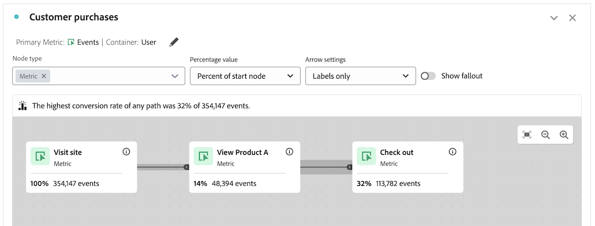
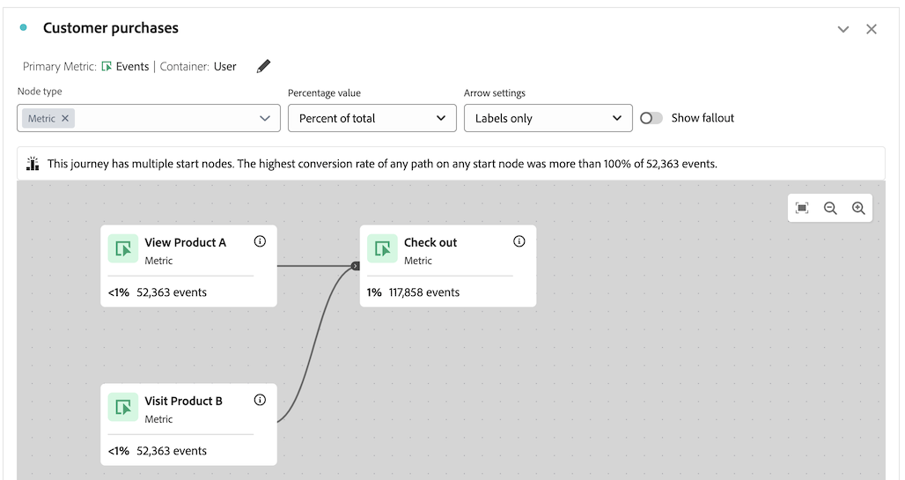
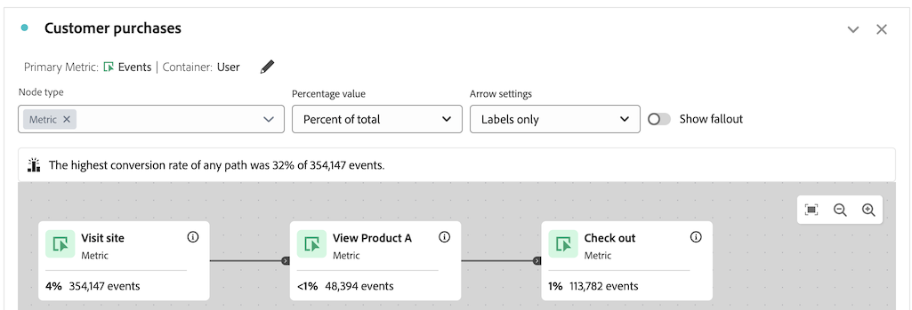

# Información general del lienzo de resolución de problemas

La visualización del lienzo de Recorrido le permite analizar y obtener perspectivas profundas sobre los recorridos que proporciona a sus usuarios y clientes.

Para obtener más información sobre el lienzo de Recorrido, vea [Información general sobre el lienzo de Recorrido](/help/analysis-workspace/visualizations/journey-canvas/journey-canvas.md) y [Configuración de una visualización del lienzo de Recorrido](/help/analysis-workspace/visualizations/journey-canvas/configure-journey-canvas.md).

La siguiente información puede ayudarle a solucionar problemas con resultados no deseados, como los nodos que aparecen más adelante en el recorrido y que muestran un mayor porcentaje o recuento de números que los nodos que aparecen más temprano en el recorrido.

## Nodos con un porcentaje o valor mayor que los nodos anteriores

En el lienzo de Recorrido, es posible que los nodos que se producen más adelante en el recorrido muestren un porcentaje o un recuento de números mayor que los que se producen más temprano en el recorrido.

En otras palabras, a diferencia de las visualizaciones de visitas en el orden previsto, que siempre tienen forma de funnel (con una participación que disminuye con cada paso), las visualizaciones de lienzo de Recorrido pueden tener una participación mayor en los pasos posteriores del recorrido que en los pasos anteriores.

Esto puede ocurrir en los siguientes casos:

* Al utilizar una métrica principal distinta de Personas o Sesiones

* Cuando varias rutas convergen en un solo nodo

### El recorrido utiliza una métrica principal distinta de Personas o Sesión

Dado que el lienzo de Recorrido le permite utilizar cualquier métrica como métrica principal, esto puede dar como resultado nodos que vienen más adelante en el recorrido para mostrar un porcentaje o recuento de números mayor que los nodos que vienen más temprano en el recorrido.

El recorrido utilizado en los siguientes casos se configura con esta configuración:

* **[!UICONTROL Persona]** se ha establecido como contenedor

* **[!UICONTROL Evento]** se ha establecido como métrica principal

#### Escenario 1: el usuario A sigue la ruta del recorrido en la primera sesión. En una sesión posterior, el usuario tiene un evento que coincide únicamente con un nodo posterior.

Supongamos que el usuario A visita el sitio y completa el recorrido (Nodo 1: &quot;Visitar sitio&quot; > Nodo 2: &quot;Ver producto A&quot; > Nodo 3: &quot;Desproteger&quot;). Dado que el usuario A tenía un evento que coincidía con cada nodo del recorrido en orden, se cuenta un evento en cada nodo del recorrido.

Ahora, supongamos que el usuario A vuelve a visitar el sitio en una sesión posterior. Dado que el usuario A ya completó el recorrido en una sesión anterior siguiendo la ruta de recorrido, esto significa que cada vez que el usuario A tiene un evento que coincide con cualquier nodo del recorrido (incluso si el usuario A no ha seguido la ruta del recorrido en su sesión actual), se cuenta un evento en el nodo correspondiente del recorrido. Por ejemplo, si el usuario A retira, un evento se cuenta en el nodo &quot;Desproteger&quot;. Esto puede dar como resultado un porcentaje y un número mayores en el nodo &quot;Desproteger&quot; que en el nodo anterior, &quot;Ver producto A&quot;.

En este ejemplo, la configuración del contenedor del recorrido de &quot;Persona&quot; desempeña un papel fundamental para determinar que el evento del tercer nodo (&quot;Desproteger&quot;) se cuente en la sesión posterior.

Alternativamente, si la configuración del contenedor se hubiera establecido en &quot;Sesión&quot;, el evento que se produjo solo en el tercer nodo de la visita posterior no se habría contabilizado en el recorrido, ya que las estadísticas que se muestran en el recorrido se restringirían a una sola sesión definida para una persona determinada. Para obtener más información acerca de la configuración del contenedor, consulte [Comenzar a crear una visualización de lienzo de Recorrido](/help/analysis-workspace/visualizations/journey-canvas/configure-journey-canvas.md#begin-building-a-journey-canvas-visualization) en el artículo [Configurar una visualización de lienzo de Recorrido](/help/analysis-workspace/visualizations/journey-canvas/configure-journey-canvas.md)

<!-- The time allotted for users to move along the path is determined by the container setting. Because "Person" is selected as the container setting in this example, people who followed the journey's path in one session (moving from Node 1 to Node 2 and to Node 3) met the criteria of the journey. On any subsequent visits to the site, any event they have that matches any node on the journey is counted on that node. -->

#### Escenario 2: el usuario B se cae del recorrido

Supongamos que el usuario B visita el sitio y no completa el recorrido (visita el sitio, ve el producto B y luego cierra la compra). En este caso, se cuenta un evento para el nodo de inicio del recorrido, &quot;Visita al sitio&quot;, pero un evento no se cuenta para los nodos restantes y el usuario B queda fuera de la recorrido. Aunque el usuario B haya cerrado la compra, un evento no se cuenta en el tercer nodo (&quot;Cierre&quot;) porque el usuario B no completó el recorrido consultando el producto A antes de cerrar la compra.

Esto se debe a que los eventos se cuentan para cada nodo solo cuando las personas siguen la &quot;ruta final&quot; del recorrido. Esto significa que los eventos se cuentan solo si la persona se ha movido de un nodo al otro, independientemente de los eventos que se produzcan entre los dos nodos.

### El recorrido tiene varias rutas que convergen en un solo nodo

El lienzo de recorrido permite incluir varios nodos de inicio en un único recorrido, lo que da como resultado varias rutas. Estas rutas pueden converger en un nodo común, lo que da como resultado que los nodos que vienen más adelante en el recorrido muestren un porcentaje o un recuento de números mayor que los nodos que vienen más temprano en el recorrido.

<!--

The journey used in the following scenarios is configured with the following settings:

* **[!UICONTROL Person]** is set as the container

* **[!UICONTROL Event]** is set as the primary metric

#### Scenario 

When a journey contains multiple paths that converge into a single node, the two paths are combined into the single node using the OR operator. This can result in the

-->

### porcentajes de recorrido

Aunque los números mostrados en cada nodo de un recorrido permanecen constantes independientemente de lo que se seleccione en el campo **[!UICONTROL Valor porcentual]**, los porcentajes en sí mismos pueden cambiar.

Las secciones siguientes muestran cómo pueden cambiar los porcentajes para el mismo recorrido, dependiendo de cuál de las siguientes opciones esté seleccionada en el campo **[!UICONTROL Valor porcentual]**:

+++Porcentaje del nodo de inicio

Los nodos de este recorrido contienen las siguientes estadísticas cuando el campo **[!UICONTROL Percentage value]** se establece en **[!UICONTROL Percent of start node]**:

| Nodo | Estadísticas |
|---------|----------|
| Nodo 1: &quot;Visitar sitio&quot; | En este recorrido, hubo 354 147 eventos en el sitio dentro del intervalo de fechas del informe, como se muestra en el nodo de inicio del recorrido, &quot;Visita al sitio&quot;. |
| Nodo 2: &quot;Ver producto A&quot; | Del número total de eventos mostrados en el nodo de inicio, el 14 % (48 394) de ellos coincidían con los criterios del segundo nodo del recorrido, &quot;Ver producto A&quot;. |
| Nodo 3: &quot;Desproteger&quot; | Del número total de eventos mostrados en el nodo de inicio, el 32 % (113 782) de ellos coincidían con los criterios del tercer nodo del recorrido, &quot;Desproteger&quot;. |

+++

+++Porcentaje del nodo anterior

Los nodos de este recorrido contienen las siguientes estadísticas cuando el campo **[!UICONTROL Percentage value]** se establece en **[!UICONTROL Percent of previous node]**:

| Nodo | Estadísticas |
|---------|----------|
| Nodo 1: &quot;Visitar sitio&quot; | En este recorrido, hubo 354 147 eventos en el sitio dentro del intervalo de fechas del informe, como se muestra en el nodo de inicio del recorrido, &quot;Visita al sitio&quot;. |
| Nodo 2: &quot;Ver producto A&quot; | Del número total de eventos mostrados en el nodo anterior, el 14 % (48.394) de ellos coincidían con los criterios del segundo nodo del recorrido, &quot;Ver producto A&quot;. |
| Nodo 3: &quot;Desproteger&quot; | Del número total de eventos mostrados en el nodo anterior, más del 100 % (113.782) de ellos coincidían con los criterios del tercer nodo del recorrido, &quot;Desproteger&quot;. |

+++

+++Porcentaje del total

Los nodos de este recorrido contienen las siguientes estadísticas cuando el campo **[!UICONTROL Valor porcentual]** se establece en **[!UICONTROL Porcentaje del total]**:

| Nodo | Estadísticas |
|---------|----------|
| Nodo 1: &quot;Visitar sitio&quot; | En este recorrido, hubo 354 147 eventos en el sitio dentro del intervalo de fechas del informe, como se muestra en el nodo de inicio del recorrido, &quot;Visita al sitio&quot;. |
| Nodo 2: &quot;Ver producto A&quot; | Del número total de eventos, menos del 1 % (48 394) de ellos coincidían con los criterios del segundo nodo del recorrido, &quot;Ver producto A&quot;. |
| Nodo 3: &quot;Desproteger&quot; | Del número total de eventos, el 1% (113.782) de ellos coincidió con los criterios del tercer nodo del recorrido, &quot;Check out&quot;. |

+++

## Compatibilidad entre la métrica del contenedor y la métrica principal

Puede configurar el contenedor del lienzo de Recorrido para que sea Persona (que utiliza la métrica Personas ) o Sesión (que utiliza la métrica Sesiones ).

Asegúrese de elegir una métrica principal compatible con la métrica de contenedor seleccionada actualmente. La mayoría de las métricas son compatibles con las métricas de contenedor disponibles. Sin embargo, se deben evitar algunas combinaciones de métricas de contenedor y métricas principales.

Por ejemplo, si se utiliza Persona como contenedor con Sesión como métrica principal, pueden producirse resultados no deseados.

<!--

## Percentages that exceed 100%

The following configurations can result in nodes that show percentages that exceed 100%:

* When the **[!UICONTROL Percentage value]** field is set to **[!UICONTROL Percent of total]** or **[!UICONTROL Percent of start node]**, and a primary metric is selected that results in less data for the start node than on subsequent nodes.

  For example, if Revenue is selected as the primary metric, and no revenue is being realized on the primary metric, then on any node where revenue is being realized will show as exceeding 100%. 

-->
