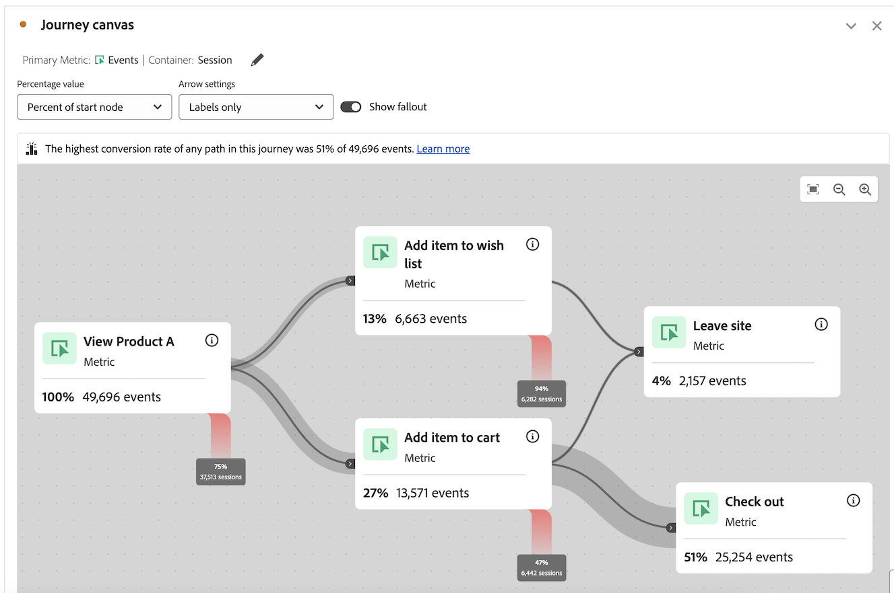
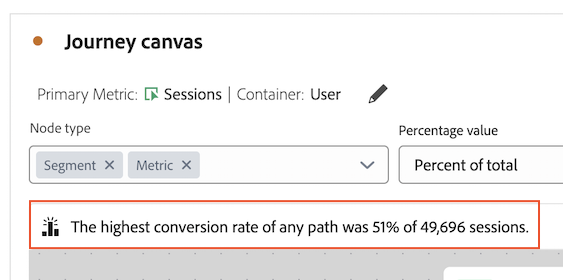
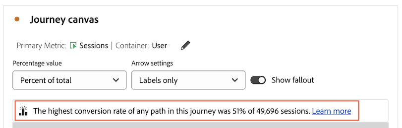
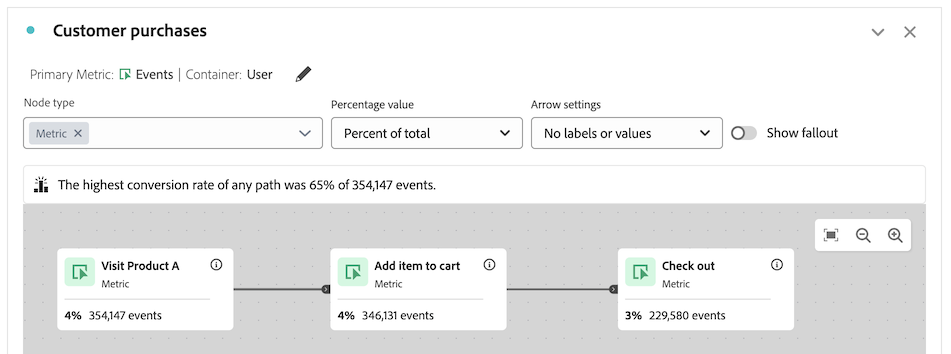
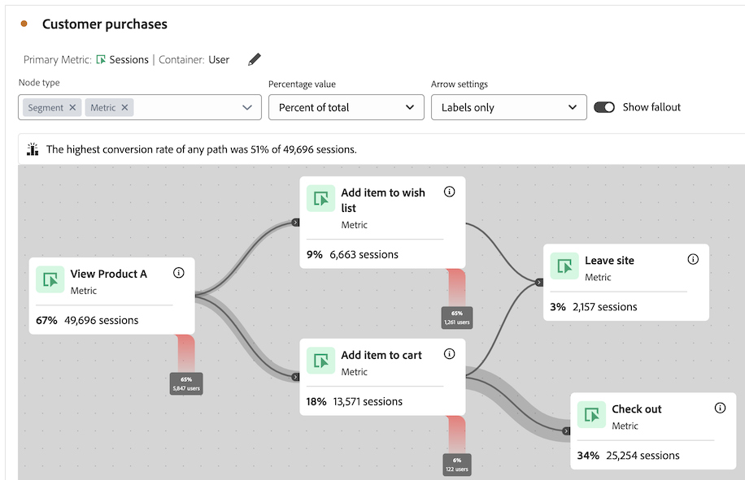
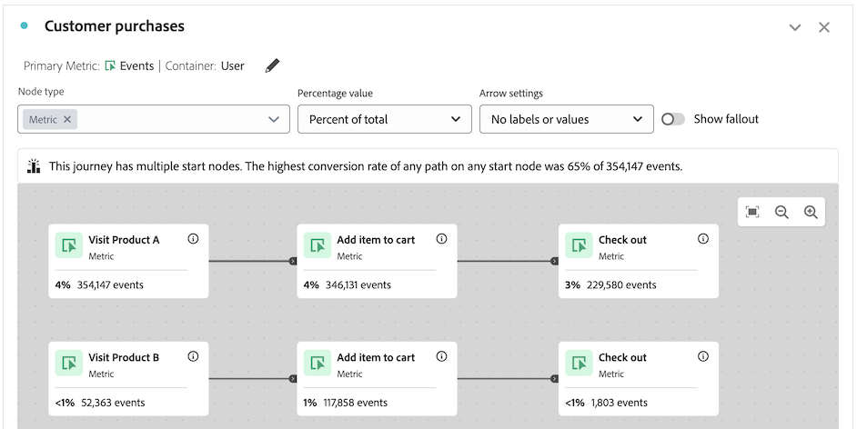
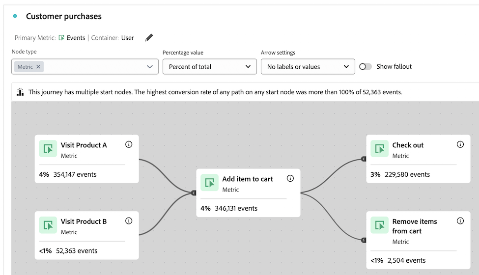

# Información general del lienzo de recorrido {#journey-canvas-overview}

<!-- markdownlint-disable MD034 -->

>[!CONTEXTUALHELP]
>id="cja_journeycanvas_button"
>title="Lienzo de recorrido"
>abstract="Muestra cómo se superan o abandonan una serie de puntos de contacto. Se utiliza para recorridos con varios puntos de entrada y rutas, o para analizar recorridos creados en Journey Optimizer."

<!-- markdownlint-enable MD034 -->

<!-- markdownlint-disable MD034 -->

>[!CONTEXTUALHELP]
>id="cja_journeycanvas_panel"
>title="Lienzo de recorrido"
>abstract="Analizar cómo se superan o se abandonan los criterios de un recorrido definido. Cree análisis de los recorridos de usuario creando un gráfico flexible de nodos y flechas que representen cualquier combinación de eventos, elementos de dimensión y filtros. Arrastre nodos en el lienzo para reorganizar los eventos y las condiciones del recorrido. A medida que lo haga, los datos se actualizarán en consecuencia.   Los clientes con acceso a Adobe Journey Optimizer pueden analizar los recorridos de Journey Optimizer existentes"

<!-- markdownlint-enable MD034 -->

<!-- markdownlint-disable MD034 -->

>[!CONTEXTUALHELP]
>id="journeycanvas_button"
>title="Lienzo de recorrido"
>abstract="Muestra cómo se superan o abandonan una serie de puntos de contacto. Se utiliza para recorridos con varios puntos de entrada y rutas, o para analizar recorridos creados en Journey Optimizer."

<!-- markdownlint-enable MD034 -->

<!-- markdownlint-disable MD034 -->

>[!CONTEXTUALHELP]
>id="journeycanvas_panel"
>title="Lienzo de recorrido"
>abstract="Analizar cómo se superan o se abandonan los criterios de un recorrido definido. Cree análisis de los recorridos de usuario creando un gráfico flexible de nodos y flechas que representen cualquier combinación de eventos, elementos de dimensión y filtros. Arrastre nodos en el lienzo para reorganizar los eventos y las condiciones del recorrido. A medida que lo haga, los datos se actualizarán en consecuencia.   Los clientes con acceso a Adobe Journey Optimizer pueden analizar los recorridos de Journey Optimizer existentes"

<!-- markdownlint-enable MD034 -->

>[!BEGINSHADEBOX]

_Este artículo documenta la visualización del lienzo de Recorrido en_  _**Customer Journey Analytics**. No hay ninguna visualización equivalente en **Adobe Analytics**._

>[!ENDSHADEBOX]

La visualización del lienzo de Recorrido le permite analizar y obtener perspectivas profundas sobre los recorridos que proporciona a sus usuarios y clientes. Permite definir un recorrido desde cero o ver uno desde Journey Optimizer y, a continuación, ver cómo abandonaron el recorrido o cómo continuaron en él.

Puede [generar análisis de recorridos de usuario](/help/analysis-workspace/visualizations/journey-canvas/configure-journey-canvas.md) utilizando cualquier combinación de eventos, elementos de dimensión, filtros e intervalos de fechas para crear nodos de recorrido. Conecte los nodos para crear el flujo del recorrido e incluya varias rutas y puntos de decisión. Arrastre nodos en el lienzo para reorganizar los eventos y las condiciones del recorrido. Los datos se actualizan en tiempo real a medida que realiza cambios.

[Los nodos están conectados](/help/analysis-workspace/visualizations/journey-canvas/configure-journey-canvas.md#logic-when-connecting-nodes) como una &quot;ruta final&quot;, lo que significa que los visitantes se cuentan siempre y cuando se muevan de un nodo al otro, independientemente de los eventos que se produzcan entre los dos nodos. El tiempo asignado para que los usuarios se muevan por la ruta viene determinado por la configuración del contenedor.

## Funciones principales

Las características clave de la visualización del lienzo de Recorrido incluyen:

* Análisis profundo de abandonos y abandonos que se adapta a los recorridos de usuario más complejos.

* Lienzo para asignar y visualizar los distintos puntos de entrada, nodos y rutas de un recorrido de usuario.

* Interacciones de arrastrar y soltar para agregar componentes al lienzo y para cambiar la posición de nodos existentes.

* La opción para generar análisis de recorridos de usuario dentro del lienzo de Recorrido o para crearlos automáticamente en función de los recorridos de Journey Optimizer.

## Perspectivas potenciales

El lienzo de recorrido proporciona perspectivas procesables para los recorridos más complejos.

### Ruta con la tasa de conversión más alta {#conversion-rate-caption}

La perspectiva más destacada en el lienzo de Recorrido se muestra como un pie de ilustración en la parte superior del lienzo.

Este pie de ilustración resume cuál de todas las rutas de la recorrido tuvo la tasa de conversión más alta.

Cuando el recorrido contiene varios nodos de inicio, el pie de ilustración tiene este aspecto:

Cuando el recorrido contiene un solo nodo de inicio, el pie de ilustración tiene este aspecto:

Tenga en cuenta lo siguiente al interpretar este pie de ilustración:

* Una _ruta_ se define como un nodo de inicio que está conectado mediante flechas a un nodo final, con cualquier número de nodos conectados entre ellos.

* El cálculo de la tasa de conversión depende del tipo de recorrido (el número de nodos iniciales y finales que contiene el recorrido y si las rutas se cruzan entre ellos).

  En la tabla siguiente se describe cómo se calculan las tasas de conversión en función del tipo de recorrido:

  | tipo de recorrido | Cálculo de tasa de conversión | Ejemplo |
  |---------|----------|---------|
  | **Un solo nodo inicial y un solo nodo final** | La tasa de conversión se calcula dividiendo el número del nodo final por el del nodo inicial. |  |
  | **Un solo nodo inicial y varios nodos finales** | La tasa de conversión se calcula buscando el nodo final con el número más alto y dividiendo ese número por el del nodo inicial. |  |
  | **Varias rutas independientes, cada una de las cuales contiene un solo nodo de inicio y un solo nodo de finalización** | La tasa de conversión se calcula dividiendo el número del nodo final por el del nodo inicial. La ruta con la tasa de conversión más alta se describe en el pie de ilustración. |  |
  | **Varios nodos de inicio que en cualquier punto del recorrido convergen en un nodo común** | La tasa de conversión se calcula buscando el nodo final con el número más alto y dividiendo ese número por el del nodo inicial con el número más bajo. |  |

### Abandonos, Abandonos y mucho más

A continuación se muestran algunos ejemplos de otras perspectivas que el lienzo de Recorrido puede ayudar a proporcionar. Puede elegir si estas perspectivas se basan en todas las personas de la vista de datos, todas las personas que iniciaron el recorrido o todas las personas del nodo anterior del recorrido.

#### Visita en orden imprevisto

* Número y porcentaje de personas que completaron el recorrido (llegaron al nodo final)

* Número y porcentaje de personas que llegaron a un nodo determinado del recorrido

* El paso más común que se produjo después o antes de un nodo determinado del recorrido

#### Visita en orden previsto

* Los nodos del recorrido donde las personas cayeron con mayor frecuencia del recorrido (nunca llegaron a ninguno de los nodos inmediatamente siguientes)

#### Datos adicionales para cada nodo

* Añada una dimensión de desglose en cualquier nodo del recorrido para ver datos adicionales de ese nodo específico

## Elija entre visualizaciones de lienzo de Recorrido, Visitas en el orden previsto o Flujo

La visualización del lienzo de Recorrido tiene similitudes con la [visualización de visitas en el orden previsto](/help/analysis-workspace/visualizations/fallout/fallout-flow.md) y la [visualización de flujo](/help/analysis-workspace/visualizations/c-flow/flow.md), pero con diferencias importantes.

### Comprender las diferencias

<!-- Information in this snippet is shared between Journey canvas, Fallout, and Flow visualization docs -->

{{journey-visualization-comparisons}}

### Cuándo se debe utilizar el lienzo de Recorrido

El lienzo de recorrido es esencial para lo siguiente:

* Análisis de abandonos que implica recorridos con varios puntos de entrada y rutas.

* Recorridos no lineales con varios puntos de entrada y rutas, con una secuencia predefinida de páginas.

* Análisis exploratorio y ad hoc basado en un recorrido predefinido.

* Análisis que requiere una métrica principal distinta de Sesión, Persona u Ocurrencias.

* Análisis más profundo de los recorridos que se originaron en Adobe Journey Optimizer.

Use [la tabla anterior](#understand-the-differences) para comprender las diferencias entre las visualizaciones de lienzo de Recorrido, Visitas en el orden previsto y Flujo.

## Analizar Journey Optimizer recorrido

>[!NOTE]
>
>Si su organización no tiene acceso a Journey Optimizer, todavía puede [crear análisis en lienzo de Recorrido](#build-analyses-in-customer-journey-analytics).

El análisis de recorridos de Journey Optimizer en lienzo de Recorrido proporciona perspectivas profundas y procesables sobre cómo las personas interactúan con un recorrido.

Cuando se analiza un recorrido de Journey Optimizer en lienzo de Recorrido, el recorrido se muestra con el mismo orden, secuencia y estructura que en Journey Optimizer. Si realiza cambios significativos en un recorrido dentro del lienzo de Recorrido, [los cambios ya no se sincronizan desde Journey Optimizer](#synchronization-between-journey-optimizer-and-journey-canvas).

### Ventajas del análisis de recorridos de Journey Optimizer con lienzo de Recorrido

El lienzo de recorrido proporciona un análisis profundo y exhaustivo que no es posible en Journey Optimizer.

El uso del lienzo de Recorrido para analizar los recorridos creados en Journey Optimizer ofrece varias ventajas:

* Cree eventos mediante dimensiones, métricas, filtros o intervalos de fechas de Customer Journey Analytics.

  En Journey Optimizer, un usuario técnico debe crear un evento para poder añadirlo a un recorrido.

* Cree audiencias en función de un nodo personalizado que haya creado (inicia el generador de audiencias de Customer Journey Analytics).

  En Journey Optimizer, solo puede crear audiencias para actividades predefinidas.

* Analizar visitas en el orden previsto y abandonos

* Desglose de eventos con cualquier dimensión

* Combinación de eventos

* Conectar eventos

* Cambiar nombre y eliminar eventos

* Mucho más

### Sincronización entre Journey Optimizer y el lienzo de Recorrido

Después de crear un análisis de un recorrido de Journey Optimizer en lienzo de Recorrido, los datos se sincronizan en una sola dirección, de Journey Optimizer a lienzo de Recorrido. Esto significa que los cambios realizados en un recorrido en lienzo de Recorrido nunca se reflejan en Journey Optimizer.

Además, los cambios realizados en un recorrido de Journey Optimizer se sincronizan con el lienzo de Recorrido [sólo si el recorrido no se ha modificado significativamente en el lienzo de Recorrido](#differences-after-modifying-a-journey-in-journey-canvas). Después de modificar un recorrido en lienzo de Recorrido, los cambios realizados en el recorrido en Journey Optimizer no se reflejarán en el lienzo de Recorrido. Para ver los cambios reflejados en el lienzo de Recorrido, puede eliminar y [volver a crear el recorrido en el lienzo de Recorrido](/help/analysis-workspace/visualizations/journey-canvas/configure-journey-canvas.md).

### Diferencias después de modificar un recorrido en lienzo de Recorrido {#differences-after-modifying}

Después de modificar un recorrido de Journey Optimizer en lienzo de Recorrido, pueden producirse cambios en el procesamiento de datos, las funciones disponibles y el comportamiento de sincronización.

Si realiza una modificación significativa en un recorrido de Journey Optimizer en lienzo de Recorrido, pueden producirse cambios en el procesamiento de datos, las funciones disponibles y el comportamiento de sincronización. Una modificación significativa incluye cualquiera de las siguientes opciones:

* Adición o eliminación de un nodo

* Adición o eliminación de una flecha entre nodos

* Cambio de los componentes de un nodo

Si realiza otros cambios en un recorrido de Journey Optimizer en lienzo de Recorrido, como arrastrar un nodo o agregar un desglose, no se aplicarán las diferencias que se describen en las secciones siguientes.

>[!NOTE]
>
>Para devolver el recorrido a su estado original, puede presionar Ctrl+z después de realizar el primer cambio en el lienzo de Recorrido. O bien, puede eliminar y [volver a crear el recorrido en lienzo de Recorrido](/help/analysis-workspace/visualizations/journey-canvas/configure-journey-canvas.md)

#### Diferencias de procesamiento de datos

Después de modificar un recorrido de Journey Optimizer en lienzo de Recorrido, es posible que observe cambios en los datos si el recorrido contiene métricas que tienen modelos de atribución no predeterminados.

Esto se debe a que, a diferencia de Journey Optimizer, el lienzo de Recorrido permite aplicar varias dimensiones dentro de un solo recorrido. Esta capacidad significa que no se admite la atribución de [métricas](/help/data-views/component-settings/attribution.md).

#### Diferencias de características

Después de modificar un recorrido de Journey Optimizer en lienzo de Recorrido, las opciones disponibles en el campo desplegable [!UICONTROL **Configuración de flecha**] cambian según las modificaciones que realice. Para obtener más información, consulte [Configurar opciones](/help/analysis-workspace/visualizations/journey-canvas/configure-journey-canvas.md).

El campo [!UICONTROL **Tipo de nodo**] solo está disponible en Journey Optimizer. No está disponible cuando se ve un recorrido de Journey Optimizer en lienzo de Recorrido, independientemente de si se realizan modificaciones en el recorrido en lienzo de Recorrido.

#### Diferencias de sincronización

Los cambios realizados en un recorrido en Journey Optimizer se sincronizan con el lienzo de Recorrido solo si el recorrido permanece sin modificar en el lienzo de Recorrido.

Después de modificar un recorrido de Journey Optimizer en lienzo de Recorrido, los cambios realizados en el recorrido en Journey Optimizer no se reflejarán en el lienzo de Recorrido. Para ver los cambios reflejados en el lienzo de Recorrido, puede eliminar y [volver a crear el recorrido en el lienzo de Recorrido](/help/analysis-workspace/visualizations/journey-canvas/configure-journey-canvas.md).

### Diferencias terminológicas entre Journey Optimizer y Customer Journey Analytics

Ciertos términos que significan una cosa en Journey Optimizer significan otra en Customer Journey Analytics. Cuando se utiliza lienzo de Recorrido, se utilizan los términos de Customer Journey Analytics.

| Término | Lienzo de recorrido | Journey Optimizer |
|---------|----------|---------|
| **Evento** | Una de las varias métricas estándar que están disponibles en Customer Journey Analytics. Esta métrica cuenta cosas como ingresos, suscripciones o posibles clientes generados. | Categoría de actividad que almacena en déclencheur un recorrido personalizado, como una compra en línea. |

### Analizar un recorrido de Journey Optimizer en lienzo de Recorrido

Para obtener información sobre cómo analizar un recorrido de Journey Optimizer en lienzo de Recorrido, consulte [Configuración de una visualización de lienzo de Recorrido](/help/analysis-workspace/visualizations/journey-canvas/configure-journey-canvas.md).

## Generar análisis en lienzo de Recorrido

Puede crear análisis en lienzo de Recorrido basados en cualquier dimensión o métrica disponible en Analysis Workspace. O bien, puede analizar los recorridos creados en Journey Optimizer. Para obtener más información, consulte [Configuración de una visualización de lienzo de Recorrido](/help/analysis-workspace/visualizations/journey-canvas/configure-journey-canvas.md).
