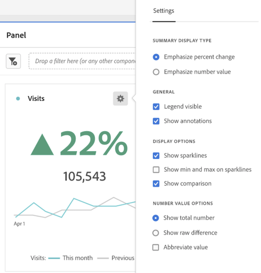

# Resumen de métricas clave

La visualización [!UICONTROL Resumen de métricas clave] permite ver las tendencias de una métrica importante dentro de un solo periodo de tiempo. También le permite comparar el rendimiento de las métricas en dos intervalos de tiempo. Proporciona las ventajas de varias visualizaciones combinadas en una sola:

* Visualizaciones de **[!UICONTROL Línea]** que muestran la tendencia de la métrica para los intervalos de fechas principales y de comparación

* **[!UICONTROL Cambio de porcentaje de resumen]** que muestra el aumento o la disminución de la métrica entre los intervalos de fechas principal y de comparación

* Valor total actual ([!UICONTROL **número de resumen**]) para la métrica

## Casos prácticos

Esta visualización aborda una variedad de casos de uso comunes, entre los que se incluyen:

* Un analista que trata de entender qué aspecto tenía la creación de oportunidades este mes en comparación con el mismo periodo de tiempo del año pasado.

* Un experto en marketing que explora cómo la generación de posibles clientes para un tipo de posible cliente específico ha cambiado de este mes al último.

* Un ejecutivo que quiere entender cómo han variado las nuevas reservas de este trimestre al último.

## Configuración del resumen de métricas clave

1. Arrastre la visualización **[!UICONTROL Resumen de métricas clave]** desde el menú **[!UICONTROL Visualizaciones]** del carril izquierdo a un panel.

1. Configure la visualización seleccionando una métrica, un intervalo de fechas principal, un intervalo de fechas de comparación y un segmento (si lo desea):

   

   | Ajuste de configuración | Definición |
   | --- | --- |
   | **[!UICONTROL Métrica]** | Seleccione la métrica que desea examinar. Todas las métricas son compatibles. |
   | **[!UICONTROL Intervalo de fechas principal]** | El intervalo de fechas actual para la tabla de forma libre. |
   | **[!UICONTROL Intervalo de fechas de comparación]** | El intervalo de fechas con el que se desea comparar el intervalo de fechas principal. |
   | **[!UICONTROL Segmento (opcional)]** | Cualquier segmento que le interese específicamente para este resumen. |

   {style="table-layout:auto"}

1. Haga clic en **[!UICONTROL Generar]**.

## Visualización del resultado

Tenga en cuenta:

* El gráfico de líneas **[!UICONTROL Período anterior]** (siempre mostrado en gris) corresponde al **[!UICONTROL Intervalo de fechas de comparación]** en el paso de configuración.

* Si no se especifica un intervalo de fechas de comparación durante la configuración o está oculto en los ajustes de visualización, solo se muestra el gráfico de líneas del intervalo de fechas principal. El cambio de resumen estará oculto.

* Desde aquí, puede pasar el ratón por encima de los gráficos de líneas para ver las estadísticas de los días individuales:

## Configuración de visualización

El resumen de métricas clave ofrece varias configuraciones flexibles para mejorar la creación de informes y la comunicación de métricas importantes. Se puede acceder a la configuración a través del icono de engranaje en la esquina superior derecha de la visualización.

| Configuración | Descripción |
| --- | --- |
| **[!UICONTROL Enfatizar el cambio porcentual]** | Mostrar el cambio de resumen en negrita destacado en el centro de la visualización |
| **[!UICONTROL Enfatización del valor numérico]** | Mostrar el número de resumen en negrita destacado en el centro de la visualización |
| **[!UICONTROL Leyenda visible]** | Mostrar u ocultar la leyenda en la parte inferior de la visualización |
| **[!UICONTROL Mostrar anotaciones]** | Mostrar u ocultar anotaciones añadidas por un administrador |
| **[!UICONTROL Mostrar minigráficos]** | Muestre u oculte gráficos de líneas en la parte inferior del gráfico. Cuando esté oculta, la leyenda cambiará para no hacer referencia visual a las líneas |
| **[!UICONTROL Mostrar mínimo y máximo en reflectores]** | Mostrar u ocultar valores mínimos y máximos en gráficos de líneas principales y de comparación |
| **[!UICONTROL Mostrar comparación]** | Muestre u oculte los datos de comparación. Cuando están ocultos, el gráfico de líneas de comparación y los objetos de cambio de resumen no se ven. |
| **[!UICONTROL Mostrar número total]** | Mostrar u ocultar el número de resumen |
| **[!UICONTROL Mostrar diferencia en bruto]** | Mostrar u ocultar la diferencia en bruto entre el valor total de la métrica en el intervalo de fechas principal y el secundario |
| **[!UICONTROL Valor abreviado]** | Abreviar los valores numéricos para simplificar las perspectivas comunicadas (por ejemplo, 20 000 -> 20K) |

## Edición de la visualización

Después de crear la visualización, aún puede editar la configuración original.

1. Haga clic en el icono de lápiz en la esquina superior derecha de la visualización (junto al icono de engranaje de configuración).

   

   Ahora volverá a la vista de configuración original.

1. Cambie la métrica, el intervalo de fechas principal, el intervalo de fechas de comparación o el segmento como prefiera.
