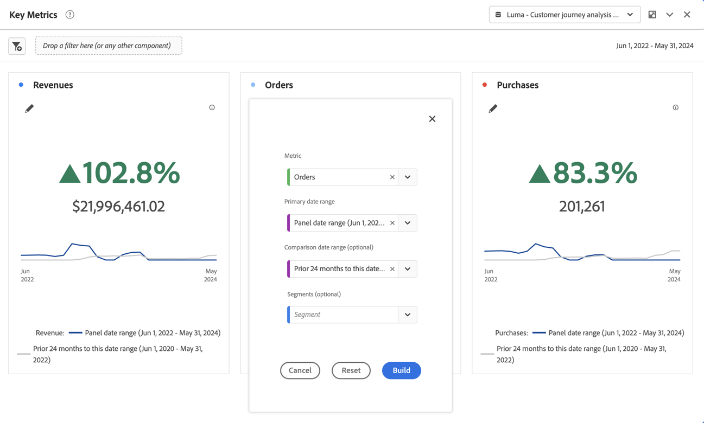

# Resumen de métricas clave {#key-metric-summary}

<!-- markdownlint-disable MD034 -->

>[!CONTEXTUALHELP]
>id="cja_workspace_keymetricsummary_button"
>title="Resumen de métricas clave"
>abstract="Cree una visualización que sea una combinación de los gráficos de líneas, resumen de cambios y resumen de números. Utilice esta visualización para comparar la tendencia de las métricas importantes entre dos períodos de tiempo."

<!-- markdownlint-enable MD034 -->

La visualización  **[!UICONTROL Resumen de métricas clave]** le permite ver las tendencias de una métrica importante dentro de un solo periodo de tiempo. También le permite comparar el rendimiento de las métricas en dos intervalos de tiempo. Proporciona las ventajas de varias visualizaciones combinadas en una sola:

* La visualización **[!UICONTROL Línea]** muestra la tendencia de la métrica para los intervalos de fechas principal y de comparación

* **[!UICONTROL Cambio de porcentaje de resumen]** muestra el aumento o la disminución de la métrica entre los intervalos de fechas principal y de comparación

* Valor total actual ([!UICONTROL **número de resumen**]) para la métrica

Esta visualización aborda una variedad de casos de uso comunes, entre los que se incluyen:

* Un analista que trata de entender qué aspecto tenía la creación de oportunidades este mes en comparación con el mismo periodo de tiempo del año pasado.

* Un experto en marketing que explora cómo la generación de posibles clientes para un tipo de posible cliente específico ha cambiado de este mes al último.

* Un ejecutivo que quiere entender cómo han variado las nuevas reservas de este trimestre al último.

## En su lugar, utilice 

1. Agregue una visualización de  **[!UICONTROL resumen de métricas clave]**. Consulte [Agregar una visualización a un panel](freeform-analysis-visualizations.md#add-visualizations-to-a-panel).

1. Configure la visualización seleccionando una **[!UICONTROL Métrica]**, un **[!UICONTROL intervalo de fechas principal]**, un **[!UICONTROL intervalo de fechas de comparación]** (opcional) y un **[!UICONTROL Filtro]** (opcional):

   

   | Opción | Descripción |
   | --- | --- |
   | **[!UICONTROL Métrica]** | Seleccione la métrica que desea examinar. Todas las métricas son compatibles. |
   | **[!UICONTROL Intervalo de fechas principal]** | El intervalo de fechas actual para la tabla de forma libre. |
   | **[!UICONTROL Intervalo de fechas de comparación]** | El intervalo de fechas con el que se desea comparar el intervalo de fechas principal. |
   | **[!UICONTROL Filtro (opcional)]** | Cualquier filtro que le interese específicamente para este resumen. |

   {style="table-layout:auto"}

1. Seleccione **[!UICONTROL Generar]**.

<!--## How the Key Metric Summary visualization handles the comparison date range

(This will probably release in January. Per Jaden Howell)

* If the primary date range is set to the panel date range, there are 2-6 options that are considered 'relative' to the primary date range. These usually include the previous period (same amount of time immediately proceeding the primary date range), and 52 weeks prior to that date range.

* If the comparison date range is set to one of the 'relative' options, upon updating the primary date range, the comparison date range updates to the period immediate preceding the panel date range.

* If your comparison date range is *not* set to a 'relative' option, then updating the panel date range changes your primary date range, but has no effect on the comparison date range.

**Example 1**

Primary date range is set to the panel's date range: 'Yesterday'
Comparison date range is set to a relative date range, one of: 'Previous day', 'Same day last week', 'Same day 4 weeks prior', 'Same day last month', 'Same day last year', or 'Same day 52 weeks prior'.
When I change the panel's date range to 'This month', the comparison date range will update to 'Previous month'.

**Example 2**
 
Primary date range is set to the panel's date range: 'Yesterday'
Comparison date range is set to a non-relative date range, such as 'Feb 2nd, 2022', 'Highest sales day', 'Last week', etc. 

>[!NOTE]
>
>Last week is relative to the day the project is opened on, but it is not based on the panel's date range of 'Yesterday'. In other cases, such as if the panel's date range was 'This week', it may be relative.

When you change the panel's date range to '4 days ago', the comparison date range remains at the previous selection. -->

El resultado del resumen de métricas clave tiene este aspecto:

* El gráfico de líneas **[!UICONTROL Periodo anterior]** (siempre mostrado en gris) corresponde al **[!UICONTROL Intervalo de fechas de comparación]** en el paso de configuración.

* Si no se especifica un intervalo de fechas de comparación durante la configuración o está oculto en los ajustes de visualización, solo se muestra el gráfico de líneas del intervalo de fechas principal. El cambio de resumen está oculto.

* Desde aquí, puede pasar el ratón por encima de los gráficos de líneas para ver las estadísticas de los días individuales:

## Configuración

Después de crear la visualización, puede editar la configuración original.

1. Seleccione  **[!UICONTROL Configurar visualización]** en la parte superior de la visualización.

   Se le redirigirá al cuadro de diálogo de configuración original.

1. Cambie la configuración como prefiera. Seleccione **[!UICONTROL Restablecer]** para restablecer la configuración actual. Seleccione **[!UICONTROL Build]** para reconstruir la visualización.

## Configuración

Como parte de la configuración de visualización, hay disponibles opciones específicas de resumen de métricas clave.

| Configuración | Descripción |
|---|---|
| **[!UICONTROL Tipo de visualización de resumen]** | Seleccione entre **[!UICONTROL Enfatizar cambio porcentual]** o **[!UICONTROL Enfatizar valor numérico]**. |
| **[!UICONTROL Mostrar líneas de tendencia]** | Mostrar líneas de tendencia en la visualización. |
| **[!UICONTROL Mostrar máximo y mínimo en las líneas de tendencia]** | Mostrar los valores máximo y mínimo en las líneas de tendencia. |
| **[!UICONTROL Mostrar porcentaje de comparación y línea de tendencia]** | Mostrar porcentaje de comparación con línea de tendencia. Si no se selecciona, ambos están ocultos. |
| **[!UICONTROL Opciones de valor numérico]** | **[!UICONTROL Mostrar número total]** o **[!UICONTROL Mostrar diferencia sin procesar]** para el valor numérico. |
| **[!UICONTROL Valor abreviado]** | Seleccione **[!UICONTROL Abreviar valor]** para abreviar de forma inteligente el valor numérico. Cuando esté seleccionada, introduzca un número para definir la cantidad de abreviaturas. Por ejemplo: <table><tr><td>**Valor original**</td><td>**Abreviatura**</td><td>**Resultado**</td></tr><tr><td>12.011.141,25 $</td><td>No seleccionado</td><td  align="right">12.011.141,25 $</td></tr><tr><td>12.011.141,25 $</td><td>Seleccionado, establecer en 1</td><td align="right">$12 MILLONES</td></tr><tr><td>12.011.141,25 $</td><td>Seleccionado, establecido en 2</td><td  align="right">12 MILLONES DE DÓLARES</td></tr><tr><td>12.011.141,25 $</td><td>Seleccionado, establecido en 2</td><td align="right">$12.011 MILLONES</td></tr><tr><td>12.011.141,25 $</td><td>Seleccione, establezca en 3</td><td align="right">$12.011 MILLONES</td></tr></table> |

>[!MORELIKETHIS]
>
>[Agregar una visualización a un panel](/help/analysis-workspace/visualizations/freeform-analysis-visualizations.md#add-visualizations-to-a-panel)
>[Configuración de visualización](/help/analysis-workspace/visualizations/freeform-analysis-visualizations.md#settings)
>[Menú contextual de visualización ](/help/analysis-workspace/visualizations/freeform-analysis-visualizations.md#context-menu)
>
